# 西门子 Simatic Iot2040 作为 Mqtt 代理[NETPIE]

> 原文：<https://medium.com/hackernoon/siemens-simatic-iot2040-as-mqtt-broker-netpie-1d906840b087>

> 本文解释了如何在 Siemens Simatic IoT2040 上安装 Mqtt broker。本文使用了 Mosca Mqtt 代理。

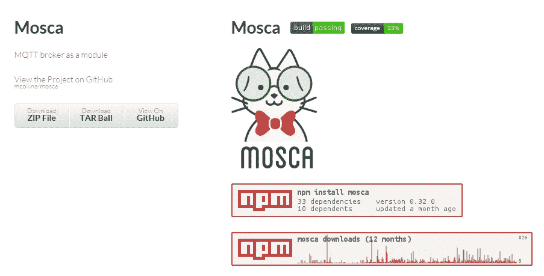

**系统型号:**

Modbus 电能表用作客户端，向安装在 Siemens Simatic IoT2040 上的 Mosca 代理发布电压、电流和频率值。Simatic 上的代理然后将数据发布到 NETPIE APP ID，该 ID 订阅了与 publisher 相同的主题。

**入门:**

Simatic IoT2040 基于 Yocto Linux 工作，镜像需要安装在 SD 卡上，并应插入 Simatic。安装 Yocto Linux 和连接 Modbus 电能表到 Simatic 的详细说明可以在[这里](/@karthikm618/connecting-modbus-rtu-smart-energy-meter-and-siemens-simatic-iot2040-to-netpie-7d38aafb7c04)找到。

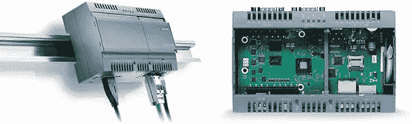

Siemens Simatic IoT2040

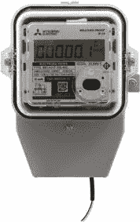

Modbus Energy Meter

**在西门子 Simatic IoT2040 上安装 Mosca:**

使用 npm 在 Simatic 上安装 Mosca，如下所述

安装 mosca bunyan -g

要测试 Mosca，请运行以下命令

莫斯卡-v |班扬

如果您得到类似下图的输出，“恭喜”，您已经成功地在 Simatic IoT2040 上安装了 Mosca。

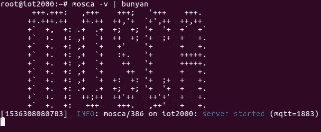

Running Mosca broker on Simatic IoT2040

**在 Node-Red 上安装节点:**

安装网络节点

npm 安装-g 节点-red-contrib-netpie

安装 Mosca Mqtt 代理节点

npm 安装-g 节点-red-contrib-mqtt-broker

安装 modbus 节点

npm 安装-g 节点-red-contrib-modbus

为了将数据从代理(安装在 Simatic 上)传输到 netpie，首先 Simatic 应该由 NETPIE 认证，为此使用了微齿轮节点(NETPIE)。一旦设备通过身份验证，Simatic 和 NETPIE 之间的连接就建立起来，并且使用 Mosca mqtt broker 传输数据。Modbus 节点用于从 Modbus 电能表读取数据。

**节点-红色流程:**

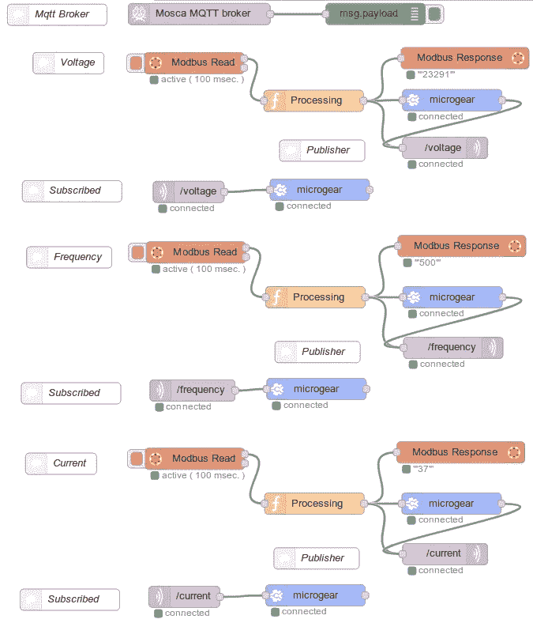

Node-Red Flow

**Mosca 代理节点:**

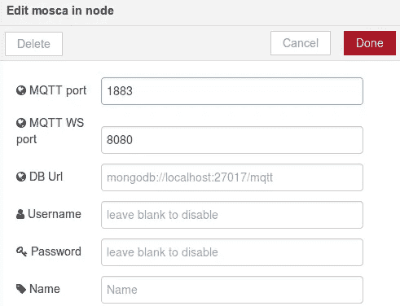

Mosca Mqtt node

**Mqtt 输出节点(发布者):**

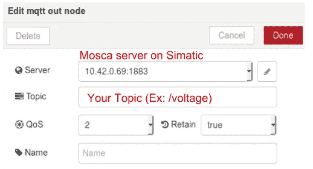

Pub node

**节点中的 Mqtt(订户):**

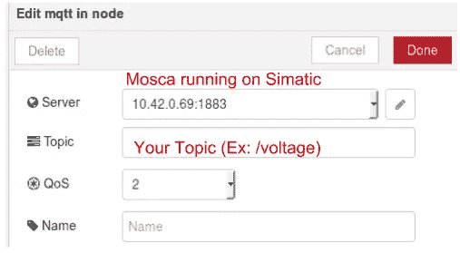

Sub node

**微齿轮节点:**

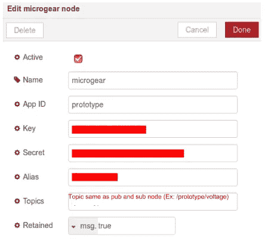

MicroGear node

**Modbus 节点:**

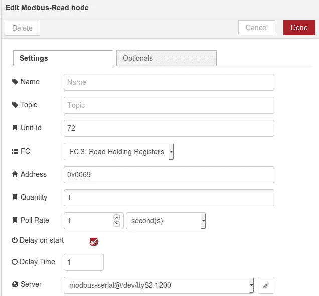

Modbus node

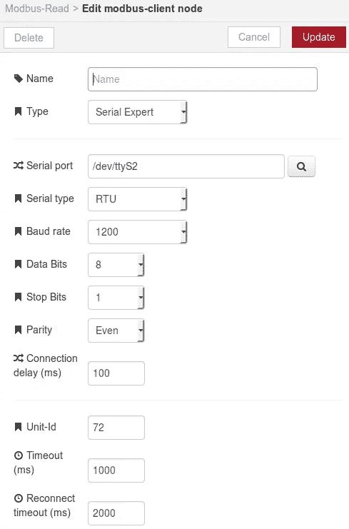

Modbus client settings

**功能节点:**

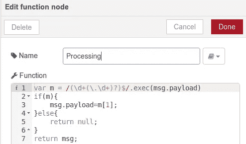

Function node

从 Modbus 能量计读取的数据将被括在括号内(例如:电压值:[23200])。为了删除数据中的括号和多余字符，我们使用函数 node。

**网络馅饼:**

在与发布者节点订阅相同主题的 NETPIE 上创建应用程序 Id。

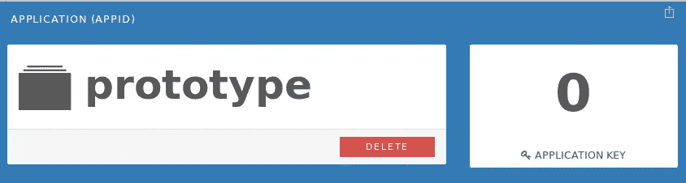

Creating APP ID on NETPIE

**创建数据源:**

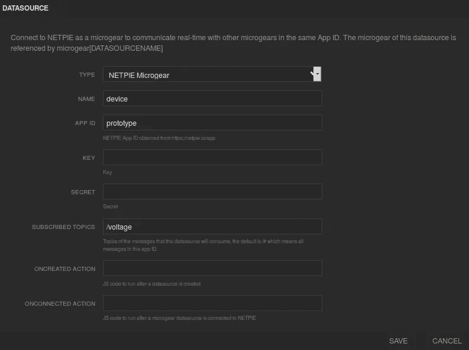

Datasource

**创建小部件:**

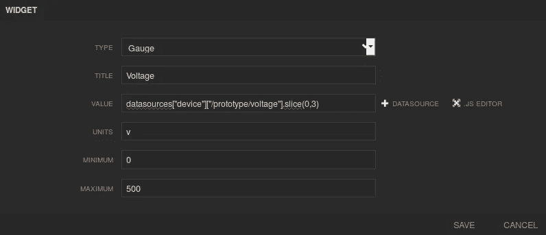

Widget to display data

**结果:**

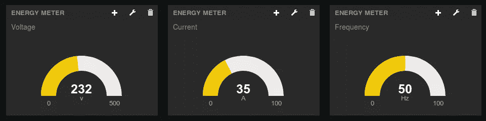

Energy Meter data published on NETPIE through Mosca broker