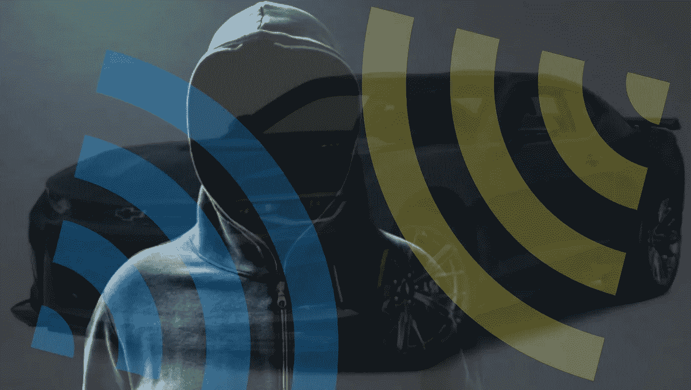
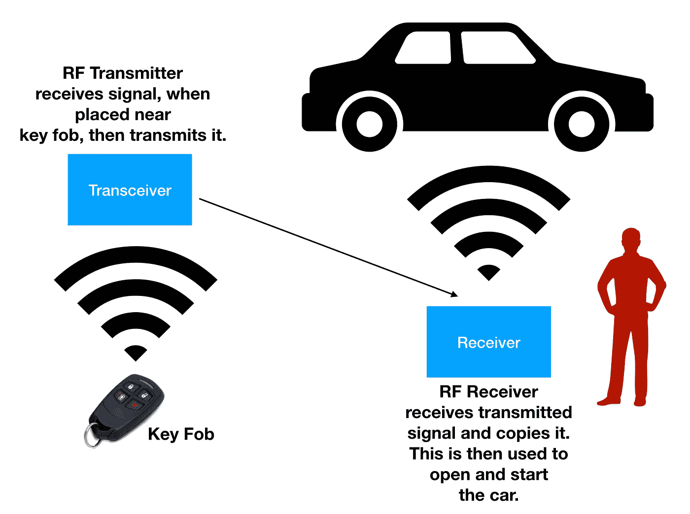
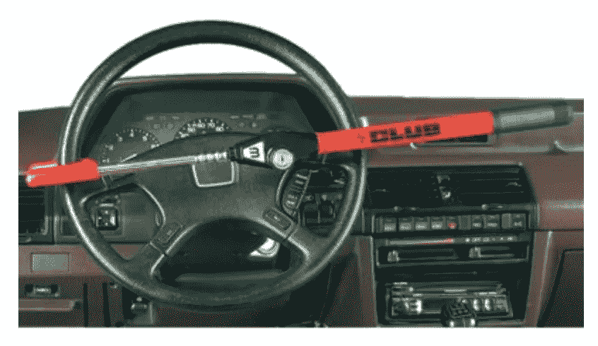

# 信号放大中继攻击

> 原文：<https://medium.com/hackernoon/signal-amplification-relay-attack-sara-609ce6c20d4f>

在拉斯维加斯的“黑客周”期间，包括真正的黑客在内的数千名信息安全专业人士汇聚一堂。最好保持警惕，因为有些坏人有流氓意图。当没有意识到迫在眉睫的威胁时，寻找受害者可能很容易。也就是说，由于与包括汽车自带锁系统在内的电子系统的集成越来越多，汽车黑客近年来变得越来越常见。对于无钥匙进入系统，它使用无线或无线电信号来解锁汽车。这些信号反过来可以被拦截，并用于闯入汽车，甚至启动它。一种这样的技术被称为 SARA 或信号放大中继攻击。

All roads lead to DEF CON 2018 (Las Vegas, NV)

这种无钥匙进入技术可能是最简单的一种。这遵循了与“中继”相似的原理，即长距离传输 RFID 信号。无钥匙进入系统使用“握手”信号，该信号将信号从遥控钥匙发送到汽车的锁控制器单元。当遥控器在汽车附近时，控制器单元检测到它并自动解锁汽车。无线电发射机中继设备使用两个设备根据该原理工作。一个设备必须放在汽车旁边，而另一个设备必须靠近车主的钥匙链。通过将信号从汽车旁边的设备发送到密钥卡附近的设备，信号从汽车被增强到密钥卡以在某种意义上欺骗它。那么信号被复制而不是被解密，并且不仅可以用来打开汽车，还可以用来启动汽车。所以它甚至没有尝试解密信号，只是复制和使用。这就像截取某人的私人钥匙。

有脆弱的汽车模型，大多是欧洲的。不幸的是，没有可供下载的修补程序或更新来解决该问题。用箔片或法拉第笼认证的盒子盖住你的钥匙链是可行的，但给主人带来不便。你可以问你的汽车经销商你的汽车模型是否容易受到这种黑客攻击。他们可能知道也可能不知道，所以咨询汽车制造商可能是最好的。我建议的老办法是在汽车的方向盘或刹车踏板上安装一把防盗锁。那些不是电子的，用的是真正的钥匙。其他解决方案包括将密钥卡放入屏蔽袋或信号阻断密钥卡支架中。

Anti-theft steering wheel lock, The Club, is one of the best ways to secure against SARA (Source: Autozone)

2016 年，总部位于慕尼黑的 ADAC 汽车俱乐部的安全研究人员[发表了](http://www.wiwo.de/technologie/auto/keyless-go-systeme-mit-funkschluesseln-haben-autoknacker-leichtes-spiel/13337808.html)他们为测试漏洞而进行的攻击的发现。他们对来自 19 个不同制造商的 24 辆车进行了这样的测试。

以下是部分受影响的汽车:
[https://www . Forbes . com/sites/Thomas Brewster/2016/03/21/奥迪-宝马-福特-小偷-汽车-黑客/# 2 CCD 9514 f1e](https://www.forbes.com/sites/thomasbrewster/2016/03/21/audi-bmw-ford-thief-car-hacking/#2cccd9514f1e)

*注:*此信息仅供教育和参考。出于恶意目的的黑客攻击是一种非法行为，应受到法律制裁。