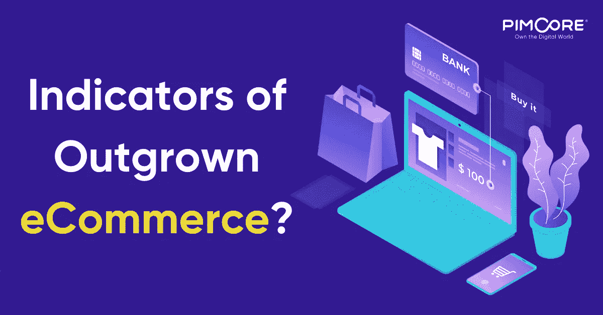

# 你已经超越你的电子商务平台的迹象，以及如何应对

> 原文：<https://medium.com/hackernoon/signs-youve-outgrown-your-ecommerce-platform-and-what-to-do-about-it-d3c2aec0c5a4>

全渠道商务正在成为一种新的规范，公司正在重新思考他们的电子商务战略。他们需要精益和敏捷的电子商务平台，以适应巨大的交易量和交易量，同时确保消费者在所有接触点选择的渠道上的体验。

新兴技术在改变消费者对数字商务的期望方面发挥着越来越大的作用。随着电子商务业务变得完全整合，理解客户购物之旅对于理解每个渠道的角色变得至关重要。一个渠道的价值不仅仅在于访问它的访问者，还在于它对产生销售的影响。该平台的价值不再仅仅是展示的产品数量，而是它在鼓励在线销售、建立信任和产生经常性业务方面的影响。

据 Gartner 称，[将影响数字商务未来的热点领域](https://www.gartner.com/doc/3881074/whats-hot-digital-commerce)是客户体验(对话式商务、沉浸式商务和统一商务)；商业模式(订阅商务、物商务和企业市场)；和技术(面向 API 的架构、人工智能、个性化和可视化配置)。

这些新趋势和技术带来了巨大的机遇，了解您的电子商务平台是否为未来做好了准备非常重要。对于电子商务玩家来说，挑战迫在眉睫，他们需要扩大规模以实现巨大的交易量，同时确保消费者在所有接触点选择的渠道上获得引人入胜的体验。如今，企业需要一个精益、敏捷的电子商务平台来交付客户所需的体验，同时管理后端的复杂性。

# 电子商务增长的指标？

随着客户群的扩大，评估电子商务平台的性能和能力变得至关重要。你知道竞争是如此激烈，即使是一件小事也能决定成败。因此，你必须关注每一个细节——订单管理、履行、产品推荐、个性化报价、全渠道体验和售后支持。

不要只关注特定的功能，要从客户的角度考虑问题。问自己以下问题:

*   在竞争激烈的市场中，您的电子商务平台是否足以通过持续提供卓越的购物体验来开发新市场和促进销售？
*   它是否通过增加参与度和个性化奖励来激励忠诚度，从而不断提高客户保持率？
*   借助强大的商品销售和轻松的交叉销售和向上销售支持，是否可以更快地推出新产品和扩大规模？
*   它是否通过提高内部团队的运营效率和绩效来提高盈利能力？
*   它在处理大量产品、简化复杂的结账流程和管理高度复杂的内容策略方面的效率如何？
*   在没有巨大成本负担的情况下，定制、扩展和集成第三方应用程序是否可能？
*   您的平台可以轻松云化以实现更高的增长和扩展吗？
*   从数字营销的角度来看，它是否获得了高性能？
*   它能够在同一个后端运行多个网站吗？
*   整合视图和实时报告是否足够简单，能够让您更快地做出业务决策？

您的回答将帮助您将业务需求与正确的[电子商务平台解决方案](https://pimcore.com/en/products/experience-manager/ecommerce/introduction)相匹配。

# 如何应对？

您可能希望采用一个电子商务平台，该平台可以轻松适应您的一系列业务计划，并帮助您享受更低的部署成本、更快的上市时间和高性能收益。以下是快速提示:

*   **战略** —评估和分析你的电子商务需求的现状。在了解现有系统和流程的同时，根据您的愿景创建正确的路线图。
*   **建筑与蓝图**——创造与人、过程和技术相一致的建筑设计。
*   **实施** —通过确保您拥有产品信息、数字资产、客户订单、分析和所有接触点的实时信息的单一视图来实施解决方案。
*   **多渠道电子商务平台** —整合电子商务和 PIM，打造一个强大而灵活的平台，用于管理结构化和非结构化产品信息和数字资产。获得同类最佳的可配置产品搜索和导航、购物车实施、高级个性化和自定义报告功能。
*   **移动就绪性** —通过移动优先的方法确保跨移动界面的无缝体验。
*   **电子商务分析** —利用分析来衡量有效性，并通过优惠和推荐推动个性化。
*   **可扩展性** —高效地扩展到多渠道、多站点、多语言和多币种的电子商务环境。
*   **全渠道支持** —将所有 B2B 和 B2C 客户接触点(在线、移动、销售点、呼叫中心、社交媒体、印刷品)整合到一个平台上，并在这些渠道中定制体验。
*   **性能** —保持最佳的应用程序性能，以最大限度地延长正常运行时间并提高在线收入潜力。

总之，用正确的策略重新调整你的电子商务平台是很重要的。查看客户反馈、评论和总体体验，了解他们对您的平台、交付和其他相关服务是否满意。如果他们不喜欢待在你的平台上，你一定不要浪费时间，开始做一些事情来超越你的竞争对手。

# 使用 Pimcore 面向未来的电子商务

**内容商务:** Pimcore 是唯一一个无缝集成 CMS 和商务的开源商务系统。这对于交付更好的客户体验(例如，对话式商务、沉浸式商务和统一商务)起着重要的作用。

观点:[你的数字商务平台与内容和商务协同工作吗？](https://pimcore.com/en/resources/blog/is-your-digital-commerce-platform-working-collaboratively-with-content-and-commerce_a5532?page=2)

**灵活性和模块化:** Pimcore 提供了一个坚实的框架，它通过严格的模块化来优化开发和实现的生产力。当谈到非标准化的商业模式时，如订阅商务、物商务和企业市场，灵活性和模块化是最受欢迎的因素。

技术和架构:[构建在标准化、健壮、模块化、开放和面向服务的架构之上——100% API 驱动。](https://pimcore.com/en/products/platform/technology-architecture)

**开源技术，使用开放标准:** Pimcore 建立在最新的开源技术上，如 Symfony PHP 框架，这使其能够与人工智能和个性化提供商进行卓越的连接。这是面向未来的一个重要因素，比如面向 API 的架构、人工智能、个性化和可视化配置。

洞察:[开源如何打开数字商务的创新之门？](https://pimcore.com/en/resources/insights/open-source-innovation-digital-commerce)

如果你喜欢这个博客。遵循 [Pimcore](https://pimcore.com/en)