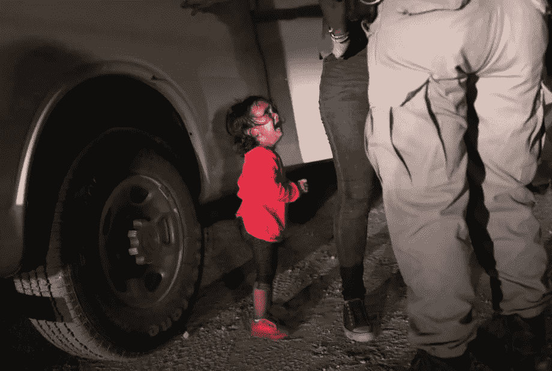

# 硅谷推动# KeepFamilesTogether

> 原文：<https://medium.com/hackernoon/silicon-valley-pushes-to-keepfamilestogether-ad42ff0600d7>

## 从 Twitter 的杰克·多西到 Airbnb 的布莱恩·切斯基，科技公司的首席执行官们纷纷表示反对美国新的零容忍政策。

A 2-year-old Honduran asylum seeker cries as her mother is searched and detained near the US-Mexico border on June 12 in McAllen, Texas. (Credits: John Moore, Staff / Getty Images)

特朗普政府上个月启动的零容忍政策及其导致儿童和未成年人在边境与父母分离的影响不仅仅是国会讨论的话题。硅谷一直在表达担忧，科技领袖对此感到震惊。

Airbnb 首席执行官布莱恩·切斯基和他的联合创始人

[他的想法得到了谷歌首席执行官桑德尔·皮帅的回应，他说这项政策是“令人痛苦的”](https://medium.com/u/8e37c023687a#KeepFamiliesTogether 标签。Khosrowshaki 也是一名移民，正如他在帖子中指出的那样，他说“家庭是社会的支柱”，政府政策是“不道德的，完全是错误的。”
<figure class=)

[YouTube 的首席执行官苏珊·沃西基也喜欢上了 Twitter。](https://medium.com/u/8e37c023687a#KeepFamiliesTogether 标签。Khosrowshaki 也是一名移民，正如他在帖子中指出的那样，他说“家庭是社会的支柱”，政府政策是“不道德的，完全是错误的。”
<figure class=)

[苹果公司首席执行官蒂姆·库克在爱尔兰都柏林评论道:“看到这些画面，听到孩子们的声音，令人心碎。在任何社会中，孩子都是最脆弱的人群。我认为正在发生的事情是不人道的，必须停止。”](https://medium.com/u/8e37c023687a#KeepFamiliesTogether 标签。Khosrowshaki 也是一名移民，正如他在帖子中指出的那样，他说“家庭是社会的支柱”，政府政策是“不道德的，完全是错误的。”
<figure class=)

[思科首席执行官罗卓克在他的推文中使用了“残忍”和“非美国”这样的词语。](https://medium.com/u/8e37c023687a#KeepFamiliesTogether 标签。Khosrowshaki 也是一名移民，正如他在帖子中指出的那样，他说“家庭是社会的支柱”，政府政策是“不道德的，完全是错误的。”
<figure class=)

[survey monkey](https://medium.com/u/f2fbe9e794c?source=post_page-----ad42ff0600d7--------------------------------)CEO[Zander Lurie](https://medium.com/u/eb0b43258382?source=post_page-----ad42ff0600d7--------------------------------)发推文链接到 RAICES。

BuzzFeed 的创始人兼首席执行官 Jonah Peretti 也在推特上讲述了一个关于他祖母的非常私人的故事。

他写道，“我的祖母是一名难民，她告诉我她逃离时与父母短暂分离的故事，以及不知道是否还能再见到他们的恐惧。”。" 60 年后，当她回忆起这段经历时，仍会感到精神创伤。"

Salesforce 的马克·贝尼奥夫转发了哥伦比亚广播公司记者大卫·贝格诺德的两条推文。

亚马逊的杰夫·贝索斯一直直言不讳地表达他对移民的立场，因为他的父亲是古巴移民，十几岁时来到美国。周日，他在推特上重申了[这一信息。据《T4》杂志](https://twitter.com/JeffBezos/status/1008348645605797890)报道，贝佐斯和他的妻子麦肯齐向 TheDream.us 捐赠了 3300 万美元，帮助那些被带到美国的无证学生支付大学学费。

Twilio 的创始人兼首席执行官 jeffiel 称政府在边境分离家庭的行为是“战争罪”。

> 有意拆散家庭客观上是错误的，我们必须大力反对。不管找什么借口，姑且称之为:集体惩罚。惩罚家庭成员的做法不仅在道德上令人不快，根据日内瓦协议，这也是一种战争罪。

 [## 分离移民家庭不仅是错误的，也是战争罪

### 有意拆散家庭客观上是错误的，我们必须大力反对。不管借口是什么…

medium.com](/@jeffiel/separating-immigrant-families-isnt-just-wrong-it-s-a-war-crime-3d707fff198c) 

微软的情况不同。正如 Axios 提到的，该公司“发现自己不仅是 ICE 的客户，还因为[在 1 月](http://link.axios.com/click/13615761.21/aHR0cHM6Ly9ibG9ncy5tc2RuLm1pY3Jvc29mdC5jb20vYXp1cmVnb3YvMjAxOC8wMS8yNC9mZWRlcmFsLWFnZW5jaWVzLWNvbnRpbnVlLXRvLWFkdmFuY2UtY2FwYWJpbGl0aWVzLXdpdGgtYXp1cmUtZ292ZXJubWVudC8_dXRtX3NvdXJjZT1uZXdzbGV0dGVyJnV0bV9tZWRpdW09ZW1haWwmdXRtX2NhbXBhaWduPXNlbmR0b19uZXdzbGV0dGVydGVzdCZzdHJlYW09dG9w/5a79b88fcbcf487a418b4585Be494e63c)的博客中表示，它为该协会感到‘自豪’。”

该公司发表声明:

“作为一家公司，微软对儿童在边境被迫与家人分离感到沮丧。自二战结束以来，家庭团聚一直是美国政策和法律的基本要素。作为一家公司，微软 20 多年来一直致力于将技术与法律结合起来，以确保难民和移民儿童能够与父母在一起。我们需要继续发扬这一崇高传统，而不是现在就改变方向。我们敦促政府改变政策，敦促国会通过立法，确保儿童不再与家人分离。”

该公司总裁兼首席法律官布拉德·史密斯(Brad Smith)此前在 LinkedIn 上也发布了类似的帖子。

 [## 父亲节:家人团聚的日子

### 这个父亲节提供了一个机会，让我们回忆起一件我们不应该认为理所当然的事情——成为…

www.linkedin.com](https://www.linkedin.com/pulse/fathers-day-families-together-brad-smith/) 

LinkedIn 的首席执行官[杰夫·韦纳](https://medium.com/u/d906aca9f715?source=post_page-----ad42ff0600d7--------------------------------)也在平台上发帖。他分享了 Annabelle Timsit 在 Quartz 上的一篇文章，并评论道:“在边境将孩子与父母分离是残忍的、不人道的，也有损我们作为一个国家的尊严。”

 [## 杰夫·韦纳在 LinkedIn 上写道:“孩子与父母的分离...

### 在边境将孩子与父母分离是残忍的、不人道的，也有辱我们作为一个国家的身份。这里有一个…

www.linkedin.com](https://www.linkedin.com/feed/update/urn:li:activity:6415047660109066240/)