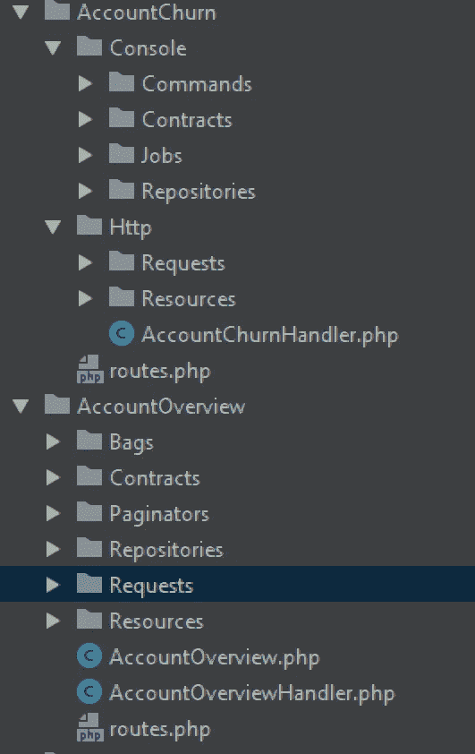

# 简单完整的基于模块的 Laravel API

> 原文：<https://medium.com/hackernoon/simple-and-complete-module-based-laravel-app-5fee7a21bf28>

我非常喜欢编写基于模块的软件，但我不太喜欢依赖第三方包来解决琐碎的事情，因为它们总是会阻止你升级。两年来，我一直用 Laravel 编写基于模块的软件，我对结果非常满意。

驱使我转向基于模块的软件的决定性因素是持续改进的可能性。想象一下，你建立了一个项目结构，6 个月后你发现你犯了很多错误。在不影响 6 个月现有代码的情况下，仅仅改进架构通常是不容易的。在分析这个主题时，我注意到了两个要点:要么在整个项目中有一个标准并坚持下去，要么将它模块化并逐模块改进。

有些人宁愿不惜一切代价使用标准，即使这意味着被一个你不再喜欢的标准所束缚。我个人比较喜欢持续改进。如果我写的第 20 个模块和第一个完全不同，我不介意。如果我需要回到模块 1 进行错误修复或重构，我可以朝着最新模块使用的新标准改进它。

如果像我一样，您想开发基于模块的 Laravel 应用程序，并避免在项目中添加不必要的第三方依赖，下面是我的做法。

## 单路线服务提供商

Laravel 路由器系统是应用程序的入口点。首先需要改变的是默认的`RouteServiceProvider.php`，它应该模块化可用的路由。

我们可以去掉该文件中的所有样板文件，只设置一个模块路由器。

## 2-模块文件

Laravel 在`routes`文件夹中附带了一些文件。我们可以删除它们，因为我们不再在 RouteServiceProvider 中映射它们。让我们创建一个单独的`modules.php`路由器文件。

## 3-书籍模块

在`app`文件夹中，让我们创建`Modules/Books/routes.php`。在其中，我们可以为 Books 模块定义应用程序路径。

您可以选择基于控制器的路由，这在 Laravel 中是标准的。我个人喜欢[再见控制器，你好请求处理器](https://jenssegers.com/85/goodbye-controllers-hello-request-handlers)的方法。下面是`ListBooks`的实现。

`BookResource`是 Laravel 的变形层。如名称空间所示，我们可以在`app/Modules/Books/Resources`文件夹中创建它。

## 4-作者模块

让我们通过 routes 文件启动 Authors 模块。

注意命名空间，它表示我们现在正在将文件写入到`app/Modules/Authors`文件夹中。请求处理程序也非常简单。

最后，我们编写资源类来将响应转换成 JSON。

注意这里的资源是如何进入另一个模块来重用 Book 资源的。这通常是一件坏事，因为模块应该是完全自给自足的，并且只重用标准类，如雄辩的模型或为在任何模块上重用而设计的通用组件。这个问题的解决方案通常是将 BookResource 复制到 Authors 模块中，这样就可以在不破坏另一个模块的情况下对其进行修改，反之亦然。我决定让这种跨模块的用法保持原样，以表明尽管一个很好的经验法则是让模块彼此完全隔离，但是如果您认为用例足够简单并且不太可能带来任何问题，打破这个法则也是可以的。一定要写测试来覆盖你写的特性，以避免别人在不知不觉中破坏你的应用。

## 5-结论

虽然这是一个非常简单的例子，但我希望它能给人这样的印象:根据自己的需要操纵 Laravel 标准结构是很容易的。为了构建一个基于模块的应用程序，你可以非常容易地改变文件的位置。我的大多数项目都附带了可被任何模块重用的泛型类的`App/Components`；`App/Eloquent`保存雄辩的模型和数据库关系，以及`Modules`文件夹，我们可以在其中构建任何基于模块的特性。这是我最近开始开发的一个应用程序的文件夹结构:

我希望每个人都从中吸取的概念是，每个模块都有它自己的一组需求，并且可以有它自己的一组文件夹/实体/类。没有必要将所有的模块标准化到完全相同，因为有些模块比其他模块简单得多，需要的结构也少得多。这个例子表明`AccountChurn`模块通过 Http 文件夹提供 API，同时仍然通过控制台提供 Artisan 命令。`AccountOverview`另一方面，只有 Http 和必需的存储库、值对象(包)和服务类(分页器)才能提供巨大的价值。