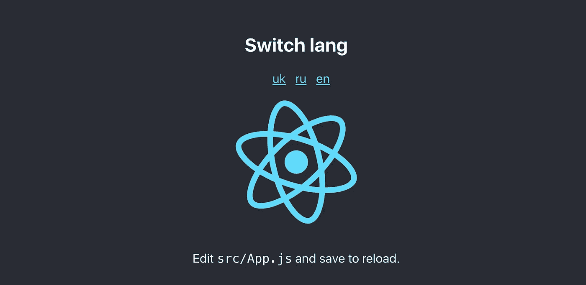

# 使用 ttag 创建 React 应用程序的简单 i18n

> 原文：<https://medium.com/hackernoon/simple-i18n-for-create-react-app-with-ttag-4c2892343201>

本文将描述如何通过 5 个简单的步骤，在几分钟内为 **Create React App** 和 [ttag](https://ttag.js.org/) 设置翻译过程。

首先，至少有 4 个理由让你选择 ttag 搭配 [CRA](https://hackernoon.com/tagged/cra) :

*   **不需要执行弹出**。
*   ttag 是**框架不可知的解决方案**,适用于任何地方 [javascript](https://hackernoon.com/tagged/javascript) 和 babel 可以工作的地方。支持 **jsx** 开箱。
*   ttag 使用翻译人员常用的 gettext T21 标准，并且可以与任何工作流程和翻译服务集成，如 transifex，weblate e.t.c
*   ttag 不要求你使用像`sprintf`这样的“外来”格式规则。您只需简单地使用**本机 javascript 模板文字**进行格式化，例如:

```
t`Hello ${ name }`
```

在本教程的最后，我们将为 **CRA** 启动页面设置 **i18n** 。



> 演示现场—[https://ttag-org.github.io/CRA-runtime-example/](https://ttag-org.github.io/CRA-runtime-example/)
> 
> 存储库—[https://github.com/ttag-org/CRA-runtime-example](https://github.com/ttag-org/CRA-runtime-example)

# 第一步。装置

在这一步，我们将简单地设置新的 CRA 并安装 ttag:

```
npx create-react-app ttag-app
cd ttag-app
npm i ttag
npm i -D ttag-cli
```

# 第二步。创造。用于翻译的 po 文件

> 你可以阅读更多关于 gettext 和。po 文件格式[此处](https://www.gnu.org/software/gettext/manual/html_node/PO-Files.html)

根据 gettext 的说法，我们需要为我们想要翻译的每种语言创建一个单独的`.po`文件。我们可以使用`ttag-cli`来创建这个文件:

```
mkdir i18n 
npx ttag init uk i18n/uk.po
```

`ttag init uk i18n/uk.po`将为乌克兰语创建`po`文件(`uk`是语言代码)。

> 您可以在这里找到所有可用语言代码的列表—[https://www.w3.org/International/O-charset-lang.html](https://www.w3.org/International/O-charset-lang.html)

# 第三步。用标签包装字符串

为了使字符串可翻译，你应该用标签来标记它们。让我们打开`App.js`文件，使短语`Learn React`可翻译:

```
import { t } from 'ttag'// Change 'Learn React' to 
t`Learn React`
```

> [还有](https://ttag.js.org/docs/jsx-gettext.html) `[*jt*](https://ttag.js.org/docs/jsx-gettext.html)` [标签，可以包含嵌套的 jsx 元素](https://ttag.js.org/docs/jsx-gettext.html)

# 第四步。更新翻译文件

为了让字符串出现在`.po`文件中，我们可以从`ttag-cli`使用`update`命令

```
npx ttag update i18n/uk.po src/
```

我们应该看到我们的短语`Learn React`被添加到了`uk.po`文件中:

```
msgid "Learn React" 
msgstr ""
```

`msgstr`是必须添加翻译的地方:

```
msgid "Learn React"
msgstr "Вивчити React"
```

# 第五步。加载翻译

在这最后一步，我们应该加载并应用来自`.po`文件的翻译。为了能够加载`po`文件，让我们用`ttag-cli`将其转换为`json`格式:

```
npx ttag po2json i18n/uk.po > i18n/uk.po.json
```

现在我们可以通过简单的导入或请求来加载`uk.po.json`文件。

`getLocale`功能的实现取决于您的需求。您可以选择将区域设置存储在 url、cookies、localStorage 或其他地方。类似于:

```
function getLocale() {  
    return cookie.get(LOCALE_COOKIE) || 'en';
}
```

> [下面是我举的](https://github.com/ttag-org/CRA-runtime-example/blob/master/app/src/i18nInit.js) `[*i18nInit*](https://github.com/ttag-org/CRA-runtime-example/blob/master/app/src/i18nInit.js)*.js*`的例子

我建议将 i18n 设置移动到一个单独的模块中，并在你的应用程序入口点顶部(在`[src/index.js](https://github.com/ttag-org/CRA-runtime-example/blob/master/app/src/index.js)`的某个地方)的任何其他导入之前导入它

# 就是这样！

最后，您还应该设置一些语言切换逻辑。您可以参考示例[存储库](https://github.com/ttag-org/CRA-runtime-example/blob/master/app/src/App.js)来了解如何做到这一点的细节。另外，ttag 还允许您在构建步骤中预编译翻译。你可以在[文档](https://ttag.js.org/docs/create-react-app.html#precompiled-translations)中了解如何做到这一点。

希望这将有助于人们与 CRA 设置翻译工作流程。感谢任何反馈。请随意创建[问题](https://github.com/ttag-org/ttag)并发表评论。

编码快乐！

## 链接:

*   https://ttag.js.org/docs/create-react-app.html 和 CRA 的官方文件—
*   ttag lib—[https://github.com/ttag-org/ttag](https://github.com/ttag-org/ttag)
*   巴别塔插件 ttag—[https://github.com/ttag-org/babel-plugin-ttag](https://github.com/ttag-org/babel-plugin-ttag)
*   ttag-CLI—[https://github.com/ttag-org/ttag-cli](https://github.com/ttag-org/ttag-cli)