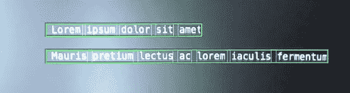
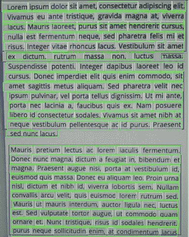
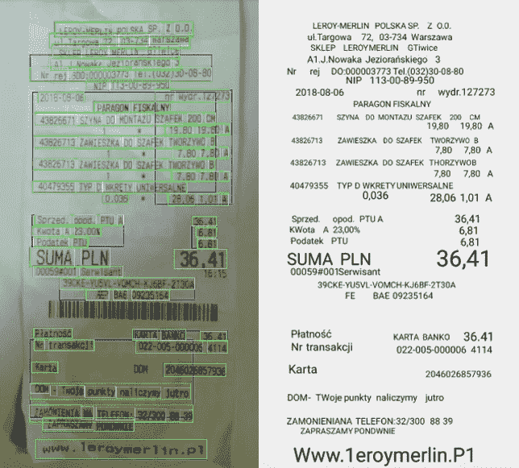
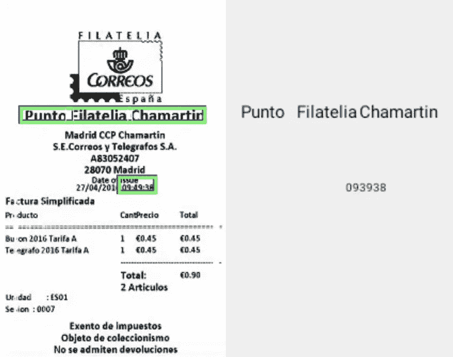
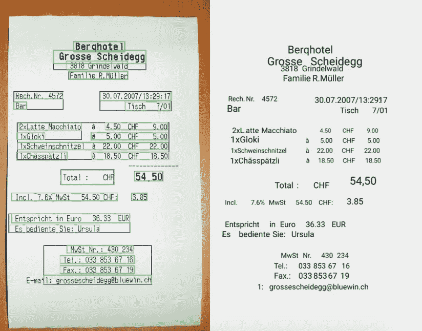

# 使用 Google 的 ML 工具包在 Android 上实现简单的 OCR

> 原文：<https://medium.com/hackernoon/simple-ocr-implementation-on-android-with-googles-ml-kit-ceb4cdd8d70c>

电子战技术正在迅速发展。一些最新的解决方案正日益受到欢迎。光学字符识别(OCR)并不是什么新鲜事，但用机器学习完善它可能会给 OCR 带来新的曙光。这显然是一个广泛的主题。尽管如此，我还是会尝试向您简要介绍 Android 上 OCR 实现中的机器学习。我还将展示它的一些功能，基于一个容易获得的叫做 Google Firebase ML Kit 的软件。

# 什么是 OCR？

如今，几乎所有东西都是数字化的。书籍、报纸、文章——随便说。那么，怎样才能使书面或印刷文本数字化，甚至被翻译呢？解决方案附带了光学字符识别(OCR)。它能够找到图像上的文字并将其数字化。

每当你需要在你和你的朋友之间分摊费用时——这总是一个问题。谁应该支付比萨饼或饮料的费用以及费用多少？现在，你可以拍一张收据的照片，智能手机上的一个应用程序可以帮你分摊费用。它甚至可以发送提醒付款给你的朋友。

此外，搜索关于公共汽车线路的信息可能更容易。通过拍摄公交车号或公交站名的照片，您可以获得所需的公交线路信息。

# 它是如何工作的？

计算机本身是哑的，不能从图像中识别任何东西。对他们来说，每张图片只是一堆像素，是关于颜色的基本信息。为了帮助计算机找到你需要的东西，我们可以教它如何识别字母。这就是所谓的模式识别。它可以用于从上到下具有相同字体、大小和间距的文本。但是如果我们在整个文本中使用不同的字体和大小呢？为了帮助计算机，需要引入检测功能。

检测特征或智能字符识别(ICR)用于识别字符的特征。它搜索符合指定要求的字母。例如:如果你看到两条有角度的线在顶部相交于一点，并且在它们之间大约一半的地方有一条水平线，那就是字母 a。

大多数 OCR 软件使用检测功能，而不是模式识别来查找图像上的字母。他们中的一些人使用机器学习来教软件如何识别字母的特征。

# Android 上的 OCR 实现

Google Firebase ML Kit 是一套帮助在 Android 和 iOS 上实现机器学习的工具，OCR 就是其中之一。开始使用机器学习相对容易。ML Kit 具有一些内置模块，可以实现文本识别、人脸检测、条形码扫描等功能。如果您在神经网络方面经验丰富，并且希望使用更复杂或专业的 ML，您可以使用自定义张量流模型。

ML 套件有两个版本:on-device 和 cloud。在这里你会发现两个版本[的区别和所有功能。下面我们将重点介绍 Android 设备上的版本。](https://firebase.google.com/docs/ml-kit/recognize-text)

在开始之前，我们需要在 Firebase 控制台中创建 Firebase 项目。教程可以在这里找到[。它需要 Kotlin 编程语言和 RxJava2 的知识。](https://firebase.google.com/docs/android/setup)

现在，让我们在 *AndroidManifest.xml* 和 gradle 依赖项中添加 Firebase ML Kit 模块。

有了这个设置，我们可以开始实现我们的文本检测器。我们需要创建*FirebaseVisionTextDetector*。

现在，我们有了视觉检测器的实例，它用于检测图像上的文本。为此，我们使用:

该方法以 *FirebaseVisionImage* 的实例为参数，产生*任务<FirebaseVisionText>。当任务准备好了，我们就可以抢 *FirebaseVisionText* 了。它包含关于检测到的文本和检测到的区域的边界框的数据。*

您可以使用以下方法从位图创建 *FirebaseVisionImage* :

创建 FirebaseVisionImage 还有其他工厂方法。我们可以在 Firebase 文档中检查它们。现在，我们将使用位图版本。

下面我实现了完整的检测器类。我使用 RxJava2 处理文本检测器的输入和输出。我还将 Firebase*Task<T>类包装在*flow*中，以检测 RxJava 流中的文本。*

完整的*文本检测器*类:

上面类中的要点是 *processImage* 和 *observeDetections* 函数。第一个是输入点，另一个是我们检测的输出，您可以收听。

现在，我们需要在扫描图像上绘制检测。所有的边界框都来自于 *FirebaseVisionText* 对象。

*FirebaseVisionText* 包含块、线和元素。块是文本中最大的区域，每个块都有行，所有的行都有元素。

知道了这一点，我们就可以在输入位图上画出所有这些元素。为此，我们需要收集每个单元的所有边界框，然后在位图上绘制矩形。

下面是一个完整的片段:

输出代码将如下所示:

蓝色边框代表块，绿色代表线，白色代表元素。几乎所有的文本都被找到了。

# 测试收据上的文本识别示例

我决定测试三张收据，并检查谷歌的文本识别将如何处理它们。每张收据都用不同语言书写:波兰语、西班牙语和德语。我无法测试不同于拉丁语的语言，因为设备上的版本不支持它们。要测试像希腊语或俄语这样的语言，需要云版本。

第一张收据是波兰文的。下面，我们可以看到两个图像。左图中突出显示的文本显示了 ML 试剂盒检测到的内容。右图是 API 返回的数据，绘制在白色背景上。它看起来和原始图像上的几乎一样。当然，格式上有一些问题。此外，一些字母没有被发现或混淆。除此之外，我们可以看到结果相当不错。我垂直对齐了所有的行，并调整了文本框的文本大小，如下图所示。如果没有这些修正，情况会更加混乱。

第二项测试是对西班牙收据进行的。这部是低分辨率的(225 x 335px 像素)。正如我们所看到的，探测器在整个图像上只发现了两个区块。

最后一次尝试是在德国的瑞士收据上。检测几乎是完美的。找到了整个文本，除了收据底部的“电子邮件”。检测器只发现了“电子邮件”的最后一个字母，并假设它是 1(数字一)。

# 摘要

我已经向您介绍了 OCR 基础知识的概述。我还展示了使用 Google 的 ML 工具包在 Android 上实现 OCR。ML 工具包的实现相当简单，不需要太多的编码。

使用设备上的版本时，检测仅限于基于拉丁语的语言。扫描的图像必须有合适的分辨率才能得到好的结果。检测器无法识别某些字母或混淆它们。此外，垂直书写的文本也存在一些问题。为了获得更好的结果，需要云版本、其他专门的 OCR 软件或自定义 Tensorflow 模型。

设备上的文本识别可用于检测较大文本中的关键字或一些简单信息，而不是扩展文章。

正如我前面提到的，OCR 一点也不新鲜。但在这项技术中引入机器学习可能会显著改善这一点。在不久的将来，我们可能会看到扩展的智能 OCR 实现，版本 2.0。谁知道呢？

这篇文章是由 ukasz Gawron 撰写的，最初发表在软件公司博客****上。访问博客，获得更多关于最佳开发实践和软件外包技巧的文章。****