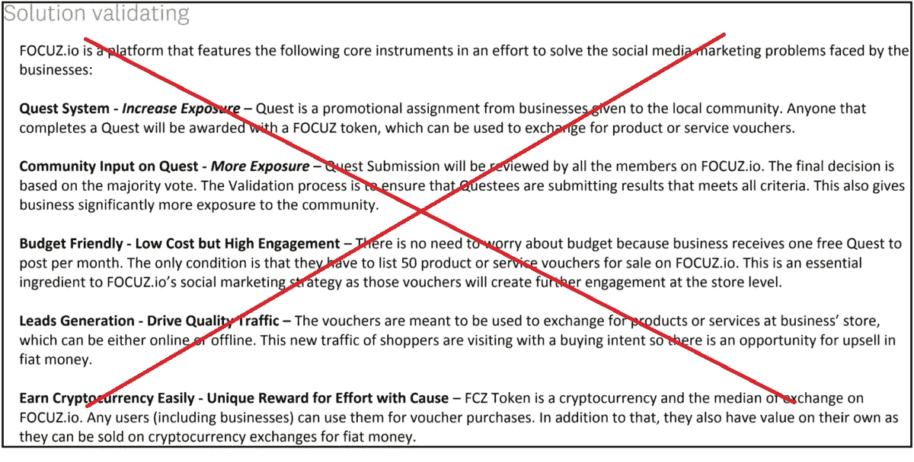
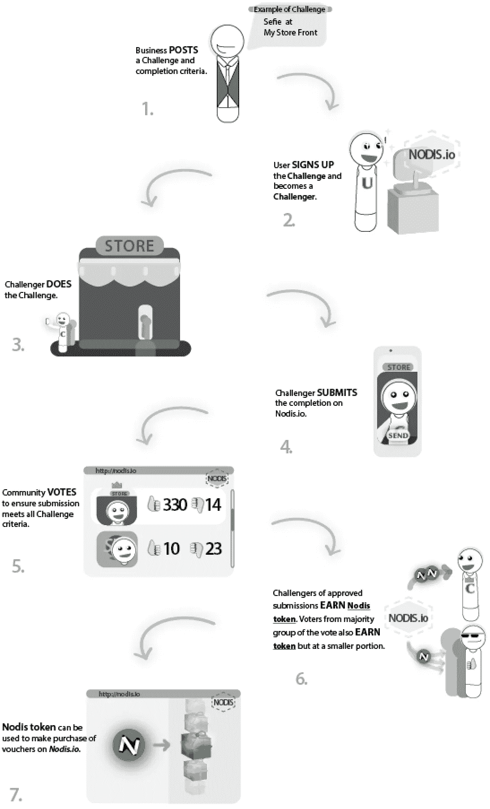

# 复杂产品的简单推介:成功的关键

> 原文：<https://medium.com/hackernoon/simple-pitch-to-a-complicated-project-the-key-to-yes-8a5cfcd0166f>

> 这是“创业 180 天”系列的第 8 篇文章，记录了我的企业家之旅。如果你想从头开始，请点击[这里](https://theascent.pub/180-days-to-start-up-1-documenting-my-journey-to-building-a-potentially-valuable-solution-1b79191ccca3)看第一篇文章。你也可以在这里查看 [Nodis.io](https://nodis.io/token-sale) 期望[完成什么](/@willchen319/what-is-nodis-io-trying-to-do-983cc67255aa)。

“kid wearing deadpool shirt” by [Bruno Nascimento](https://unsplash.com/@bruno_nascimento?utm_source=medium&utm_medium=referral) on [Unsplash](https://unsplash.com?utm_source=medium&utm_medium=referral)

我记得我花了几个小时为我们的网站制作一个清晰的营销方案，介绍我们的平台如何工作以及它为什么有价值。我满怀信心地以调查的形式发出了这条信息，以研究人们对此的看法。令我惊讶的是，95%的被调查者要么需要进一步的解释，要么什么都不明白。事实上，我让我的妻子阅读它，她从第一天就知道这个想法，她给了我 TL；脸博士。我知道这是行不通的，尤其是如果世界上大多数人只会从我们网站的内容中理解

NOPE… Not gonna work!

解释一个想法并让人们看到相同的愿景是很难的。用区块链和加密货币解释一个想法甚至更难。现实是，当我们试图将去中心化放入一个解决方案中时，它经常以“怪异”或“需要更多解释”的方式出现。解释我们的[分散投票机制](/@willchen319/what-is-nodis-io-trying-to-do-983cc67255aa)将如何工作是*对*的挑战。

以下是我从那次调查和其他研究中学到的 3 条重要经验:

## **不惜一切代价避免技术、时尚或流行术语**

是的，这包括像“区块链”和“加密货币”这样的词。我们的目标市场是经常落后于技术趋势的小企业主/经理。使用行话会疏远我们的目标市场，偏离核心理念。

“traffic light on stop sign” by [Paweł Czerwiński](https://unsplash.com/@pawel_czerwinski?utm_source=medium&utm_medium=referral) on [Unsplash](https://unsplash.com?utm_source=medium&utm_medium=referral)

虽然加密货币受到了大肆宣传(好的方面和坏的方面)，但每当这个词出现时，它就占据了中心舞台，每个人都忘记了其他一切。这通常可以归结为这样的问题:“加密货币能做什么？”或者“它会值多少钱？”。这几乎让人感觉产品理念是为了支持加密货币的增长，而不是相反。

流行语不能成为我们宣传的中心。正如彼得·泰尔在他的书《从零到一》中所说…

> “客户不会关心任何特定的技术，除非它以更优越的方式解决了特定的问题。如果你不能垄断一个小市场的独特解决方案，你就会陷入恶性竞争。”

人类的思维以一种有趣的方式运作:我们自然地试图抓住我们听到的一切。任何时候一个技术术语出现，都有可能导致听众短时间的空白，甚至完全脱离。我不得不修改我的信息，这样我就可以避免所有可能的科技词汇。我需要一层一层地构建我的信息，这样当我*让*说出“加密货币”时，他们*已经*很好地理解了我们的目标以及它将如何让他们受益。我决定不使用加密货币，而是使用普通公众能够理解的简单词汇，如“奖励积分”。

## 帮助他们将信息视觉化

大多数人在视觉内容中能更好地理解想法。在第一次调查之后，我立即招募了一名设计师来帮我设计一个图表，展示 Nodis.io 挑战机制是如何工作的，以及它如何在营销中使企业受益。

Our first draft to explain how a Nodis Challenge works

我把这张图片发给了有问题的被调查者，回复率要积极得多。他们最终能够从“试图理解”阶段进入“告诉我更多”阶段。

## 向他们展示价值

受众首先需要清楚地了解问题以及我们希望实现的目标:

> 我们的使命是帮助当地的小企业在网上引起注意，增加商店的流量，并在竞争中脱颖而出。

正如我在我的[上一篇文章](/swlh/an-attempt-to-build-a-blockchain-based-product-that-doesnt-require-selling-5dfd90e86cfd)中所说，我个人从我朝九晚五的工作中抽出一周时间，带着我们的原型走访了 150 多家小企业。我修改了信息，使其以上述陈述为中心。这是一条所有小企业都能认同的简单路线。

结果，只有少数决策者难以理解我们的推销。事实上，反应非常积极，60%的决策者签署成为创始合伙人。这比我为调查发出的原始信息有了很大的改进。

有了以上 3 个我们推销方式的主要变化，我在直接面对面和通过网络间接解释解决方案方面更加成功了。

内部沟通同样重要。有世界级的推介却没有产品可以提供是没有意义的。在开发和执行过程中，团队的激励是极其重要的。关于如何做到这一点，有很多书籍和哲学，但每个团队都是不同的。我的下一篇文章将是关于我们做了什么来保持每个人的积极性，以及学到了什么。

如果你觉得我写的东西有一点点有趣，请在媒体上关注我，并给我一些掌声。您也可以在 [Telegram](https://t.me/nodisgetnoticedgroup) 和 [Instagram](https://www.instagram.com/nodis.io/) 上关注我们，获取最新内容和项目更新。感谢阅读！