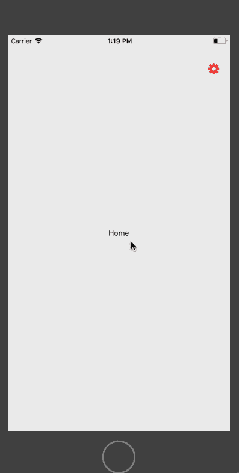
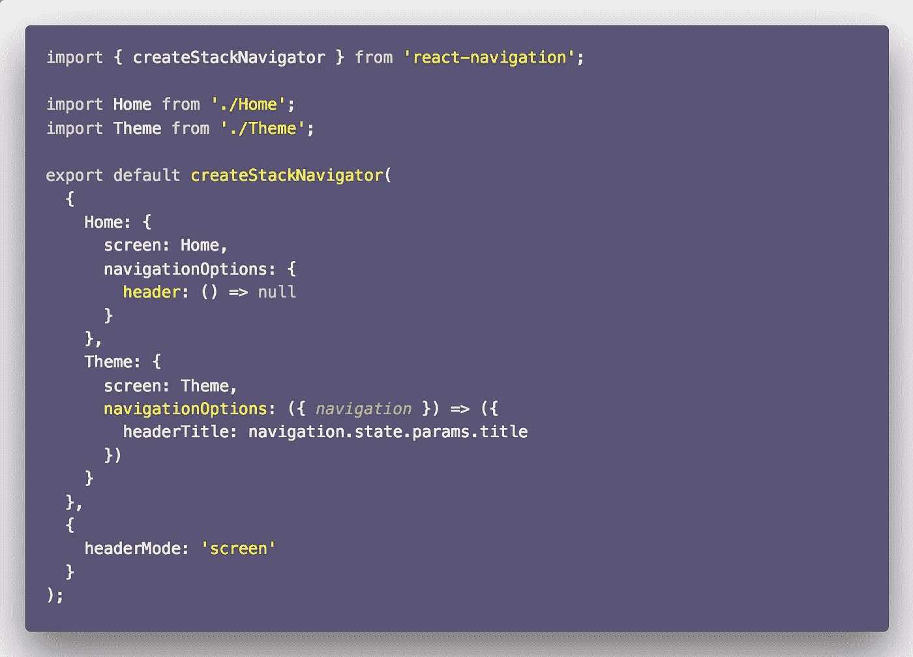
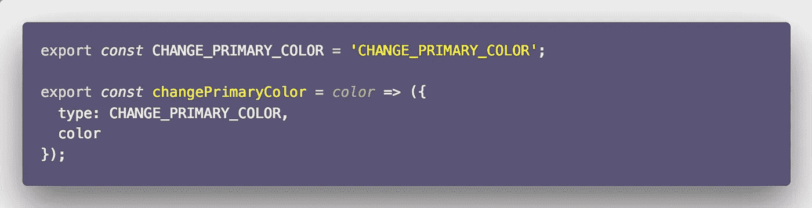
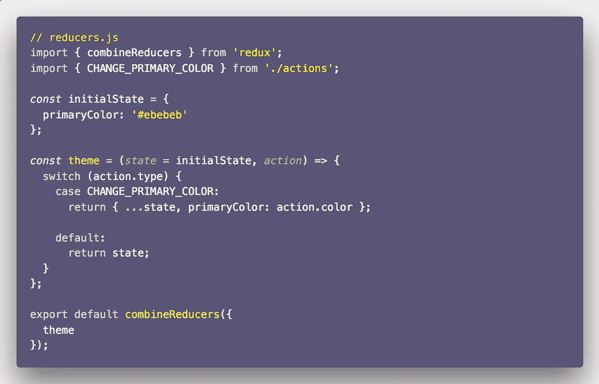
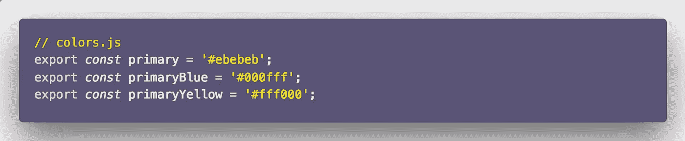
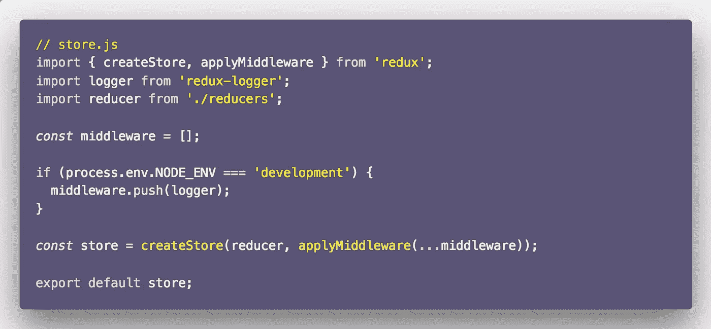
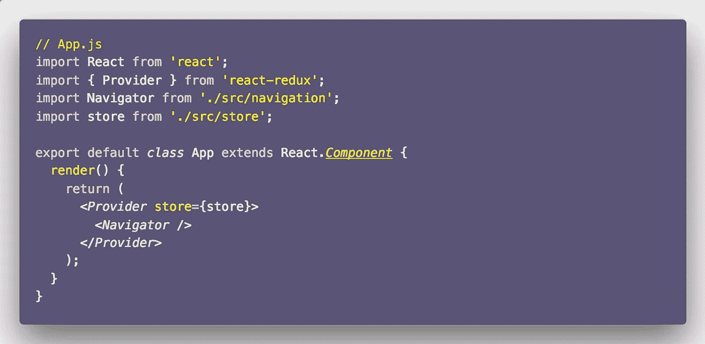
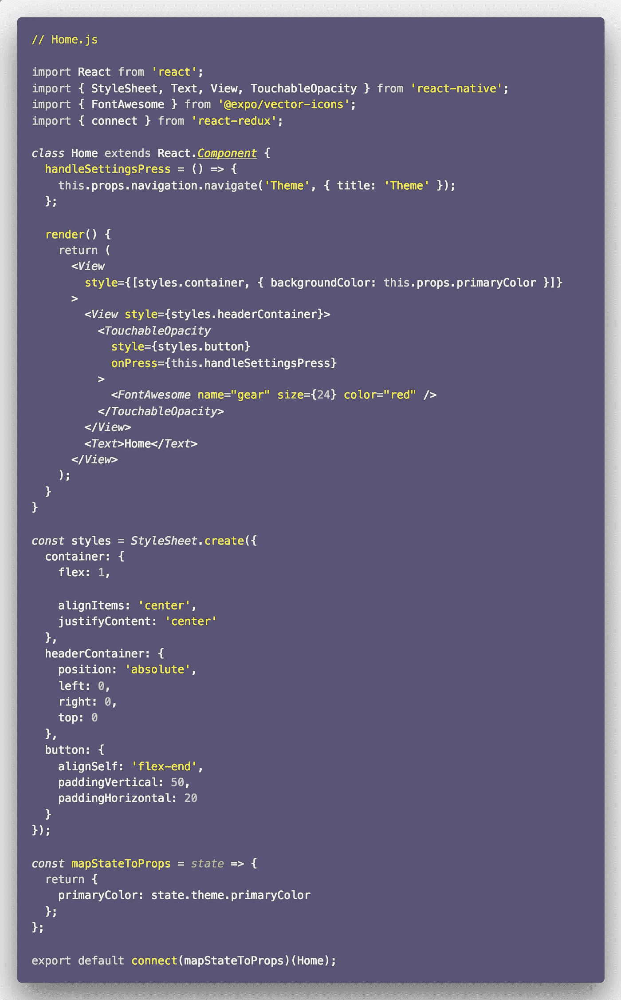
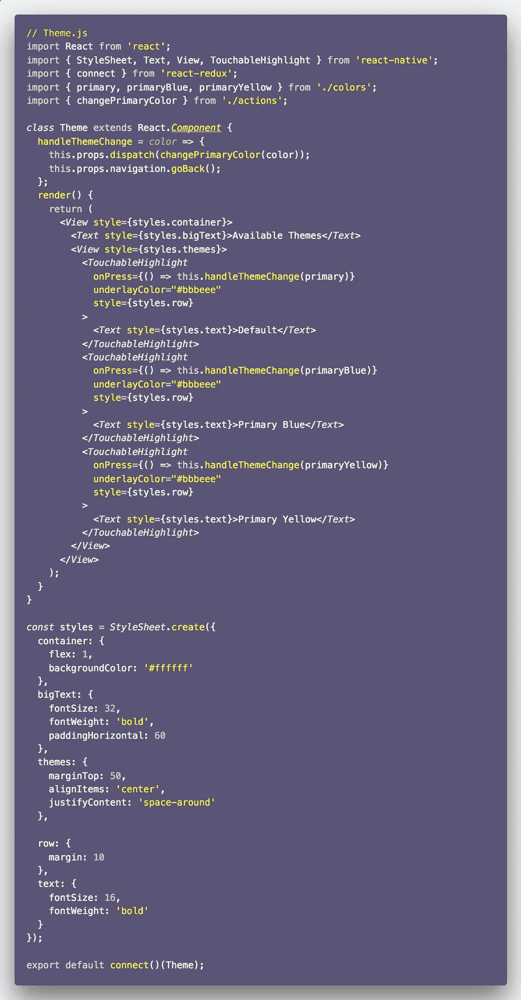

# 在 React Native 中构建主题应用程序的简单方法

> 原文：<https://medium.com/hackernoon/simple-recipe-to-build-a-theme-app-in-react-native-8e2456f81bc5>

最近，我一直在开发一个 React 原生应用程序，它需要一个基于用户选择的可变主题。我想尽可能用最简单的方式来做这件事。到目前为止，我一直避免使用任何 React Native UI 工具包，如 NativeBase 或 React Native Elements。在下面的文章中，我将和大家分享这个简单的食谱。

> 这就是我们正在建设的。到本文结束时，您将拥有一个外观相似的 React 原生项目。

# 要求

你可以从 Github repo 中克隆这个应用程序来看看它是如何工作的。或者你可以一步一步跟着文章走。由你来决定。首先，使用您选择的生成器生成一个 react 本机应用程序。我们必须做出选择:

*   `react-native cli`
*   expo-cli/CRNA

我将使用 expo-cli 进行演示，但如果您愿意，也可以使用 CRNA(Create-React-Native-Project)。在开始之前，我们需要在项目中安装以下依赖项。

*   回家的
*   redux-logger(可选的，如果出现任何问题，您可以更好地进行调试)
*   反应-导航
*   react-native-vector-icons(仅在使用 react-native-cli 时安装)

# 入门:导航

我们只需要两个屏幕来演示。我将称他们为`Home.js`和`Theme.js`。两者现在都只包含样板代码。在我们使用`react-navigation`连接他们之前，他们保持沉默是件好事。创建一个名为`navigation.js`的新文件并导入两个组件。

`createStackNavigator`是`react-navigation`版本 2+中对`StackNavigator`的替代。请注意，我们没有向主屏幕传递标题。

# 使用 Redux 创建商店

下一步是构建一个 redux store，它将利用一个 action、action creator 和 reducer 来改变应用程序中的主题。在`actions.js`中输入以下代码。

我们只有一个动作，改变应用的主题颜色。现在减速器:

请注意，我们将初始状态下的原色设置为十六进制值。您也可以从应用程序的配置文件或常量文件中检索它。我们还导出了`colors.js`文件，该文件包含三个不同的十六进制代码值，它们定义了不同的配色方案。

最后，创建商店，并将其发送到`App.js`，供应用程序组件使用。

在`App.js`文件中，我们连接 Redux 存储来管理状态和导航。

您可能想知道为什么要为这么小的应用程序使用 Redux Store。我想展示的是一种实用的方法，使用 React Native 和 Redux 构建一个可运行的应用程序。管理国家是你的选择。

# 完成应用程序

我们的 React 本地应用程序的最后一个组件是`Home.js`和`Theme.js`。

通过按下设置图标，我们可以导航到主题屏幕来更改主屏幕的背景颜色。我们也在这里传递主题画面的标题。

改变颜色的魔法正在`Home.js`发生在这条线上:

我们正在接收道具中的`primaryColor`。在选择一个可行的选项时，`Theme.js`文件将改变这个道具的值。看看下面。

在上面的例子中，`handleThemeChange`处理我们在`actions.js`中定义的唯一动作的分派。最后，我们让我们的应用程序工作。

> 您可以在这个 Github 资源库中找到完整的代码。👇

 [## amandeepmittal/30 天

### ⚛️ + 📱。在 GitHub 上创建一个帐户，为 amandeepmittal/30 days of reactive development 做出贡献。

github.com](https://github.com/amandeepmittal/30daysofReactNative/tree/master/rn-themes-app) 

> 我的名字是[阿曼·米塔尔](https://twitter.com/amanhimself)。我是一名开发人员，负责 Node.js 相关 web 应用程序和❤️s React Native 的构建和咨询。这是我的[网站](http://amanhimself.me)和[推特](https://twitter.com/amanhimself)。

如果你不熟悉如何在 React Native 中使用/集成 Redux，并想了解更多，你应该查看下面的文章。

 [## 如何使用 React Native 和 Expo 将 Redux 集成到您的应用程序中

### Redux 是 React Native 生态系统的重要组成部分。如果你的世界围绕着 JavaScript 转，你可能…

medium.freecodecamp.org](https://medium.freecodecamp.org/how-to-integrate-redux-into-your-application-with-react-native-and-expo-ec37c9ca6033) 

***要获得关于我下一篇 React Native 文章的通知，请使用此表单注册我的个人时事通讯。***

[**在此加入每周简讯。**](https://tinyletter.com/amanhimself)