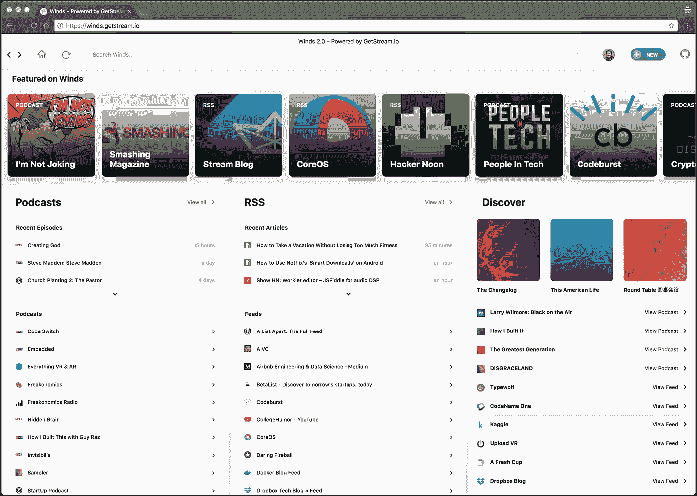
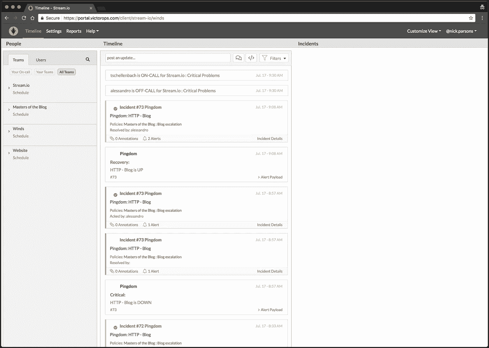
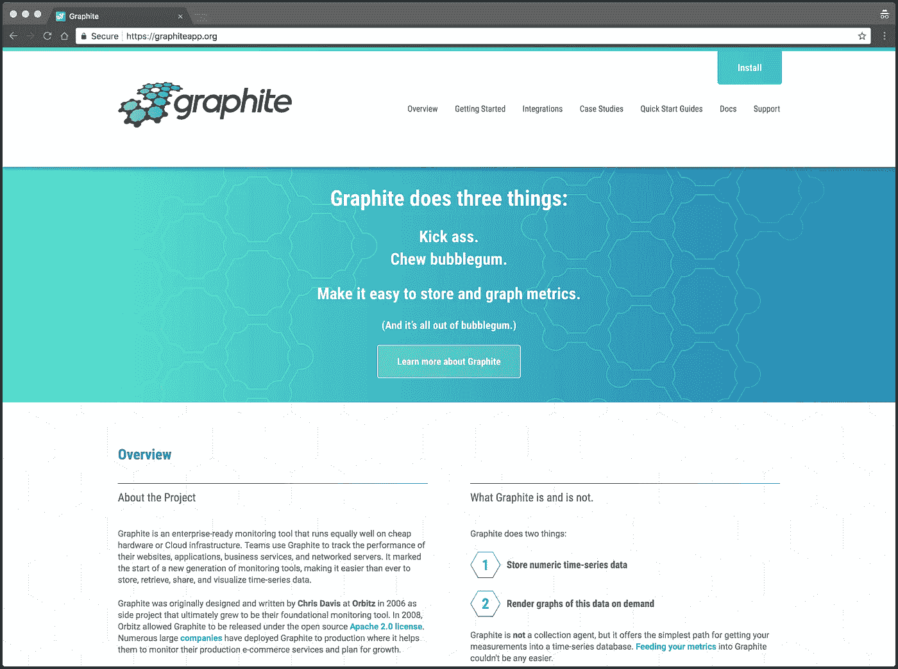
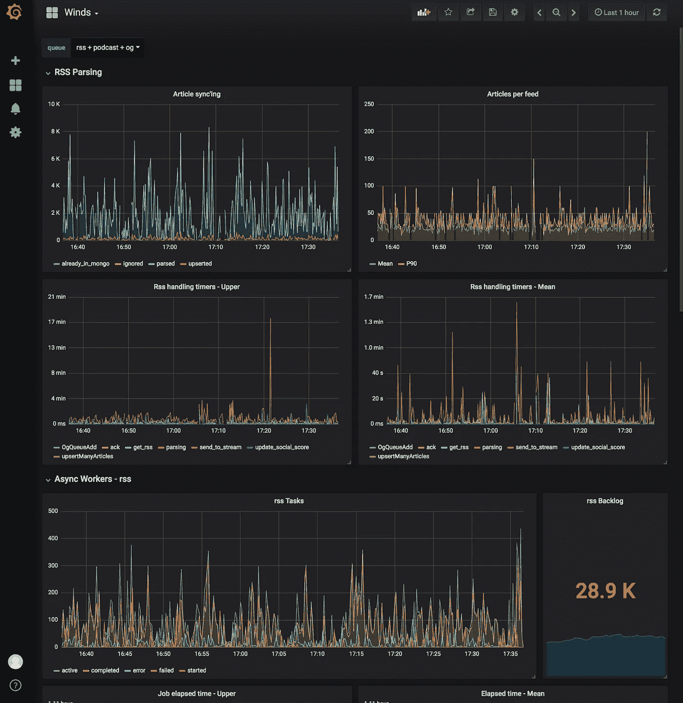
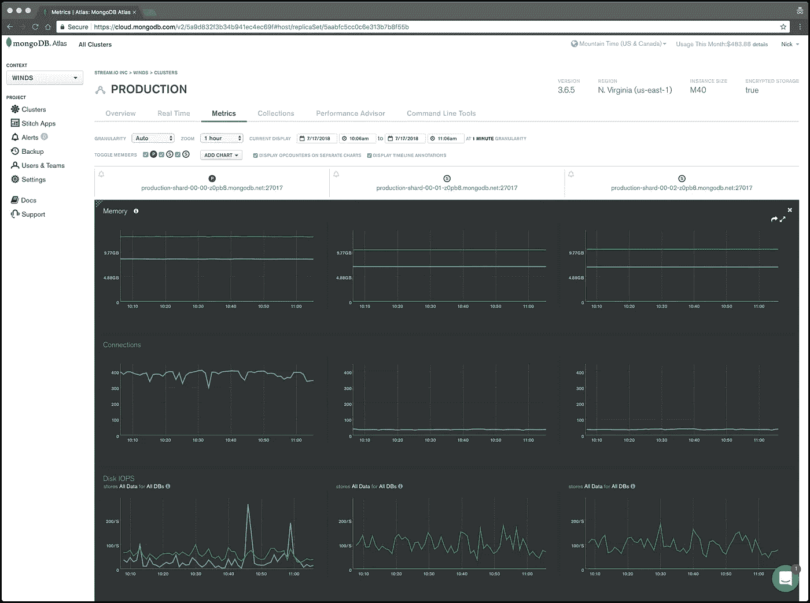
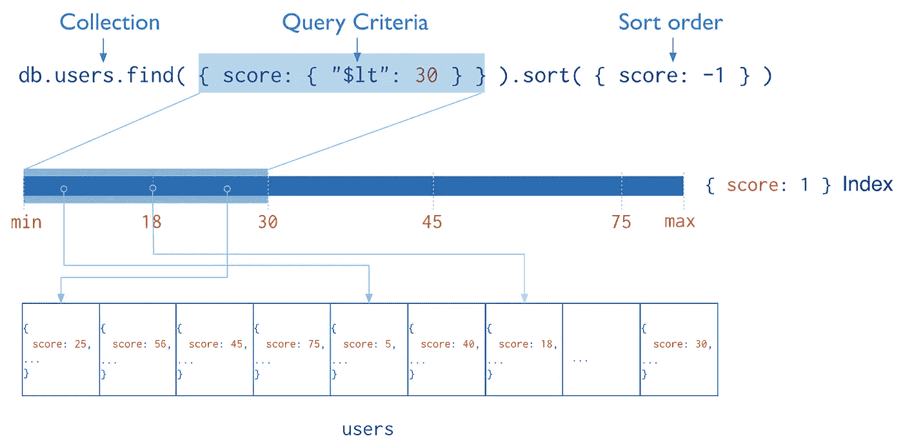
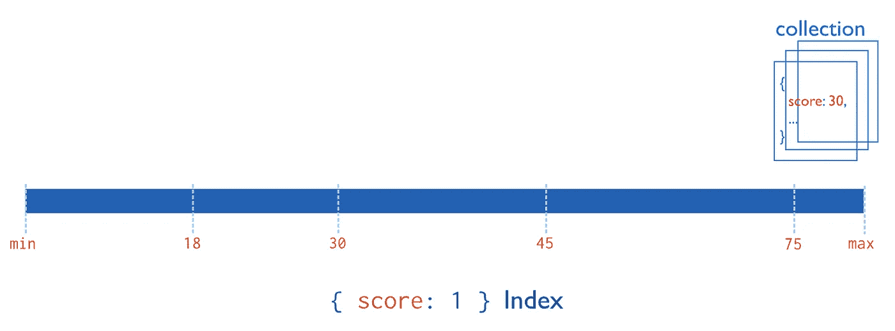
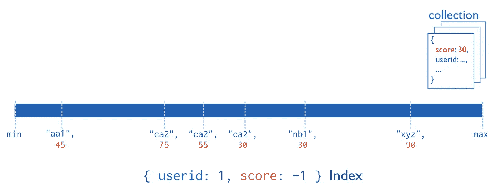
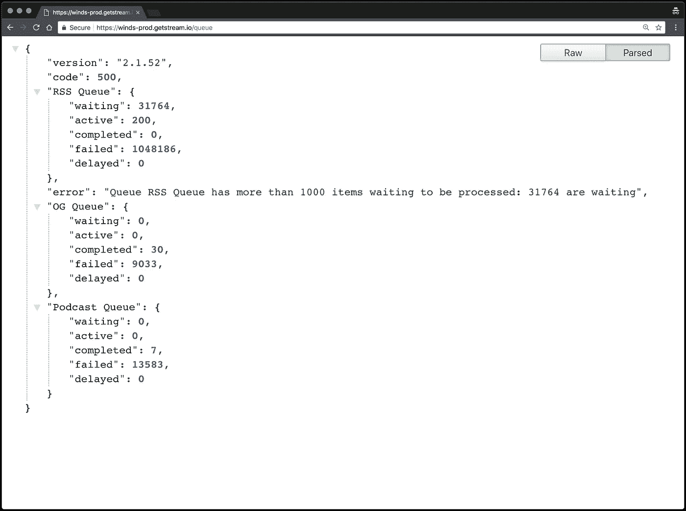

# 使用 MongoDB、Redis 和 Node.js 优化应用性能的简单步骤

> 原文：<https://medium.com/hackernoon/simple-steps-to-optimize-your-app-performance-5700d8b58f58>

[https://getstream.io/try-the-api/](https://getstream.io/try-the-api/)

# 重要的事情先来

在 [Stream](https://getstream.io) 这里，我们为 3 亿多终端用户提供活动订阅源，并且喜欢尝试在各种用例中使用我们的产品。最近，我们构建了 Winds，[，一个开源的 RSS 和播客](https://getstream.io/winds/)应用，重点放在 UI 和 UX 上。

在我们于 2018 年 5 月下旬推出第二代 Winds 后不久，我们开始看到用户注册量大幅上升。当然，大多数示例应用程序不会有这么大的流量。然而，风在[黑客新闻](https://news.ycombinator.com/item?id=17129086)和[产品搜索](https://www.producthunt.com/posts/winds-2-0)上疯传。到目前为止，示例应用程序代码并没有得到很好的优化。这篇博文涵盖了一些快速入门技巧，可以帮助你提高应用程序的性能。

在这篇文章中，我们将讨论如何通过优化数据库模式和添加缓存来减少 API 调用延迟，以及我们实现的其他工具和改进。

https://getstream.io/winds

# 可视化和优化 API 调用

对问题进行分类的第一步是理解潜在的问题。如果您没有使用正确的工具来帮助您可视化代码库中正在发生的事情，这可能是一项艰巨的任务。对于 Winds，我们利用各种工具的组合来更好地了解我们的生产环境中发生了什么，从而帮助我们查明延迟问题和缺陷。下面是我们使用的工具以及我们为什么喜欢它们的简要概述。

# 新遗迹

[New Relic](https://newrelic.com/) 提供了我们的请求和响应基础设施的全面视图，使我们的团队能够更好地理解和定位慢速路线。Node.js(我们选择的语言)和其他语言的实现非常简单——只需导入包并放入您的密钥；新圣物从那里接手。

这是 New Relic 在野外的截图(你会注意到我们还没有优化我们的 **POST /rss** 端点*和*——New Relic 如何让我们看到哪些端点需要优化的完美例子)。

[https://newrelic.com](https://newrelic.com)

在上面截图中的“交易”下，您会看到一个路线列表。这些是 API 路由，以及从应用程序到 API、数据库并返回所需的时间(以毫秒为单位)。了解往返需要多长时间对于隔离缓慢的响应时间非常重要。

# 维克托罗普斯

这个工具*很神奇*。 [VictorOps](https://victorops.com/) 允许我们的团队指派其他团队成员“随叫随到”，如果/当出现问题(如 API 关闭)时，VictorOps 将 ping 用户 Slack 并发送短信以引起他们的注意。这个过程加快了解决问题的速度，并让团队中的每个人都知道应用程序是否有问题。下面是我们的帐户仪表板的屏幕截图:

[https://victorops.com](https://victorops.com)

# StatsD

最初由 [Etsy](https://codeascraft.com/2011/02/15/measure-anything-measure-everything/) ， [StatsD](https://github.com/etsy/statsd) 编写，是一套工具，可用于从您的应用程序发送、收集和聚合自定义指标。该名称既指原始守护程序中使用的协议，也指实现该协议的软件和服务的集合。

StatsD 系统需要三个组件:客户机、服务器和后端。客户端是一个库，在我们的 Winds 应用程序代码中调用它来发送指标。这些指标由 StatsD 服务器收集。

服务器汇总这些指标，然后定期将汇总的数据发送到后端。后端然后使用我们的数据执行各种任务——例如， [Grafana](https://grafana.com/) (显示在 Grafana 部分)用于查看风力[工人](https://github.com/GetStream/Winds/tree/master/api/src/workers)的实时图表(RSS、播客、打开图表等)。)和其他重要的基础设施指标。

为了收集数据，我们使用一个名为 node-statsd 的节点库。使用这个库，我们创建了一个帮助文件来保持代码的整洁:

我们可以像这样调用 util(在任何有 statsd 注释的地方):

值得注意的是，您可以将以下[指标类型](https://github.com/etsy/statsd/blob/master/docs/metric_types.md)用于 StatsD:

*   **计数器** —它们代表一段时间内的数值或某一事件的发生次数(您可以设置或增加/减少)。StatsD 将计算平均值、百分位数等。)
*   **仪表** —类似于计数器，但它代表一个值(可用的最新数据点)，而不是一段时间内的值
*   **计时器**——类似于计数器，但用于测量操作花费的时间，而不是操作发生的次数

# 石墨

Graphite 由三个软件组件组成:Carbon、Whisper 和 Graphite Web。Carbon 是一个高性能的服务，它监听 StatsD 发出的时间序列数据。Whisper 是一个简单的数据库库，用于存储时间序列数据，graphite-web 是 graphite 的用户界面和 API，用于呈现图形和仪表板(尽管我们在项目中不使用 Graphite Web，因为我们使用 Grafana)。

更清楚地说，来自 StatsD 的指标通过 Carbon 服务输入堆栈，Carbon 服务将数据写出到 Whisper 数据库进行长期存储。然后，我们使用 Graphite Web 提供的 API 在 Grafana 中可视化数据。

石墨的详细实施和其他信息可以在[这里](https://graphiteapp.org/)找到。

[https://graphiteapp.org/](https://graphiteapp.org/)

# 格拉夫纳

[Grafana](https://grafana.com/) 是领先的时间序列分析开源软件，这就是为什么我们选择用它来分析风和河流。Grafana 允许我们的团队查询、可视化、警告和理解从 Graphite 检索的风的度量。它充满了令人敬畏的可视化工具(如下面的截图所示)，允许我们的团队挑选和选择我们想要如何显示我们的数据。

[https://grafana.com/](https://grafana.com/)

# 优化我们的 MongoDB 数据库

对于我们的主数据存储，我们使用[MongoDB Atlas](https://www.mongodb.com/cloud/atlas)——由 MongoDB 提供的 MongoDB *的托管版本。这允许 Winds 拥有一个完整的副本集(3 台服务器),而无需管理它们。服务器会自动升级并自动安装补丁，这非常方便。MongoDB Atlas 还执行定期备份，并提供副本集的时间点备份。不幸的是，这种奢侈是有代价的；然而，这是我们愿意承受的，这样我们就可以专注于改善 Winds 的用户体验。*

虽然 MongoDB Atlas 负责数据库管理的繁重工作。这并不意味着它解决了所有问题。文档需要正确地组织和索引，我们需要确保将读写保持在最低水平，这样我们就不会使用所有分配的每秒输入/输出操作(IOPS)和连接。

[https://cloud.mongodb.com](https://cloud.mongodb.com)

# 索引使用

不正确的索引或根本没有索引通常是应用程序延迟增加的首要原因。如果没有索引，MongoDB 必须执行集合扫描，即扫描集合中的每个文档，以选择那些匹配查询语句的文档。

正如 MongoDB 所描述的，索引是一种特殊的数据结构，它以易于遍历的形式存储集合数据集的一小部分。索引存储特定字段或字段集的值，按字段值排序。索引条目的排序支持高效的等式匹配和基于范围的查询操作。此外，MongoDB 可以通过使用索引中的排序返回排序的结果。

下图说明了一个使用索引对匹配文档进行选择和排序的查询:

# 散列索引

在 Winds 中，我们几乎拥有所有合适的索引，但是，我们没有认识到 MongoDB 中的一个主要需求/约束。索引条目的总大小必须小于 1024 字节。这并不难保证…对吗？事情是这样的，我们对 URL 进行索引以加快查找过程，一些进入 Winds API 的 URL 超过 1024 字节。这导致了各种意想不到的错误。

经过大量研究，我们找到了一个解决方案— [散列索引](https://docs.mongodb.com/manual/core/index-hashed/)。散列索引维护索引字段值的散列条目。这意味着我们可以像以前一样在同一个 URL 上进行查找，而不用担心它的长度，并且仍然保持完整性。

> 注意:当使用散列索引解析查询时，MongoDB 会自动计算散列。应用程序不需要计算散列。

# 单一索引

除了 default _id 索引之外，MongoDB 还支持在文档的单个字段上创建用户定义的升序/降序索引。这将是你最常用的索引类型。

对于单字段索引和排序操作，索引键的排序顺序(即升序或降序)并不重要，因为 MongoDB 可以在任一方向上遍历索引。

# 复合指数

与其他数据库类似，MongoDB 支持复合索引，其中单个索引结构保存对多个字段的引用。

> 注意:不能创建具有散列索引类型的复合索引。如果试图创建包含哈希索引字段的复合索引，将会收到错误消息。

要创建复合索引，请使用类似如下的操作:

或者，如果您使用 Mongoose，您将需要在模式级别定义索引。这里有一个例子:

> 注意:上面展示了一个添加复合指数的例子，类似于添加单一指数。唯一的区别是，对于单个索引，只有一个值为 1 或-1 的键。

索引中字段的值描述了该字段的索引种类。例如，值 1 指定按升序排列项目的索引。值-1 指定按降序对项目排序的索引。

> 注意:如果您对深入阅读 MongoDB 中的索引感兴趣，[这里有一个很好的资源](https://docs.mongodb.com/manual/indexes/)。还有一个关于性能索引的精彩的[幻灯片](https://www.slideshare.net/mongodb/fast-querying-indexing-for-performance-4)。

# 确保索引

MongoDB 提供的一个特性是 **createIndex()** 操作。这样做的目的是遍历数据库中的每个文档，并“确保”它有正确的索引。许多人没有意识到这是一个非常繁重的数据库任务，占用了宝贵的 CPU 和内存，降低了数据库的速度。

如果对索引进行更新，您需要运行 **createIndex()** 操作；但是，我们建议在非高峰时间这样做，此时您的数据库不会受到每秒大量请求的冲击。

要在 Mongoose 中启用这个特性，请看一下这里的文档。

> 注意:如果您想阅读关于 **createIndex()** 操作的内容，MongoDB 有关于这个主题的[大量文档](https://docs.mongodb.com/manual/reference/method/db.collection.createIndex/#db.collection.createIndex)。

# 巧妙处理查询

减少对数据库的查询是您可以实现的最大性能增强。使用 New Relic，我们发现用户注册路径非常慢。一个注册 API 调用变成了对 Stream API 的大约 60 个请求，还有几个对数据库的调用来获取兴趣。在研究了这个问题之后，我们意识到我们可以做两件事来减少请求的总数:

1.  在 Redis 中缓存兴趣(接下来将介绍)，而不是为每个用户注册对数据库进行 N 次 API 调用
2.  批量 API 调用第三方服务，如 Stream

另一个常见的错误是多次执行一个简单的查询，而不是读取所有必需记录的单个查询。当从流中读取提要时，我们简单地使用 MongoDB **$in** 操作符来检索流中存储的所有带有 id 值的文章。

# 精简查询

对于我们的 ODM，我们使用了 Mongoose，它是 MongoDB 驱动程序之上的一个功能打包且易于使用的 Node.js 层。这允许我们实施对象模型验证、转换和业务逻辑，这在我们的 API 代码库中提供了一致性。唯一的缺点是每个查询都返回一个沉重的 mongose 对象，带有 getter/setter 方法和其他我们有时不需要的 mongose 魔法。

为了避免查询响应中有时出现的额外开销，我们在一些查询中使用了[**【lean()**](http://mongoosejs.com/docs/api.html#query_Query-lean)**选项。这产生了一个普通的 JavaScript 对象，然后可以将其转换为 JSON 作为响应负载。就像做类似下面的事情一样简单:**

# **解释查询**

**[$explain 操作符](https://docs.mongodb.com/manual/reference/method/cursor.explain/#cursor.explain)非常方便。顾名思义，它返回一个描述用于返回查询的过程和索引的文档。这在尝试优化查询时提供了有用的见解(例如，添加什么索引来加速查询)。**

**关于$explain 操作符的文档指定了如何实现查询。**

# **雷迪斯**

**[Redis](https://redis.io/) 是内存中的数据结构存储。它可以用作数据库、缓存和消息代理。在我看来，Redis 是最容易被忽视的数据存储库之一——前提是它在存储内容方面非常灵活。对于 Winds，我们将其广泛用作缓存，以避免不必要的数据库查找。**

**例如，在 Winds 的注册阶段，我们会问你的兴趣是什么，这样我们就可以利用机器学习围绕你喜欢的东西打造用户体验。这个步骤过去需要调用数据库来获取数据库 ID，这样就可以存储它。现在，我们简单地将利息存储为 JSON，并对 Redis 进行查询。因为 Redis 将所有内容都存储在内存中，所以这是一个非常轻量级的任务，几乎没有额外的延迟。**

****

**[https://winds.getstream.io](https://winds.getstream.io)**

**这里有一个我们如何将兴趣储存在风中的例子:**

**针对您的应用的一些关键要点:**

****使用 Redis 表示**:**

*   **存储流行的和频繁查询的数据，以减少数据库查询(查询内存比让数据库对磁盘进行查找要有效得多)。**
*   **在数据有效的时间内缓存数据(例如，在我们的例子中，Winds 为 60 分钟)，并使用自动过期(这是默认设置)。**
*   **将您的缓存键与您的应用程序版本号相关联(例如**兴趣:v2.0.0** )。这将在您向应用程序部署更新时强制重新缓存，从而避免潜在的错误和缓存不匹配。**
*   **字符串化你的数据，以确保它可以存储在 Redis 中(它只是键值，两者都必须是字符串。**

# **公牛队列**

**Bull 是一个奇妙的排队系统，位于 Redis 之上。我们在 Winds 中将 Bull 用于我们的工人基础架构，并且有几个队列用于处理(抓取)数据:**

*   **简易资讯聚合**
*   **播客**
*   **打开图表**

****最重要的是，我们选择公牛的原因如下**:**

*   **由于采用了免轮询设计，CPU 使用率极低**
*   **基于 Redis 的稳健设计**
*   **延迟的工作**
*   **作业的限速器**
*   **重试次数**
*   **优先**
*   **并发**
*   **每个队列有多种作业类型**
*   **线程(沙盒)处理功能**
*   **从流程崩溃中自动恢复**

**我们对提要和开放图抓取使用了一种排队机制，因为它将进程分开，这样它们就不会在没有 API 性能的情况下发生冲突。这通常是最佳实践，因为当您经常解析 10，000 或更多的提要时，您不希望您的 API 挂起。**

**在构建 API 或应用服务器时，重要的是退后一步，问一问任务是否会妨碍您的响应时间。响应时间应该最多 250 毫秒，即使这个数字也很慢。当有疑问时，将它放入一个队列，并在一个单独的线程上处理它。**

> **注意:这里是我们队列的一个快速截图。这将显示队列中活跃的 RSS、Podcast 和打开的 Graph 作业的数量及其状态。Bull 通过 API 提供所有这些数据，使我们能够更好地了解幕后发生的事情。你也可以使用其他第三方用户界面进行监控，比如[任务组](https://taskforce.sh/)和[竞技场](https://github.com/mixmaxhq/arena)。**

****

# **使用专用解决方案**

**类似于 Bull 卸载处理负担的方式，使用专用解决方案来加速应用程序是非常有价值的。例如，我们使用自己的服务 [Stream](https://getstream.io/try-the-api) ，以确保用户在被放入系统时，能够跟踪必要的提要并接收更新。从零开始建造这个可能需要几个月，甚至几年；然而，通过使用服务，我们能够在几个小时内实现。**

**另一个我们喜欢的第三方服务是 Algolia。Algolia 在 Winds 中增强了我们的搜索功能，使查找速度快如闪电(查找时间少于 50 毫秒)。虽然我们*可以*用一个专用的端点和一个奇特的 MongoDB 查询自己构建搜索，但我们无法扩展搜索功能并保持 Algolia 提供的相同速度，而且当用户执行搜索时，它会耗尽宝贵的 API 资源。**

**这两种解决方案都远远优于您使用通用数据库在内部构建的解决方案。**

# **最后的想法**

**我们希望您喜欢这份提高 Node 应用程序性能的基本技巧列表。大多数现实世界的性能问题都是由简单的事情引起的。这篇文章列举了一些常见的解决方案:**

*   **APM 工具，如 New Relic、StatsD 和 Grafana**
*   **索引使用和查询优化**
*   **Redis 和缓存**
*   **异步任务**
*   **为搜索和提要使用专门的数据存储**

**如果你正在寻找更高级的主题，请查看关于 [Stream 如何使用 RocksDB，Go 和 Raft 为超过 3 亿用户提供提要的帖子](https://stackshare.io/stream/stream-and-go-news-feeds-for-over-300-million-end-users)。**

**如果您正在构建一个需要新闻提要或活动提要的应用程序，请查看 Stream。我们有一个 5 分钟的教程，将带您浏览我们涵盖的各种使用案例。API 教程可以在[这里](https://getstream.io/try-the-api)找到。**

***如果你有任何问题，请在下面的评论中提出。如果你有兴趣在推特上关注我，我的账号是*[***@ nick Parsons***](https://twitter.com/@nickparsons)*。***

****快乐编码！****