# 简化将人工智能添加到应用程序的过程——Core ML 向沃森问好

> 原文：<https://medium.com/hackernoon/simplify-adding-ai-to-your-apps-core-ml-say-hello-to-watson-c4dfebf66802>

IBM Watson 刚刚宣布能够在 iOS 上本地运行视觉识别模型作为核心 ML 模型。我非常兴奋。

在此之前，只要从苹果公司下载一个模型，就可以很容易地将视觉识别系统集成到你的 iOS 应用程序中。但是，您可以使用的模型非常简单，并且特定于它可以识别的一组标准项目(汽车、人、动物、水果等)。

但是，如果您希望有一个能够识别特定于您的用例的项目的模型呢？

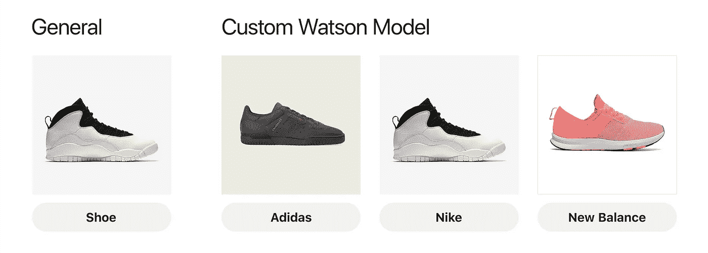

在此之前，如果你想这样做，并且你不熟悉人工智能的来龙去脉，这可能是一个相当困难的任务。你需要熟悉机器学习框架，比如 TensorFlow、Caffe 或 Keras。然而，使用 Watson，我们可以训练自己的定制模型，而无需接触任何代码。

## **在**之前，如果你用沃森训练一个模型

*   它被困在云层里了
*   你需要一个互联网连接来访问它
*   你被收费使用它

## **现在**

*   您可以下载您的模型作为核心 ML 模型
*   您可以像任何其他核心 ML 模型一样在本地使用它
*   无附加条件

# 收集数据

为了建立一个定制模型，我们需要收集数据来训练它。如果我们想在不同品牌的鞋子上训练我们的模型，我们需要收集每个品牌的大量图片。

我从谷歌上下载了:

*   100 张耐克鞋的照片
*   阿迪达斯鞋子的 100 张图片
*   新百伦鞋子 100 张图片

这是一种非常懒惰的数据收集方法。它不会产生很好的结果，除非我们的用例恰好是对 Google 图片搜索结果进行分类。一个更好的方法(鉴于这是针对 iOS 应用程序的)是用你的 iPhone 相机给不同的鞋子拍照。然而，我刚好只有两双鞋，而且它们都属于“耐克”的范畴。

我们尽力而为🤷‍♂️

> **注意:**不出所料，这个模型并没有我想要的那么好，所以我最后只用了我的 10 张耐克鞋的照片、我爸爸的 10 张新的 Balances 的照片和我朋友的 10 张阿迪达斯鞋的照片(而不是谷歌照片)。

收集完图像数据后，我们需要将每个类别压缩到各自的`.zip`文件中。

# Watson 入门

要使用 Watson，我们需要创建一个 [IBM Watson Studio](https://datascience.ibm.com) 帐户。登录或注册，然后进入主页:

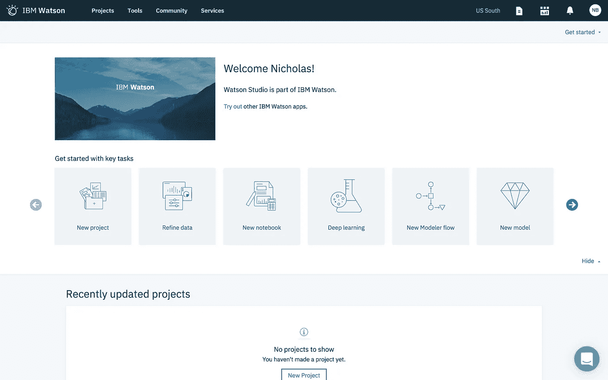

> **注意:**如果没有看到`New project`、`Refine data`、`New notebook`等...点击右上角的`Get started`下拉菜单。

点击`New project`，然后选择`Visual Recognition`:

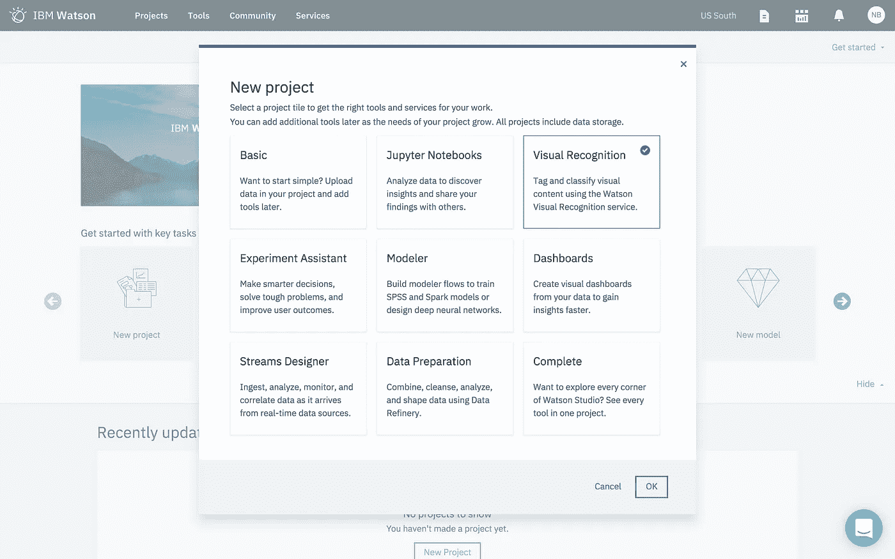

为您的项目命名并继续:

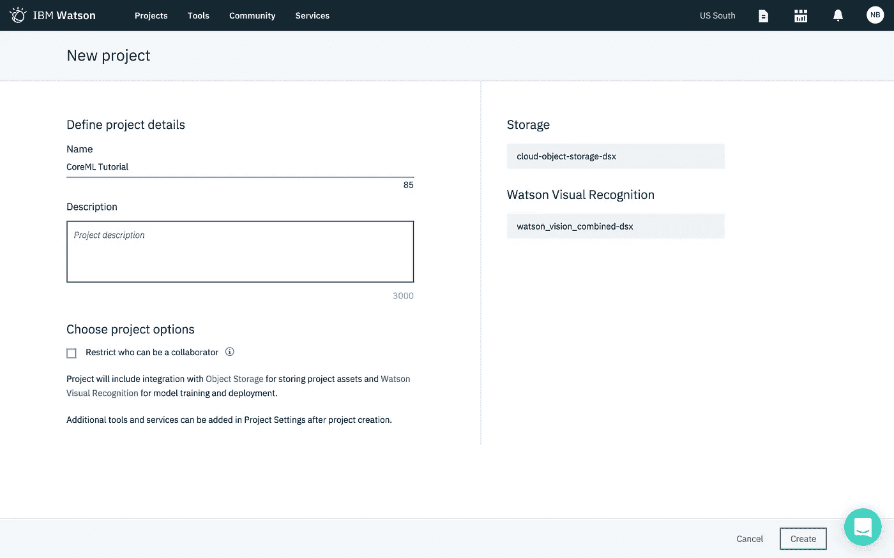

浏览您创建的`.zip`文件:

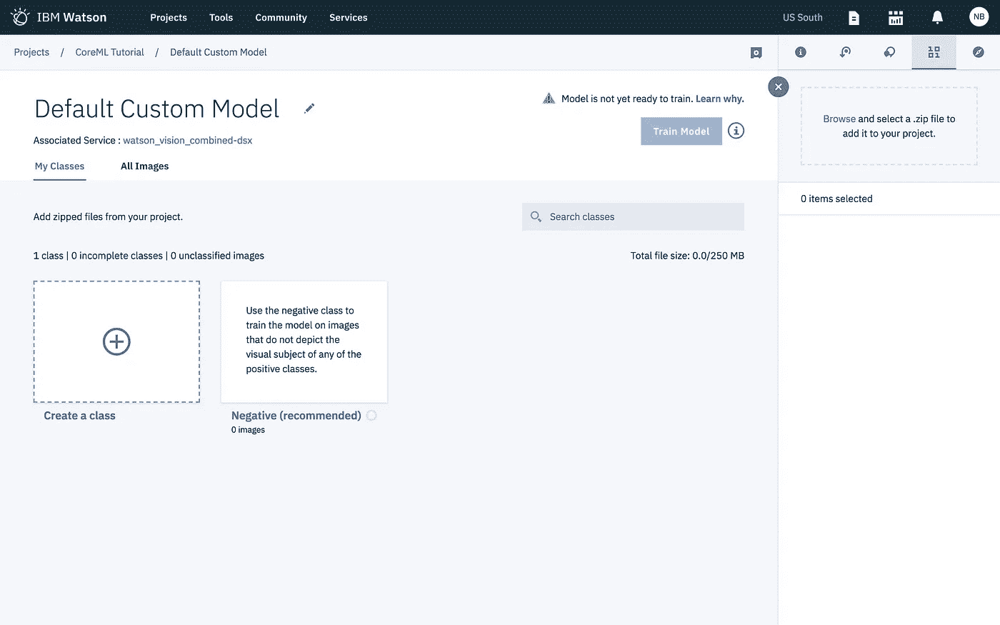

然后点击 3 点菜单并选择`Add to model`将它们添加到模型中:

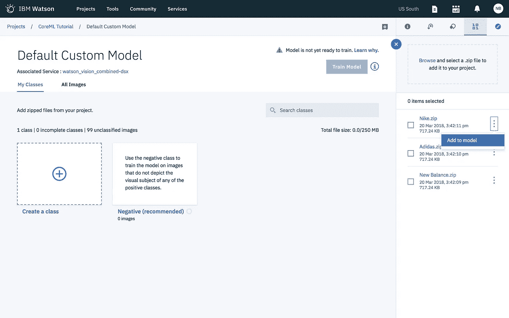

然后单击以训练模型:

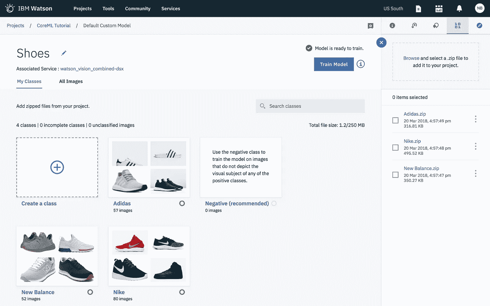

# 下载核心 ML 模型

一旦模型完成训练，你会收到一个小通知。单击查看并测试模型:

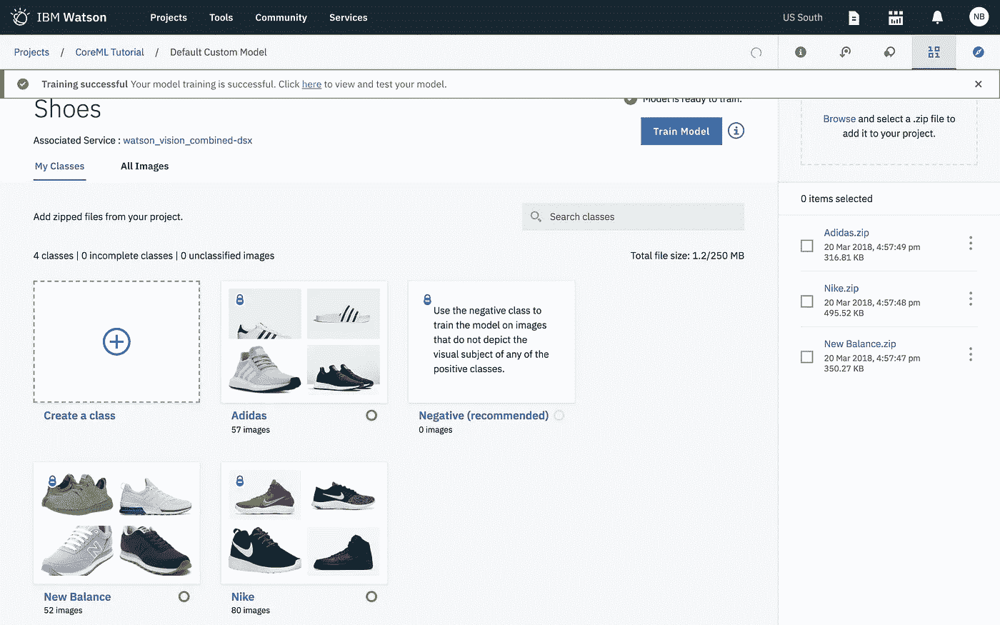

这将带您进入允许您下载模型的页面:

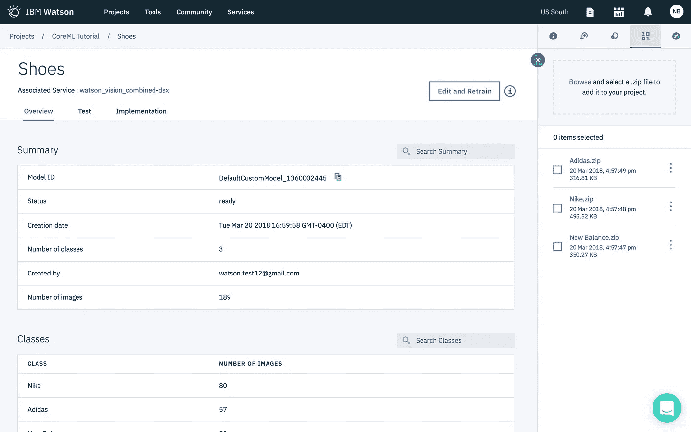

选择`Implementation`，然后选择`Core ML`。然后下载模型文件:

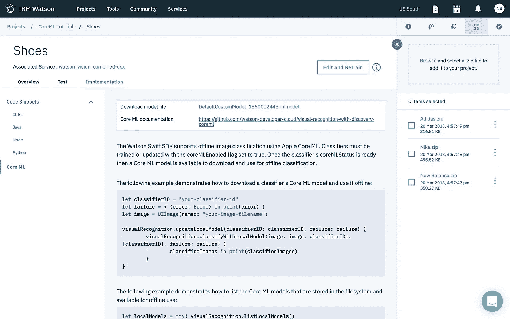

> **重要提示:** Safari 下载扩展名为`.dms`的文件。只需将其重命名为具有`.mlmodel`扩展名。

# 运行应用程序

为了这篇文章的简单，我假设你有 Xcode 的工作知识😬

我构建了一个示例应用程序，你可以从我的 GitHub 克隆它。

你需要做的就是打开这个项目。导入您下载的核心 ML 模型文件。然后在`CameraViewController`文件中更改模型名称以匹配您的名称:

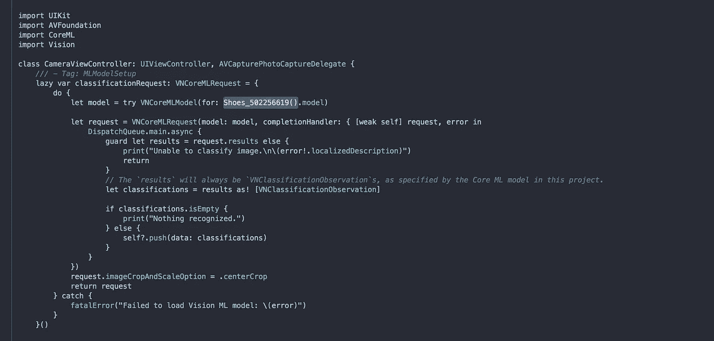

> **更新:**写完这个，我了解了一下 [Watson Swift SDK](https://github.com/watson-developer-cloud/swift-sdk) 。它使得分类变得非常容易，也使得在重新训练后下载模型的任何更新变得非常容易。

## 分类

## 更新本地模型

仅此而已！你应该可以运行应用程序，拍照并取回分类(请原谅我极其脏的鞋子):

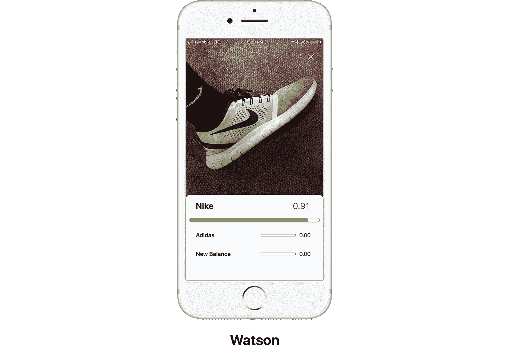

# 最后的想法

我知道我为 IBM 工作，但希望我不是唯一对此感到兴奋的人😝我一直在等待能够在本地运行我的定制 Watson 模型。不再需要互联网连接，无论您身在何处，模型都能快速运行。

感谢阅读！如果你有任何问题，请随时联系 bourdakos1@gmail.com，通过 LinkedIn 联系我，或者通过 Medium 和 Twitter 关注我。

如果你觉得这篇文章很有帮助，给它一些掌声会很有意义👏并分享出来帮别人找！并欢迎在下方发表评论。