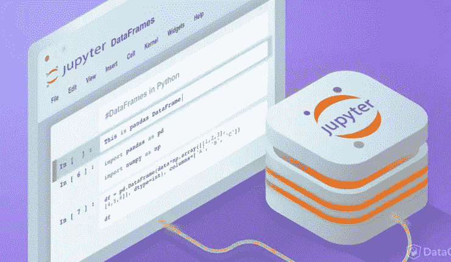
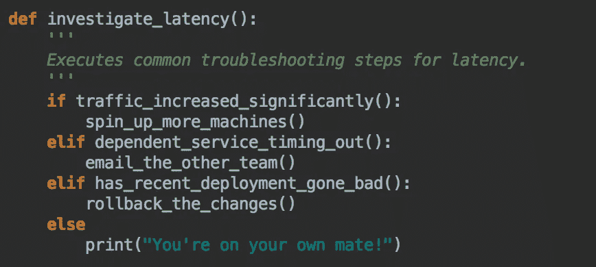

# 使用 Jupyter 笔记本电脑简化开发工作

> 原文：<https://medium.com/hackernoon/simplify-devops-with-jupyter-notebook-c700fb6b503c>

Jupyter Notebook 是一款神奇的数据探索工具。它**将 markdown 文本、可执行代码和输出都放在一个浏览器中的单一文档中**。虽然 [Jupyter](https://hackernoon.com/tagged/jupyter) 对于数据科学来说很棒，但我将展示[笔记本](https://hackernoon.com/tagged/notebook)在一个完全不同的用例中的使用: **DevOps Runbook** 或者简单地说，*一种对系统中断做出快速响应的* *方式*。

# 问题

想象一下，你正在和心爱的人共度一个夜晚，突然看到一系列关于 API 延迟攀升的 slack/pager 警报。从那以后一切都走下坡路了。你上网检查所有常见的可疑点:**最近的部署、相关服务、负载平衡器、传入流量、数据库等等**。你从终端跳到 AWS 控制台，跳到 NewRelic，跳到电话会议等等。我们只能说，在你找到并解决问题之前，整个经历都充满压力。

更成熟的组织维护事故响应操作手册。Runbook 概述了要遵循的步骤，并排除了调试中的猜测工作。首先，让我们看看当前形式的操作手册面临的一些挑战:

*   您需要手动执行每个步骤，不需要自动化
*   除非写得很好，否则下面的说明可能会有歧义/混乱
*   让每个人都参与进来以保持操作手册的更新是一项相当大的努力

# 解决办法

为了解决这些问题，我建议使用 Jupyter 笔记本来写操作手册。下面是您的 API 延迟调试会话在笔记本环境中的样子(请以全屏模式观看此视频，如果需要，可查看原始的 [youtube 链接](https://www.youtube.com/watch?v=vvLXSAHCGF8&feature=youtu.be&showinfo=1&rel=0))。

Incident response with Jupyter Notebook

> 您可以**从 Notebook** 中获取图表、检查部署时间、回滚更改、运行 SQL 查询、shell 脚本、SSH。

# 利益

以下是以可执行笔记本格式维护操作手册的一些好处。

*   少一些困惑。代码比用英语写的指令更具确定性。
*   减少事故时间和影响。随叫随到响应速度更快，调查/解决问题所需的代码唾手可得。
*   按照您自己的节奏实现自动化。因为 Notebook 支持 markdown，所以可以直接导入现有的 runbooks 在每个 sprint 中自动执行一些步骤。
*   更好的协作。它提供了一个一流的平台，用于共享开发者为解决某个问题而保留的所有部落知识和本地脚本。
*   当我们将单个步骤结合起来构建更复杂的逻辑时，就有了真正的力量。今天以下是可能的。这是迈向自我修复系统的一步。

# 挑战

可执行笔记本格式是有前途的，但目前的 Jupyter 实现存在一些挑战。

*   典型的 Jupyter 安装是单用户本地安装，要求 Jupyter 服务器在本地运行。共享笔记本没有简单的方法。
*   谷歌联合实验室可能是个不错的选择，但它托管在谷歌服务器上。笔记本电脑服务器需要自我托管的代码，以访问我们的 VPC 内的所有基础设施。
*   任何基础设施代码都需要凭证、ssh 密钥等。我们需要一种安全共享它们的方式&而不仅仅是把它贴在笔记本代码片段的任何地方。

我正在构建 [Nurtch](http://nurtch.com/) ，一个解决这些挑战的平台&提供了一种在团队内部编写和共享可执行操作手册的简单方法。[文档](http://docs.nurtch.com/)提供了 Nurtch 功能和操作方法的完整概述。让我知道你对这种管理手册的方法有什么看法。

[查看 Amit Rathi 的所有帖子](https://blog.amirathi.com/author/amirrathi/)

*原载于 2018 年 3 月 27 日 blog.amirathi.com***。**