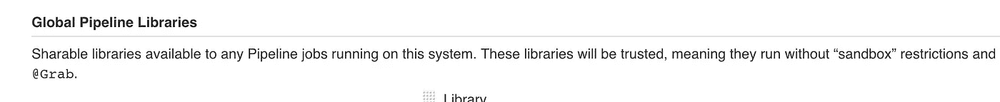

# 简化 Jenkinsfiles 文件

> 原文：<https://medium.com/hackernoon/simplifying-jenkinsfiles-c97cfee13f83>

> 利用詹金斯来解开詹金斯。


在过去的几周里，我对詹金斯的内部运作进行了彻底的**疯狂的调查。我们一直在寻找一种好的、方便的方法来简化我们的应用程序库的根处的`Jenkinsfile`。我们喜欢詹金斯，经过谷歌搜索和一些实验，我们发现了一些很酷的东西。但是首先，问题。**

我试图雄辩地描述我们的一些詹金斯档案有多糟糕，但是我的一个同事抢先了一步:

> 这个 Jenkinsfile 看起来像是 Groovy 开发人员用 cat 命令创建的。

他没有错。天哪，我们的档案里有一些疯狂的东西。所有这些*都需要*，但没有一件是漂亮的。看看这个坏男孩:

```
pipeline {
    agent any parameters {
        string (defaultValue: '', description: '**Imagine like 10 parameters here**', name: 'buildNumber') tools {
        // Yep, everyone was using the same maven and JDK version.maven 'Maven 3.5.0'
        jdk 'jdk8'
    }
    environment {
        BUCKET='my-app-bucket' **// ABOUT 15 IDENTICAL ENVIRONMENT VARIABLES**
    }
    stages {
        stage("Initialise"){ steps{
                echo "Config Aws - **Yep, everyone does this too**"
                sh"""
                    **aws do-some-repetitive-shit**
                """

            }
        }
        stage("Test"){
            when {
                expression {
                    params.buildNumber == ''
                }
            }
            steps{
                echo 'Running Tests'
                sh "**Run the same maven command as every build**"
                }
            }
            post {
                always {
                    junit 'target/surefire-reports/**/*.xml'
                }
                success {
                    **sh "Tell Slack the build went okay"**
                }
                failure {
                    **sh "Tell Slack the build is knackered"**
                }
            }
        }
        stage('Cleanup') {
            when {
                **// Do the same conditional logic in every file.**
            }
            steps {
                **sh "Do the same clean up for every app"**
            }
        } stage('Packaging') {
            when {
                **// Some more conditional logic? Fuck it, why not.**
            }
            steps {
                // **You guessed it you animals, more of the same.
                sh "Literally run mvn package"** }
            post {
                failure {
                    **sh "A failure condition that has never fired"**
                }
            }
        } stage(’Push App Version’) {
            when {
                **// It’s not complicated enough. MORE CONDITIONALS.**
            }
            steps {
                **// You bet this is copied and pasted.** 
            }    
        } stage(’Deploy’) {
            when {
                **// Ayyy. It’s not a party without conditional logic.**
            }
            steps{
                echo "Deploying cos to dev"
                **sh "THE SAME COMMAND EVERY TIME SERIOUSLY OMG"**
            }
        }
    }
}
```

# 该死的克里斯

我知道。我们运行着令人毛骨悚然的微服务，这种疯狂充斥着整个节目。几十个这样的文件(除去脏话)，这完全是我的错。我记得一开始设计这个该死的文件。我记得懒洋洋地复制和粘贴。我知道这将咬我的屁股，像一个 S&M 爱好者，我不在乎。变坏的感觉真好。

当我们不得不对 CI/CD 渠道进行更改时，这种感觉就不再好了。我摘下我的瘸子面具，做了一些谷歌搜索。然后我挖到了金子。

## 全球共享库

对，所以首先要认识到的是，你的管道只是一组 groovy 脚本。如果是声明式的或脚本式的，它只是运行一堆 groovy 命令。Groovy 和 Java 一样，支持文件顶部的`import`语句。一旦这一点变得显而易见，我们就会想到一些事情:

*   所有的构建都以同样的方式做着同样的事情
*   由于复制和粘贴，一些构建使用了 maven 的旧版本或者运行不同风格的命令。
*   所有应用程序都部署到同一个基础架构中。

所以我转向我的同事，告诉那个漂亮的混蛋我有个主意。他没理我，因为我一天要说 100 遍，但这次我说到点子上了。

我在这个过程中学到了一些东西，所以我把一个[简单的示例库和一些注意事项](https://github.com/ChrisCooney/jenkins-global-library-simple)放在了一起。好吧，盛大的揭幕仪式，我们的詹金斯档案现在看起来怎么样了？

```
import com.central.ci.*APP_NAME = "my-app"Pipelines pipelines = new Pipelines()pipelines.javaPipeline(APP_NAME)// They could also invoke pipelines.emptyJavaPipeline() and define their own, but without the need to set everything up.
```

## 而且做起来非常简单！

首先，创建一个 git 存储库。詹金斯支持其他一些人，但现在已经不是 2006 年了。请记住，Jenkins 需要适当的凭证才能访问您的私有存储库。

其次，告诉 Jenkins 这个存储库是存在的。点击“管理 Jenkins”并向下滚动，直到您看到以下内容:



You’ve struck oil you lucky bastard.

您需要指定存储库的位置，包括您需要的任何凭证。从那里，像对待任何其他 Groovy 脚本一样对待您的`Jenkinsfile`,并导入您的库。如果你想确保所有的构建默认都有这个，我建议勾选“隐式加载”框。

## 所以是的

不敢相信实话实说会有这么好的效果。我们还没有给它一个详尽的运行，但到目前为止，它已经受到好评，我们正在推出它到我们现有的应用程序的过程中。

更多 CI/CD 漫谈，[在 twitter 上关注我！](https://twitter.com/chris_cooney)