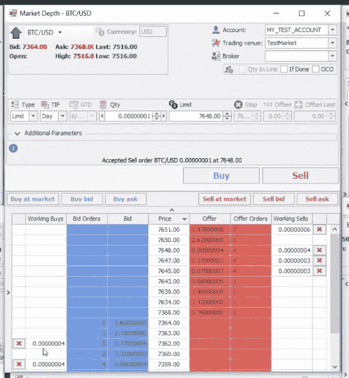

# 加密领域的模拟交易环境

> 原文：<https://medium.com/hackernoon/simulated-trading-environment-for-crypto-landscape-467140aa9b99>

> 不要担心市场会做什么，担心你会做什么来应对市场。*-****卡尔***

交易是一种艺术形式，你可以花一生的时间去完善它，如果交易失败了，你仍然会觉得自己是个新手。然而，如果你想交易，这不应该阻止你尝试，变得更好的简单秘诀是练习。

> 用模拟器训练是理解交易和发展你的市场感觉的最好方法。

在传统衍生品市场呆了近十年后，在闯入加密货币交易领域时，我对缺乏任何旨在指导初学者的综合模拟器感到非常惊讶。模拟软件不仅对刚进入市场的新手至关重要，对想要测试新策略或新型金融工具交易的有经验的交易者也很重要。随着加密衍生产品慢慢进入市场，模拟交易环境是加密领域的当务之急。

模拟器利用真实的市场数据让用户熟悉界面，教授下达不同类型订单的基础知识，并让他们掌握市场的运作方式。没有实物资产，交易者可以探索不同的市场方面，磨练他们的思维方式，并在执行真实交易前做好准备。

加密货币市场在很大程度上是现货市场。低买高卖，用各种硬币维持一个投资组合，通过支付交易费来获取你的收益，这是今天密码交易者做的大部分事情；这可能需要也可能不需要使用模拟器进行复杂的培训。交易衍生品，虽然需要一些技能发展，但有巨大的潜在回报，因此模拟器对于进入衍生品市场的用户来说是非常合适的。此外，能够在模拟环境中探索市场是提高交易敏感度的一种极好的方式，因此应该是任何加密平台的普遍特征。

在开发 idap.io 的过程中，我们意识到了*在我们平台的功能列表*中添加一个模拟器的重要性。我们的交易模拟器将帮助用户从真实的市场数据中学习，而不用冒真实加密货币的风险。他们将能够练习投资，制定策略并进行测试，通过控制衡量市场运作的指标来模拟假设情景，并找出如何在任何市场条件下交易不同类型的工具。通过彻底了解各种可能的情况，用户将有优势在他们的交易中最小化机会的作用，并提高他们的市场意识。好交易者和坏交易者的区别在于实践，我们的交易模拟将确保你得到大量的实践。

引入加密衍生品市场本身就是一个游戏规则的改变者。再加上一个模拟交易环境，*不仅可以教育用户，而且与*互动也很有趣，我们希望创造一个 [**idap.io**](http://www.idap.io) 平台的忠实追随者。

Example screenshot of Trading Simulator

## 保持更新:加入我们，改变加密资产市场

[网站](https://www.idap.io) | [电报](https://t.me/idap_io) | [Reddit](https://www.reddit.com/r/idap_io/) | [推特](https://twitter.com/idap_io) | [脸书](https://www.facebook.com/idapio.exchange/) | [Instagram](https://www.instagram.com/idap.io) | [比特币会谈](https://bitcointalk.org/index.php?topic=3431151)