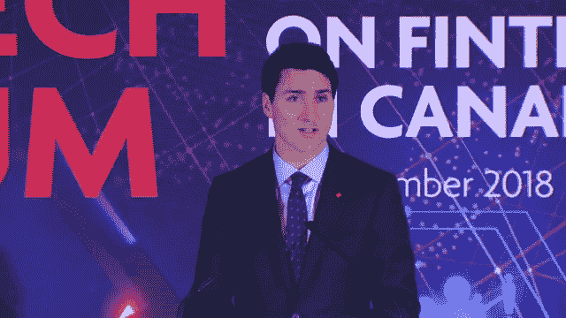

# 新加坡金融科技节 2018:我们应该从金融和科技领域的‘婚姻’中期待什么？

> 原文：<https://medium.com/hackernoon/singapore-fintech-festival-2018-what-should-we-expect-from-the-marriage-of-finance-and-e54516cbb42a>

作者:慧贤

2018 年新加坡金融科技节(SFF)占据了新加坡博览会的四个会议厅，吸引了来自七大海洋的约 45，000 名与会者，是去年的两倍。第三届电影节由微软软件工程师 Saqib Shaikh 主持开幕。他描绘了一个因创新技术而变得更加包容的社会。MAS 董事总经理拉维·梅农说:

> *“谢赫的故事体现了新加坡金融科技节的核心目标——创新、包容和灵感。”*

他补充说，为了建立更强大的金融科技[生态系统](https://hackernoon.com/tagged/ecosystem)；MAS 致力于六个组成部分:人员、身份、支付、数据治理、应用研究和创新平台。

其他出席此次活动的全球领导人包括印度总理纳伦德拉·莫迪；国际货币基金组织总裁克里斯蒂娜·拉加德；加拿大总理贾斯廷·特鲁多；新加坡教育部长兼新加坡金融管理局(MAS)董事会成员 Ong Ye Kung 新加坡财政部长亨瑞杰；肯尼亚中央银行行长 Patrick Njoroge 和老挝人民民主共和国银行行长 Sonexay Sithphaxay。

在国际名人中，许多全球领导人都对区块链和数字货币的发展表现出浓厚的兴趣。克里斯蒂娜·拉加德强调了数字资产作为对抗垄断和监管缺陷的后盾的重要性。尽管印度总理纳伦德拉·莫迪(Narendra Modi)在 2018 年世界信息技术大会(World Congress on Information Technology 2018)上拿区块链投资者的从众心理开玩笑，但他提到，区块链和物联网将对我们的日常生活产生深远影响，需要在我们的工作场所迅速采用。

加拿大总理贾斯廷·特鲁多除了是万人迷之外，还强调了加拿大对投资未来解决方案的承诺。加拿大银行、英格兰银行和新加坡金融管理局正在合作研究三种跨境支付模式。新加坡金融管理局首席金融科技官 Sopnendu Mohanty 表示:

> *“这三个司法管辖区的央行和金融机构的合作努力有助于我们确定跨境支付的差距和改进领域，并为进一步的技术试验奠定基础。”*

全球最大的金融科技节也见证了新加坡和其他国家之间的历史性交流，如与印度推出 API Exchange(APIX)；这项技术将使 20 亿人获得以前无法获得的银行便利。因此，APIX 的实施将促进 23 个国家的金融包容性。Ripple 的首席执行官 Brad Garlinghouse 参加了 SFF，他说:

> *“这种清晰的监管环境使得应用区块链和数字资产技术解决现实世界的业务用例变得更加容易，例如改善整个东盟地区的跨境支付。仅去年一年，东亚市场就收到了 1300 亿美元的汇入汇款。它们很贵，而且市场已经成熟，可以采用像区块链这样的新技术来大幅降低成本。”*

此次活动最重要的活动之一是马来西亚金融管理局、巴林、伊斯兰开发银行集团和其他金融中介机构签署了谅解备忘录。例如，美洲开发银行集团和新加坡签署了一项协议，以促进金融服务的包容性。

新加坡金融管理局在赛事场外推出了 FEAT 等举措。在金融中使用人工智能(AI)和数据分析时，FEAT 是一套用于促进公平、道德、问责和透明的原则。

数字化的基础是什么？答案很简单——连接。业务无国界是由 IMDA MAS 和六个私营部门合作伙伴设计的一项计划，旨在为混合业务数据和数字解决方案中心创建一个概念验证(POC)。

安全令牌(STO)——一种具有类似公司股票属性的令牌——是加密领域的新流行语。许多公司和投资者已经放弃了首次公开募股(ICO)的想法，去探索更安全的避风港。如果你是一家寻求推出 STO 的真正公司，沙盒快递将是一个诱人的选择。这一举措旨在使企业能够开展受监管的活动，并更快地开展实验；绕过现有的沙盒申请和批准过程。

根据新加坡金融管理局的新闻稿，评估的两个要求是:

*   金融服务的技术创新，以及
*   申请人主要利益相关者的合适性和适当性。

申请将被快速跟踪，在 21 天内批准决定。将要求批准的预定义沙盒实体向 MAS 提交定期进度报告，并确保完全符合预定义沙盒预期。

除了主要活动之外，2018 年东盟金融峰会还推出了一个新的部分——MATCH(与东盟的人才和冠军会面)——这是风险投资和科技公司之间达成交易的“导火索”。MATCH 已经在 380 名参与投资者和 840 家企业之间进行了 17，000 多次配对。正如 MAS 在[发布的新闻稿中所述，“这些举措得到了其他努力的补充，这些努力旨在扩大本地人才库，同时为私募股权和风险投资(VC)行业雇佣外国专家提供灵活性。此外，为早期风险资本交易引入了风险资本投资示范协议(VIMA)2。“VIMA 将通过一套投资者和企业可以使用和适应的标准化且易于获取的文件，提高交易和成本效率。”](http://www.mas.gov.sg/News-and-Publications/Media-Releases/2018/MAS-to-place-up-to-US5-billion-with-private-equity-and-infrastructure-fund-managers.aspx)

[创新实验室巡展](http://www.blockasia.io/singapore-fintech-festival-2018-paypal-long-hash-innovation-lab-crawl/)，SFF 的子活动，见证了 32 个创新实验室向超过 10，000 名参观者展示他们的最新技术。下一个环节表彰了 2018 年[金融科技奖](http://www.blockasia.io/twelve-innovative-fintech-solutions-recognised-at-the-2018-fintech-awards/)中的 12 个创新解决方案。最后，[全球金融科技黑客组织](http://www.blockasia.io/2018-global-fintech-hackcelerator-winners-announced-at-singapore-fintech-festival/)展示了未来的尖端科技。

毫无疑问，2018 年新加坡金融科技节已经成为参展商积极反馈的年度节日。

AMTD 集团(Singapore)分析师 Zoe Fang 表示:“在新加坡金融科技节(Fintech Festival)展出期间，我们能够见到来自该地区的高管和学生，并就金融科技的前景进行了许多有意义的对话。我们希望明年能再回来。”

加密谷协会(CVA)通信工作组主席 Ian Simpson 说，

> *“我们在瑞士和新加坡之间看到了许多相似之处，瑞士和新加坡都非常重视银行业、创新和区块链技术。与会者和参展商的素质反映了这样一个事实，新加坡是东南亚的一个中心，就像瑞士作为欧洲心脏的区块链中心一样。最重要的是，在音乐节上，大家都充满了活力和学习的欲望。”*

**主要收获——数字资产和区块链的实施将推动金融普惠并改善生活**

SAP 是可持续发展保证和创新联盟(SUSTAIN)的创始人之一，正在开发可持续棕榈油区块链网络(SPOBN)，以改善供应链中的农业生活。

[SAP 农业业务副总裁 James Veale](https://www.linkedin.com/in/james-veale-b72b9b9/?originalSubdomain=au)告诉 Block Asia:

“棕榈油可持续发展的最大挑战是可追溯性。我们已经知道哪个棕榈鲜果集团(FFB)的农民已经注册了可持续街区，我们知道从农场大门到工厂再到最终客户的供应链上的所有接触点。我们发现的挑战是，构成可追溯性记录的所有信息都位于整个供应链的多个孤立系统中。这使得我们很难全面了解 FFB 的原产地，从而证明棕榈油的可持续发展能力。

为了确保可追溯性，SPOBN 使用区块链的分布式分类账来跟踪从农场大门到消费者的整个供应网络的可追溯性。

计划于 2019 年第二季度首次推出，SAP 和我们的合作伙伴对这一利用区块链的力量为棕榈油可持续发展带来一步变革的举措感到兴奋。"

此外，克里斯蒂娜拉加德(Christine Lagarde)曾提到，银行并不急于为非银行业务提供服务，数字资产“提供了巨大的前景，因为它能够接触到偏远和边缘化地区的人和企业。”因此，我们可以期待金融普惠成为金融科技的主要成果之一。

克里斯蒂娜·拉加德(Christine Lagarde)的一句话可以总结此次活动的圆满结束:

> *“技术会改变，我们也必须改变。为了避免我们成为枯枝上的最后一片叶子，其他的已经决定随风飞翔。新加坡知道这一点。你知道的。这是金融科技节的真正精神——为新的数字未来敞开大门；向变革之风扬起风帆。”*

[汇贤@blockasia.io](/hackernoon/huixian@blockasia.io)

请访问 [www.blockasia.io](http://www.blockasia.io) 了解亚洲和世界各地的更多区块链和加密货币新闻。

请关注我们今天在 Facebook.com/BlockAsia.io[和 Twitter.com/block_asia](https://www.facebook.com/BlockAsia.io/)[的最新动态！](https://twitter.com/block_asia)

*原载于 2018 年 12 月 4 日*[*www . block Asia . io*](http://www.blockasia.io/singapore-fintech-festival-2018-what-should-we-expect-from-the-marriage-of-finance-and-technology-sector/)*。*