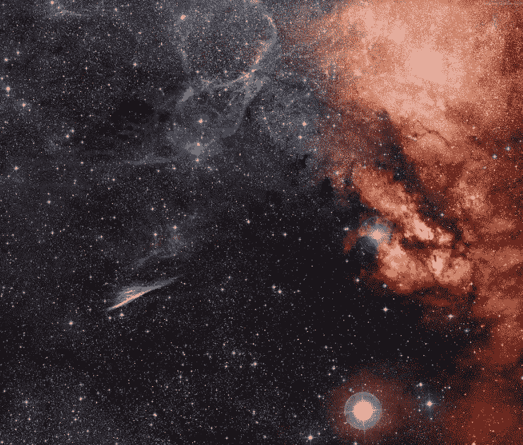

# 新加坡区块链财团在 3.5 亿美元的交易后获得了 Bithumb 的多数股权

> 原文：<https://medium.com/hackernoon/singaporean-blockchain-consortium-takes-majority-stake-in-bithumb-after-350-million-deal-ff3dec2771b>

**市场状况—2018 年 10 月 12 日** [**BTC**](https://berminal.com/coins/Bitcoin-BTC)**:6300.44 美元(+0.23%)** [**ETH**](https://berminal.com/coins/Ethereum-ETH)**:197.32 美元(-1.89%)** [**【XRP**](https://berminal.com/coins/XRP-XRP)**:0.425 美元(+4.34%)**

加密货币市场在 10 月 10 日大幅回调后，昨日开始企稳。这一大幅调整似乎与道琼斯、标准普尔 500 和纳斯达克指数的意外下跌有关。随着全球市场从昨日的下跌中复苏，分析师们开始质疑比特币是否与传统市场反向相关，因为普遍的假设表明，如果全球市场调整，比特币将会反弹。

其他消息，美国银行、住房和城市事务委员会的参议员有幸听取了纽约大学经济学家努里埃尔·鲁比尼的证词，他也被称为“末日博士”。据报道，鲁比尼在描述“与自峰值以来平均损失 95%的数千枚替代硬币相比，70%的资本损失是一笔“好”交易时，将替代硬币称为“sh*tcoins”。此外，随着 Bakkt 加密货币交易平台 11 月发布的临近，该集团报道称，前[比特币基地高管亚当·怀特已加入 Bakkt，担任新的首席运营官。](https://berminal.com/news/97658/Coinbases-Adam-White-to-Serve-as-COO-of-Bakkt-Crypto-Trading-Platform)

受欢迎的韩国交易所 Bithumb 在过去 24 小时内交易量达到 11.3 亿美元，它以 3.54 亿美元的价格出售了其多数股权。BK 国际财团获得了该交易所 51%的股份，从而获得了完全的控制权。该财团是由新加坡整形外科临床团队 BK 国际成立的区块链投资公司。Bithumb 在 2018 年上半年实现利润 3500 万美元，但在 6 月份的一次黑客攻击中损失了 4000 万美元。([阅读更多](https://berminal.com/news/97973/South-Korean-Exchange-Bithumb-Sold-For-354-Million))

由文克莱沃斯双胞胎运营的加密货币交易所 Gemini 宣布了莱特币的上市。该交易所获得了纽约州金融服务局(NYDFS)的批准，将 Litecoin 上市。用户可以在 10 月 13 日 13:30 UTC 开始存入莱特币，并从 10 月 16 日开始对美元、比特币、以太坊和 Zcash 进行全面交易。Litecoin (LTC)价格为 53.63 美元，最近 24 小时上涨 1.68%。([阅读更多](https://berminal.com/news/98074/Gemini-Adds-Litecoin-After-Approval-From-New-York-Regulators))

**3)比特币基地专业交易平台比特币基地 Pro 宣布上市 0x 协议(ZRX)。**存款现已开放，12 小时后即可交易。韩元对美元、BTC 和欧元可以交易。ZRX 还不能在 Coinbase.com 或比特币基地的 iOs 和 Android 应用上使用。比特币基地专业版用户将能够存放 ZRX，比特币基地团队打算在 ZRX 在其他平台可用时单独发布公告。([阅读更多](https://berminal.com/news/97325/Coinbase-Pro-To-List-0x-Protocol-ZRX))

[***订阅百慕达简讯***](https://visitor.r20.constantcontact.com/d.jsp?llr=myyhdl6ab&p=oi&m=1131022639884&sit=9ar6aztmb&f=776989ec-8460-43a4-b86a-bcf8f2f1bca7)

[***免费下载百慕大 App***](https://berminal.app.link/medium-post)

*[***百慕大官方电报***](https://t.me/berminal)*

*[***百慕大推特***](https://twitter.com/berminalapp)*

**