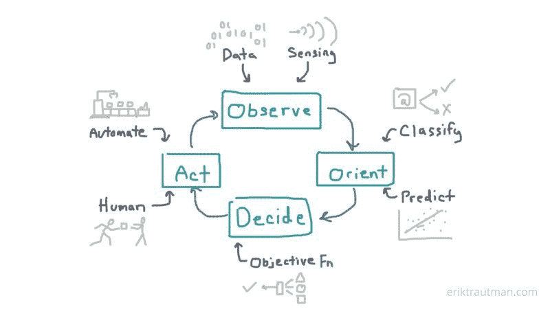
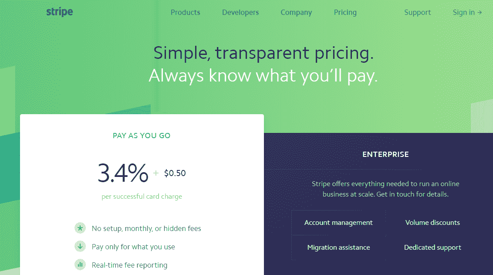
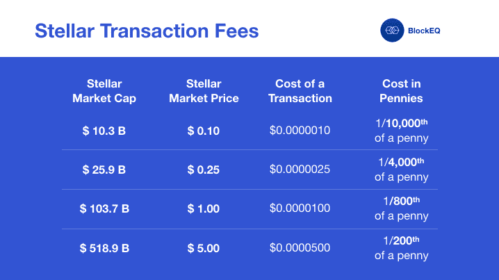
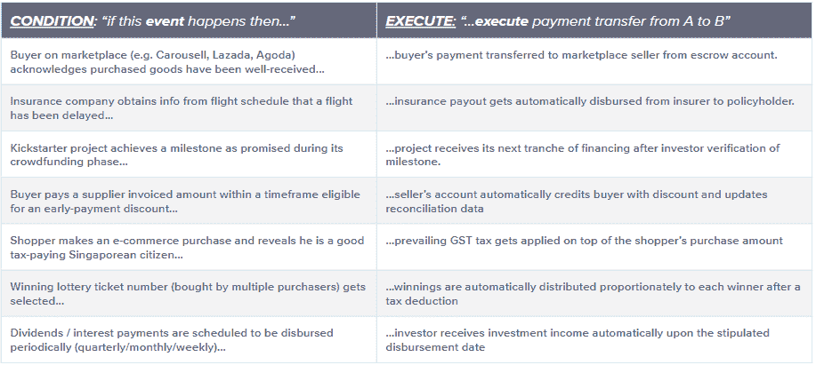
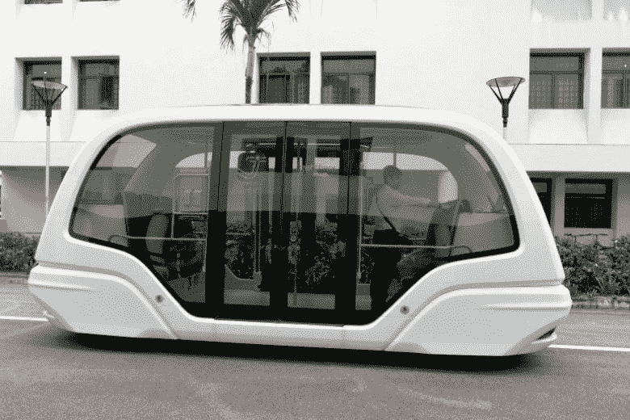

# 新加坡向智能国家的转型需要“智能资金”

> 原文：<https://medium.com/hackernoon/singapores-transition-into-a-smart-nation-will-require-smart-money-82b4a9f2cfb3>

随着我们越来越习惯于看到新加坡的妈妈和爸爸每天在当地的杂货店敲手机付款，人们不禁惊叹我们年轻的国家张开双臂欢迎支付创新的速度和接受能力。考虑到我们已经详细规划了未来五年的[电子支付基础设施](https://www.smartnation.sg/what-is-smart-nation/initiatives/Strategic-National-Projects/e-payments-1)的战略重点，这一点尤其令人共鸣。

也许这一直根植于我们 DNA 的某个地方。在新加坡历史的不同时期,*【金钱】*有着不同的含义，这一事实被遗忘了。从 14 世纪的中国宋朝硬币、19 世纪初的印度卢比和墨西哥元，到 19 世纪下半叶秘鲁和玻利维亚等遥远国家制造的少量银元硬币。

当谈到如何进行商业交易和支付结算时，早期新加坡的商人只是适应了当时的环境；作为一个雄心勃勃、自称为“聪明的国家”，我们今天将如何在这方面适应明天的挑战？

> 这就是为什么 [SGDR](https://sgdr.io/) ，一种以新加坡元计价的价格稳定的加密资产(被区块链业界亲切地称为“*稳定币*”)将在帮助打造我们迈向[智能国家](https://www.smartnation.sg/)的旅程的下一个篇章中发挥巨大作用。

**但是*到底什么是*聪明的民族？**

> 智能国家是新加坡政府的一项倡议，旨在利用信息通信技术、网络和大数据来创建技术支持的解决方案。

基本上，新加坡政府希望建立一个高科技的新加坡，利用最新的技术，利用网络和*——长期以来被吹捧为[新的*【黑金】*](https://www.wired.com/insights/2013/02/is-big-data-the-new-black-gold/) 。随着新用户数量的增加，Grab 和 Airbnb 等网络变得越来越强大，这反过来导致更多的这种*【黑金】被创造出来——但这到底为什么重要呢？**

**我们正处于第四次工业革命的早期，人工智能技术的进步——由小型微处理器的计算能力以及来自我们生活各行各业的大量数据的指数级增长推动——将导致我们的日常产品和生活方式发生指数级变化。**

**手头数据量的增加使得产品能够更好地预测和自动化操作(例如 Youtube 如何推荐视频观看)，这反过来又因为更好的体验吸引了更多的用户。然后，这些新用户将有助于创建更多的数据，从而可以更好地调整预测模型，并在未来提供更好的用户体验。然后吸引更多的用户。这样就形成了良性循环。**

****

***A* [*“virtuous cycle”*](https://hackernoon.com/how-artificial-intelligence-is-closing-the-loop-with-better-predictions-1e8b50df3655) *of how data helps to improve and reiterate the product in an ongoing fashion***

**智能国家的举措旨在确保新加坡做好充分准备，利用数据和计算能力作为基本构件，充分利用这一新的宏观趋势。很明显，新加坡政府并不只是口头上支持这一远大目标——正在计划中的[举措](https://www.smartnation.sg/what-is-smart-nation/initiatives)的细致细节显示了相反的情况。**

****为什么今天的支付基础设施与智能国家不兼容？****

> **像 SGDR 这样的稳定货币有助于为大众带来加密货币的好处，同时减少价格波动。**

**它允许廉价、快速和可编程的交易，这反过来将有助于解锁支付模式，这些模式在当今的支付基础设施中不太可行，如小额支付和事件驱动支付。**

**举例来说，快速和超便宜的交易开辟了一个用例，即直接向在线视频内容提供商*付费，无需中间人，而是基于每小时观看的小额支付，而不是订阅模式。***

***现任者收取的最低每笔交易费用今天禁止了这一点。举例来说，根据他们的网站，Stripe 对每笔交易收取 3.4%+0.50 新加坡元(这包括 Stripe 需要转给银行和信用卡网络方案(如 Visa 和 Mastercard)的费用；可提供定制批量折扣)。***

******

***相比之下，恒星区块链的每笔[交易费用](https://support.blockchain.com/hc/en-us/articles/360019105431-Stellar-transaction-fees)——将被 SGDR 利用——目前支付 1 万笔 [交易只需***0.01 美元:***](/@blockeq/transaction-fees-on-stellar-3d5e442fc00a)***

****

**更令人兴奋的是，SGDR 的可编程性允许事件驱动的支付——这类似于某人在其他事情发生的情况下收到付款。由于当今的数字货币缺乏可编程特性，我们今天根本无法做到这一点。**

**例如，我不能独立设计一个应用程序，利用 GrabPay 信用来构建一个提供自动飞行保险赔付的应用程序，这是由于 a)grab pay 货币的专有、闭环性质，以及 b)缺乏货币本身的编程语言。**

****

***Here’s a list of some possibilities which event-driven payments could help unlock***

## **像 SGDR 这样的可编程货币将如何帮助实现智能国家的目标？**

****公用事业—按需计费和折扣****

**为了优化资源利用，智能国家计划根据一天中的时间和所有家庭的消耗量，纳入动态电力和[水定价](https://www.smartnation.sg/what-is-smart-nation/initiatives/Urban-Living/automated-meter-reading-amr-trial)方案。**

> **从所有家庭收集的集体数据将为电力和水的准确预测定价模型创造条件。**

**这将允许单个消费者查看在任何时间点，对于单个特定活动，他每秒钟消费和花费了多少。例如，他可以选择将他的洗碗机编程为仅在一天中耗电和耗水量最低的时候开始下一个洗碗周期。**

**或者，由于游戏化奖励，他可能被激励减少他的总体消费模式，由此他将公用事业的使用降低到某一等级将使他有权获得立即支付的定价折扣。他甚至可以通过安装和销售[太阳能电池板](https://www.smartnation.sg/what-is-smart-nation/initiatives/Urban-Living/smart-towns)产生的电能回馈电网，来赚取白天每一秒钟的收入。在那之前把那些回扣和收入都用在晚上的晚餐上！**

**这一举措所需支付的复杂性质将与 SGDR 的低交易费用(用于进行和接收实时小额支付)及其可编程性(将预测定价模型与游戏化奖励背后的逻辑相结合)完美契合。**

****自动驾驶汽车——因为汽车也需要支付账单****

**自动驾驶汽车(AVs)对人类的革命性影响可能会超过上一次汽车取代马匹的汽车革命，可用于分析的道路图像数据的爆炸[是关键](https://www.smartdatacollective.com/data-key-autonomous-vehicle-technology-tesla-says-winning/)。作为智能国家[计划](https://www.smartnation.sg/what-is-smart-nation/initiatives/Transport/autonomous-vehicles)的一部分，新加波也在这一领域投入了大量资源，以确保新加波的公民能够获得大量部署 AVs *的回报*。这些好处包括减少交通拥堵、提高按需车辆服务效率和减少事故。**

****

***There are already driverless shuttle buses on the* [*Nanyang Technological University*](https://www.straitstimes.com/singapore/transport/ntu-gets-new-driverless-shuttle-bus-to-ferry-students-across-campus) *campus connecting student halls with the main academic areas, ferrying up to 300 passengers each day.***

**AVs 仍然需要在日常循环中进行小额支付，例如当他们通过道路收费时，获得电力充电或进入车间进行维护时，或者当通勤者乘坐它们时，因此使每次支付的成本保持较低是至关重要的。**

**此外，AVs 可以通过编程让通勤者灵活地决定他们希望出行的紧急程度和速度。这将允许，例如，有人急着支付额外费用，她的乘坐提供了通行权。奖金数额将由乘坐其他 AVs 的通勤者分享，这些通勤者愿意以更悠闲的节奏沿着同一条路线旅行。**

> **这种复杂、动态的计算和支付活动总是需要一种智能、可编程的货币来无缝执行。**

****物联网——面向大众的数据货币化****

**对于外行人来说，物联网(IoT)这个术语可能会带来电影 *The Matrix* 中的各种图像，机器正在控制我们生活的方方面面。他们会惊讶地发现，我们已经生活在物联网时代——智能手机、手表、健身可穿戴设备、电视、汽车、相机和家用恒温器等“T10”物品今天都已经连接到互联网，并在我们的生活中使用。**

> **随着技术的发展，包括更强大的微处理器芯片和即将到来的 T2 5G 移动网络，用不了多久，甚至更普通的物体，如冰箱、无人机、路灯，甚至 T4 的人行道也将成为物联网设备。**

# **这些物联网设备的主要目的是收集数据，这些数据将被输入到控制产品行为的预测模型中。**

**这将为消费者提供一个“农场数据”的机会，以获得被动收入——例如，通过向运动设备制造商出售他们的健身可穿戴设备收集的关于他们日常活动的匿名数据。另一种选择是，设备制造商在出售之前拥有收集的数据——无论是通过双方同意的方式还是其他方式。这些公司可能会在销售中输给一个透明地允许数据在用户控制之下的公司。**

**一项名为“ [Punggol digital district](https://www.smartnation.sg/what-is-smart-nation/initiatives/Startups-and-Businesses/punggol-digital-district) 的关键智能国家计划致力于培育一个高科技的生活和工作生态系统，物联网设备是数据经济的核心。对数据的支付本质上将是小额和频繁的——因此需要像 SGDR 这样的工具来允许廉价和快速的小额支付。**

****结论****

**智能国家的最终目标是建立一个“数字时代新加坡繁荣的未来”。在实物商品交易方面，我们作为枢纽的地理位置给了我们历史性的战略优势。当我们进入数字时代，数据等数字资产开始在国际上自由交易，没有物理边界时，是什么让新加坡也拥有这种优势？当预测模型的市场确实是全球性的时，为什么一家公司会选择限制自己只购买本国的训练数据呢？**

**智能国家计划的举措无疑是朝着正确方向迈出的一步。总的来说，新加坡要继续前进，其他必要的关键因素包括有利的法规、创新文化、鼓励早期采用的激励措施以及金融和人力资本。**

**虽然[之前承认](https://hackernoon.com/stablecoins-are-now-officially-in-vogue-again-7ae746c44c62)央行加入央行数字货币(CBDCs)的竞争可能会发生，但我们认为这至少在未来 2-3 年内是不可能实现的。**

**在[项目 Ubin](http://www.mas.gov.sg/singapore-financial-centre/smart-financial-centre/project-ubin.aspx) 从主要以批发银行和证券交易结算为主的项目发展为零售支付也参与其中的项目之前，可能会涉及多轮内部反复讨论，因为以下系统性风险将影响新加坡的货币政策。**

**新加坡金融管理局(Monetary Authority of Singapore)将需要评估通过当前的部分准备金制度发行 CBDC 元的影响，以及这样做是否会影响他们现有的调整汇率政策的工具(当新加坡金融管理局需要扩大或收缩货币基础时使用)。**

**另一种选择是，如果在发行 CBDC 元时采用完全 1:1 的抵押模式(即流通中的 CBDC 元兑 1 新元)，理论上可以简化问题，但如果贸易融资部门等机构需要大量 CBDC 元，可能会对货币基础的流动性产生巨大影响。(请记住，银行现在有能力通过部分准备金银行向系统中发放更多的金融资本，如贸易融资贷款，而不是支持它的美元存款)。**

# **然而，至关重要的是，与国际同行相比，新加坡私营部门的创新仍然尽可能领先。**

> **在政府决定发行商业票据的方法的 2-3 年内，可能已经有大量由私营部门提供的实验性案例研究，这反过来将为国家吸引更多的金融和人力资本。**

**由于数据驱动的产品重复出现的 ***良性循环*** ，这一时间框架实际上可以让一个产品利用网络效应，建立起超越国际同行的强大、可防御的优势。**

**鉴于我们正在向智能国家转型，也许是时候让“ *money* ”再次意味着别的东西了——一种可编程和智能的东西，因此是为未来的智能经济而设计的。**