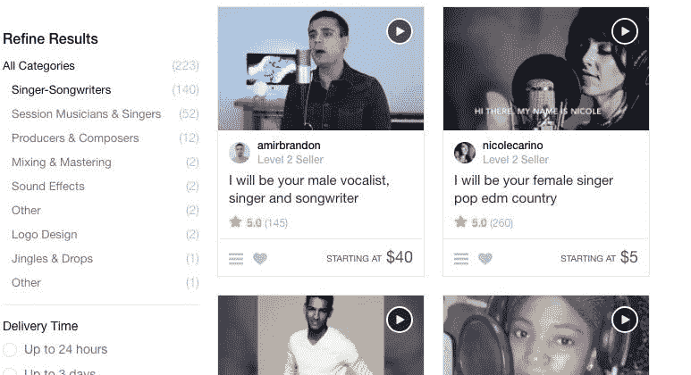
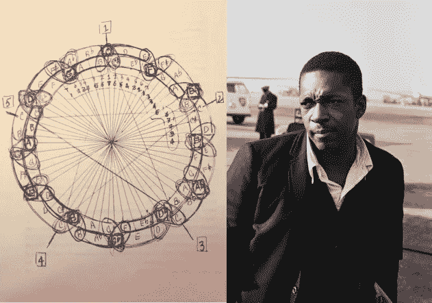

# 在零工经济中歌唱

> 原文：<https://medium.com/hackernoon/singing-in-the-gig-economy-dfbb751318f8>

## 与点播音乐人一起创作音乐

零工经济是艺术家的革命性工具。

像 Fiverr 这样的创意服务平台汇集了艺术劳动力的需求和供给。

有大视野的艺术家需要雇佣合作者。想要练习他们的艺术技巧同时赚取一些闲钱的艺术家需要演出来工作。Fiverr 将双方联系在一起，充当托管人并调解偶尔的纠纷。

Fiverr lets you buy or sell creative services such as singing, graphic design, and writing

新的艺术工具产生了新的艺术形式。Photoshop 创造了新类型的视觉艺术和迷因。Unity 使 3d 模型设计变得容易实现，从而带来了新的游戏。Ableton 简化了制作电子舞曲的能力，催生了新的流派。

演出经济是一个强大的新艺术工具，因为它开启了 T2 的有偿合作。

在本帖中，我们将探索为什么零工经济对艺术家如此有用，以及如何利用它将一个伟大的艺术愿景变成现实。

## 创意演出

零工经济广泛用于体力劳动，如开车、送杂货和打扫房间。

还有越来越多的人采用基本的数字服务，如转录、数据输入和网络抓取。甚至像[医学](http://heal.com)、[法律](http://upcounsel.com)和会计这样的白领知识工作也在转向零工经济。

The list of gig economy platforms is growing.

像优步、Instacart 和 UpCounsel 这样的平台通过在数字平台上聚合供需来降低成本和提高市场效率。你可以利用零工经济进行兽医上门服务、送花和播客编辑。

对于事务性的、定义明确的任务，零工经济显然是游戏规则的改变者。但是创造性的工作呢？

作家、设计师、动画师和音乐家可以通过零工经济被雇佣。世界各地成千上万的艺术家在网上谋生，同时实践他们热爱的东西。雇佣他们很便宜，而且他们中的许多人对自己的工作非常在行。

在这种对艺术作品的供给和需求的密集聚合下，艺术如何变化？

Singers on Fiverr

我决定尝试音乐制作如何利用零工经济。在过去的一年里，我从 Fiverr 雇佣了十个不同的歌手来演唱我写的专辑。我还雇了三个录音师来混音和掌握音轨。

写这张专辑是非常有趣和令人满意的。能够付钱给有才华的陌生人，让他们在网上和我一起工作，感觉很超前。

我对艺术的看法被费弗尔改变了，就像我对汽车所有权的看法被优步改变了一样。演出经济极大地降低了雄心勃勃的艺术项目的成本。

# 付费合作

无论你是谁，互联网都邀请你去创作雄心勃勃的艺术。互联网上有免费的资源来学习制作艺术，有免费的工具来创作你的艺术，还有免费的社交网络来传播你的艺术。

零工经济填补了缺失的一块:**付费协作。**

无论你是在创作一部电视剧，一部小说，还是一个企业，你都可以把零工经济作为一个巨大的人才库来帮助你解决问题。

为什么付费协作如此重要？因为艺术家通常想从事他们自己的艺术。艺术是一种孤独的追求。当我们独处时，我们创造艺术。我们用艺术将我们个人的情感表达到一本书、一首歌或一幅画中。

“Isolation Communication” by Charles Luna

艺术与世隔绝的本质使得很难找到艺术合作者。每个能和你合作的人都有自己的艺术作品。他们为什么要帮助你完成你的项目？

最好的艺术作品涉及多人。一个作家需要一个编辑。一个歌手需要一个作曲家。一个软件工程师需要一个 UI 设计师。

如果你经营一家企业，你可以雇佣一名全职员工来帮助你进行有偿合作。但是，如果你正在创建一个艺术项目，你没有一个大的预算来分配。

自己很难做出好的艺术。零工经济让你找到负担得起的合作者来获得艺术杠杆。

# Pop 工作流程

我在电脑上写音乐已经十五年了。自从 [Distrokid](https://distrokid.com) 让音乐发布到 Spotify 成为可能，我已经发布了五张专辑。这些都不是很棒的音乐，但我一直在稳步提高。

My five previous albums

我和许多数字艺术家一样。我受到互联网创造和传播艺术的力量的启发。我想与世界分享我的声音，我希望我的艺术质量足够好，让人们能够与之联系。

从 2003 年到 2017 年，我大部分时间都在独自工作。我没有寻找导师，或者征求建设性的反馈，或者寻找合作者。而且我也没有试图去学乐理。

在这张新专辑中，我想更上一层楼。我想利用互联网来教育自己如何成为优秀的音乐家。我想和能补充我作品的歌手一起工作。

我这张专辑的目标是创作出朗朗上口的现代流行音乐。

我的音乐榜样是马克斯·马丁，这位音乐制作人能够和几乎任何人一起富有成效地工作。从布兰妮到邦·乔维，再到泰勒斯威夫特，他创作了许多你在过去二十年中听过的热门歌曲。

马克斯知道他的长处和短处。他的谦逊和领导力让他组建了一个精英音乐团队。他持续创作流行音乐杰作的时间几乎比历史上任何人都长，这绝非偶然。

我把每个零工经济歌手想象成一个我有幸与之共度时光的一线流行明星。我的工作是通过为这些歌手提供令人难以置信的乐器和令人难忘的歌词，让他们发挥出最佳表现。

考虑到这一点，我需要有完整的歌曲，准备好为每个歌手表演。我想让歌手们知道我尊重他们的时间和才华。作为回报，他们会提供一流的表演。

为了创作这些歌曲，我使用了一个[数字音频工作站](https://www.image-line.com/flstudio/) (DAW)。DAW 就像音乐的 Photoshop。它允许制作人创作旋律、制作乐器、录制歌手、混合曲目，以及做其他一切与音乐创作相关的事情。

许多主流歌曲是由“卧室音乐人”制作的，他们只用一台 DAW 和一副耳机。

DAW 是一个丰富的音乐创作工具集。这是授权，但也可能是压倒性的。人们很容易迷失在细节中，一次花几个小时调整一首歌的一个小细节。

当我开始这张专辑时，我的歌曲创作效率不高。我的音乐并不吸引人，也缺乏流行音乐那种清晰的结构和令人上瘾的感觉。我不知道如何写出能让你记住的歌词。

在谷歌的帮助下，我参加了一个现代流行音乐作曲速成班。

“The Essential Secrets of Songwriting” is my favorite songwriting blog

加里·尤尔的《T2 歌曲创作的秘密》是无价之宝。Gary 以一种清晰易懂的方式讲述了音乐理论和流行歌曲创作的算法结构。

流行歌曲受欢迎是有原因的。pop 格式是科学的。伟大的流行音乐以其熟悉程度安慰我们，但也以与我们以前听过的略有不同的方式刺激我们。

> “你有一个非常基本的安排，一个非常简单的声乐，非常简单的过渡。这几乎就像一个公式，你替换歌词和音乐，而鼓保持不变。”— [加尔文·哈里斯](https://www.youtube.com/watch?v=bxhRAifD8Nc)

设计一首流行歌曲有许多不同的方法。理解[合唱和独唱](https://www.secretsofsongwriting.com/2016/09/08/does-a-song-need-more-than-verses-and-a-chorus/)的基本概念很重要。这代表了几乎每首流行歌曲都有的两个截然不同的领域。更多种类的歌曲除了合唱和独唱部分之外，可能还有一个合唱前和/或过渡部分。

音乐理论允许作曲家在一个对听众有意义的结构中建立这些不同的部分。从 Gary 的文章中，我终于领悟到了[【五度圈】](https://www.secretsofsongwriting.com/?s=circle+of+fifths)的重要性，它对写歌的用处就像元素周期表对化学一样。

现在当我写音乐的时候，我会一直开着一个五度圈的窗户。

Gary 强调了“钩子”的使用。钩子是一种音乐结构，它抓住听众并与他们粘在一起。副歌或独唱中可以出现勾号。有些歌曲有一个不可思议的挂钩，其他的有几个不同的挂钩。

随着我对音乐理论的了解，我寻找能够解释加里在文章中谈到的流行理论的视频。我找到了 Pyramind 的一个视频系列，名为[“崩溃”](https://www.youtube.com/playlist?list=PLYepICirv4smh6XfvTbScGO7HYrt7P1vv)，其中马特·唐纳对现代流行音乐/电子音乐的理论进行了分解。

我发现马特的建议非常有用，所以我[向他预约了私人课程](https://www.pyramind.com/mentorship/matt-donner-pyramind-mentor/)，我向任何想找电子音乐老师的人推荐这个课程。

马特的视频强调如何成为一名电子音乐人。如果你想坐下来在四个小时内写完一首歌，你如何分配你的时间？黎明为你提供了一系列令人麻痹的选择。重点是什么？

我的首要任务变成了钩子。一首流行歌曲生死攸关。一首没有吸引力的歌曲不可能成为流行歌曲。相反，一首好的歌曲可以弥补一首无聊的歌曲。

对我来说，找到窍门是写流行歌曲最难的部分。在写这张专辑的几个月里，有很多天我没有找到一个钩子。但是有了耐心和坚持，一段朗朗上口的旋律似乎总能最终出现在屏幕上。

一旦我找到一个旋律挂钩，我就会开始围绕它写歌词。如果是副歌钩，我会专门为副歌的四八小节写歌词。如果我找到了一个诗钩，情况也是如此。

[Write Songs Right Now](https://www.amazon.com/Write-Songs-Right-Alex-Forbes/dp/0792791797) was a source of guidance for how to write lyrics effectively.

亚历克斯·福布斯(Alex Forbes)坚持认为，写歌词是为了接触你的潜意识，并将你的真实心态反映到页面上。否则歌词听起来会很空洞，歌曲也会缺乏作为流行歌曲成功所需的活力。

流行歌词可以有很多种形式——但是它们必须朗朗上口。

流行歌词既可以使用模糊、抽象的短语，也可以使用引人入胜的具体意象。歌词可以使用押韵、偏韵、引申隐喻。任何可以在书中使用的文学技巧都可以在歌曲中使用。

但是歌词*一定要*朗朗上口。

这些词说起来一定很有趣。某些短语一定会让你感到刺痛。发现朗朗上口的歌词和找到鱼钩一样重要。

有了一个钩子和一段歌词，这首歌的其余部分就自然而然地到位了。Gary Ewer 的文章提供了一个很好的系统来围绕一个吸引人的钩子构建一个完整的歌曲架构。

这就是五度圈再次发挥作用的地方。五度音圈提供了一个框架，用于在调之间移动并发展和弦进行，在合唱和独唱中有不同的声音。

John Coltrane drew elaborate relations within the circle of fifths — but there is immense value to be found in even a basic study of this powerful chart.

五度圈可以用来描绘出一首歌曲的一个部分中的特定和弦。它还可以用来定义如何从一首歌曲的一个部分移到另一个部分。一首歌曲中的片段序列被称为“[曲式](http://www.songstuff.com/song-writing/article/song-form-overview/)或“[曲式](https://en.wikipedia.org/wiki/Song_structure)”。

歌曲形式中的不同部分通常用字母 A、B 和 C 来列举(不要与 A、B 和 C 的音调混淆)。每个字母代表一首歌曲的一个旋律部分。

[《AAA……》或《s trophic》](http://www.songstuff.com/song-writing/article/song-form-guide-aaa/)歌曲结构最简单。在“AAA…”中，合唱部分的和弦在独唱部分重复出现。

“AAA…”可能是一个舒适区。在这张专辑中，我需要吞下学习五度圈基础知识的苦果，这样我就可以探索更复杂的结构，比如“ABABC…”。

HookTheory 是另一个无价的工具。HookTheory 允许您看到和听到您喜爱的歌曲背后的和弦进行。在五度圈旁边使用 HookTheory 是了解音乐理论是如何支撑最好的流行歌曲的一个好方法。

[HookTheory rendering of Baby One More Time](https://www.hooktheory.com/theorytab/view/britney-spears/baby-one-more-time)

当我写我的新专辑时，早上都在阅读加里·尤的教程。下午我看了 Pyramind 的视频。我在电脑前吃晚饭，玩着 HookTheory，看着 Zedd 的和弦进行与 Eagles 的和弦进行相比如何。

我喜欢互联网的原因是:你可以完全沉浸在一个话题中。多种形式的教育材料可以结合在一起，定制您自己的理想学习环境。

# 与歌手合作

每首歌都以一个乐器挂钩开始。在钩子之后，我在写歌词的同时写了其余的乐器。当我写完一首歌的所有乐器和所有歌词后，我录下了自己唱歌词的过程。

一旦我有了这首歌的歌词，我就完成了这首歌的初稿。我把这首歌导出到 mp3，放在一个 Dropbox 文件夹里，这个文件夹与我的手机同步。

[John Seabrook’s “The Song Machine](https://www.amazon.com/Song-Machine-Inside-Hit-Factory/dp/1622319621)” chronicles how modern pop music is made, including the famous [“L.A. Car Test”](https://slate.com/culture/2015/10/denniz-pop-max-martin-and-cheiron-studios-the-man-who-invented-modern-pop.html).

创作一首流行歌曲通常至少需要几天时间。有时需要长达一个月的时间。当马克斯·马丁创作一首歌曲时，他会定期将歌曲项目跳转到 mp3。他通过耳塞、笔记本电脑扬声器和汽车音响系统来听这首歌。

我们到处听流行音乐，所以在最终确定一首歌之前，在多种背景下听它是很重要的。

“Minds” written with [amirbrandon](https://www.fiverr.com/amirbrandon)

我喜欢在外面跑步的时候戴着便宜的蓝牙耳机听音乐。重要的是我自己的音乐在那种背景下听起来不错。当我慢跑穿过太平洋高地的山丘时，我专注于我正在制作的音乐的质量。

听着自己唱的歌词，我想什么样的歌手最适合这首歌。应该是天使般的女声吧？男中音？年轻的男孩乐队类型？

[Vocalist profile page for Adam](https://www.fiverr.com/awbmusic), one of the musicians I worked with

为了找到歌手，我使用了 Fiverr。还有其他平台，如 UpWork、SoundBetter 和 Vocalizr。这些平台各有各的优势，但 Fiverr 似乎有低成本的最佳歌手选择，软件和 UI 都是顶尖的。

Fiverr 上的歌手有一个[个人资料页面](https://www.fiverr.com/awbmusic)，展示他们的技巧。歌手小样的质量和他们最终带来的结果的质量有很大的关联。

当我决定了一个歌手，我给他们发了一条信息，包括我写的歌词和我唱的歌曲版本。

当一个歌手在 Fiverr 上接受一个邀请时，他就承诺了一个截止日期。客户(在这种情况下是我)被收取演出的费用，并且该费用被托管，直到演出被交付并且交易被完成。

当我写这张专辑的时候，如果可能的话，我试着一次专注于一首歌。我想在切换到新歌之前完整地完成一首歌。

“Black and White” written with [awbmusic](https://www.fiverr.com/awbmusic)

不幸的是，最好的歌手通常都有积压的订单。从我发出第一条信息开始，歌手需要 4-7 天的时间来理解我的歌词并表演出来。这在单首歌曲的工作流程中造成了瓶颈。

实际上，我通常在任何时候都会创作 2-3 首歌曲。为了管理这张专辑，我使用了一个 Trello 板来可视化歌曲在我工作流程不同阶段的进度。

Trello board for tracking the progress of songs

当一个歌手完成了他们的歌词，他们将音频文件上传到 Fiverr。我下载了下来，加载到我的 DAW 里，听了他们的表演。通常会有 2-3 个我要求修改的地方。

Fiverr 事务内置了这个“修订”特性。我从来没有感到不舒服，要求一个歌手做另一个拍摄，或给另一个声乐轨道，这样我就可以超过他们。

Revision requests allow you to ask the hired artist to revise the work they have submitted.

当我真的提出修改请求时，我学会了对我所要求的非常具体。一个 Fiverr 歌手最不想听到的就是“运用你最好的判断力”或者“自由创作”这样的话。

告诉歌手“自由创作”增加了交易的主观性。主观性创造了质量争议的机会。

顾客可以说歌手唱得不好，并要求退款——在演出经济中，顾客永远是对的。歌手们希望对如何演唱一首歌有严格的规定，以保护他们自己不做无用的工作。

“Cold Again” written with [stasiaestep](https://www.fiverr.com/stasiaestep)

# 费用

一场典型的三分钟流行歌曲的声乐表演通常花费我 70-140 美元。

你也可以雇佣非常便宜的歌手，但是你通常会得到你所支付的。我花了 10 美元买了一个尼日利亚 R & B 歌手，他的声音很棒，但不幸的是，他的廉价麦克风使音频质量降级太多。

一首流行歌曲需要一个伟大的歌手进行必要的练习。但是歌手也必须是一个合适的人选。有几次，我聘请了一位经验丰富的歌手，但他的表演最终并不适合这首歌。整张专辑有大约 400 美元的沉没成本。

Fiverr transaction history

在某些情况下，我发现歌手的价格被严重低估。两个例子是圆滑的女歌手 T2·利哈特和出色的巴哈马说唱歌手 T4·格拉夫兹。这些艺术家每三分钟约 40 美元。

“There For You” written with grafezzy

# 收尾

在我的专辑发行的八个月里，我已经完成了 16 首歌曲的声乐和乐器演奏，总计不到一个小时的音乐。这些曲目没有混合。

每首流行歌曲都必须有好的混音。混音指的是轨道的整体感觉，包括乐器的音量、声相以及混响和压缩等效果。

The FL Studio mixer, which I barely touched during my songwriting process

当我写这些歌的时候，我并没有把重点放在混音上。这是一个深思熟虑的决定——我喜欢在调音台里工作，摆弄效果和调整音量。但我只有这么多时间。在 DAW 中创作音乐是一个如此广阔的决策空间，你必须决定你将**做什么，而不是**做什么。

我知道我可以把混音留到最后，然后找人帮我完成那部分。我省下的避免混音的时间和精力被用来写歌了。然而，一旦歌曲都写好了，人声也录好了，就该花些时间在混音上了。

“Carbon Copy” written with [amirbrandon](https://www.fiverr.com/amirbrandon)

我从 SoundBetter(每首 400 美元)和 Fiverr(每首 50 美元)分别聘请了两名[录音室](https://soundbetter.com/profiles/6183-sefi-carmel) [工程师](https://soundbetter.com/profiles/17897-benny-steele)来混音和制作我的三首歌曲。所有三个混音结果都很好——但我决定我要在房间里参与其余曲目的混音/母带制作过程。有太多的小的，创造性的决定，我想通过判断。

An engineer from Pyramind helped me mix the album.

在 [Pyramind](https://studios.pyramind.com/) 与一名工程师的工作室时间很便宜，而且它能让我在一个隔音的房间里听到好的扬声器里的音乐。我和一位名叫萨姆的工程师在他们位于福尔松街的工作室“金库”呆了几天。

当我们完成混音后，我做了最后一次测试，在室外用蓝牙耳机听完成的专辑，以确保它在受控的录音室环境中听起来不错。

十个月后，专辑完成并准备上传到[发行版](https://distrokid.com/dashboard/)。整张专辑可以在 [Spotify](https://open.spotify.com/album/27JdDr9ENb0OtRfLKHgiBw) 、 [YouTube](https://www.youtube.com/playlist?list=OLAK5uy_lGiS_M-OJtpBbFYqFZcsPlMMIQdzJA9Sk) 和其他音乐平台上获得。

# 卖方

从买家的角度来看，创意零工经济是一个巨大的胜利。对卖方的影响也是积极的。

与我合作过的一位歌手说:“我个人对‘零工经济’的看法是，在做你喜欢的事情的同时，它也是一种很好的谋生资源。我宁愿唱各种各样的随机音乐工作(我喜欢并且非常擅长的工作)，也不愿在餐桌上表演或者做一些我不感兴趣的事情。”

> “我个人对‘零工经济’的看法是，它是一种很好的谋生资源，同时还能做你喜欢的事情。”-五个歌手

“它还帮助我提高了录音的效率，从而使我在录音室录制自己的音乐时速度更快。从某种意义上来说，它通过定价(对一些人有利，对另一些人不利)来平衡竞争环境，帮助买家选择看起来工作质量和道德水平都很高的创意人才(通过评级)，并打开了否则永远不会建立的联系。”

零工经济是一个人们一边工作赚钱一边培养技能的地方。这样，零工经济就像一所没有学费的职业学校。Fiverr 上的青少年在创意动画和播客编辑方面帮助了我。他们乐于接受反馈，渴望学习。

Talented workers can build a reputation and raise prices

对于那些已经拥有需求技能的工人来说，零工经济可以提供优越的工作条件。当像 Toptal 这样的平台提供高薪的在家工作时，许多精英科技工作者每天要经历不愉快的 2 小时通勤。

零工经济是买方和卖方的密集聚集，允许快速的价格发现和有效的市场。

在一些市场，我们已经看到了零工经济效率的负面后果。随叫随到的司机执行 12 小时的轮班，以满足配额。送餐员骑着自行车在雪地里送泰式炒面，天还很热。

最累人的零工经济工作是在商品化领域。如果你开着一辆优步，或者为 Instacart 运送食品杂货，你很难与众不同。你无法逃避可替代劳动力无情的降价压力。

另一方面，像平面设计和唱歌这样的领域没有工资上限。艺术工作做起来更有趣，而且总是有向上的流动性。艺术家有真正的定价权。

# 合作带来更好的艺术

2003 年，邮政推出了经受了时间考验的电子流行专辑*。*

**

*乐队的名字是指这张专辑是通过物理邮件合作制作的，艺术家们互相发送数字录音带。*

*就在 2003 年，最有效的音乐合作方式是通过邮件发送磁带。15 年过去了，线上艺术协作还是觉得不成熟。*

*艺术合作最发达的领域是软件[工程](https://hackernoon.com/tagged/engineering)。在 GitHub 上，成千上万的用户共同为软件做出贡献。一些世界上最有影响力的软件是这些庞大的开发者群体在一个管理混乱的环境中免费开发软件的结果。*

**

*Users collaborating on GitHub*

*在软件工程中，去中心化的协作带来了革命性的技术，如 Linux 和比特币。陌生人一起工作来建立任何一个人都不可能开发的技术。*

*Linux 和比特币是由个人发起的，但软件的在线协作工具使贡献者的数量扩大成为可能。*

*艺术界尚未受到在线合作的如此影响。我们听的歌曲是由几个在录音室工作的人制作的。电影是由单片工作室制作的。*

*这是新一代艺术家重新思考如何利用互联网创作合作艺术的机会。*

*像 Slack、Asana、Dropbox 和 [Splice](https://splice.com/) 这样的新工具已经改变了艺术家管理他们项目的方式。零工经济让我们接触到付费的合作者。*

*随着时间的推移，这些工具将重塑我们制造和消费的艺术。我们将会看到更多的卧室音乐家和电影导演在咖啡店外工作。分散的艺术团队将使用软件来实现他们的项目。*

*对于一个有远大抱负的艺术家来说，现在是最好的时机。*