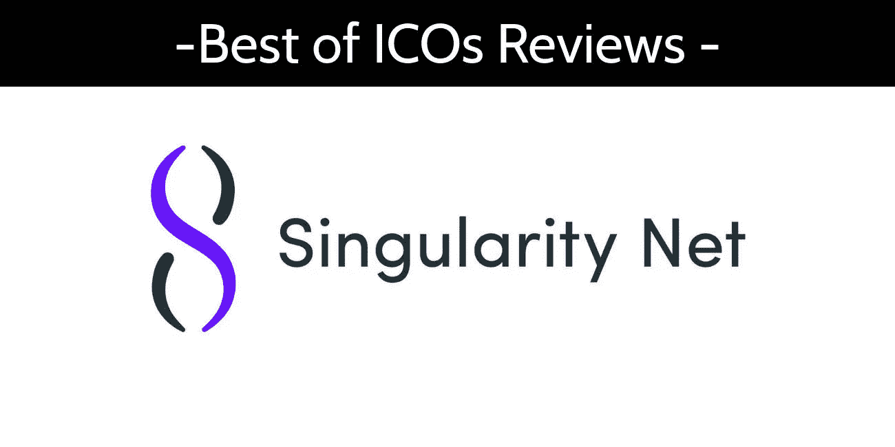
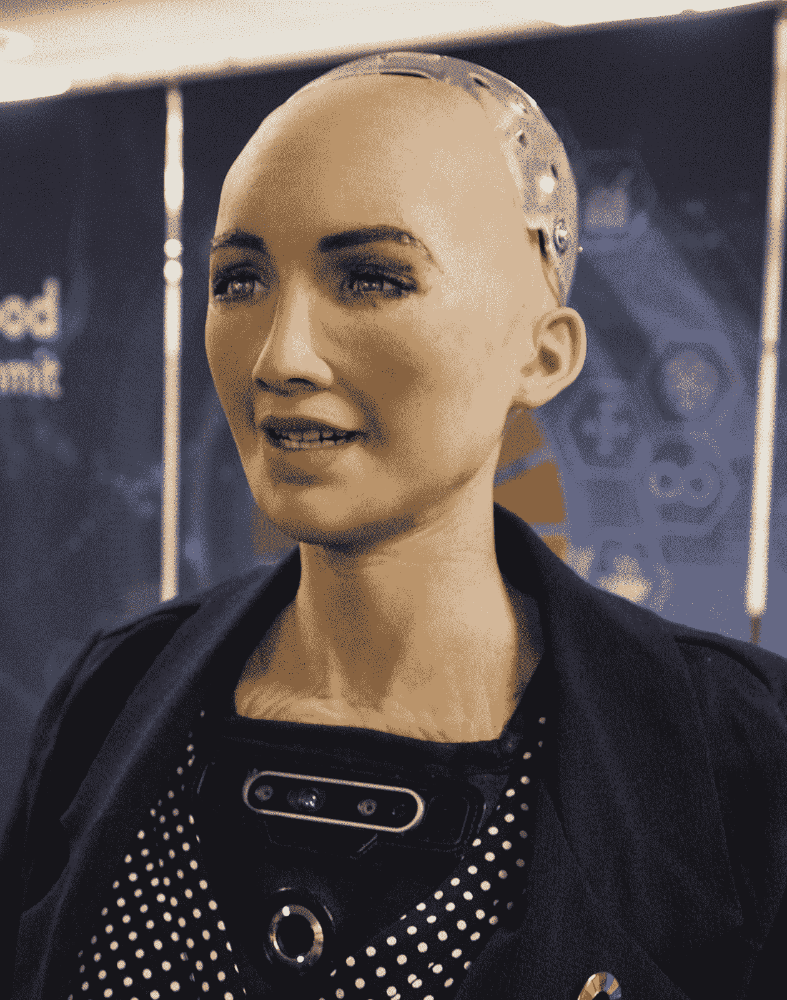
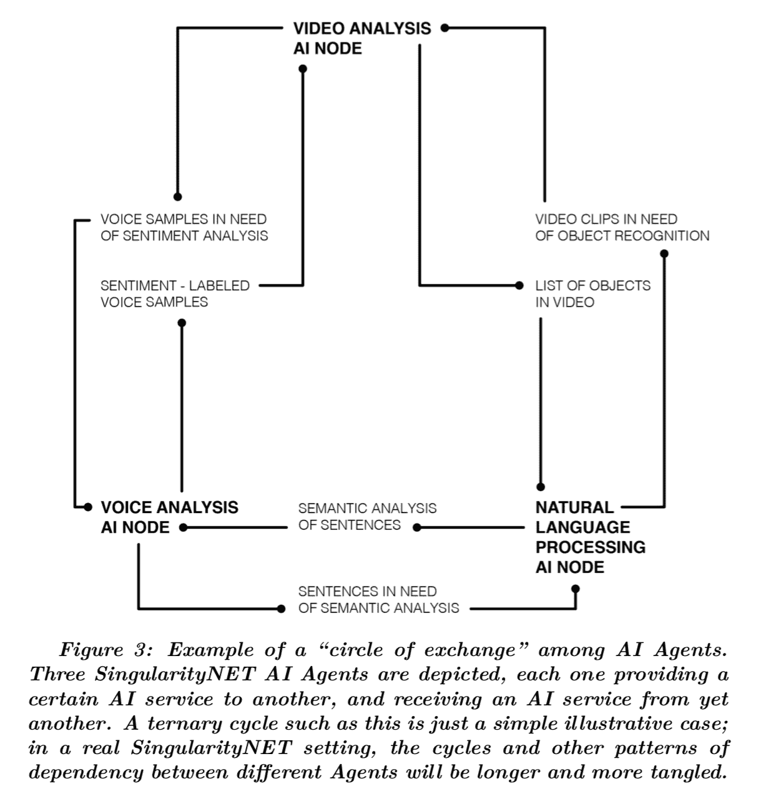
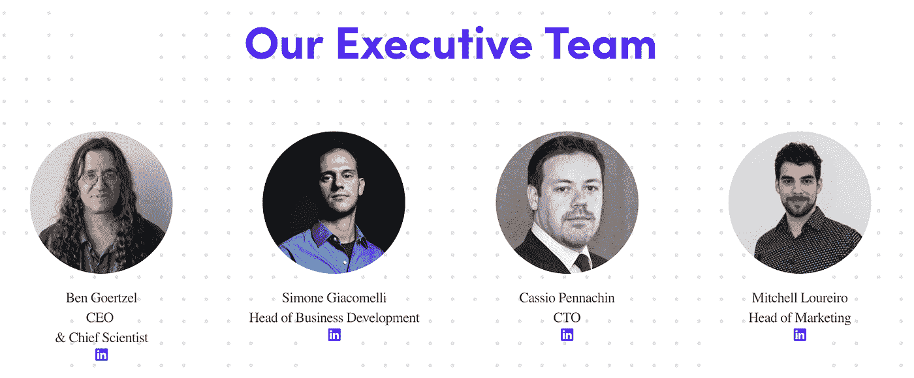

# 奇点网 ICO 评论

> 原文：<https://medium.com/hackernoon/singularitynet-ico-review-4624bc2f18d0>

Before reading this article, please read our disclaimer found at the bottom of the article or [here](https://thebestoficos.com/disclaimer.html).

## 人工智能算法市场

[SingularityNET](https://singularitynet.io/) 是一家总部位于荷兰的瑞士公司，通过他们在 2017 年 12 月 19 日持续一天的 ICO 筹集了大约 3600 万美元(当时)的 AGI 代币，目前每枚价值约 0.17 美元。这家公司的疯狂之处在于，他们在大约一分钟内提高了整个 ICO。

奇点网正在为人工智能算法和服务创造一个市场。随着人工智能+区块链开发的兴起，我们想看看该领域目前的一些参与者，以及他们的差异化之处。

# 介绍

## 这个想法

> “人工智能的价值和力量每年都在急剧增长，并将很快主导互联网——以及整个经济。然而，如今的 AI 工具被封闭的开发环境割裂了；大部分都是一个公司开发来执行一个任务，没有办法把两个工具塞在一起。SingularityNET 旨在成为联网 AI 和机器学习工具的关键协议，以形成协调的人工通用智能。”
> 
> 来自:奇点网白皮书

SingularityNet 将自己定义为人工智能服务的开源协议和市场。本质上，他们试图解决人工智能公司目前独立建立自己的服务和库的问题，而 SingularityNet 将是许多人工智能服务的集合。他们认为通用人工智能不应该被少数公司所拥有，而应该被所有人所拥有。

这个概念非常类似于谷歌的 TensorFlow，这个项目曾经是谷歌人工智能团队 Google Brain 创建的一系列私人算法，现在是**也是**一个开源库，拥有一系列工具，使任何人都可以轻松地利用机器学习和深度学习，并使公众能够为其不断增长的以人工智能为中心的工具库做出贡献。

该公司希望在 2018 年 12 月发布其软件。

## 历史

SingularityNET 归汉森机器人有限公司所有，这是一家成立于 2013 年的香港公司，专门制造类似人类的机器人(或机器人)。该公司因创造了索菲亚(下图)而闻名。2017 年，该公司与其首席科学家 Ben Goertzel 一起创建了 SingularityNET。

Image taken from the Sophia [article](https://en.wikipedia.org/wiki/Sophia_(robot)) on wikipedia.

当人类创造了一个如此强大的人工智能，它能够以更快的指数速度自我改进，从而迅速超越人类的智力，最终结束当前的人类时代，或者至少修改它，使其超出任何人的理解能力时，人类文明的时代就被赋予了技术奇点。这被描述为“奇点”，这个名字是由美国科幻作家 Vernor Vinge 在 1993 年创造的，指的是一个单一的人工智能控制一切。这也被称为超级人工智能，或 SAI。

显然，SingularityNET 的团队认为这可能对我们的社会有潜在的积极影响，并决定创建一个平台，让我们更快地实现这一目标。该公司看到，人工智能的当前状态是难以置信的特定问题(狭隘)，为了制造一个通用的人工智能，我们需要有更大的能力来共享和构建强大的人工智能库和工具，本质上他们希望将所有当前的人工智能技术放入一个市场。最终创造出一个整体，这个整体将大于它的各个部分的总和。

该公司认为，实现这一目标的最佳方式是通过一个分散的开源网络，让所有人工智能开发者都能加入到网络中。

此外，该公司还创建了一个名为 Hanson Robotics 的硬件机器人细分市场。这个想法是，这个硬件看起来和行为都像人类，然后利用奇点网的软件，它也可以像人类一样思考和行为。该公司正在寻求创造第一个功能齐全的机器人。

# 市场

奇点网旨在实现人工通用智能(AGI)。在探索过程中，它与 OpenCog 基金会合作，OpenCog 基金会是一个开源工具包，旨在实现 AGI。SingularityNET 基金会将利用这种合作关系，以 Atomspace 的名义开发自然语言处理、概率逻辑接口、进化学习和其他用于 AI 开发的核心系统。奇点网上的代理是作为 Atomspace 的扩展而创建的。

这个想法是，人们(用户)可以使用令牌从网络上的单个或多个 AI 代理购买 AI 服务，这取决于问题的复杂程度。简而言之，市场是不同人工智能合作伙伴的组合，可以出租给用户以交换令牌。节点本身就是人工智能黑盒，人们可以雇佣它。

用户和代理可以互换使用，因为其他人工智能可以请求其他玩家出租某些算法。本质上创建了一个服务和请求的复杂网络。以下是 SingularityNET 团队创建的图表，描述了实际情况下的示例:

Image taken from SingularityNET white paper page 18

# 技术

## 站台

目前，该平台正在以太坊虚拟机上构建，该公司意识到这将无法扩展，并将最终建立自己的共识协议。

该公司声称他们的平台将具有以下属性:

*   **互操作性:**网络可以连接多个区块链
*   **数据主权和隐私:**用户控制什么类型的数据被共享作为网络上的控制
*   **模块化:**人工智能代理和故障恢复系统的多种安排是可能的
*   **可伸缩性:**该平台安全地托管私有和公共合同，并宣称接近零交易成本

该公司希望使各种硬件设备能够运行节点，类似于 IOTA。这是一部以物联网和其他持续接入互联网的设备为主要目标的重头戏。

## 令牌

令牌用于不同的 AI 节点和处理器交换值。

例如，如果客户想要利用另一个开发人员创建的特定人工智能算法，他可以简单地向人工智能节点支付服务费用。这可以让任何代理通过他们的令牌使用多种不同的人工智能技术。

AI 节点可以有网络私有的内部分包商。使人们能够与一个节点进行交互，而节点本身向其内部的参与者支付解决问题的费用。这个想法是多台计算机可以运行一个节点，而这个节点只代表正在被利用的人工智能。

# 牵引力

这个 ICO 可能是有史以来完成最快的作品之一。在大约 60 秒的时间里，该公司能够最终确定其目标，并筹集了大约 3600 万美元，以换取他们的 AGI 代币，目前每枚代币的价值约为 0.17 美元。

# 组

Image taken from SingliartyNet’s website [here](https://singularitynet.io/).

SingularityNET 由一位迷人的首席执行官和一系列受过良好教育的人工智能研究人员、营销人员和合作伙伴建立。从本·戈泽尔开始。本还是一家名为 aidyia holdings 的预测公司以及机器人公司 Hanson Robotics 的首席科学家。不用说，他的专业领域是人工智能、机器人、数据科学和数学。他还因创造了机器人[索菲亚](https://en.wikipedia.org/wiki/Sophia_(robot))而出现在多部纪录片中。

# ICO

## 令牌分发

奇点网创世纪合同产生了 10 亿 AGI 代币。它们的分布如下:

*   ICO 为 50%
*   20%作为奖励池
*   18%给予创始人(2 年归属)
*   8%捐给奇点网络基金会
*   4%给了竞选支持者

奖励工具将以每年 2%的速度发布，从创世纪一年后开始。储备本身将分成不同的组:

*   40%开发
*   40%受益
*   20%固化

此外，该平台正计划创建自己的共识协议/区块链，并将为第 2-11 年产生的新区块增加 10%的年度奖金。

# 批评

## 基本原则

该公司认为，人工智能的力量应该由一群人分享，而不是由少数公司分享

> “SingularityNET 得到了 SingularityNET 基金会的支持，该基金会的运营理念是，人工智能的好处不应由任何一小群强大的机构主导，而是由所有人共享。”—奇点网白皮书

我们不确定这是否是正确的反应。尽管埃隆·马斯克可能会同意他们的观点，但当谈到民主化人工智能时，还是有很多担忧。

用人工智能安全研究员罗伯特·迈尔斯的话说:

> “这个论点听起来像是:核武器极其危险，所以我们需要让尽可能多的人拥有核武器”

## 提供资金

该平台将其令牌的 26%奖励给创始人和奇点网络基金会，4%奖励给竞选支持者。这意味着大约 30%的代币是内部发放的。对公司来说，这是否是一大笔钱还存在争议。我们必须考虑到，一旦平台发布，价格可能会大幅上涨。

## 人工智能模仿节点

该系统声称是开源的，并且还与开源人工智能平台合作，以解决用户的问题。然而，平台上的大多数 AI 节点本质上将作为黑盒来操作。这可能会导致一个问题，即节点复制开源人工智能库，并通过更便宜的计算能力作为黑盒解决方案来转售服务。那么，有可能有一个系统，在这个系统中，那些在营销解决方案上花费更多的人最终获得了很大一部分市场，而没有创造新的人工智能创新。

在没有黑盒代理的情况下，这甚至会成为一个问题。因为即使所有的代码都是开源的，人们仍然可以从开源库中复制算法并在市场上转售。这种情况在廉价国家制造的硬件产品中最为常见，它们抄袭了其他国家的知识产权。我们可以在像这样的开源人工智能市场中看到这种情况。

## 区块链

目前，该公司提到，它正在利用以太坊虚拟机，并计划建立自己的共识协议。不过白皮书也提到可能会使用 IOTA 或者其他一些物联网区块链。是哪一个？为什么公司对自己的核心技术如此困惑以求共识？似乎有很多关于令牌的问题，它将如何发展，以及他们将如何转移或利用多个区块链。此外，该公司声称可扩展，并正在努力，但很少或没有细节，他们将如何实际实现可扩展性，这是特别困难的区块链架构。

# 结论

SingularityNET 汇集了一系列极其重要的技术，这些技术必将引领未来十年的科技行业。在即将到来的未来，快速而轻松地购买人工智能算法的能力将是一个非常强大的市场。

我们最大的担忧是权力下放和民主化的不可预见的后果。有一个真正的危险可能会发生，从一个匿名市场的人购买非常强大的人工智能服务。

SingularityNET 的最终目标是创造一个超级人工智能，通过也是机器人的硬件设备与人类进行物理交互。如果这个想法真的成功并完成了它的使命，也可能会有一系列危险的后果。

现在确定这个网络的价值还为时过早，因此假设它是否会成功，以及它是否会导致世界末日完全是推测性的。

想帮忙吗？在 Bountey 上支持我们！[https://www.bountey.com/bestoficos](https://www.bountey.com/bestoficos)

想在 ICOs 中保持最新？
在 https://thebestoficos.com[拜访我们](https://thebestoficos.com/)

有一个有趣的故事？给我们在 info@bestoficos.com 写信

# 放弃

本网站及其包含的信息无意成为投资、金融、技术、税务或法律建议的来源。本网站不能代替专业建议和独立的事实验证。在没有首先评估你自己的个人财务状况，也没有咨询财务专家的情况下，千万不要使用这个网站上的想法和策略。本网站的所有内容仅供参考，按“原样”提供，不保证完整性、准确性、及时性或使用本网站所获得的结果。这只是一个存根，您对本网站的访问和使用取决于您对全部免责声明的接受和遵守。免责声明适用于所有希望访问或使用本网站的访问者、用户和其他人。