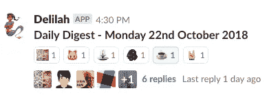

# 异步站立——提高注意力和协作的一种方式

> 原文：<https://medium.com/hackernoon/sit-down-dont-stand-up-one-path-to-improve-focus-and-collaboration-a759c9443b9b>

Photo by [Bruno Aguirre](https://unsplash.com/photos/yJBMbQgw9mg?utm_source=unsplash&utm_medium=referral&utm_content=creditCopyText) on [Unsplash](https://unsplash.com/?utm_source=unsplash&utm_medium=referral&utm_content=creditCopyText)

# 介绍

你有没有花时间站在一个似乎不符合“简短扼要”的目标？随着站立时间一瘸一拐地进入第二个小时，这似乎更像是一个庆祝耐力的仪式，而不是一个检查、连接和校准的机会。

你走神了，你笨拙地从一只脚走到另一只脚，你在关心和环境中时隐时现，想知道是否有更好的方法，一种节省皮鞋和体力的方法。

我们也想知道。一名产品负责人休完育儿假回来，在办公室工作两天，一名在家工作，另一名团队成员在周五承担主要的护理职责，我们想知道如何才能更具包容性。我们如何才能找到一种日常协作的实践，让每个人无论在办公室内外都能参与其中。我们试着给一个不在办公室的人打电话，但是技术阻碍了我们；糟糕的电话信号和人们不断怀疑是否有其他人要发言并没有带来巨大的流量。

# 第一次尝试—将更新发送到回显室

这些生硬的单口相声对任何人都不起作用，所以我们想知道我们还可以尝试什么。该团队讨论了提高包容性的选项，并决定使用 Slack 进行异步离线站立。Slack 已经是技术部门内部一个深度嵌入的协作和交流工具，因此在吸收过程中几乎没有摩擦。

与许多第一次尝试一样，当你质疑自己做的事情是否正确时，会有大量的反复试验、轻微的困惑和不断加剧的恐慌。这些感觉至少因积极和愿意尝试而变得活跃起来。这些协议是松散的，有点脆弱，就像一张餐巾纸被心不在焉地推到一个茶托下，突然被一阵强风捡起又扔掉。更新是通过不同的渠道进行的，有些人跟帖了，有些人回复了，有些人两者都没有，忘记更新了。此外，还依赖于人类启动一个线程来触发人们的记忆来发布更新。很多天没有接触，这就像向回音室发射更新。

# 检验和适应打开了一条通往卓越的道路

试用两周后的第一次回顾产生了有价值的见解和讨论，因为我们梳理出了什么是有效的，什么是无效的。

团队普遍喜欢《站起来》没有打破他们制作人的计划这一事实。人们很早就到了，不会因为站起来而分散注意力，而且人们也不需要改变个人时间表来确保他们能及时到达。团队成员在一天中的什么时候收集他们的想法并提交它们也有更多的灵活性。

不幸的是，在具体的过程中存在一定程度的混乱:如何、发布什么、何时以及在哪里发布没有被普遍理解。由于人们并不总是在线程上，所以很难跟踪更新，特别是当他们与通常的团队讨论、在线协作和笑话混在一起时。人们也用不同的方式命名他们的更新，这增加了混乱。还有一种感觉是，在问题上蜂拥而至的程度较低，因为当有人大声说他们遇到了困难，某个问题变得越来越紧迫，或者他们希望配对设计/编码以获得所有相关的好处时，没有触发点。最重要的是，这种做法没有名字，经过一番深思熟虑后，这个团队登陆了《每日文摘》。

# 第二次尝试——每天消化

回顾中的行动为下一次冲刺增加了几个协议:

*   将创建一个只包含每日更新的新频道
*   每天使用一个线程
*   下午 4.30 前创建帖子，所有帖子在上午 9.15 前完成更新(现场起立鼓掌的时间)
*   用一周中明确的日期命名你的更新(周一/周二而不是昨天/今天)
*   一旦你阅读了每个更新，用你选择的表情符号回复。

频道和线索有助于组织和日常流动，而人们用表情符号回复则为更新添加了一些生命、色彩和互动。人们现在知道其他人正在阅读他们向世界发布的内容。

# 第三个——暴民规则——自动化所有的事情

我们有一些动力和积极的氛围，但仍然依赖人类来开始每天的过程。该团队建议 mob 编程创建一个 Slackbot，每天创建一个新线程。欢迎来到消化机器人黛利拉的世界。现在，每天下午 4:30 都会创建一个新的线程，一周中的每一天都会充满团队的美好。

Daily Digest

# (不)预期结果和相邻优势

异步方面减少了长时间的上下文或设计讨论，这种讨论过去常常在离线时无意中发生，使得那些贡献很少但过于礼貌而不愿离开对话的团队成员陷入困境。现在有更多的集中讨论发生在那些能增加价值或需要被咨询的人身上。它似乎创造了一个空间，让协作可以在一天中进行，而不仅仅是在看台的后面。

有文字记载的历史可以搜索和查阅。当团队成员休假回来时，他们所要做的就是浏览摘要，轻松地收集上下文，并了解团队在休假期间所经历的进展和挑战。这在同步立式中是不可能的。一些团队成员报告说，写下他们将要做的任务并承诺下来帮助他们更好地安排他们的一天。

当团队成员陷入困境时，更容易识别出来——当更新开始像上周的新闻一样阅读时，它会突出出来，使团队比站起来时更快地呼叫和合作。就像看慢动作的体育比赛；更容易选择行动，更好地预测将要发生什么，或者在这种情况下，什么不会发生。

由于我们现在以数字方式跟踪工作，可以进行测量并形成相关性，这使得个人和团队可以做出更明智的投资决策。

团队也越来越乐于分享他们所做的一切，因此透明度增加了。在每日站立中没有机制或空间来分享人们正在工作或花费时间调查的更广泛的方面。这个团队有机地分享了次要项目、工程工作和启发他们思维的学习。这使得团队对员工的热情和兴趣有了更深的理解，并带来了更多的分享和交流。这也让产品负责人对团队成员参与和处理的所有事情有了更清晰的认识，而不仅仅是特定的卡片。

我们仍然要解决如何处理物理板，以及如何代表长期的重点和实验，这些都不是积极的工作，但仍在观察。未来的回顾会帮助我们结束这个循环。

与此同时，团队同意继续他们的每日文摘，因为他们享受异步站立的好处。