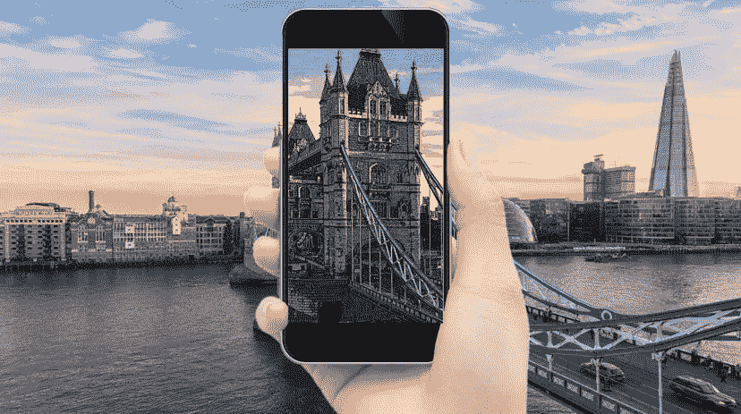
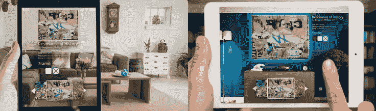
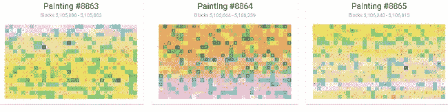
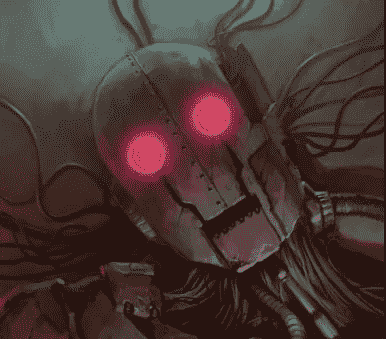
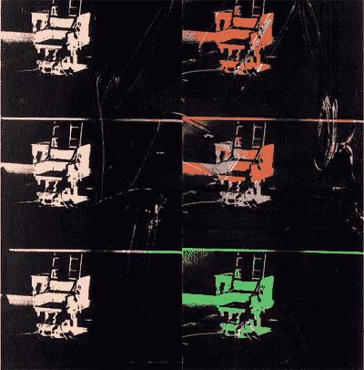
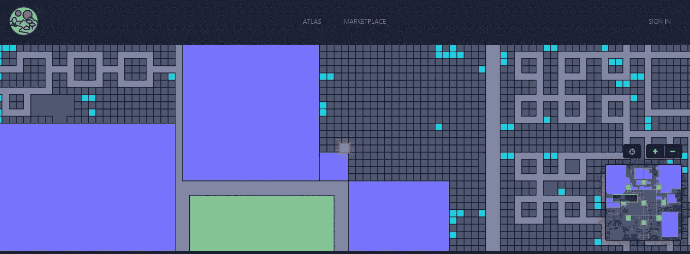
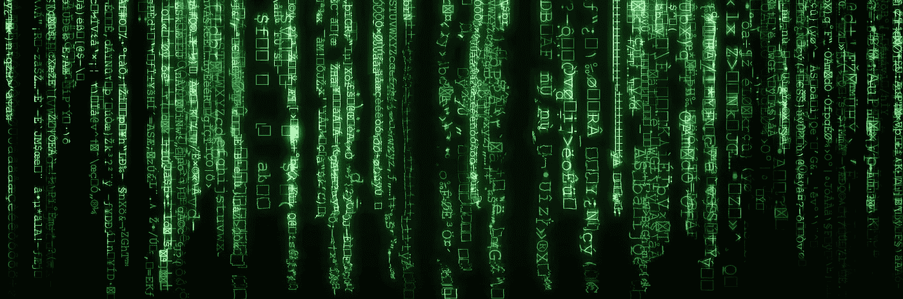

# 六个半项目弥合了艺术和区块链技术之间的差距

> 原文：<https://medium.com/hackernoon/six-and-a-half-projects-bridging-the-gap-between-art-and-blockchain-technology-89a3ff394001>

随着讨论话题的深入，艺术和技术这两个通常截然不同的领域很少能分享相同的气息，但在区块链的前沿，这两者已经找到了一系列令人兴奋的新方法来走到一起。在这里，传统艺术市场发现自己被打乱、扩大、数字化，在某些情况下甚至彻底改变了。

虽然[技术](https://hackernoon.com/tagged/technology)和艺术可能看起来像道家哲学的阴阳两极一样对立，但他们已经找到了*在同一条道路上旅行的方式*。他们一起在真正的全球范围内拍摄了一系列不同的地点和景观。我邀请你和我一起踏上这一旅程，我们将参观六个(半)项目，这些项目颠覆了我们思考、消费和与艺术互动的方式。我们将一起看到从艺术家到艺术市场、符号和符号化、谜语和游戏的一切——我们甚至将探索我们自己宇宙的三维空间。

哦，在我们出发之前，还有一件事:请记住把你的手一直放在车里。

# ArtPro

我们从 ArtPro 开始这次旅行，这是一个专注于创建点对点市场的艺术品来源平台。尽管大多数艺术项目仍然按照过时的体系运作，包括拍卖行、画廊和其他中介，但 ArtPro 是一个移动应用和在线市场，艺术家和买家可以直接联系，省去了中间人，降低了成本。

ArtPro 使用了许多新颖的技术，看起来像一个真正的颠覆者，旨在通过一个负担得起的艺术投资基金和教育买家来降低进入门槛。在[新闻发布会](https://bitscreener.com/news/artpro-unveils-crowdsale-bringing-art-to-the-masses)上，首席执行官奥利弗·汉姆斯解释了该项目的目标:

> “艺术应该属于大多数人，而不是少数人。通过 ArtPro，我们将艺术带给大众，让比以往更多的人投资并拥有一件艺术品。”

ArtPro 项目的另一个引人注目的方面是他们计划使用增强现实(AR)智能手机应用程序，允许潜在买家在他们选择的现实世界空间中查看 ArtPro 平台上出售的任何艺术品。说到 AR，它很好地把我们带到了下一个目的地。

# 崔佛·琼斯

当谈到 AR、艺术和区块链的融合时，一个名字立即脱颖而出，那就是[崔佛·琼斯](https://www.trevorjonesart.com)。这位苏格兰-加拿大艺术家最近宣布了一个受加密货币启发的展览，“颠覆:区块链艺术”，将展出 14 幅由增强现实“驱动”的大型画作。如果你现在看，你可以看到一个展示这项技术的视频。

Bitcoin.com 引用琼斯的话说:

> “在过去的 7 年里，我一直专注于创造创新的艺术，推动形式的界限，增加创造性的知识，挑战甚至威胁现状，鼓励人们质疑一幅画到底是什么。比特币和其他加密货币正在对菲亚特和金融部门做类似的事情。对我来说，尝试将这一切联系在一起，探索一个秘密主题展览的概念是有意义的。”

对于那些在苏格兰的人来说，即将到来的展览将于 10 月 22 日至 26 日在爱丁堡的邓达斯街画廊举行。别担心，在那之前我们会带你回家的。

# 隐花艺术

在 9895 幅系列画作中讲述了以太坊区块链的故事，每幅 [CryptoArte](https://www.cryptoarte.io/) 画布包含 576 个形状、颜色和装饰的独立块。这个项目是科技企业家塞巴斯蒂安·布罗彻的创意，他是一名职业建筑师，而不是艺术家。然而，由此产生的图像有一种催眠的美，尤其是当顺序观看时。由于每个区块矿工都有自己独特的符号，因此可以绘制出矿工发现每个新区块的频率。其结果是一个艺术和视觉上美丽的以太网历史档案。

CryptoArte 的一个巧妙之处在于，它允许你找到在你选择的特定日期在以太坊区块链创作的画作。如果你想要一幅代表你生日或周年纪念的画，很容易找到。你第一次收到 ETH 的那天？没问题。看看 CryptoArte 项目到目前为止已经完成的一些作品。

# 霓虹区

我们的下一站是[霓虹区](https://neondistrict.io/)，这是比特币艺术家和连续受挫商人 YT 的最新项目，她在 twitter 上的昵称是@coin_artist。YT 对区块链艺术世界最著名的一次尝试是*烧毁了 H34R7S，*一个区块链的绘画拼图，因找到答案而获得 5 BTC 的奖金。该项目于 2015 年启动，花了三年时间才找到解决方案，当时奖金价值 5 万美元。

现在 YT 带着另一个融合了艺术、区块链、谜题和 RPG 游戏的项目以[霓虹区](http://neondistrict.io/helpdesk)的形式回来了。

The AI Puzzle in Neon District

虽然霓虹区还没有完全推出，但它已经在加密社区引起了很大的期待，这不亚于我们对这个棘手的加密难题的期望。

# 梅塞纳斯

Maecenas 项目基于加密货币项目中的一个共同主题，允许投资者令牌化和购买资产股份。在这种特殊情况下，资产是名画。结果是在艺术世界里出现了各种各样的股票市场。

梅塞纳斯最近制造了新闻，他们的第一次拍卖出售了安迪·沃霍尔的 *14 小电椅*的 31.5%的股份。令牌化拍卖通过将画作所有权分解为记录在区块链上的防篡改所有权证书，成功筹集了 170 万美元。在一份新闻稿中，Maecenas 的首席执行官 Marcelo Garcia Casil 说:

> “资产的令牌化是区块链技术最突出和最令人兴奋的用例，我们很自豪能够成为这一领域的先锋。这幅沃霍尔画作是未来更多画作中的第一幅，我们期待看到并引领艺术市场的金融革命。”

# 分散土地

我们的最后一站是[分散王国](https://decentraland.org/)，一个建立在以太坊区块链上的充满可能性的虚拟现实世界。在这个虚拟现实平台上，用户可以购买虚拟土地，并创造几乎任何他们想要的东西。使用法力令牌购买的虚拟土地完全由他们控制。虽然 Dentraland 尚未完全上线，但它将可以通过手机、网络浏览器或虚拟现实耳机进行访问和探索。

The Map of Decentraland

有趣的是，分散土地将允许不同的区域，如节日土地，大学和博物馆。在虚拟现实博物馆中，游客将能够观看艺术品，参加虚拟现实艺术活动，并购买和出售可以送到你(非虚拟)家庭地址的真实艺术品。根据[分散地维基](https://wiki.decentraland.org/index.php?title=Museum)的说法，博物馆的愿景如下:“我们希望在分散地建立主要的博物馆体验。展示我们策划的艺术，邀请策展人，并向任何对展示他们的创作感兴趣的人出租画廊或体验模块”。

在分散的土地上，人们将完全有可能在区块链主持的完全模拟的世界中与艺术互动。

*这让我们想到…*

**半**

再往前一点。

据信，我们宇宙的最终热寂将发生在 10 ⁰⁰⁰年内——误差不超过几年——曾经存在的一切都将不复存在。另一种理论认为宇宙本身只是另一种模拟，可能很像分散的土地。从内部根本无从得知。如果是那样的话，或许根本就不会有热寂；宇宙的散列将被简单地解决，另一个宇宙将被添加到链中。

有可能我们的现实只是一个天体模拟中的宇宙艺术项目，在一个不断发展的区块链的画布上进行。所以在我们的旅行结束之前，你可能想再读一遍最后一句话，如果你真的在读的话。

*你可以在推特上关注罗伯特·d·奈特*[*@ redcryptoknight*](https://twitter.com/redcryptoknight)