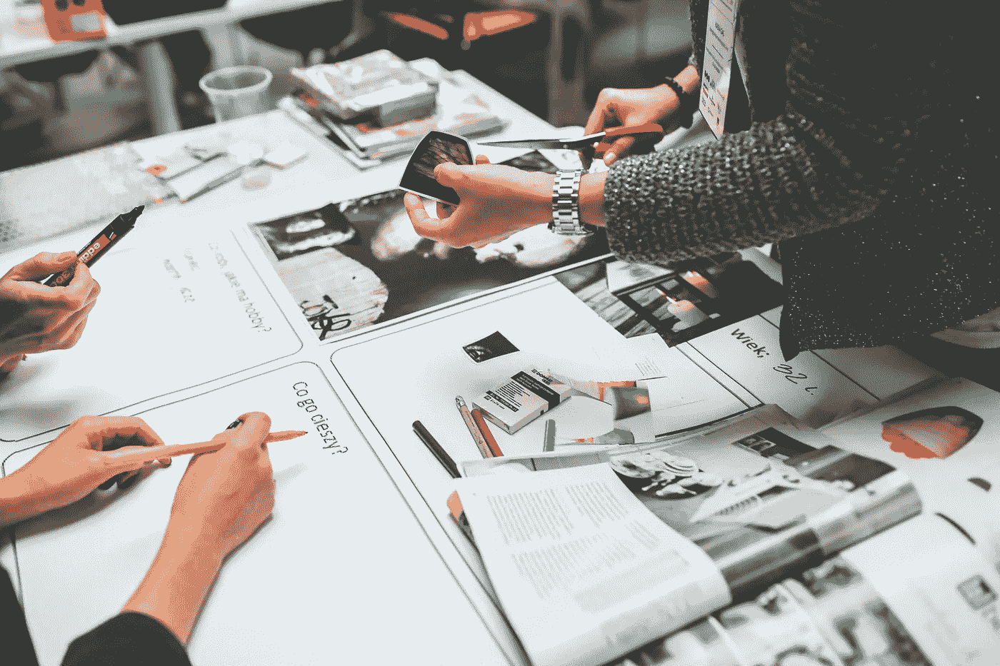
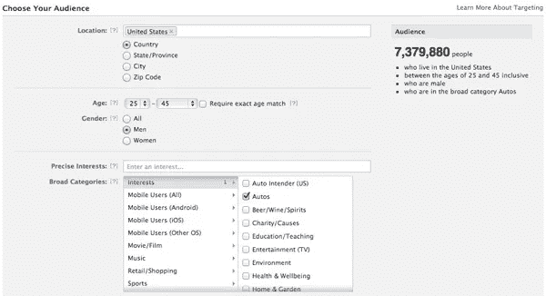
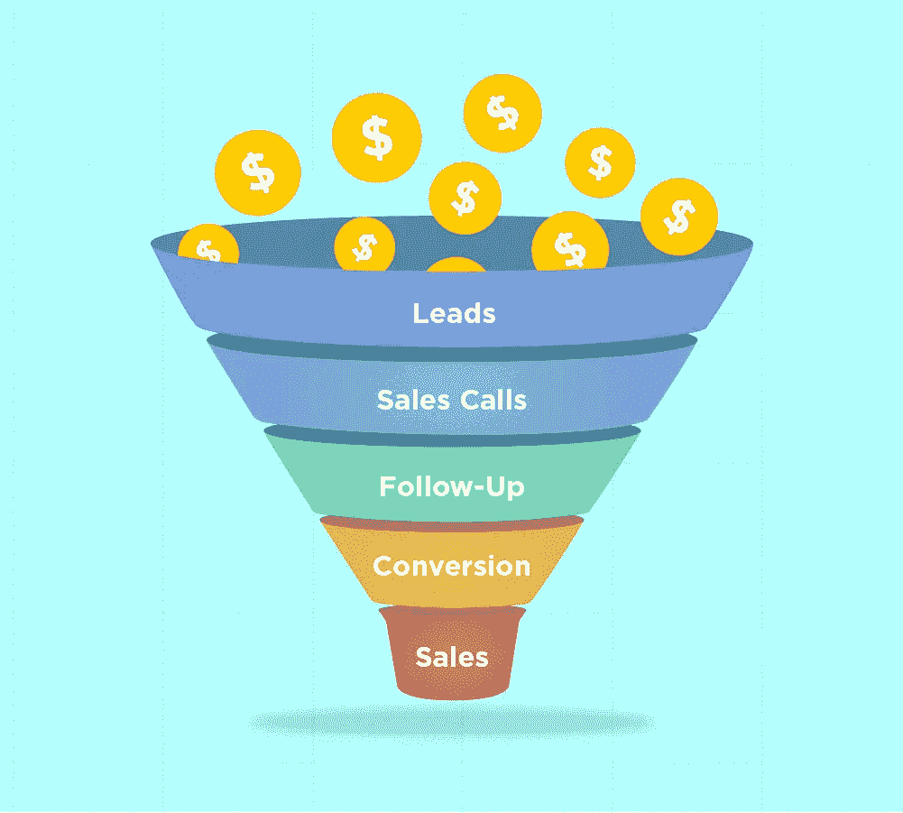
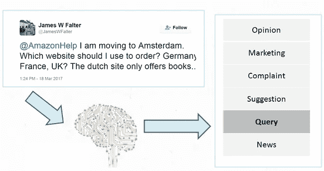
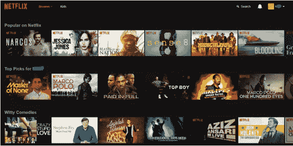
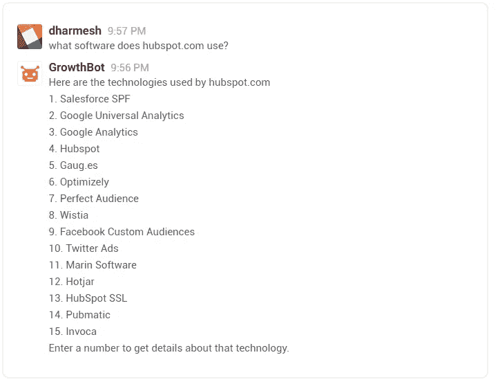

# 人工智能在市场营销中的六种新兴应用

> 原文：<https://medium.com/hackernoon/six-emerging-applications-of-ai-in-marketing-a6e7a78035e1>

营销中的人工智能在营销的完全自动化中发挥着至关重要的作用。

2016 年是人工智能重要的一年。许多人预见到了人工智能的奇妙能力。但是当谷歌的 AlphaGo 在一场 [**五局围棋比赛**](https://en.wikipedia.org/wiki/AlphaGo_versus_Lee_Sedol) **中击败 18 次世界冠军 Lee Sedol 时，AI 宣布了它的到来。人工智能正成为近来投资最多的领域之一。所有的科技巨头(如谷歌、脸书、IBM、苹果和亚马逊)都在投入数十亿美元开发和培育基于人工智能的产品。**

人工智能正在许多垂直行业中找到自己的根基。在这篇文章中，我将谈论这样一个垂直市场，营销。随着用户数据的可用性，营销变得更加个性化、有针对性和数据驱动。品牌在大众传播渠道上挥霍的时代已经一去不复返了。人工智能在许多领域都在帮助营销人员。广告优化、销售、客户支持、内容监管和分析都在被人工智能彻底改变。让我们探索更多 AI 在营销中的这类应用。

# 人工智能在市场营销中的应用和用例

1.  **学习用户行为**

正如我前面提到的，AI 正在帮助品牌理解用户行为和需求。当我们使用互联网*(每天大约 6 小时)*时，我们总是会在网上留下足迹。营销人员可以分析和利用你的搜索数据和社交媒体对话来了解你的需求。

随着深度学习算法的出现，预测你的行为成为可能。这让品牌向你展示你关心的广告。根据这项[研究](http://www.pnas.org/content/112/4/1036.full.pdf)，通过分析你在脸书上仅仅 300 个“赞”，机器学习算法可以比你的配偶更好地预测你的行为。想象一下，有了营销人员可以利用的所有浏览数据，广告就可以有很强的针对性。这导致了更好的优化和投资回报率。

作为实验，我们鼓励您安装[数据自拍](https://chrome.google.com/webstore/detail/data-selfie/kjmnobfdkgaclpkgeniccafoennghjnm)的浏览器扩展。这个应用程序展示了脸书如何从平台上所有的浏览和点击数据中生成对用户的理解。

**2。利用个性化**

这是个性化营销的时代。个性化并不局限于根据你的需求定向投放广告。品牌正试图与用户建立情感联系，以推动更多的参与。西蒙·西内克在有史以来最著名的 Ted 演讲之一中解释了与顾客建立情感联系的力量。他强调了这样一个事实:

> *人们不在乎你做什么，他们在乎你为什么这么做。*

因此，从用户对话中分析情绪和情感对品牌来说变得很重要。

人工智能可以帮助从用户数据中检测情绪和情感。该数据可进一步用于针对特定用户和个性化产品/服务推荐。此外，它还可用于竞争性研究和比较。在之前的[帖子](http://blog.paralleldots.com/technology/changing-marketing-with-emotion-detection-technology/)中，我们已经广泛讨论了情绪检测在营销中的新兴作用。

**3。销售自动化**

人工智能也可以帮助优化销售渠道。品牌雇佣一大群销售专业人员来识别、瞄准和推销顾客。对销售人员来说，识别潜在买家并锁定他们是一项令人兴奋的任务。这项任务可以通过使用人工智能预测用户行为来实现自动化。使用智能算法过滤潜在客户可以为销售团队节省大量时间，并减少人力。

人工智能可以帮助人工识别潜在客户和联系人，筛选线索，并根据用户行为最终确定客户。

**4。客户支持优化**

人工智能正在改变处理和分析客户查询的方式。用户选择社交媒体、电子邮件和论坛来表达他们对产品/服务的意见和评论。利用人工智能，营销人员可以将数据分为各种类别，并允许相关来源响应此类用户查询。

使用[意图分析](https://www.paralleldots.com/text-analysis-apis#intent)，营销人员可以自动识别文本的潜在意图。这有助于营销人员对网上出现的大量用户查询进行分类和管理。这使得整个过程快速而高效。

**5。内容监管和推荐引擎**

人工智能也可以帮助内容营销人员管理内容。[语义分析](https://www.paralleldots.com/text-analysis-apis#semantic-analysis)可以帮助媒体机构、记者、博客和新闻平台获得创意，减少冗余。

此外，许多品牌正在使用人工智能来驱动他们的推荐引擎。推荐已经成为一种非常有效的重新参与和重新定位的策略。基于用户行为的内容推荐增加了参与度。以网飞的推荐引擎为例。通过向经常性用户推荐相关内容，网飞阻止他们取消订阅。网飞[报道](http://www.businessinsider.in/Why-Netflix-thinks-its-personalized-recommendation-engine-is-worth-1-billion-per-year/articleshow/52754724.cms)推荐引擎每年可以节省 1B 美元，网飞上 80%的内容发现都是通过推荐实现的。

**6。虚拟助手**

NLP 支持的虚拟助手也取得了成功。苹果的 Siri、微软的 Cortana、亚马逊的 Alexa、谷歌助手是最显著的几个。如果你想知道助理与营销有什么关系，你应该看看 Hubspot 的 [Growthbot](https://growthbot.org/) 。GrowthBot 是一款用于营销和销售的聊天机器人。它连接到各种营销系统(如 HubSpot、Google Analytics 等)和数据库，让您快速、轻松地获取信息和服务。

尽管在整合营销和虚拟助理方面做得不多。我可以想象机器人被用来自动化营销中的大部分冗余工作，执行 A/B 测试，优化漏斗等等。这个垂直行业的未来看起来很好，充满了可能性。

随着聊天机器人和虚拟助手的使用越来越多，营销人员已经开始围绕这一领域制定他们的战略。在未来，机器人对机器人的营销将成为一种规范。其中智能机器人将与其他机器人/虚拟助理交互以搜索、交互和执行特定任务。例如，你可以让你的机器人为你预订航班。酒店预订平台的机器人可能会向您的机器人推送广告，推荐您在该目的地入住的酒店。

这些是人工智能在市场营销中的一些新兴应用。我相信未来会有更多人工智能在市场营销中的应用。在这个高度个性化和有针对性的客户获取时代，人工智能有着至关重要的作用。由于营销已经从大众转向个人，品牌现在在哪里玩单位经济和客户生命时间价值(CLTV)，人工智能可以彻底改变对基层用户行为的阅读。

# 未来

我在这篇文章的开头引用了 Alpha Go 的胜利作为人工智能的突破。在同一场比赛中，阿尔法围棋产生了[著名的“棋 37”](http://www.huffingtonpost.com/entry/move-37-or-how-ai-can-change-the-world_us_58399703e4b0a79f7433b675)，这是该游戏三千多年历史中从未出现过的一步棋。这是人类直觉的一个进步。随着机器认知能力的增强，很难想象人工智能在营销方面的未来会是什么样子。**谁知道 AI 有没有预测未来的“37 招”。我很确定一件事，那将会非常令人兴奋。**

我们希望你喜欢这篇文章。请[注册](http://user.apis.paralleldots.com/signing-up?utm_source=blog&utm_medium=chat&utm_campaign=paralleldots_blog)免费的 ParallelDots 账户，开始你的 AI 之旅。你也可以在这里查看 PrallelDots AI API[的演示。](https://www.paralleldots.com/text-analysis-apis)