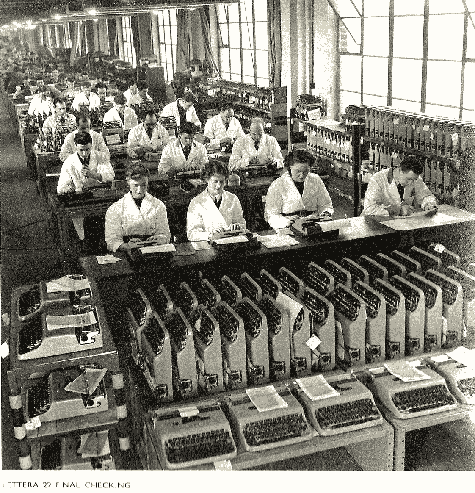
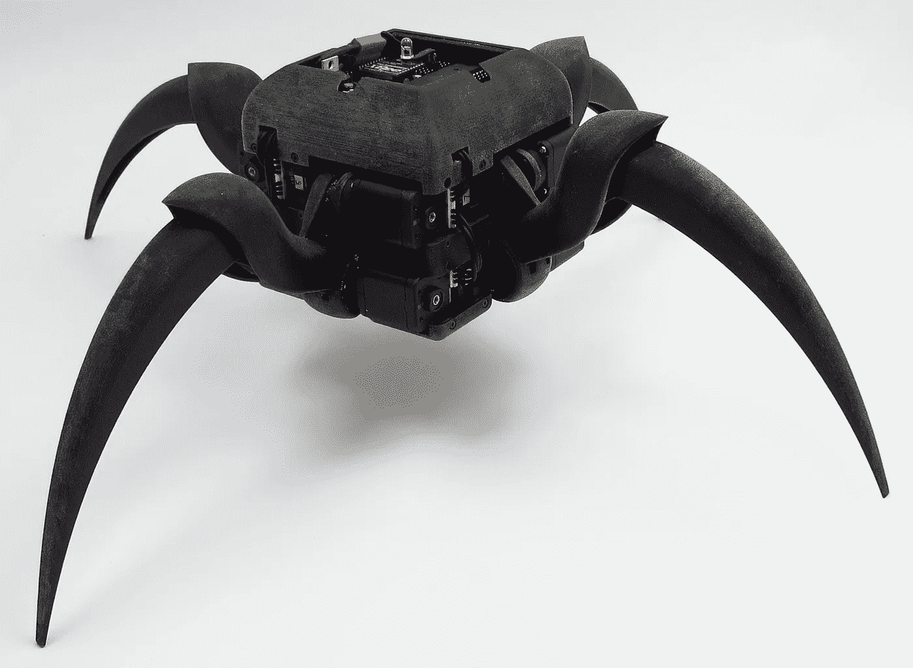
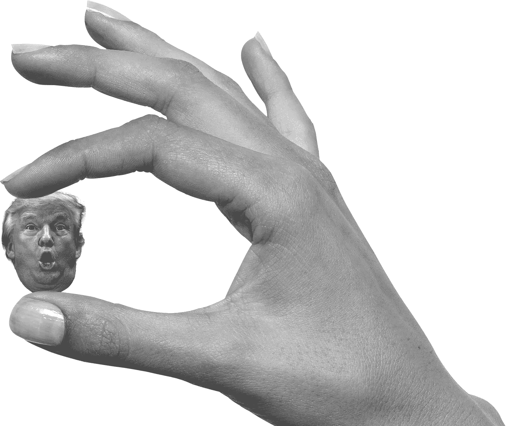
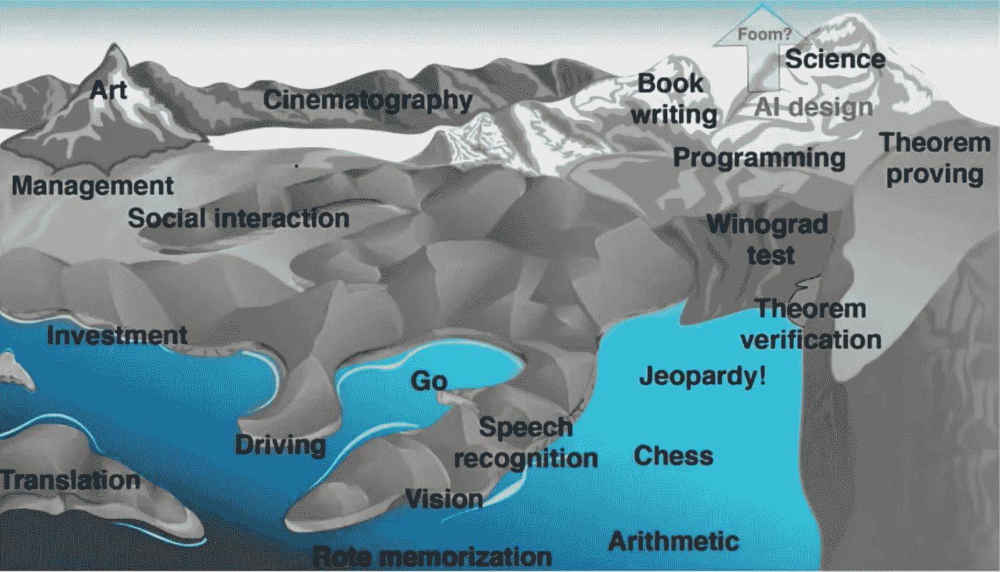
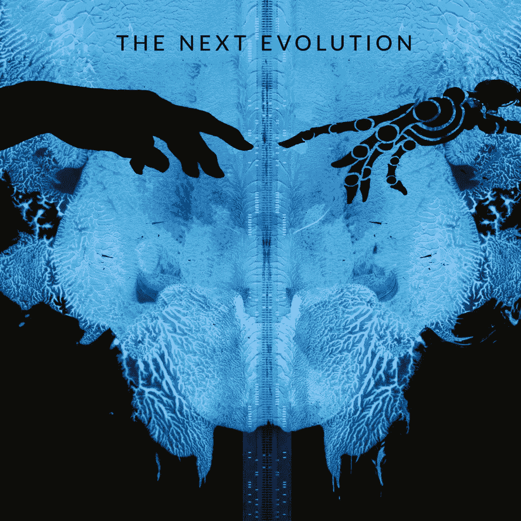
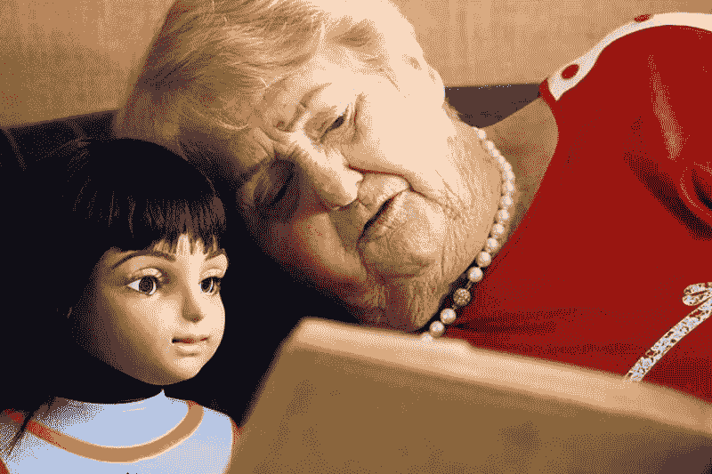

# 思考人工智能的六个有用比喻

> 原文：<https://medium.com/hackernoon/six-useful-metaphors-for-thinking-about-artificial-intelligence-c7468b1551fa>

“SUR-FAKE”[*Antoine Geiger*](http://antoinegeiger.com/filter/photo/SUR-FAKE)

## 为了能够创造性地、有目的地和负责任地思考像人工智能这样的新技术，我们需要有益的比较，使之有可能与它的内在特征相关联。我的背景是设计思维，而不是数据科学，当以有意义的方式思考人工智能时，这六个类比对我很有帮助。

# 一个奇特的东西贴标机

今天谈论人工智能的方式主要是关于什么是真正的机器学习。谷歌首席决策科学家凯西·科兹尔科夫(Cassie Kozyrkov)称机器学习是一台[花哨的贴标机](https://www.youtube.com/watch?v=iLu9XyZ55oI)。这是一种非常基础和令人欣慰的思考方式。我们通过展示许多水果的例子来训练机器给苹果和梨贴标签。这很好理解。如果你只给它看青苹果和梨子，它就能识别所有的东西，所以有好的例子是很重要的。

计算机 excel 表格取代了坐在打字机上做手工数据输入(以及将纸质文件放入活页夹和文件柜)的一排排没完没了的人。机器学习将以同样的方式取代所有的标签工作。不再需要手动和重复地识别、分类和整理东西。我们可以预计这项技术的应用会很快，因为大多数人不喜欢做重复性的工作。一名[日本农民](http://7,000 pictures of cucumbers sorted by his mother)拍摄了 7000 张他母亲手工分拣的黄瓜照片，并基于这项技术建造和训练了一台自动分拣的机器。

# 和醉鬼岛

因为我们很少了解花哨的贴标机如何工作的基本机制，我们必须善于测试决定的结果是我们所期望的。 [Cassie Kozyrkov](https://hackernoon.com/imagine-a-drunk-island-advice-for-finding-ai-use-cases-8d47495d4c3f) 最近在 [SthlmTechFest](http://www.sthlmtechfest.com/) 上谈到了这个问题，并就如何思考这个问题做了另一个很好的类比。

你有一个朋友，他有一个小岛，岛上有许多喝醉的居民，他们都有联网的笔记本电脑。他们有世界上所有的空闲时间，并且都非常愿意做事，但是不回应任何详细的书面指示，所以你必须给他们例子。这意味着，如果你有一次性任务，花时间教他们是一件痛苦的事，所以你会专注于你想从生活中剔除的重复性苦差事。

但是等等！在你把所有工作都卸到这个岛上之前，想想:这些人喝得有多醉？他们能完成你的任务吗？不要只是盲目地将重要的工作托付给他们。通过检查他们是否能很好地完成你的任务，迫使他们赢得你的信任。根据 Cassie 的说法，你还没有准备好投入到一个严肃的机器学习项目中，直到你拥有一个概述了以下内容的文档:

*   正确完成任务意味着什么？
*   哪些错误比其他哪些错误更糟糕？
*   在你收到的 1000 个单位的醉酒回复中——有些并不完美——你如何给那堆工作打分？

[Aracna](http://www.creativemachineslab.com/aracna-robot.html): A open-source robotics platform from with evolutionary computation that can teach itself to walk and explore with out examples or sensors.

# 有用的宠物或蜘蛛网

[马特·琼斯](https://www.youtube.com/watch?v=gMPbEvtRaEw)正致力于将以人为中心的设备人工智能带到[谷歌](https://hackernoon.com/tagged/google)硬件上，最近他在斯德哥尔摩的[前沿](https://frontiers.design/)谈论人工智能是章鱼、老鹰和蜘蛛的微小大脑。我们如此痴迷于人工智能将成为某种人类形式的交互，就像电影 [Her](https://www.imdb.com/title/tt1798709/?ref_=nv_sr_1) 中的声音一样，但基本上我们已经看到了巨大的变化，因为这项技术体积小、价格便宜，并且在分散的处理器中工作。所以马特建议我们把人工智能看作与我们智力不同的伴侣物种。这种分布式团队工作暗示了其他类型的关系。有感知能力的人工智能蜘蛛可以将它们的认知卸载到一个网络上，这样我们就可以直观地抓住它周围的环境。网络和它的颜色可以指示城市环境中集中的空气污染。

Ana Arriola 是微软人工智能研究院的设计总监，他在 me 大会上发表了关于将人工智能引入科技的演讲。她还把早期的人工智能(AGI)比作伴侣，比如天生的小动物，并展示了机器狗的照片。

# 乡村白痴 vs 爱因斯坦

埃隆·马斯克说，非人类智慧的百分比正在增加，最终我们将只代表非常小的一部分智慧。在电影[中，比人类更像人类](https://morehumanthanhuman.ai/)的瑞典哲学家[尼克·博斯特罗姆](https://en.wikipedia.org/wiki/Superintelligence:_Paths,_Dangers,_Strategies)尽可能地伸出他的双臂，说我们认为乡村白痴和爱因斯坦之间的智力差距远在我们的想象之外。这是我们判断智力的整个范围。然后他把手指合在一起，说，事实上是这样的:在智慧的轴上有一个非常非常小的距离。这就是为什么我们不会看到人工智能的到来，也不会对人工智能的悄然而过感到惊讶。

Max Tegmark rising sea visualization of Hans Moravecs landscape of knowledge.

# 上涨的大海

马克斯·泰格马克是未来生命研究所的联合创始人，他在瑞典电台做了一次很棒的夏季演讲，他将人工智能不断增强的能力比作海平面上升。在抽象景观中，不同的任务会有不同的高度。海平面代表了人工智能能力的当前水平，所以你可能想避免在即将被海平面取代的海滨工作。水位会上升多高？它什么时候能覆盖人类知识的每一座山顶，让我们拥有一个人工的一般智能？大多数人工智能研究人员认为这将在几十年内发生，这意味着在大多数人阅读这篇文章的一生中。我如何让我的孩子准备好与一个超级智能共存？

> 我信任人工智能的唯一方式是我能在某种程度上理解它

From [More Human Than Human](https://www.imdb.com/title/tt7977162/) movie poster

# 奇怪的环形镜

当我想到人工智能时，我会想到机器在看着你，就像一面扭曲的镜子一样。像 facebook 和 google 这样的 AI-first 公司正在用多年的自我图像、问题和数以千计的关于喜欢和其他互动的数据点来回顾你。这是一面奇怪的镜子，有一种记忆，给你一张透视自己形象的 x 光片。当这面镜子里的人工智能让我感觉被看见时，它在维护人类方面为我做了一件事，那就是讲述我的故事。我们的边缘共鸣越多，参与就越多。我们真的很喜欢被镜像！这是一个循环，因为它是自我强化的，因此在我们的自我中产生了诸如[过滤泡沫](https://en.wikipedia.org/wiki/Filter_bubble)和饱和[偏见](https://en.wikipedia.org/wiki/Confirmation_bias)的现象。

> 最终，我们是自我感知、自我创造、被锁定的海市蜃楼，是自我参照的小小奇迹。
> 道格拉斯·霍夫斯塔德*我是一个奇怪的循环*第 363 页

《我是一个奇怪的循环》是道格拉斯·霍夫施塔特于 2007 年出版的一本书，深入研究了一个奇怪的循环的概念来解释“我”的意义。基本上是说类比是认知和理解的核心。任何足够复杂的类比系统，如数论，都会产生自我镜像/参照的“奇怪循环”效应。

镜子类比中的关键思想实验是思考人工智能镜子具有什么扭曲，以便我们可以理解它将在我们的自我形象中引起的后续奇怪循环。

延伸来说，这就是“我”分布在众多系统中的想法，而不是仅仅局限在一个大脑中。如果这些其他的系统被西方宗教中仅仅来自男性的有限数据所扭曲，我们将会在系统中阿瑟巨大的偏见，结果是在我们的“我”中。自从[马歇尔·麦克卢汉](https://en.wikipedia.org/wiki/Marshall_McLuhan)在 20 世纪 60 年代指出媒介就是信息以来，规范的心理效应高参与和低参与媒介就被很好地记录了下来。 [cambridge analytica](https://en.wikipedia.org/wiki/Cambridge_Analytica) 公司非法使用来自 8700 万 facebook 用户的大数据来创建相关的确认偏见内容(奇怪的循环)，并在 2016 年唐纳德·特朗普总统竞选和 2017 年英国英国退出欧盟投票中的 leave.eu 成功中产生了巨大影响。

[Ik ben Alice](https://www.imdb.com/title/tt4619556/?ref_=fn_al_tt_1), documentary about robots for the elderly.

对我来说，这种镜像想法也解释了为什么人们痴迷于按照自己的形象制造机器人。为了满足未来孤独和患有痴呆症的老年人的护理需求，开发了护理机器人 Alice T1。在纪录片《爱丽丝关心》(Ik ben Alice)中，我们看到荷兰孤独的老人很快就喜欢上了机器人，并形成了非常人性化的互动，尽管 dialoge 的机器人能力有限，并且主要通过使用[古老的镜像技巧](https://en.wikipedia.org/wiki/ELIZA)来工作。当老太太们因为机器人被从家里搬走而感到悲伤和沮丧时，这种依恋的真实性就显而易见了。人工智能将会留在这里，但是我们要为它设计最好最人性化的游戏方式。