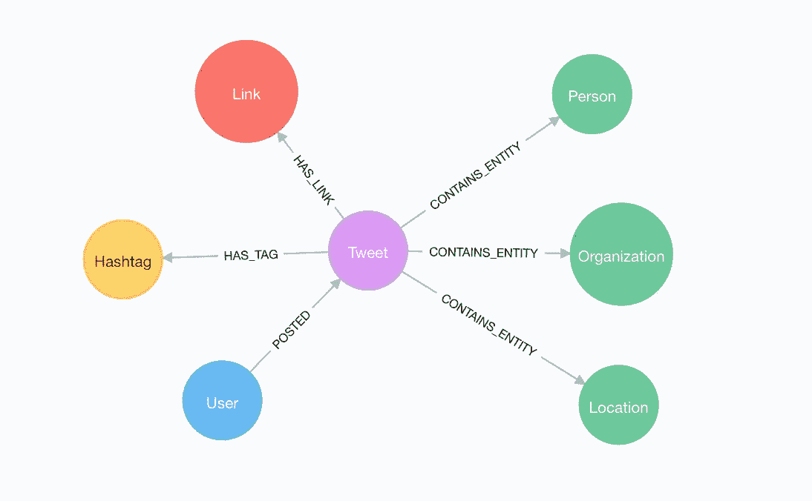

# 在 Neo4j 中探索俄罗斯 Twitter Trolls 数据库的六种方法

> 原文：<https://medium.com/hackernoon/six-ways-to-explore-the-russian-twitter-trolls-database-in-neo4j-6e52394c38f1>

NBC 新闻[公开发布了一个已删除推文的数据库](https://www.nbcnews.com/tech/social-media/now-available-more-200-000-deleted-russian-troll-tweets-n844731)，这些推文来自他们对俄罗斯推特流氓如何影响 2016 年美国大选的调查。你可以在他们的故事[这里](https://www.nbcnews.com/tech/social-media/russian-trolls-pushed-graphic-racist-tweets-american-voters-n823001)和[这里](https://www.nbcnews.com/tech/social-media/russian-trolls-went-attack-during-key-election-moments-n827176)中读到 NBC 的分析结果，但这篇文章的重点将是**你如何利用开源数据分析工具自己探索数据。**我们将展示如何从数据入手，希望能启发你自己去挖掘数据。

# 1.Neo4j 沙盒和 Neo4j 浏览器

NBC 新闻已经将数据发布为 Neo4j 数据库和 CSV 文件，可以与您喜欢的数据分析工具一起使用。但是从数据开始最简单的方法是使用 [Neo4j 沙箱](http://neo4j.com/sandbox-v2/)。Neo4j 沙箱允许您创建一个预先填充了有趣数据集的 Neo4j 私有托管实例。


Use [Neo4j Sandbox](https://neo4j.com/sandbox-v2/) to spin up private hosted Neo4j instances pre-populated with interesting datasets.

一旦您启动了您的俄罗斯 Twitter Trolls 沙盒实例，您将可以访问 Neo4j 浏览器，Neo4j 的查询工作台将允许您与数据库进行交互。


Use Neo4j Browser to visually explore the database.

# 2.用密码查询

[Cypher](https://neo4j.com/cypher-graph-query-language/) ，图形查询语言是一种探索数据库的好方法，可以在 Neo4j 浏览器中使用，或者通过使用 Neo4j 的[客户端驱动程序](https://neo4j.com/developer/language-guides/)构建应用程序来使用。

Cypher 使用[图形模式匹配](https://neo4j.com/developer/cypher-query-language/)来允许用户表达复杂的图形模式来匹配图形。这允许回答如下问题:

**巨魔最常用的标签是什么？**

```
MATCH (t:Troll)-[:POSTED]->(tw:Tweet)-[:HAS_TAG]->(ht:Hashtag)
RETURN ht.tag, COUNT(tw) AS num
ORDER BY num DESC
```

**哪些巨魔账号的关注者最多？**

```
MATCH (u:Troll) WHERE EXISTS(u.followers_count)
RETURN u.screen_name AS screen_name, u.followers_count AS followers
ORDER BY followers DESC LIMIT 50
```

**哪些推文中含有“诈骗”二字？**

```
MATCH (t:Troll)-[:POSTED]->(tw:Tweet)
WHERE tw.text CONTAINS "fraud"
OPTIONAL MATCH p=(tw)-[:HAS_TAG|HAS_LINK|MENTIONS|IN_REPLY_TO]-(a)
RETURN * LIMIT 50
```

找到推断的关系——哪些巨魔在转发其他巨魔？

```
MATCH p=
(:Troll)-[:POSTED]->(:Tweet)<-[:RETWEETED]-(:Tweet)<-[:POSTED]-(:Troll)
RETURN p LIMIT 10
```

**进一步的查询思路:**

*   巨魔发布推文最常用的应用是什么？
*   巨魔帐户在他们的个人资料中列出了哪些位置？
*   不是来自其他俄罗斯巨魔账户的哪些推文被转发的次数最多？

# 3.填写缺失的数据

由于数据收集的方式不同，有些缺失。例如，一些用户缺少个人资料信息，一些推文缺少元数据，如赞数和转发数。

**缺少个人资料信息**

例如，用户“@TEN_GOP”在数据库中缺少个人资料信息，因为这不是采集到的:

```
MATCH (u:Troll) WHERE u.screen_name = "TEN_GOP"
RETURN u.id, u.screen_name, u.description, u.location, u.name
-------------------------------------------------------------
╒════════════╤═══════════════╤═══════════════╤════════════╤════════╕
│"u.id"      │"u.screen_name"│"u.description"│"u.location"│"u.name"│
╞════════════╪═══════════════╪═══════════════╪════════════╪════════╡
│"4224729994"│"TEN_GOP"      │""             │""          │""      │
└────────────┴───────────────┴───────────────┴────────────┴────────┘
```

我们可以重建“@TEN_GOP”的 Twitter 个人资料 URL:

```
https://twitter.com/TEN_GOP
```

但是因为这些账号已经被 Twitter 暂停了，所以我们看到的都是:


The Russian Troll accounts were suspended by Twitter, removing their data from Twitter.com and Twitter’s API

我们可以检查网络缓存，如互联网档案，以找到这些网页的缓存版本，然后我们可能能够抓取。Internet Archive 有一个 API，用于检查页面的缓存版本，例如:

```
[http://archive.org/wayback/available?url=http://twitter.com/TEN_GOP](http://archive.org/wayback/available?url=http://twitter.com/TEN_GOP)
--------------------------------------------------------------------{ **url**: "[http://twitter.com/TEN_GOP](http://twitter.com/TEN_GOP)",
  **archived_snapshots**: {
    **closest**: {
      **status**: "200",
      **available**: true,
      **url**: "[http://web.archive.org/web/20170818065026/https://twitter.com/TEN_GOP](http://web.archive.org/web/20170818065026/https://twitter.com/TEN_GOP)",
      **timestamp**: "20170818065026"
    }
  }
}
```

显示“@TEN_GOP”的个人资料页面已被互联网存档捕获，并且在此处[可用](http://web.archive.org/web/20170818065026/https://twitter.com/TEN_GOP)。

**丢失推文信息**

我们还可以**为数据库中缺失信息的推文重建推文 URL**,以对照缓存进行检查:

```
MATCH (u:Troll)-[:POSTED]->(t:Tweet) WHERE t.text = ""
RETURN "[https://twitter.com/](https://twitter.com/)" + u.screen_name + "/status/" + t.id 
AS tweet_url 
LIMIT 10
------------------------------------------------------------------
╒═══════════════════════════════════════════════════════════╕
│"tweet_url"                                                │
╞═══════════════════════════════════════════════════════════╡
│"https://twitter.com/SCOTTGOHARD/status/781651098398494720"│
├───────────────────────────────────────────────────────────┤
│"https://twitter.com/SCOTTGOHARD/status/780602260401299456"│
├───────────────────────────────────────────────────────────┤
│"https://twitter.com/WarfareWW/status/783649582064467968"  │
├───────────────────────────────────────────────────────────┤
│"https://twitter.com/WarfareWW/status/783642593137754114"  │
├───────────────────────────────────────────────────────────┤
│"https://twitter.com/WarfareWW/status/756033388423897088"  │
├───────────────────────────────────────────────────────────┤
│"https://twitter.com/WarfareWW/status/794918302585909250"  │
├───────────────────────────────────────────────────────────┤
│"https://twitter.com/WarfareWW/status/787416487346708481"  │
├───────────────────────────────────────────────────────────┤
│"https://twitter.com/WarfareWW/status/794189517653680132"  │
├───────────────────────────────────────────────────────────┤
│"https://twitter.com/WarfareWW/status/797080157135761409"  │
├───────────────────────────────────────────────────────────┤
│"https://twitter.com/WarfareWW/status/781515670379003904"  │
└───────────────────────────────────────────────────────────┘
```

**展开网址**

许多推文包含使用 link shortener 服务的 URL，因此不清楚他们实际上共享了哪些页面:

```
MATCH (t:Troll)-[:POSTED]->(tw:Tweet)-[:HAS_LINK]->(u:URL)
WHERE u.expanded_url CONTAINS "bit.ly"
RETURN u.expanded_url LIMIT 10
------------------------------------------------------------
╒═══════════════════════╕
│"u.expanded_url"       │
╞═══════════════════════╡
│"http://bit.ly/2eeMnZR"│
├───────────────────────┤
│"http://bit.ly/2dCn9qP"│
├───────────────────────┤
│"http://bit.ly/2ctTjGN"│
├───────────────────────┤
│"http://bit.ly/2eAOBnf"│
├───────────────────────┤
│"http://bit.ly/2awlrUs"│
├───────────────────────┤
│"http://bit.ly/2aAtdyN"│
├───────────────────────┤
│"http://bit.ly/29UHsyx"│
├───────────────────────┤
│"http://bit.ly/2cOskmM"│
├───────────────────────┤
│"http://bit.ly/2cOskmM"│
├───────────────────────┤
│"http://bit.ly/2cOskmM"│
└───────────────────────┘
```

我们可以使用 cURL 这样的工具来展开链接，找到最终的目的地 URL:

```
➜ curl -Ls -w %{url_effective} -o /dev/null [http://bit.ly/2eeMnZR](http://bit.ly/2eeMnZR)[http://ksnt.com/2016/10/27/early-voting-more-good-signs-for-clinton-in-key-states/?utm_source=twitterfeed&utm_medium=twitter%](http://ksnt.com/2016/10/27/early-voting-more-good-signs-for-clinton-in-key-states/?utm_source=twitterfeed&utm_medium=twitter%)
```

像[unfurler](https://unfurlr.com/)这样的在线工具允许我们完成同样的事情，但也可以检查页面内容和欺骗用户代理。

**丰富数据的进一步想法:**

*   用[谷歌知识图](https://github.com/neo4j-contrib/trumpworld-graph/tree/master/08-google-knowledge-graph)补充数据
*   检查像 [archive.is](http://archive.is/) 和 [Internet Archive](https://archive.org/) 这样的网络缓存，寻找被删除推文的缓存版本
*   在其他社交媒体平台上搜索被重复使用的用户名

# 4.图形算法

[图形算法](https://neo4j.com/graph-analytics/)是一种将分析应用于整个图形的方法，以进一步增强我们对数据的理解。这些算法分为三类:

*   **中心性** —网络中最重要的节点是什么。中心性算法包括 PageRank、中间中心性和接近中心性。
*   **社区检测** —图怎么分？社区检测和聚类算法包括 Union Find、Louvain、标签传播和连接组件。
*   **寻路** —给定成本，最短路径或最佳路线是什么？寻路算法包括最小重量生成树、所有对和单源最短路径以及 Dijkstra。


PageRank is a recursive graph algorithm that defines the importance of a node proportional to the importance and number of connected nodes in the graph. [Image source Wikipedia](https://en.wikipedia.org/wiki/PageRank)

我们可以使用 [Neo4j 图形算法](https://github.com/neo4j-contrib/neo4j-graph-algorithms)程序在 Neo4j 和 Cypher 中运行这些算法。例如，下面是如何在 Troll 转发图上运行 PageRank:

```
CALL algo.pageRank("MATCH (t:Troll) RETURN id(t) AS id",
 "MATCH (r1:Troll)-[:POSTED]->(:Tweet)<-[:RETWEETED]-(:Tweet)<-[:POSTED]-(r2:Troll) RETURN id(r2) as source, id(r1) as target", {graph:'cypher'})
```

有关在俄罗斯 Troll 数据集上运行图形算法的更多示例，请参见[俄罗斯 Twitter Trolls Neo4j 沙盒实例](https://neo4j.com/sandbox-v2/)的 Neo4j 浏览器指南。

**图形算法思路:**

*   最有影响力的巨魔账号有哪些？
*   你能使用社区检测算法根据交互在图中找到社区吗？

# 5.图形可视化

数据可视化通常是理解图形算法结果的最佳方式。有许多用于可视化图形数据的开源工具，每种工具都有各自的优缺点。诸如 [Gephi](https://gephi.org/) 、 [vis.js](http://visjs.org/network_examples.html) 和[symbolic](https://emeeks.github.io/semiotic/#/semiotic/networkframe)等工具通常用于构建交互式图形可视化。

对于那些熟悉数据可视化的人来说，图形数据带来了一系列独特的挑战。通常，图形可视化最重要的特征是:

*   将**节点大小**绑定到图中节点的重要性或中心性
*   将节点分组到集群中。许多图形可视化工具使用强制定向布局来显示集群，但是我们也可以使用社区检测算法和**将社区绑定到节点颜色**来显示集群
*   显示**关系厚度**与关系的属性或权重成比例


Visualizing the Russian Troll retweet/reply network. Node size is proportional to PageRank, color shows the result of a community detection algorithm, and relationship thickness is determined by the number of retweets between the Trolls.

上图显示了在俄罗斯巨魔转发图上运行 **PageRank** 和**社区检测算法**的结果，并使用名为 [neovis.js](http://github.com/johnymontana/neovis.js) 的 vis.js 包装器库进行可视化。

**进一步的想法:**

你能想象可以从图中提取的其他类型的推断网络吗？你如何用密码来表达这些图表？你能使用上面提到的工具之一来构建一个交互式图形可视化吗？

# 6.自然语言处理

自然语言处理(NLP)是理解文本数据的过程。常见的自然语言处理任务包括词性标注、实体提取、词语相似度和情感分析。有许多用于执行 NLP 任务的开源工具，如斯坦福的 CoreNLP 工具、Python 中的[NLTK](http://www.nltk.org/)，甚至还有一些专门为处理 Twitter 数据而设计的工具，如 [CMU 的 Twitter 词性标记器](https://github.com/brendano/ark-tweet-nlp)和一个用于查找 hashtag 定义的众包工具[。](https://tagdef.com/en/tag/en)



Entity extraction on the Tweet data involves extending the graph model by annotating tweets that contain entities.

您甚至可以使用扩展在 Neo4j 中直接使用 Cypher 运行 NLP 任务。关于如何开始使用 [GraphAware neo4j-nlp 程序](https://github.com/graphaware/neo4j-nlp)，请参见[这篇文章](/@david.allen_3172/using-nlp-in-neo4j-ac40bc92196f)。对于那些熟悉使用 Python 工具进行 NLP 的人来说，这篇博文展示了如何使用 Neo4j 和 Python 对 Twitter 数据进行实体提取。

**自然语言处理理念:**

*   **实体提取** —推文中提到最多的人、组织、地点是什么？某些巨魔团体是在谈论某些实体吗？
*   **情绪分析**——巨魔们在积极谈论什么吗？还是他们只专注于传播负面情绪？

我们希望你对探索这些数据感到兴奋，在 Twitter“@ neo4j”上与我们分享你发现的任何有趣的东西。