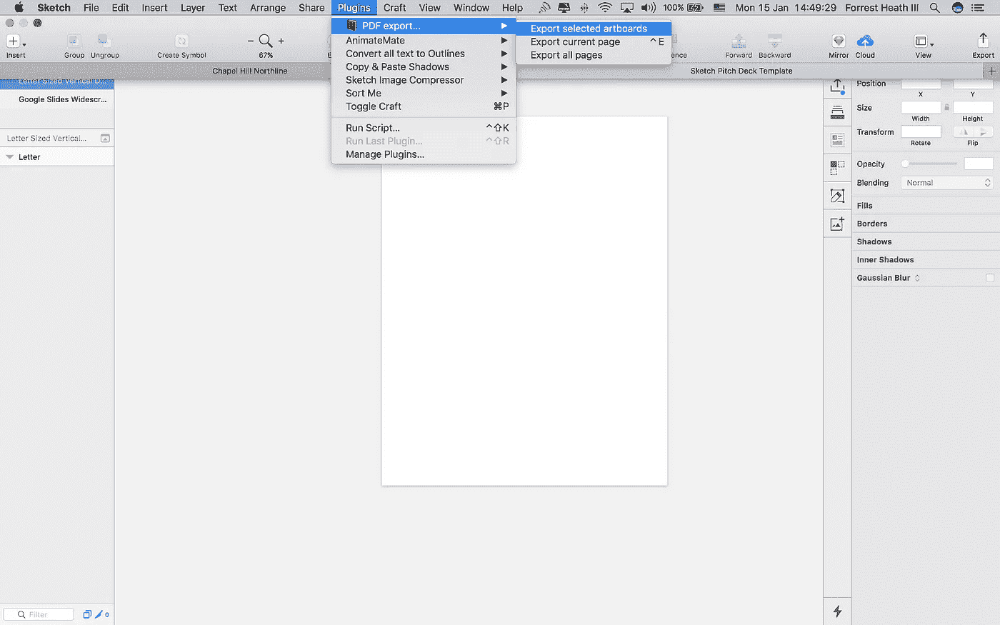

# 草图幻灯片、白皮书和演示工作流程

> 原文：<https://medium.com/hackernoon/sketch-slide-deck-white-paper-presentation-workflow-3fbc0f210280>

## 一个好的演示文稿是任何项目的熔炉。这是你让那些宝贵的少数初始利益相关者给狗屎的途径。这是我们用来做我们自己的过程——快乐投球

# 1)从草图开始:

我冒昧地创建了一个模板来帮助您开始。其中包括:

*   适合白皮书或报告风格文档的垂直信纸大小的页面 **612x792**
*   适合演示和推介的水平宽屏页面 **1600x900**

如果您需要不同的尺寸，只需手动调整所需的画板尺寸。

[草图球场甲板模板](https://forrest-heathiii.squarespace.com/s/Sketch-Pitch-Deck-Template.sketch)

*奖励提示:* **命令⌘** + **D** 将在草图中复制一个画板

# 2)设计

这可能需要一整篇文章，老实说，这很大程度上取决于你以前的经验，但我会在高层次的概念上给你一些启发。你首先要确定你要制作什么类型的文件。最常见的两种是幻灯片演示，通常是口头演示的视觉辅助工具，或者是白皮书或报告类型的文档，主要是在没有口语成分的情况下阅读。

## 始终包括:

*   简单标题页
*   页码
*   带有品牌的一致页眉或页脚
*   关闭包含联系信息的页面
*   如果超过 10 页，请附上目录(在某些情况下，可以不放幻灯片，请自行判断)

这给了你一个很好的总体框架，至少让内容易于导航。

## 高级设计理念:

**保持简单—** 确保少用疯狂的颜色、字体和图片。你希望内容成为中心。如果你添加了一些东西，确保它支持页面上的内容。**过剩吸**

**使用留白**——留白看起来很顺眼，可以节省你的工作，而且在任何屏幕或表面上看起来都不错。如果有疑问，选择更多的留白空间，释放你内心的极简主义。

**强有力的图片—** 记住一句古老的谚语“一张图片胜过千言万语”,战略性地使用图片来帮助阐明你的观点。它们不需要出现在每一页上，但是当巧妙使用时，它们是一个强大的工具。不要害怕给他们整个页面，不加注释或只加最少的注释。

# 真实世界的例子↓

## 有用的资源:

我做了一个有用的[设计](https://hackernoon.com/tagged/design) [工具](https://hackernoon.com/tagged/tools)的目录，叫做[启动包](https://www.pareto-design.com/launchkit/)，它将提升你的设计游戏。

# 3)导出为 PDF

你有了设计精美的内容，并准备向全世界展示，现在该怎么办呢？好吧，我们必须导出，但是有一个警告——如果演示文稿是一个大的、多页的文档，默认的草图导出对话框是远远不够的。

为了解决这个问题，我们将使用一个来自善良的澳大利亚人 William 的插件。点击下面的链接从 github 下载插件。

[草图 PDF 导出插件](https://github.com/DWilliames/PDF-export-sketch-plugin)

你只需要解压文件，然后点击文件标签:

"***PDF export . sketch plugin***

现在可以在插件下拉菜单的草图中找到它

选择所有要导出的画板，然后在插件菜单中，单击“ ***导出选定的画板***

您将看到上面的弹出窗口，默认设置是从左向右导出文档。你不应该改变这些。

点击 ***导出*** ，大功告成！

# 4)压缩你的 PDF

如果您有一个主要是文本的文档，这一步可能是不必要的(但仍然可能是一个好主意)。我们将使用一个便捷的网络应用程序来压缩我们的 PDF 文件，使之更易于管理，可以轻松地通过电子邮件发送，而不会超出附件大小的限制。如果您的演示文稿中有大型图像，这一点尤为重要。

作为参考，上面的 Southrail 例子从**202.8 MB**→**5.3 MB**

只需上传您的 PDF 文件，然后去喝杯咖啡(或几杯，取决于文档大小),同时等待您新压缩的演示文稿完成！

[小 PDF](https://smallpdf.com/compress-pdf)

# 5)有目的地推销

你的想法现在看起来像一百万美元，那么为什么不出去筹集一千万美元呢？