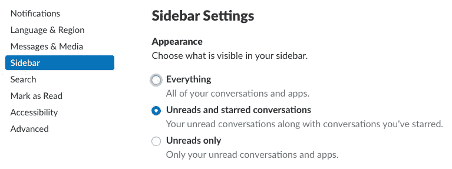
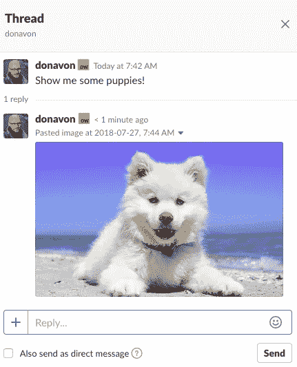
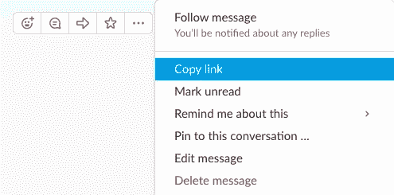
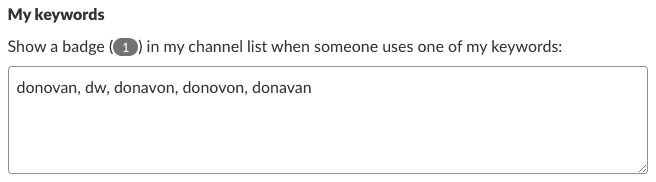
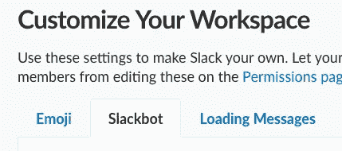

# 松弛专业技巧

> 原文：<https://medium.com/hackernoon/slack-pro-tips-43e7708515ab>

## 通过这些快速的“我不知道你能做到”的专业建议，让你的日常工作生活更加愉快和富有成效。

Original photo by [Donnie Rosie](https://unsplash.com/photos/taO2fC7sxDU?utm_source=unsplash&utm_medium=referral&utm_content=creditCopyText) on [Unsplash](https://unsplash.com/search/photos/brick-wall?utm_source=unsplash&utm_medium=referral&utm_content=creditCopyText)

如果你和我一样，当你在办公室的时候，你的生活、呼吸和死亡都是由懈怠造成的。它已经成为我们许多工作生活的一部分，以至于在极少数情况下，当它确实下降时，我们会恐慌，世界似乎会嘎然而止。

但是不要担心。Slack 活得很好，我们在这里讨论快乐时光。

在这篇文章中，我想分享一些我一路走来得到的专业建议——其中许多是我在推特上发布的，或者放在`#random`频道供我的同事使用——但我收集了它们并在这里展示给你使用。

# 整理你的工具条

我们有一个庞大的组织。因此，我订阅了很多频道。事实上，太多了，以至于我不得不在我的工具条上滚动浏览。Slack 有一个设置，如果有未读的消息，或者如果你将它标上了星，它将只在你的边栏中显示频道。

进入偏好设置，侧边栏，选择“未阅读和已加星的对话”，就像这样。

现在你的侧边栏只会告诉你什么是重要的。

# 你现在可以在帖子里张贴图片了！

与其说是专业建议，不如说是“嘿。你知道你现在可以在线程中发布图片了吗！”这是 Slack 一段时间以来一直缺少的东西，它终于在上周的某个时候出现了，我非常高兴。

# 线程中的 Post /giphy

尽管你可以直接在一个线程中发布图片，但不幸的是，你还不能发布`/giphy`图片。但是，有一个解决方法。

1.  去你的“我”频道。
2.  像平常一样找到你的`/giphy`。
3.  将鼠标悬停在 giphy 上，点击`...`菜单。
4.  选择“复制链接”
5.  将链接粘贴到线程中。

# Giphy 文本

说到`/giphy`，你知道`/giphy #echo`吧？这是一种快速发布文本的方式，肯定会引起注意。它创建了一个大的动画图像与任何你想传达的文本。

例如，你可以使用`/giphy #echo slack pro tips`来产生这样的东西。字体和动画是随机选择的，但是您可以循环选择，直到找到您喜欢的为止。

# 添加您名字的拼写错误

Slack 的一个很好的特性是，当有人简单地输入你的名字时，你可以得到通知，即使他们没有明确地指出你。对于常见拼写的名字，这不是问题。

> “我要和`Bob`一起吃午饭。还有谁愿意加入我吗？”

如果你是鲍勃，你会收到通知。

但是如果你的名字是，我不知道，多纳文。人们总是以各种方式拼错我的名字。

幸运的是，每当使用某些关键字时，Slack 都有办法通知您。我用它来添加我名字的各种拼写错误，甚至是我名字的首字母。

如果有人说:

> 我从多诺万那里学到了一个很酷的专业技巧

我收到了通知。(我喜欢知道人们什么时候在谈论我)

# 在频道内搜索

如果您在搜索栏上输入一个搜索词，它将搜索所有的 Slack。但是你知道你可以在一个特定的频道里搜索吗？有一个很酷的捷径可以做到这一点？

当您在频道或直接消息中时，不要在搜索栏中单击，而是按`Cmd-F`。Slack 将在搜索框中预先填入要搜索的频道名称。

# 处理`@here`和`@channel`滥用者

这是我最喜欢的专业技巧。你们很多人已经知道我指的是什么，但是让我解释一下。

Slack 有两个内置的组，可以通知每个在这里(即在线)的人或一个频道的所有成员，但它应该几乎像 911 类型的我需要 HELP NOW 一样使用，而不是用于随意的问题。

> @在这里看看这篇关于酵母薄片多种用途的文章

这将向在线的每个人发送通知。这打断了他们的工作流程。

这实质上相当于走到公司的每个人面前，不管他们当时在做什么，拍拍他们的肩膀，说“看看这篇关于酵母薄片的许多用途的文章”。你绝不会做这种事，那么你有什么权利放松呢？

我设计了一个聪明的方法，委婉地提醒他们这是一个禁忌，它使用 slackbot 响应来做到这一点。

1.  首先，在公共频道(可能是#random)创建一条消息，内容如下(点击“查看原始数据”，选择文本，然后粘贴到 Slack 中)。

2.然后获取消息的链接(点击消息上的`...`，然后复制链接)。

3.单击您的工作区名称旁边的向下小 v 形图标，然后选择“定制时差”。

4.一旦你的浏览器打开，点击第二个标签 Slackbot。

5.添加新的 Slackbot 响应

6.在“当有人说..”字段，输入`!here, !channel`

7.将上面第 2 步中的 URL 粘贴到“slackbot responds”字段中。

现在，每当你或组织中的任何人目睹`@here`或`@channel`虐待时，你所要做的就是键入`!here`或`!channel`，Slackbot 就会礼貌地给他们上一堂松弛礼仪课。

# 结论

所以你走吧。现在你可以像专业人士一样使用 Slack 了。

我也为美国运通 [*科技*](https://hackernoon.com/tagged/technology) *博客写稿。在*[*American express . io*](http://americanexpress.io/)*查看我的其他作品和我才华横溢的同事的作品。也可以* [*在 Twitter 上关注我*](https://twitter.com/donavon) *。*