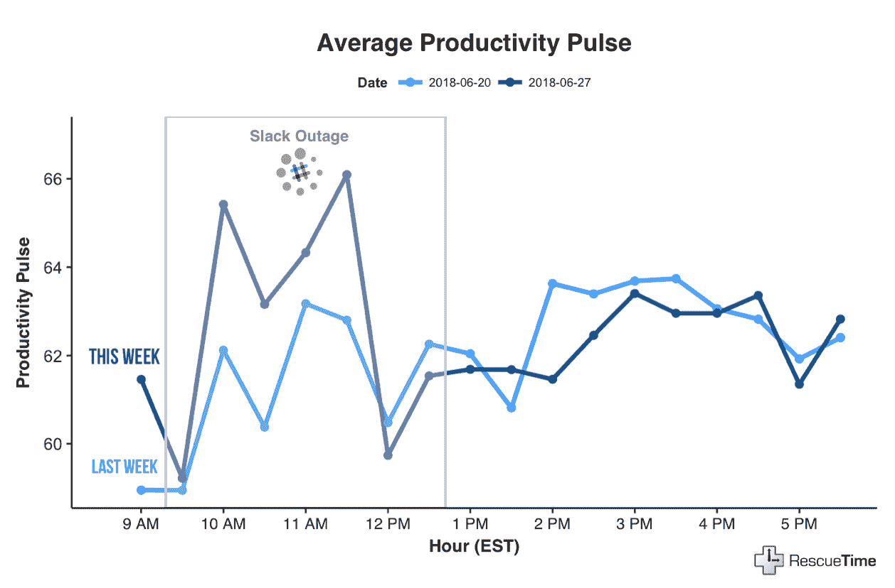
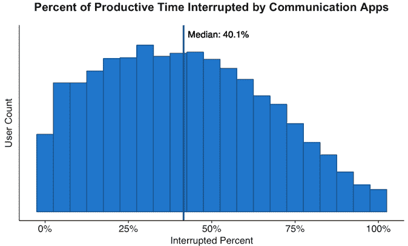
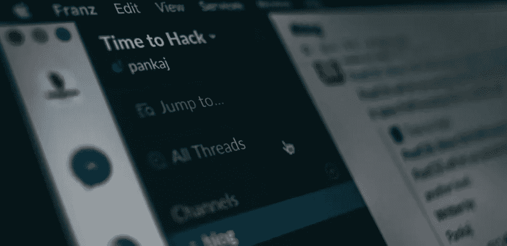

# 懈怠与生产力:下面是当每个人最喜欢的通信工具瘫痪时发生的事情

> 原文：<https://medium.com/hackernoon/slack-vs-productivity-heres-what-happened-when-everyone-s-favorite-communication-tool-went-down-919dc17019c>

如果你是使用 Slack 作为主要沟通工具的[800 多万人中的一员](https://techcrunch.com/2018/05/08/slack-hits-8-million-daily-active-users-with-3-million-paid-users/)，那么在 6 月 27 日星期三，你的一天可能会有些不同。

在早上令人紧张的几个小时里， [Slack 的服务被中断了](http://fortune.com/2018/06/27/slack-connectivity-issues-2/&sa=D&ust=1530280783723000&usg=AFQjCNFm1Bf1lE8A46ZsZcTFZik4b27mWw)。

Slack 自称是“工作发生的地方”那么，当它基本上停止营业时，发生了什么呢？

**为了了解 Slack 的使用对我们的生产力有多大影响，我们将 12，000+**[**rescue time**](https://www.rescuetime.com/)**的匿名** [**生产力数据**](https://blog.rescuetime.com/breaking-down-the-rescuetime-productivity-score/) **和 6 月 27 日(Slack 停机日)的 Slack 用户与一周前进行了比较。**

# 当空闲时间不可用时，用户在生产性工作上花费的时间要多于前一周的同一时间

你可能认为失去沟通工具会让工作效率陷入停滞。但是，当我们查看 Slack 用户在 Slack 停机期间的生产率得分时，我们发现人们的生产率比前一周同一时期提高了约 5%。

(注:我们已经看到，生产率模式会随着一周中的每一天而变化，所以比较周三和周三是最有意义的。)

很难不看这个图表而不得出一些非常清楚的结论。

首先，与“正常”的一天相比，几个小时的无懈怠给生产力带来了相当大的提升。

仔细想想，这是有道理的。甚至没有使用他们选择的通讯工具的选项，更多的用户在[重新安排的时间](https://www.rescuetime.com/)中把时间花在他们归类为“有效率”的任务上。

接下来，当服务恢复时，它产生了生产力“鞭打”效应，用户的生产力下降到每天的最低点。

但是，难道懈怠不应该减少我们对交流的需求，帮助我们保持专注和高效吗？

实际上，当然。

然而，当我们最近研究人们在工作日如何使用沟通工具时，[我们发现](https://blog.rescuetime.com/communication-multitasking/) **平均来说，知识工作者一天中有 40%的时间在沟通和其他生产性工作之间进行多任务处理**。

更糟糕的是，正因为如此，**员工平均每天只有 1 小时 12 分钟的生产时间没有被通讯工具**打断。

众所周知，[多任务处理会扼杀我们的生产力](https://blog.rescuetime.com/multitasking/)和专注力，这意味着我们总是让沟通工具开着，躲在幕后，这是在自毁我们的工作日。

# 我们喜欢懒散。但是多任务沟通是一个越来越严重的问题。

这并不是说懈怠是生产力杀手。

我们是 RescueTime 的宗教 Slack 用户，绝对喜欢它如何帮助我们完成伟大的工作(特别是作为一个[远程团队](https://blog.rescuetime.com/remote-work-lessons/)！)

问题不在于工具本身，而在于我们大多数人如何使用它。

在空闲时间(或电子邮件)和其他任务之间不断的上下文切换会打断我们的一天，扼杀我们的注意力。在一项研究中，大卫·迈耶博士发现“即使是任务转换造成的短暂精神障碍也会耗费一个人 40%的工作时间。”

想想看，有多少次你无意识地陷入懈怠，结果却被小狗的 gif 或随意的对话搞得不知所措？

懈怠分心的挣扎是真实的。昨天的停电证明了这一点。

# 下次你感到落后时，给自己一个交流的休息时间

像 Slack 这样的沟通工具在现代职场中是必不可少的。但它们也是我们分心的主要来源之一。看到当我们被迫不使用它们时，生产力会发生什么，真是大开眼界。

因此，虽然我们从来不提倡摆脱懈怠(或者你使用的任何工具)。很明显，短暂的休息会对我们做好专注工作的能力产生奇迹。

***准备好看看自己每天在懈怠中度过多少时间了吗？*******免费报名参加，收回对自己时间的控制权。****