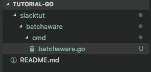

# Slack'n Go:批量在线感知机器人

> 原文：<https://medium.com/hackernoon/slackn-go-batch-presence-aware-bot-bcea4d7ae672>

我们将在 [Go](https://golang.org/) 中创建一个 [Slack](https://slack.com/) Bot，它可以感知批量存在变更事件。

本质上，我们将构建并运行这里给出的示例:[https://github . com/nlopes/slack/blob/master/examples/conn params/conn params . go](https://github.com/nlopes/slack/blob/master/examples/connparams/connparams.go)。本教程给出了如何运行它的更详细的操作，这样即使是一个相对较新的人也可以很容易地遵循它。

存在改变事件的一个例子是当聊天组的成员将他们的状态从活动改变为离开。

Slack 为他们的 API 提供了一个[更新](https://api.slack.com/changelog/2017-06-batch-presence-and-presence-subscriptions),通过批量更新来实现更有效的存在变化检测。这与具有大量空闲成员的群组的激增相一致，其中存在的改变可能导致在短时间内对许多事件的昂贵处理，或者以错过一些事件为代价。

在本教程中，我们认为 Golang 已经安装。你也可以参考[https://golang.org/doc/install](https://golang.org/doc/install)的相关内容。

对于更清晰的分步活动，我们可以参考[https://github . com/suekto-Andreas/tutorial-go/commits/TUT-001](https://github.com/suekto-andreas/tutorial-go/commits/TUT-001)的提交。

# 如何扩展这个基本代码

通过遵循本教程创建的代码，您可以将其扩展为更复杂的 bot，其中一个非常初步的扩展可以发生在创建事件处理程序时。(本教程只是简单的做打印。)

更不用说一旦你生成处理程序和创建一个更复杂的业务流程/用例，照顾面向包的设计，提供自动化单元测试。我个人更喜欢将 Go 项目视为一个库的概念，而可执行文件被分组在`cmd`目录中。

# 创建备用令牌

首先，我们需要访问 API 的令牌。请参考以下链接:[https://get . slack . help/HC/en-us/articles/215770388-Create-and-regenerate-API-tokens](https://get.slack.help/hc/en-us/articles/215770388-Create-and-regenerate-API-tokens)

# 获取依赖关系

我们使用下面的库与 Slack 通信:[https://github.com/nlopes/slack](https://github.com/nlopes/slack)。让我们去得到它，在终端中运行以下命令

```
$ go get github.com/nlopes/slack
```

# 创建我们的项目目录

为此，我们只需创建一个可执行的命令行，我将它的结构如下:



this tutorial project structure

当您的目标是构建一个特定的 slack bot 项目时，您可能更喜欢这里的层次结构，因为上面的结构是为将更多的教程代码放在 1 个存储库下而准备的。一个例子是 *batchaware* 成为根项目目录，而不是 *tutorial-go* 。

# 写代码

我们的代码应该是一个简单的主函数。首先，让我们实例化一个 Slack 对象。将“您的令牌”替换为我们在上一步中创建的令牌。(如果您正在考虑生产代码，请确保这里的令牌以更好的方式提供，而不是硬编码，例如将其作为环境变量。)

```
package mainimport (
   "fmt"
   "log"
   "net/url"
   "os" "github.com/nlopes/slack"
)func main() {
    api := slack.New(
        "YOUR TOKEN HERE",
        slack.OptionDebug(true),
        slack.OptionLog(
            log.New(os.Stdout, "slack-bot: ",
            log.Lshortfile|log.LstdFlags)),
    )
}
```

接下来，我们要与 Slack 建立一个 RTM(实时消息)连接。这是我们传入的选项参数，它表明我们的 Bot 已经准备好进行批处理存在感知。

```
rtm := api.NewRTM(
    slack.RTMOptionConnParams(
        url.Values{"batch_presence_aware": {"1"}}))
```

让我们开始连接

```
go rtm.ManageConnection()
```

之后，我们甚至可以通过查看 IncomingEvents 通道来监听，使用以下 for 循环

```
for msg := range rtm.IncomingEvents {
    fmt.Print("Event Received: ")
}
```

我们将把 hello world 发送到我们希望机器人监听的频道。我们使用 ConnectedEvent 来完成这项工作，这是库的内部事件，而不是 Slack 事件。在这个事件发生时，我们发送一条消息，指出我们希望机器人监听的相应的松弛信道 ID。

```
for msg := range rtm.IncomingEvents {
    fmt.Print("Event Received: ") switch ev := msg.Data.(type) {
    case *slack.ConnectedEvent:
        fmt.Println("Infos:", ev.Info)
        fmt.Println("Connection counter:", ev.ConnectionCount)
        // Replace ABCDEFGH with your Channel ID
        rtm.SendMessage(
            rtm.NewOutgoingMessage("Hello world", "ABCDEFGH")) default:
        // Ignore other events..
        fmt.Printf("Unexpected: %v\n", msg.Data)
  }
}
```

要激活状态更改活动，我们需要首先订阅此活动(自 2018 年 1 月起，这是一个强制步骤。)我们将在 HelloEvent 期间订阅，当 Bot 成功连接时，这是一个松弛事件。对于这一步，我们需要 USER-id，一种简单的检索方法可以通过执行这一步[这里](https://stackoverflow.com/questions/40940327/what-is-the-simplest-way-to-find-a-slack-team-id-and-a-channel-id/41653047)来完成。(对于更自动化的方式，下面的[链接](https://stackoverflow.com/questions/38939233/display-all-online-users-in-a-slack-channel)可以启发你。)

```
for msg := range rtm.IncomingEvents {
    fmt.Print("Event Received: ") switch ev := msg.Data.(type) {
    case *slack.ConnectedEvent:
        fmt.Println("Infos:", ev.Info)
        fmt.Println("Connection counter:", ev.ConnectionCount)
        // Replace ABCDEFGH with your Channel ID
        rtm.SendMessage(
            rtm.NewOutgoingMessage("Hello world", "ABCDEFGH")) case *slack.HelloEvent:
        fmt.Printf("Hello: %v\n", ev)
        // Replace USER-ID-N here with your User IDs
        rtm.SendMessage(rtm.NewSubscribeUserPresence([]string{
            "USER-ID-1",
            "USER-ID-2",
        })) default:
        // Ignore other events..
        fmt.Printf("Unexpected: %v\n", msg.Data)
    }
}
```

在所有的设置和完成之后，我们现在应该听听这篇文章中的主要目标，存在改变事件！

```
for msg := range rtm.IncomingEvents {
    fmt.Print("Event Received: ") switch ev := msg.Data.(type) {
    case *slack.ConnectedEvent:
        fmt.Println("Infos:", ev.Info)
        fmt.Println("Connection counter:", ev.ConnectionCount)
        // Replace ABCDEFGH with your Channel ID
        rtm.SendMessage(
            rtm.NewOutgoingMessage("Hello world", "ABCDEFGH")) case *slack.HelloEvent:
        fmt.Printf("Hello: %v\n", ev)
        // Replace USER-ID-N here with your User IDs
        rtm.SendMessage(rtm.NewSubscribeUserPresence([]string{
            "USER-ID-1",
            "USER-ID-2",
        }))

    case *slack.PresenceChangeEvent:
       fmt.Printf("Presence Change: %v\n", ev) default:
        // Ignore other events..
        fmt.Printf("Unexpected: %v\n", msg.Data)
    }
}
```

# 运行机器人

运行 bot(给定本教程中的目录结构)

```
$ go run slacktut/batchaware/cmd/batchaware.go
```

然后，机器人将开始监听空闲信道。尝试让频道中的一个成员改变它的存在(比如从活动到离开。)

```
switch ev := msg.Data.(type) {
    case *slack.ConnectedEvent:
        fmt.Println("Infos:", ev.Info)
        fmt.Println("Connection counter:", ev.ConnectionCount)
        // Replace ABCDEFGH with your Channel ID
        rtm.SendMessage(
            rtm.NewOutgoingMessage("Hello world", "ABCDEFGH"))case *slack.HelloEvent:
        fmt.Printf("Hello: %v\n", ev)
        // Replace USER-ID-N here with your User IDs
        rtm.SendMessage(rtm.NewSubscribeUserPresence([]string{
            "USER-ID-1",
            "USER-ID-2",
        }))default:
        // Ignore other events..
        fmt.Printf("Unexpected: %v\n", msg.Data)
    }
}
```