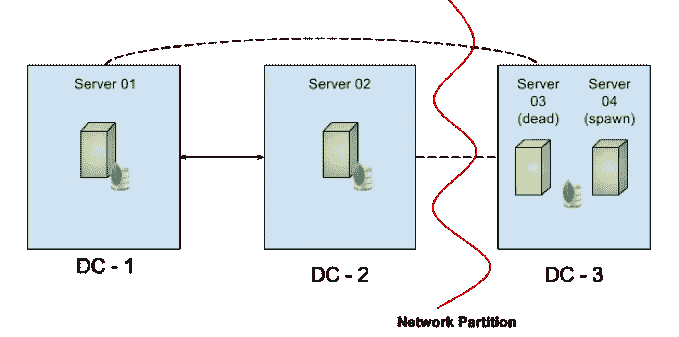

# 晚上睡得更香！下面是如何自动重生一个 MongoDB 服务器！

> 原文：<https://medium.com/hackernoon/sleep-better-at-night-here-is-how-to-respawn-a-mongodb-server-automatically-f1a30d1b36f6>

> 在没有事先警告的情况下失去服务器不再是一个是否会发生的问题，而是当它发生时——如何确保 [MongoDB](https://hackernoon.com/tagged/mongodb) 高可用性不会受到威胁？

本文提供了一个解决方案，当您的副本集的一个服务器遇到意外的服务器故障时，自动旋转替换服务器。这种方法有助于减少副本集暴露于容错值 0 的总时间。

# 谁应该读它？

本文的目标读者是运营人员、对 AWS 产品有基本了解的 DevOps 团队、MongoDB 爱好者以及所有想了解一切的技术人员。本文使用的技术有 [MongoDB](https://www.mongodb.com/) 、 [AWS EC2](https://aws.amazon.com/ec2/) 、 [Lambda](https://aws.amazon.com/lambda/) 、 [Route 53](https://aws.amazon.com/route53/) 、 [DynamoDB](https://aws.amazon.com/dynamodb/) 、 [CloudWatch](https://aws.amazon.com/cloudwatch/) 、 [VPC](https://aws.amazon.com/vpc/) 、[自动缩放](https://aws.amazon.com/autoscaling/)、 [Ansible](https://www.ansible.com/) 、 [IAM](https://aws.amazon.com/iam/) 和 [Python](https://en.wikipedia.org/wiki/Python_%28programming_language%29)

# 为什么要读？

在意外的服务器故障情况下，副本集的容错能力可能会下降到 0。换句话说，如果再有一个服务器出现故障，副本集很容易出现*“没有主服务器】*。这篇文章可以帮助你

*   根据上述情况建立知识库
*   恢复容错值> 0 所需的步骤
*   自动化 AWS 中的流程

尽管本文讨论了针对亚马逊 Web 服务的解决方案，但是您也可以将知识库应用于其他平台，比如 T2 的谷歌云平台、T4 的 Pivotal Cloud Foundry 或 Kubernetes。

# 你会学到什么？

本文详细概述了以下主题

*   副本集的容错能力为 0 时的最坏情况
*   运营团队解决问题的典型流程
*   通过自动化加快流程更换的方法
*   重生方法的利弊
*   满足您需求的增强范围

# 有什么解决办法？

考虑到这篇文章深入细节，我想就*“这是如何做到的？”做一个执行简报*。与无状态 web 服务器不同，MongoDB [数据库](https://hackernoon.com/tagged/database)服务器完全是关于状态的。所以，我用了

*   CloudWatch，Lambda 来检测失效/恶化的 EC2 实例
*   自动扩展以重生和替换失效的服务器
*   将磁盘卷与 EC2 实例相关联的 Ansible & Resource 标记
*   Route53，Lambda 解析/更新 DNS/服务器名称
*   让新的副本集成员自动同步

希望这是简短的总结！

# 荣誉

我要感谢[亚历克斯·科米亚金](/@alexkomyagi)、[古普塔·哥鲁达](/@guptagaruda)和[阿南特·斯里瓦斯塔瓦](/@anantsrivastava)为审阅本文付出的宝贵时间。

# 警告

本文中讨论的解决方案*不会帮助您获得更高的容错能力*。它主要有助于减少容错值为 0 的副本集的持续时间。我想让你知道，这篇文章和这里讨论的解决方案都没有得到 [MongoDB Inc](https://docs.mongodb.com/manual/support/) 的官方支持。所以，请放心使用，风险自担！

# 源代码

源代码可从 repo:[https://github . com/sarjarapu/whites/tree/master/MongoDB/respawn/code](https://github.com/sarjarapu/whitepapers/tree/master/mongodb/respawn/code)获得。

# 介绍

作为一名现场咨询工程师，我与由运营、数据库管理员、架构师和开发人员组成的不同客户端团队合作。这些客户中有许多在云提供商上托管他们的数据库服务器，比如 T2 的亚马逊网络服务、T4 的谷歌云平台等等。一些在 Amazon AWS 中占有很大份额的大客户和/或已经使用 AWS 几年的客户遇到了如下问题

*   损坏的 EC2 实例
*   无法 SSH 到服务器
*   亚马逊[让你的实例](http://docs.aws.amazon.com/AWSEC2/latest/UserGuide/instance-retirement.html)退役等等。

与这样的客户打交道时，一个非常有趣且具有挑战性的问题浮出了水面

> *"* 在没有预先警告的情况下丢失 EC2 实例不再是是否会发生的问题，而是何时发生的问题——我们可以采取什么措施来确保 MongoDB 的高可用性？

*像任何负责任的运营团队一样，这些团队高度关注最糟糕的情况，并希望通过制定应急计划来主动采取行动。当一个副本集成员面临意外的服务器故障时，副本集的容错能力可能为 0。在这种情况下，您的副本集处于易受攻击的状态，因为它无法承受额外的系统故障以实现高可用性。*

*为了将容错恢复正常，该过程通常需要*

*   *服务器问题的诊断*
*   *分析是否需要更换服务器*
*   *如果需要更换服务器*
*   *重新配置 MongoDB 副本集*
*   *[新服务器上的数据同步](https://docs.mongodb.com/manual/core/replica-set-sync/)*
*   *更新应用程序连接字符串以使用新服务器*

*我想强调的是，这种方法需要运营团队的手动干预，并且耗费大量时间。除了重新生成新的服务器任务之外，操作人员还必须对整个系统的健康状况保持高度警惕；当副本集的容错能力为 0 时，确保不会发生其他故障。本文为您提供了一个解决方案，尽管服务器出现故障，它可能会帮助您整夜睡得更好。所以，让我们开始吧！*

# *高可用性*

*MongoDB 通过[复制](https://docs.mongodb.com/manual/replication/)提供数据库的冗余和[高可用性](https://docs.mongodb.com/manual/core/replica-set-high-availability/)。每当副本集中的一个成员出现故障，MongoDB 副本集的[容错](https://docs.mongodb.com/manual/core/replica-set-architectures/#consider-fault-tolerance)计数就会减少 1。*

*如果大多数[副本集成员](https://docs.mongodb.com/manual/core/replica-set-elections/)不可访问或不可用，那么您不能选举[主成员](https://docs.mongodb.com/manual/core/replica-set-primary/index.html)，副本集将不能接受写入。所以有一个初选成员或者有足够的成员来选举初选是至关重要的。最重要的是，减少您面临失去主要成员和失去额外成员的脆弱状态的时间。*

*如果你害怕失去另一个成员而没有主要成员，那么你应该有比现在更高的容错能力。参考[成员数量 v/s 容错矩阵](https://docs.mongodb.com/manual/core/replica-set-architectures/#consider-fault-tolerance)，要获得 2 的容错能力，您至少需要 5 个成员的副本集。但是，如果您负担不起 5 个成员的副本集，那么本文可能有助于采取措施来缩短副本集的容错能力为 0 的时间段。*

# *解决方案—手动版本*

*如果副本集成员变得无响应，并且在不替换整个服务器的情况下无法恢复，那么您将需要手动干预来解决该问题。如[中所述，解决方案是什么？](https://gist.github.com/128ff2f46c3b21fd3892a2523a4dda5a#whats-the-solution)汇总部分，您需要执行以下操作*

*   *用新的替换服务器替换无响应的服务器*
*   *用新的替换服务器重新配置副本集*
*   *等待数据同步完成*
*   *用新服务器更新应用程序连接字符串*

*下图显示了一个包含 3 个成员的副本集的场景，其中`Server 03`没有响应。与其他两个成员相比，磁盘卷- `Disk 3`是`STALE`，因为数据没有被复制到`Server 03`。*

**

*MongoDB Server Replacement*

*根据数据大小的不同，在全新的服务器上从头开始进行完整的数据同步需要花费大量时间。因此，首先让我们讨论如何使数据同步更快*

# *更快的数据同步*

*你可以通过[重用](https://docs.mongodb.com/manual/tutorial/resync-replica-set-member/)数据量来实现更快的同步*

*   *从`Server 03`中卸载 MongoDB 数据卷`Disk 3`*
*   *在替换服务器`Server 04`上挂载数据卷`Disk 3`*

*这样做可以完全避免[初始同步](https://docs.mongodb.com/manual/core/replica-set-sync/)，并且只同步还没有[复制的](https://docs.mongodb.com/manual/core/replica-set-sync/#replication)操作日志数据。换句话说，如果您的旧/失效的服务器在 10 分钟内被替换，那么替换服务器只需要复制在这 10 分钟内发生的操作日志条目。*

*在考虑重用现有磁盘卷以实现更快的同步时间时，做了一些假设*

*   ***使用独立的数据卷**:MongoDB 数据文件被写到独立的磁盘卷上，而不是底层操作系统磁盘上，因此您可以在其他地方卸载/重装。*
*   ***可重新安装的磁盘** : [EBS 卷](http://docs.aws.amazon.com/AWSEC2/latest/UserGuide/AmazonEBS.html)可以连接到替换 EC2 实例。但是，EC2 实例存储/ [临时磁盘](http://docs.aws.amazon.com/AWSEC2/latest/UserGuide/InstanceStorage.html)，这些磁盘是物理连接的，不能挂载到另一个实例上。*
*   ***磁盘或数据未损坏**:如果磁盘卷或 MongoDB 数据文件损坏，那么在替换服务器上重新装载相同的磁盘卷仍会处于相同的损坏状态。要修复损坏的磁盘/数据，您可能需要在一个新的磁盘卷上完成[初始同步](https://docs.mongodb.com/manual/core/replica-set-sync/)*

# *解决方案—自动化版本*

*前面提到的解决方案工作正常，但是仍然需要手动干预来完成以下任务*

*   *创建替换服务器*
*   *用新成员重新配置副本集*
*   *装载重复使用的磁盘卷和数据同步*

*自动化过程是本文的核心，而且很快就变得很厚，绝对不适合胆小的人。因此，我将按照复杂性增加的顺序向您介绍自动化流程。在我们进入细节之前，这里是关于如何自动化上述步骤的*高级概述*。*

***高级概述:**当替换服务器`Server 04`启动时，shell 脚本将挂载所有标记为`Server 03`的磁盘卷。AWS CloudWatch 将基于*‘running’*事件调用 [AWS Lambda](https://aws.amazon.com/lambda/) 函数。用 [Python](https://en.wikipedia.org/wiki/Python_%28programming_language%29) 编写的 Lambda 函数将更新 [AWS Route 53](https://aws.amazon.com/route53/) 上的 DNS 条目，以便`Server 03`实例的 FQDN 现在被映射到`Server 04`的 [IP 地址](https://en.wikipedia.org/wiki/IP_address)。*

# *自动化:装载数据卷*

*为了自动化将磁盘卷装载到 EC2 实例上的过程，首先需要识别/搜索资源。我使用 AWS [资源标签](http://docs.aws.amazon.com/AWSEC2/latest/UserGuide/Using_Tags.html)来搜索 EC2 实例及其相关的磁盘卷。下图显示了一些与磁盘卷相关联的标记，磁盘卷是安装在 EC2 实例`skamon_demoapp_rs03`上的 *'/dev/xvdb'* 。*

**

*AWS Resource Tags*

*如果与`instance_name`标签:`skamon_demoapp_rs03`关联的 EC2 实例被认为没有响应，那么您需要为它提供一个新的替换 EC2 实例。当新服务器启动时，如果它还没有挂载，一个 [Ansible](https://www.ansible.com/) 脚本将使用标签获取磁盘卷，并将它们挂载到当前 EC2 实例上。你可以使用任何你可以使用的工具，包括 [AWS 命令行界面](https://aws.amazon.com/cli/)、[木偶](https://www.puppet.com/)、[厨师](https://www.chef.io/)等等，来达到同样的目的。*

# *避免副本集重新配置*

*副本集中的成员都不能使用`Server 04`，因为服务器还不是副本集的一部分。然而，重新配置副本集会导致当前的主成员下台，这可能会[触发新主成员的选举](https://docs.mongodb.com/manual/core/replica-set-elections/#replica-set-election-internals)。通过在您的[副本集配置](https://docs.mongodb.com/manual/reference/replica-configuration/)中使用服务器的[完全限定域名](https://en.wikipedia.org/wiki/Fully_qualified_domain_name) (FQDN ),您可以完全避免副本集的重新配置，而不是使用默认的[私有 DNS 名称](http://docs.aws.amazon.com/AmazonVPC/latest/UserGuide/vpc-dns.html),它对于每个 EC2 实例都是唯一的。*

*本节的其余部分将讨论*

*   *VPC 设置和组件*
*   *动态 DNS*

# *VPC 设置和组件*

*我已经创建了一个带有公共和私有子网的 VPC，如下图所示。*

**

*AWS VPC Components*

*创建 VPC、子网等的详细步骤。超出了本文的范围。如果你不知道 VPC 的概念，或者不确定如何将数据库服务器与公共互联网隔离，那么我强烈推荐你阅读文章[什么是亚马逊 VPC](http://docs.aws.amazon.com/AmazonVPC/latest/UserGuide/VPC_Introduction.html) 和 [VPC 的公共和私有子网](http://docs.aws.amazon.com/AmazonVPC/latest/UserGuide/VPC_Scenario2.html)。我还发现下面的视频非常有用。*

# *动态 DNS*

*如前所述，通过在副本集配置中使用服务器的完全限定域名(FQDN ),而不是使用默认的专用 DNS 名称，可以完全避免副本集的重新配置。在这一节中，我将详细介绍如何使用 Amazon Route53 和一系列其他产品在 AWS 中建立动态 DNS。*

> *虽然默认的 VPC DNS 可以为您的 VPC 提供基本的名称解析，但相比之下，53 号公路专用托管区域提供了更丰富的功能。Route 53 允许客户通过 web 服务调用修改 DNS 记录。使用这个 API，可以自动创建/删除记录集和托管区域。杰里米·考恩和埃夫兰·富恩特斯*

*我要感谢亚马逊网络服务团队的 Jeremy Cowan 和 Efrain Fuentes 编写了一篇非常有趣的文章——“[使用 CloudWatch Events 和 Lambda 为 53 号公路构建动态 DNS”。我强烈推荐你阅读上面的文章来了解更多关于动态 DNS 的知识。](https://aws.amazon.com/blogs/compute/building-a-dynamic-dns-for-route-53-using-cloudwatch-events-and-lambda/)*

*下图描述了将在幕后触发的各种事件，并显示了当新的替代服务器取代失效服务器时，各种系统如何协同工作。请通读事件顺序部分，跟随图表。*

**

*Sequence of events while spawing a new server*

***事件发生的顺序:***

1.  *副本集中的`Server 03` (ip-10.12.230.160)失效*
2.  *副本集的其他成员将`Server 03`视为“不可达”*
3.  *副本集的容错现在下降到 0，3 个成员中只有 2 个在运行。*
4.  *提供新的替换服务器`Server 04` (ip-10.12.230.200)*
5.  *新服务器上的 Ansible 脚本将各种标签从`Disk 03`复制到自身(`Server 04`)*
6.  *该脚本更新服务器的主机名，使用资源标签找到并安装`Disk 03`*
7.  *触发`Server 04`上的“EC2 实例状态:正在运行”的云监控事件*
8.  *订阅以上云观察事件的 AWS Lambda 函数运行 Python 代码*
9.  *Python 代码获取`Server 04`上的 CNAME /区域资源实例标签，并更新 Route53 中的 A、PTR 和 CNAME 记录(用`Server 04`替换`Server 03`)*
10.  *DNS 名称`skamon_demoapp_rs03`现在被解析为`Server 04`*
11.  *复制过程开始并保持所有成员同步，副本集的容错能力将恢复到 1*

# *自动化:配置替换服务器*

*解决方案中需要自动化的最后一部分是*“在检测到故障时自动生成一个新的 MongoDB 替换服务器”*。您可以使用[自动缩放](https://aws.amazon.com/autoscaling/)来检测受损的 Amazon EC2 实例或不健康的应用程序，并在无需您干预的情况下替换这些实例。如果你是自动缩放的新手，那么我强烈建议你观看*迈克尔·哈尼什*关于[通过自动缩放自动管理亚马逊 EC2 实例](https://www.youtube.com/watch?v=bSRTAMPqS3E)的网络研讨会*

*实施替换硬件的自动供应*

*   *创建和配置新的自动缩放组*
*   *将 MongoDB 副本集的 EC2 实例放在组中*
*   *将组设置为始终保持最小/最大计数=副本集成员计数*
*   *在启动配置中使用 [AMI](http://docs.aws.amazon.com/AWSEC2/latest/UserGuide/AMIs.html) 和所有需要的工具和软件*

*如上配置自动扩展组后，当其中一个服务器终止时，会自动创建一个新的 EC2 实例。您可以配置该组的运行状况检查规则以满足您的需求。*

*我想确保你明白功能*‘AWS Auto Scaling’*纯粹是用来帮助确保你运行所需数量的 Amazon EC2 实例，而不是通过正确使用 [MongoDB 分片](https://docs.mongodb.com/manual/sharding)来实现你的 MongoDB 数据库的可伸缩性。*

*如果您发现为 MongoDB 数据库使用“AWS Auto Scaling”特性是一个有趣的用例，那么您可能也会喜欢下一节中列出的[其他用例场景](https://gist.github.com/128ff2f46c3b21fd3892a2523a4dda5a#other-use-case-scenarios)。*

# *用例及改进范围*

# *其他用例场景*

*将*“AWS 自动伸缩”*方法与*“MongoDB 滚动更新”*特性结合起来，您可以升级副本集成员的底层硬件配置，执行 MongoDB 版本升级等。为了实现这一点，您必须重建或修补一个 AMI，更新一个自动缩放组，并以滚动升级的方式重新创建副本集成员的所有 EC2 实例。*

*尽管我很喜欢升级硬件的用例，但在我看来，将这种方法用于像 [MongoDB 版本升级](https://docs.mongodb.com/manual/tutorial/upgrade-revision/)这样的琐碎过程是大材小用。典型的 MongoDB 版本升级包括[就地二进制版本升级](https://docs.mongodb.com/manual/tutorial/upgrade-revision/#replace-the-existing-binaries)，这比用升级后的 AMI 生成整个 EC2 实例要简单得多，耗时也更少。我确实遇到过一个客户，他更喜欢修补 AMI，而不是简单地保持整个操作过程的一致性。所以纯属个人喜好。*

# *改进的余地*

*虽然当前的解决方案对你们中的一些人来说已经足够了，但是仍然有进一步改进的空间。我思考过的一些即兴创作是*

## *跨数据中心支持*

*当前解决方案仅使用一个自动缩放组。如果您的 MongoDB 部署在地理上一直分布在多个数据中心，那么您可能必须为每个数据中心创建一个自动伸缩组。这将有助于确保每个数据中心至少有一台服务器启动并运行。*

## *网络分区*

*如果您的 MongoDB 部署分布在三个数据中心，那么您自然会享受到 MongoDB 的高可用性。下图显示了一个副本集成员失败的情况和一个网络分区的情况。尽管产生了一个新的 MongoDB 服务器，但是由于网络分区的原因，副本集的容错能力仍然是 0。*

**

*Multiple Data Centers with Network Partition*

## *多个故障同时发生*

*当 Ansible 脚本在替换服务器上运行时，它使用与`server_group_name`相关联的标记名来搜索可用磁盘。如果两个或更多的副本集成员同时停机，那么来自两个替换服务器的脚本可能会尝试装入同一个磁盘。我目前在挂载磁盘之前使用随机延迟作为一种 *poorman 的机制*来克服两台替换服务器试图同时挂载同一个磁盘卷的可能性。*

## *AWS 凭据*

*Ansible 脚本利用来自替换服务器的 AWS 凭证来搜索和装载磁盘卷。因此，AWS 凭证文件必须复制到 EC2 实例上，并且应该以这样一种方式进行保护，即只有运行 cron 作业的用户才能访问它。*

## *消除 cron 作业*

*可以将 Ansible 脚本中的逻辑移到 AWS Lambda 函数中，以完全消除调用 Ansible 脚本的 cron 作业的需要。*

*如果你能想到这里没有列出的即兴创作，请在评论中给我留言。*

# *结束语*

*我强烈建议您查看 *mongod.logs* 来诊断和修复真正的问题，而不是盲目更换有问题的服务器。增加服务器数量以保持容错是最重要的，但是不首先解决导致这种情况的问题就像把事情越拖越久。*

*您的服务器有可能因为其他地方已经解决的原因而关闭。例子:*蒙哥*被 [OOM 黑仔](https://linux-mm.org/OOM_Killer)杀死。在这个场景中，生成一个新的 MongoDB 服务器与重新启动 mongod 进程没有什么不同。作为替代，分配*交换空间*将避免内存争用问题，并且[防止 Linux 系统上的 OOM 黑仔杀死 mongod](https://docs.mongodb.com/manual/administration/production-notes/#swap) 。*

*最后，我想祝贺您在这篇冗长的文章中读到这里。如果你不熟悉这里列出的一些技术，那么我只能想象你经历了多少信息过载。你们都应该为这一令人敬畏的壮举而受到表扬。*

*如果您计划在您的环境中使用这些概念，或者您想到了上面没有列出的任何有趣的用例，或者我碰巧激发了您的一些灵感来进一步定制它，请发表评论。*