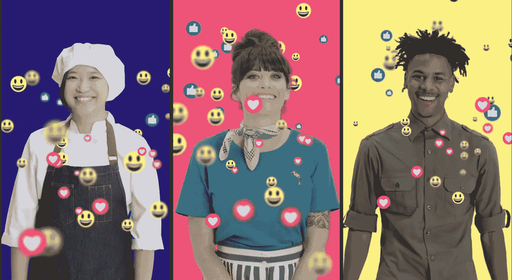

# 小企业无法在社交媒体上竞争。我们已经建立了一个人工智能解决方案来解决这个问题

> 原文：<https://medium.com/hackernoon/small-business-cant-compete-on-social-media-we-ve-built-an-a-i-solution-to-fix-that-ad777d84905a>

人工智能和社交媒体是当今最强大的两项技术。人工智能为日益复杂的任务带来了机器学习的力量，社交媒体将碎片化世界的人们联系在一起。

# 在不久的将来，每一个都会对市场营销和我们整个社会产生深远的影响。这就是为什么我创立了 Sensai，这是一个面向小企业和创意人员的人工智能社交媒体营销平台。

我们的目标是为企业提供强大的社交媒体营销解决方案，提供有价值的见解，帮助他们在不断变化的社交媒体环境中更好地接触目标受众。

将我带到 Sensai 的道路是曲折的(我已经在三个大陆上帮助建立了公司)，非传统的(我从一名环境律师到一名职业运动员到大型媒体公司的商业领袖再到一名科技企业家)，以及基于机会的(我以创造新市场为荣)。

> 在我与底特律的小企业、非营利组织和创造者一起工作的时候，我看到他们正在努力在复杂的社交媒体营销世界中导航。

当他们与预算庞大的主要品牌争夺注意力时，他们意识到社交媒体不是他们期望的公平竞争环境*。这主要是因为主要平台的货币化导致了有机增长和曝光率的下降。*

这正是我创立 Sensai 的原因:

## 帮助资源短缺的人和组织在社交媒体上获得成功。

# **社交媒体:过去与现在**

最初，社交媒体平台是一个新的媒体和营销前沿，大品牌和初出茅庐的创作者都可以与他们的客户、投资者、捐赠者、顾客、合作伙伴和其他利益相关者进行互动。

我一直很喜欢社交媒体作为营销渠道和沟通媒介的这一点。

但随着付费广告和推广帖子的出现，我看到社交媒体变成了另一个空间，让大型企业品牌用它们的信息淹没人们，就像过去的电视和时尚杂志一样。

> 一旦主要的社交媒体平台开始积极推进提高盈利能力，在社交媒体上获得曝光*需要*为赞助内容付费。

这不仅是因为赞助帖子获得了付费曝光，还因为平台算法有意减少了品牌和公司通过发帖获得的有机曝光。

所以我开始着手改变现状。

# **开拓有机社交范围**

我想帮助小企业和创意人员重获社交媒体曾经提供的力量。

> 这些是我大半辈子都深深投入其中的社区，无论是职业上还是通过倡导和行动主义。

在 MTV Networks 学习大型媒体和娱乐行业多年后，我努力与独立艺术家和创意人员分享这些知识。

例如，在[西南偏南(SXSW)](https://www.sxsw.com/) 媒体和音乐节上，我作为顾问帮助确保独立创意者的声音被听到。

当我在一体化流媒体服务和社交网络 [Bebo](https://bebo.com/) 担任音乐和内容全球副总裁时，我的任务是帮助音乐人与全球在线观众建立联系。

作为开发主要社交媒体平台的早期先驱之一，我获得了宝贵的见解，这些见解已用于建立 Sensai，以确保我们可以一起超越。

正如我提到的，在底特律，我投入了大量资金和个人，帮助小企业、非营利组织和音乐人在这座城市的市中心取得成功。

所以 Sensai 在任何意义上都是一个激情项目。

# **突破噪音**

我相信小企业和创意者有值得倾听的重要信息和声音。

但是他们被淹没了。

在与严重依赖社交媒体作为营销渠道的音乐人合作时，我亲眼目睹了社交媒体平台算法变化的影响。当发行新单曲或宣布巡演时，他们使用社交媒体来增加流量和销售门票。但是在过去的几年里，他们注意到它不再那么有效了。

当然，他们并不孤单。

> 小企业、艺术家、运动员和非营利组织都看到社交媒体成为越来越难以掌握的营销渠道。

这种越来越难以接近是一个主要问题，因为根据我们最近对小企业的全国调查，57%的人认为社交媒体是他们最重要的渠道之一。

我们的目标是赋予这些越来越得不到充分服务的群体权利。最重要的是，我们希望他们知道，通过正确的方法，有机地发展社交媒体受众仍然有巨大的价值。

# **触及正确的受众，每一次**

本质上，我们帮助企业在复杂的、算法驱动的社交媒体世界中导航，并提供实用的指导。

## 我们喜欢称我们的方法为“增强智能”

这真正意味着我们利用我们专有的人工智能和我们的人类专家团队为客户提供万全之策和商业见解，因此忙碌的人不必成为算法专家也能获得成功。

我们利用人工智能的力量来“倾听”社交媒体:人们参与了什么，他们在社交媒体上的行为如何，他们的触发点在哪里(换句话说，他们回应了什么词和话题)。我们利用人的力量来帮助我们的客户破译数据在说什么。

> 如果没有像 Sensai 这样的人工智能解决方案，获得这些数据驱动的见解需要庞大而昂贵的分析团队和多种企业解决方案。

当然，这是麦当劳、耐克和 North Face 对待社交媒体的方式。但是，小企业几乎没有资源来雇佣大型分析或社交媒体团队，许可昂贵的技术或每月在赞助帖子后面投入数千美元。

然而，通过机器学习和人工智能，我们现在能够让更多的组织和企业采用类似的方法。

我相信这是目前最强大、最实惠的社交媒体营销解决方案。我对我们完整的[自助照明解决方案](https://trysensai.com/agency/)感到特别兴奋，我们通过开发人工智能增强的广告购买，在有机增长方面取得了成功。

我们在今年早些时候推出了测试版，我们的客户——从著名的非营利环保组织 Surfrider 基金会，到厨师 Nyesha Arrington，到传奇人物杜兰·杜兰，再到 29，000 个小组织和艺术家——给了我们很好的反馈。

> “我已经使用 Sensai 获得了关于发布时间、最佳使用渠道以及哪些关注者值得被认可的战略建议。森赛就像是在另一个办公室工作的乐于助人的同事！”-凯蒂·克拉斯纳，杜兰·杜兰杰出的社交媒体经理

我们衡量了他们的成功:

事实上，我们活跃的[专业级客户](https://trysensai.com/small-business/)比没有使用我们指导的类似客户的粉丝增长速度快了 198%。

此外，我相信 Sensai 将为任何准备采取下一步行动的中小型组织带来社交媒体营销的变革。

## 既然你坚持到了最后，这就是你的奖励:一个月的免费专业服务(价值 99 美元)，促销代码 ThankYou18。请[访问我们](https://www.getsensai.com/)并在结账时使用该代码。