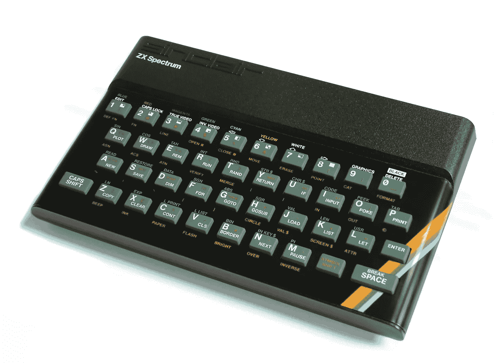
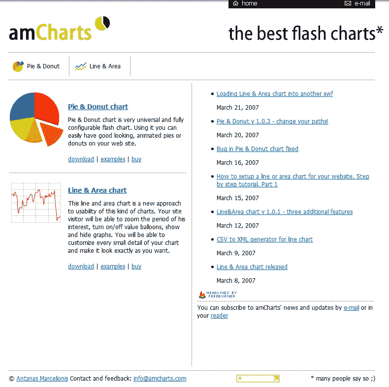
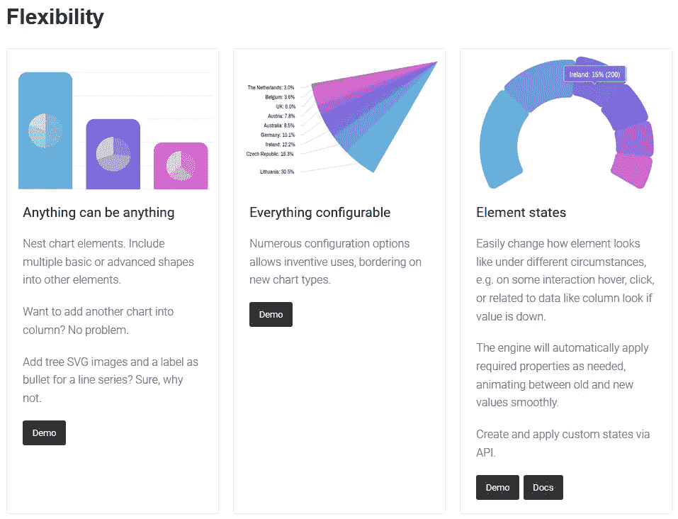
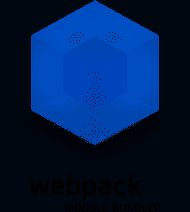

# 小团队，大成功。第 1 部分:amCharts 正在构建 Web 数据可视化的未来

> 原文：<https://medium.com/hackernoon/small-team-big-success-part-1-amcharts-is-building-the-future-of-data-visualization-on-the-web-7a88ac6147a2>

Martynas Majeris (left) and Antanas Marcelionis (right)

在过去的 5 年里，我一直梦想着开一个播客，在那里我会采访那些成功的独立开发者，他们仍然决定保持小规模和节俭，而不是拍摄一些想象中的明星，只是因为我们的社会认为这是“正确的”方式。为什么在创造了一个成功的“独立”产品后，开发人员会决定将自由和快乐置于管理成千上万人的机会之上，这是一个我感兴趣并喜欢探索的问题。

由于过去涉足播客，我不愿意再做了——准备、应付会议、制作等等。工作量很大。此外，可能没有人想听纯音频形式的我的东欧口音，我没有时间或决心去尝试改变它:)

所以，我最终决定做一系列书面采访，而不是播客。今天我们有这个系列的第一集。谁应该是第一个对我来说一直是一个不需要思考的问题——我认识安塔纳斯·马塞廖尼斯和马蒂纳斯·马杰里斯已经很多年了。我亲眼目睹了挑战“硅谷模式”的成功，这是一个很好的例子。他们在 Flash 中建立了一个领先的图表库，然后在技术景观突然转移到他们下面时重复了他们的成功。现在[他们已经发布了 v4](https://www.amcharts.com/v4/) ，这看起来像是产品历史上又一个伟大的里程碑。

所以，我得到了做这个系列的最后推动力，我们在这里…

> **免责声明**:正如我上面提到的，我认识安塔纳斯和马丁纳斯已经有一段时间了。自 2008 年以来，我们一直是几项业务的合作伙伴，我一直是扩展后的 [amCharts](https://hackernoon.com/tagged/amcharts) 团队中断断续续的一员。所以，我很难不带偏见。话虽如此，但这可能会对这次面试产生相反的影响(相对于无耻的赞美)，因为我试图避开与我们的私人关系有关的有争议的话题。

# 请告诉我们一些关于你自己的情况，以及你是如何开始从事 amCharts 的工作的？

## 安塔纳斯·马塞利奥尼

ZX Spectrum ([image by Bill Bertram](https://commons.wikimedia.org/wiki/File:ZXSpectrum48k.jpg))

从我还是个孩子的时候起，我就发现了几乎所有的商业机会，并探索了很多机会。做生意的主要原因是为了赚钱买一台电脑。我甚至试着自己造一个，但是不太顺利。所以，我帮助父亲种植郁金香，用我们在市场上卖郁金香赚来的钱，我买了我的第一台电脑。那是辛克莱·ZX 的光谱。我想那时我大约 13 岁。

后来，我有了一台 IBM 个人电脑，然后连上了互联网。从那以后，我所做的一切都与互联网有关。我甚至帮助人们，主要是美国人，有偿寻找在立陶宛的亲戚(即使基本上是在电话簿上查找有姓氏的人)。

amCharts website circa 2007

我已经在 Geocities 上建立了我的第一个主页，然后开始为一些公司提供网页设计服务。我一直为自己工作，开了又关(或离开)了 3 家网页设计公司，直到 27 岁。在这段时间里，我并没有积极地编程，只是偶尔为之(主要是因为我没有接受过任何编程教育)。我离开上一家公司的时候，并不清楚自己下一步要做什么，碰巧我们与马丁纳斯和艾伦租了同一个办公室。我在做一些自由职业者的工作，我需要画几次图表。所以，我想如果我能创建一个绘制图表的工具，我的生活会变得更简单。从那时起，我开始更认真地编写代码，并成为一个相当令人讨厌的同事，因为我问了很多关于编程的问题。事情就这样发生了，我制作的第一个图表(当然是饼状图)在日本变得相当流行！

当人们开始购买许可证时，我向办公室的同事承诺，在购买更贵类型的许可证的那天，我会去买披萨。很快我们就再也看不到披萨了。

正如他们所说，剩下的就是历史了，从那以后(2006 年),我开始全职制作图表。

## 马蒂纳斯·马杰里斯

自从大约 30 年前我妈妈带回一台 IBM PS/2，我的生活就有了一条清晰的道路。从十几岁时第一次涉足编程，到全面的 IT 相关工作，直到我在当地的一家开发公司、纽约的一家共同拥有的网络咨询公司、一些个人项目和自 2006 年 amCharts 成立以来的兼职之间周旋。

在某个时候，在这么多事情之间分配注意力的负担变得陈旧了，五年前，我放弃了其他一切，专注于 amCharts。从那以后，我一直负责开发的某些部分，管理支持团队，管理销售和网络运营。你典型的 COE(万物之主)。随着团队的成长，当我们开始开发 v4 时，我能够承担更多的开发责任——这正是我一直想要的。

## 保罗·查普曼

我一直是个极客，我第一次使用电脑是在我 8 岁的时候，我立刻就被吸引住了。我 16 岁开始编程，只是为了好玩。一个朋友教了我基础，但之后我就完全自学了。从那时起，我已经从事编程工作超过 11 年，并且我已经学习了许多编程语言。

我需要一份兼职工作，不幸的是，兼职编程工作非常少，但 amCharts 有一个兼职支持人员的空缺。我在这方面做了几年，离开几年去做一个非 amCharts 的副业项目，然后回来做 amCharts 的程序员。

我的主要职责是处理底层基础设施:工具、实用程序、库，将 V4 与其他技术(Angular、React 等)集成。).除此之外，我还提供建议，处理其他需要做的事情。我很高兴为 amCharts 工作，我与马丁纳斯和安塔纳斯相处得很好。

# 在看到最初的成功后，你为什么决定保持小规模？

## 安塔纳斯

很可能是因为我们都是内向的人，我们目前的员工 100%在家工作——我和 Martynas 在立陶宛维尔纽斯的家庭办公室工作，Paul 在夏威夷工作，我们的支持团队分散在世界各地——我们有一个人在巴厘岛冲浪累了的时候提供支持。我退出自己的网站开发公司的主要原因是，我厌倦了与人正式沟通和管理。现在，当一家投资公司的某个戴着领带、看起来很重要的人说，他们想投资 amCharts，并将帮助我们建立一家“正常的”、更有价值的公司时，我不断提醒自己，我已经努力做一个正常人了。我不喜欢这样。

## 马丁纳斯

这些年来，我们多次面临这种选择，但每次都放弃了。我们已经享受了太多，为了更多的钱而心甘情愿地放弃我们的自由。做大意味着接受外部资本，对某人负责，将我们自己的责任从开发转移到管理。呸:)

我们有时会在闲聊中用 5 分钟左右的时间做出重大的商业决策，然后在接下来的一个小时内付诸实施。只是想象一下，在一个以不惜一切代价追求增长为导向、风投支持的公司里，它会如何走向衰落，这让我很吃惊:)

我们还有一个理念，那就是我们为开发者工作。这意味着一切——许可、安装、功能、支持——对开发者来说都是有意义的。如果有什么不一样，我们可以心血来潮改变它，而不用长时间思考这会如何影响增长或收入流。

接受风险投资，壮大团队，需要我们将重心转向取悦投资者——增加收入。两者兼而有之——让投资者满意，并养活庞大的团队。这不可避免地导致决策更偏向于增长，而不是开发社区的常识。

因此，保持小规模，除了我们的用户——开发者——没有人需要负责，这在 10 年前对我们来说是最有意义的，现在仍然如此。

# 安塔纳斯，你曾经是一名 Flash/ActionScript 开发人员，7 年前用 amCharts 的 v2 过渡到 JavaScript。这个转变困难吗？

## 安塔纳斯

事实并非如此，ActionScript 与 [JavaScript](https://hackernoon.com/tagged/javascript) 非常相似。我记得我从为 Flex 制作的图表中复制粘贴了很多代码，只修复了一些小的差异。我在 JavaScript 中错过的主要东西是类，当然还有类型安全编程。

## 马丁纳斯

第一反应是“哦，不，你在做什么，史蒂夫？你要杀了飞侠，我们得从头开始。一旦最初的反应过去，我们很快就将它视为一个机会，既可以重写和改进我们的产品，又可以领先于我们(当时)“疲软”的竞争对手。

# 当时的网络平台准备好复制你用 Flash 能做的事情了吗？

## 安塔纳斯

现在和那时的唯一区别是，现在人们不期望一个库能与不支持 SVG 的旧 IE 浏览器一起工作。我们的 v3 可以使用 SVG 和 VML(IE8 和更早版本支持的矢量格式)来呈现，这导致了很多问题，因为 VML 比 SVG 更不灵活。今天的 SVG 和 7 年前一样，所以现在一切皆有可能，那时也一样。嗯，电脑和浏览器变得更快了，所以你可以做一些更花哨的效果，不用太担心性能。有了 SVG，你可以做任何你可以用 Flash 做的事情。唯一的问题是，你经常需要投入更多的时间——Flash 提供了许多现成的东西，而且你不必担心浏览器的差异。

## 马丁纳斯

是的。在那之前就准备好了。这个行业只是需要一个来自苹果的推动。我们从笨重的、专有的、基于插件的 Flash 过渡到了开放的、基于标准的 JavaScript 和 SVG。可能发生的最好的事情。

# 在 v4 中，您切换到使用 TypeScript 进行开发。是什么促使了这个决定？

## 马丁纳斯

我们需要升级我们的游戏。我们需要做一些灵活的、可扩展的事情。这是现代 web 开发人员乐于接受的。它与当前的框架和技术兼容。我们需要模块，我们需要类型检查和错误处理，我们需要我们的东西与 ide 兼容。普通的 JavaScript 并不适合，而 [TypeScript](http://www.typescriptlang.org/) 是*事实上的*标准。我们做过的最简单的决定。

## 安塔纳斯

当 TypeScript 的第一个版本公开发布时，我试用了它，我很喜欢它，因为我说过我非常缺少 ActionScript 的严格类型、类和其他东西。甚至第一个版本也有我期望的大部分东西。我在 2015 年用 TypeScript 1.5 写了 amCharts V4 的第一行。现在是 Typescript 2.9 开发团队一直在改进这种语言(并让我们多次重写代码，但并不后悔)。

# 你考虑过其他选择吗？

## 马丁纳斯

只是短暂的。有很多选择，有些可能在某些任务上比 TS 更好。但坦率地说，有了 TS 背后的所有力量，以及社区中的整体接受度，这是一个显而易见的事情。

## 安塔纳斯

一个朋友向我推荐 Coffeescript，但我必须说我从未尝试过。事实上，像微软这样的公司用正确的哲学支持 TypeScript，这足以立刻扭转局势。在我们开始 v4 的工作期间，谷歌宣布他们将在 Angular 中使用 TypeScript，所以感觉我们做出了正确的选择，没有理由再“货比三家”了。

## 保罗

当时最大的替代就是流量，也挺好的。但是最终 TypeScript 更受欢迎的事实(并且在 Angular 之类的东西中获得了牵引力)使它成为一个更有吸引力的选择。

# 在 v4 上工作了几年之后，我们终于可以[看到结果](http://www.amcharts.com/v4/)，它们是惊人的。恭喜你！你认为你选择 TypeScript 的决定是值得的吗？

## 马丁纳斯

现在数鸭子还为时过早，因为我们还没有看到切换到 TypeScript 的商业影响。然而，从事情的发展方面来看，它肯定是有回报的。如果没有强大的类型检查，我们现在可能还在追踪奇怪的 bugs)

## 安塔纳斯

我肯定是的。我们已经花了 3 年时间开发 V4，如果没有严格类型、所有重构可能性和 TS 提供的所有其他好东西，我担心我们可能会花两倍的钱。我甚至不愿意去想如果没有这些，我们会留下多少虫子。

## 保罗

起初我对 TypeScript 持怀疑态度(当时 Flow 有更好的特性)，但是随着时间的推移，TypeScript 增加了 Flow 的所有特性(甚至更多！)，所以我认为 TypeScript 绝对是正确的决定。

# 显然，你对自己选择使用 TypeScript 的决定很满意，但是在这个过程中你一定遇到了一些障碍，或者你希望将来在 TypeScript 中看到一些东西…

## 马丁纳斯

我对 TypeScript 最大的不满是它需要编译，而且那里有三种编译器。它们都有自己的复杂性、缺点、缺陷和巨大的学习曲线，这看起来就像是火箭科学管理一个巨大的项目。我数不清我们遇到编译障碍的次数。对于试图进入 TS dev 的人来说，这可能是一个严重的负担(直到你很好地开始之前，这个负担可能并不突出)。

## 保罗

我们在 TypeScript 上遇到了许多小问题(并提交了一些错误报告)，但总的来说，我们能够解决所有问题。我认为我们的独特情况(我们正在提供一个庞大而复杂的库，我们还需要担心与 JavaScript 用户的兼容性)使事情变得更具挑战性:我认为应用程序开发人员在 TypeScript 方面的问题会少得多。

# 除了 TypeScript 之外，你还对 v4 做了其他的技术改变吗？

## 马丁纳斯

我们不能谈论 v4 和旧版本之间的“变化”，因为它是一个全新的 dataviz 库。从零开始想象和完成。也就是说，我对我们做出的一些概念性决定感到特别自豪。其中一个特别的例子就是我们所说的“国家”。这是一种动态改变或逐渐过渡的方式。任何设置、数据、属性。引擎会自动处理。例如，我们可以说这个列现在将有不同的值和颜色，它将神奇地发生，逐渐过渡到一个新值并改变颜色。它如此强大又如此自然，仍然让我起鸡皮疙瘩:)

## 安塔纳斯

开发 v4 时，我们从构建核心开始。我喜欢 ActionScript，所以很多核心的东西都是按照我记忆中 Flash 和 Flex 的方式完成的。我们甚至称我们的主要可见对象为 Sprite(我希望 Adobe 不会因此起诉我们:)。因此，这个核心可以做任何事情——在舞台上展示对象，制作动画，交互，改变状态，过滤，进行数学，数字，字符串和日期格式化，处理数据——构建任何类型的 SVG 项目所需的一切，并且您确实可以独立于图表使用它。当内核准备就绪时，我们使用它构建图表，同时改进内核以满足我们的需求。我们的图表是以一种让用户控制一切的方式构建的——访问每个精灵，更改任何属性，添加交互。如果您是开发人员，您还可以扩展我们的图表类，构建您自己的新图表类型，或者添加一些不受开箱即用支持的内容。而且，由于我们有一个非常好的核心和非常灵活的类来构建图表，我们计划很快添加许多有趣的图表类型。

From the amCharts v4 website

## 保罗

除了 TypeScript，我们现在还正式支持 npm、Webpack、Angular、React 等。因为 V4 是从零开始重写的，所以我们能够确保它与现代 JavaScript 工具和生态系统配合得很好。

# 在一个小团队中开发 amCharts 时，你的工具箱包括哪些部分？

## 马丁纳斯

90%的工作发生在[崇高文本 3](https://www.sublimetext.com/) 。剩下的就是一堆其他的东西:Git、Node、Webpack/Rollup、Selenium 和……Spotify:)

## 安塔纳斯

同事们都叫我“艺术家”，因为我其实不太在乎“美码”。我制造有用的东西，做我需要的事情，但不在乎我是怎么做到的。一年左右的时间里，我独自开发 v4，用我需要的主要东西构建了核心的早期原型。后来，Martynas 和 Paul 加入了我的团队，他们几乎重写了所有的代码，这样代码就能满足质量标准，速度快，文档完整。目前，我更专注于开发产品的图表部分，他们仍然每天都在改进核心部分。我认为这种方法对我们非常有效，因为完美主义的开发人员无法完成他们的产品是很常见的，因为他们陷入了完善代码的困境，不允许自己在代码方面犯一些小错误，因为那样就不完美了。我没有这样的约束。

至于工具，除了 Sublime 之外，我还大量使用纸和铅笔——绘制图表需要解决大量的几何问题，所以我在纸上画东西，并在那里写一些数学。幸运的是，几何是我在学校最喜欢的科目之一。

## 保罗

是的，那当然是真的，有许多日常犯下的小“罪行”，哈哈。但总的来说，我认为代码现在处于一个很好的位置。

我们使用普通的 TypeScript 编译器(tsc)进行翻译，它对我们的 ES6 和 TypeScript 用户来说工作得很好。至于我们的 JavaScript 用户，我们用 [Webpack](https://webpack.js.org/) 预捆绑一切，因为它对代码拆分和动态加载有很大的支持，提高了启动性能。

至于个人工具，我不用什么花哨的，就用 Sublime Text 3 和一个主机。我已经写了一堆自定义脚本，这些脚本自动完成 amCharts 的各种事情(构建、测试、发布等)。)

成为一名程序员有点独特，因为你真的不需要太多:即使你没有钱，你仍然可以成为一名顶级程序员，因为所有的工具都是免费或便宜的。

# 作为一个远程团队，您如何保持流程正常运行？你用什么工具和套路？

## 马丁纳斯

我们基本上生活在懈怠中。在此之前，我们尝试了许多解决方案，如 Basecamp，甚至简单的 Skype。没有卡住。现在，团队的所有成员——开发、支持、销售，甚至兼职助手——都在懈怠。

Git 在版本控制和问题跟踪方面做得非常好。很自然。

构建过程都是自动化的(感谢 Paul 对完美和自动化的非凡热爱；).

# amCharts 对于 web 开发者来说是一个非常成功的库，无论是在思想分享和好评方面，还是在商业上。你对那些想把职业和业务集中在网络空间的有抱负的开发者(和企业家)有什么建议吗？

## 马丁纳斯

这看起来像是直接从励志海报上摘下来的，但是无论你做什么，确保你喜欢做。无聊的东西很快就会变旧，变得无人问津。没有必要把你的时间浪费在一次性的东西上。如果这看起来像是工作，我们绝对不可能在 10 多年后还在做这件事。

## 安塔纳斯

耐心点。我们花了 3 年时间开发 v4。做了这么长时间，没有机会享受成果，真的是一件很难的事情。

## 保罗

有句话说，掌握一件事需要 10 年。我认为这是真的，所以你需要长期参与其中。如果你期待立竿见影的效果，那么你只会失望。

—

查看 amCharts 网站并在[推特](https://twitter.com/amcharts)上关注他们。