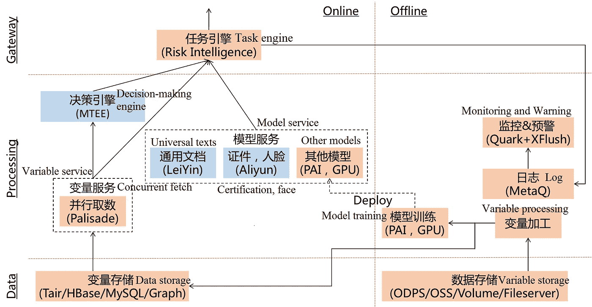
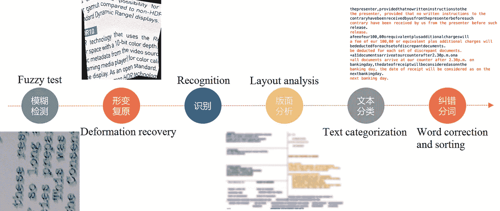
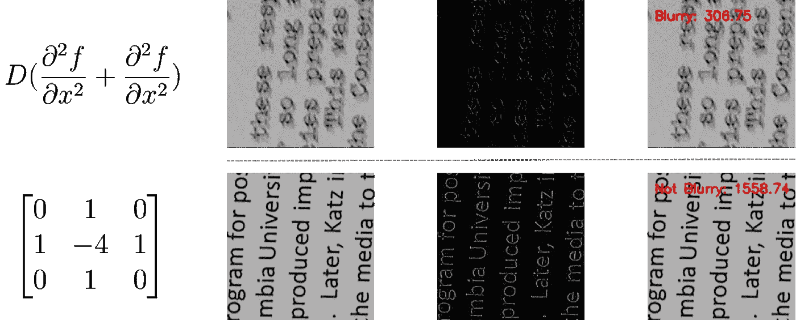
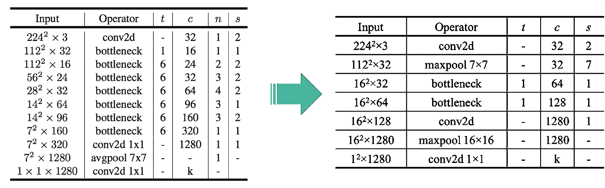
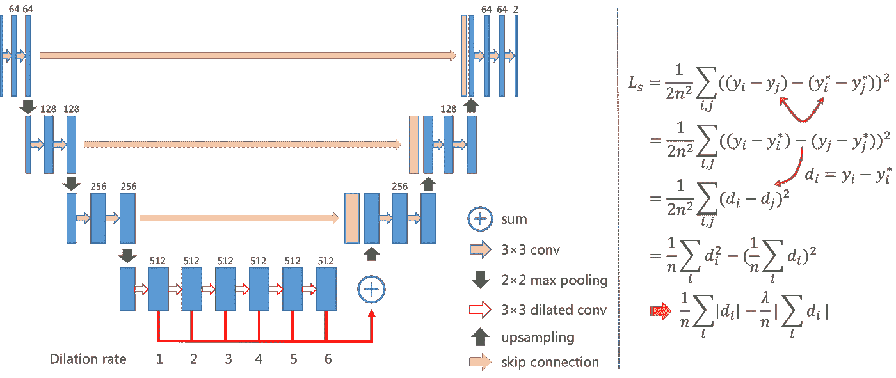
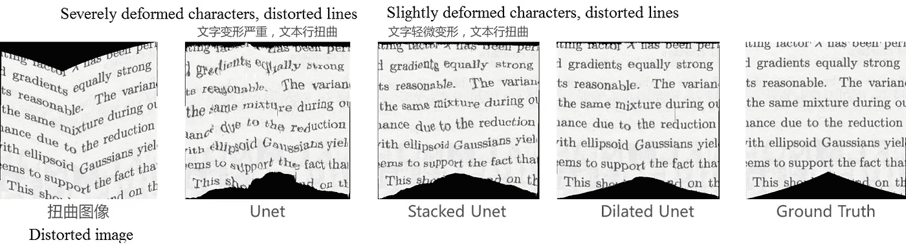
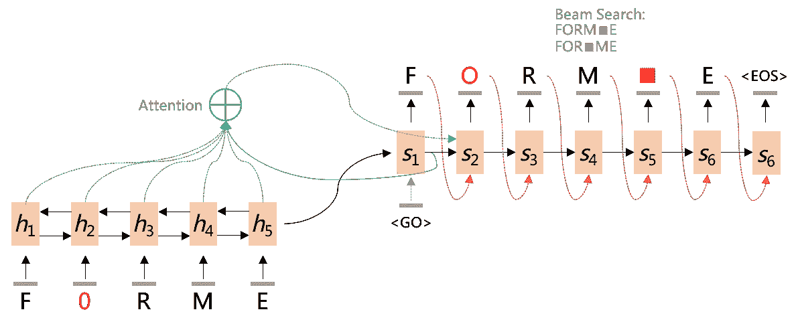
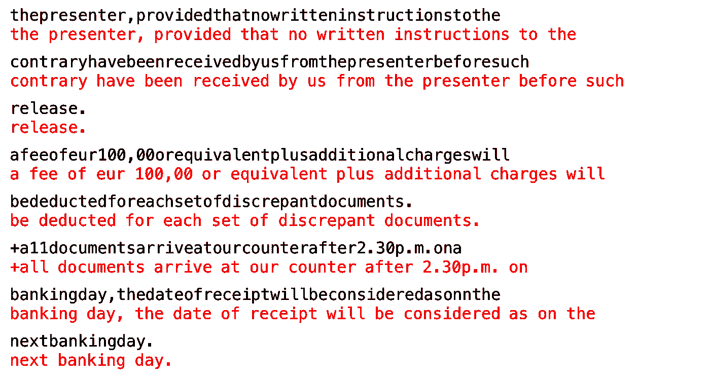
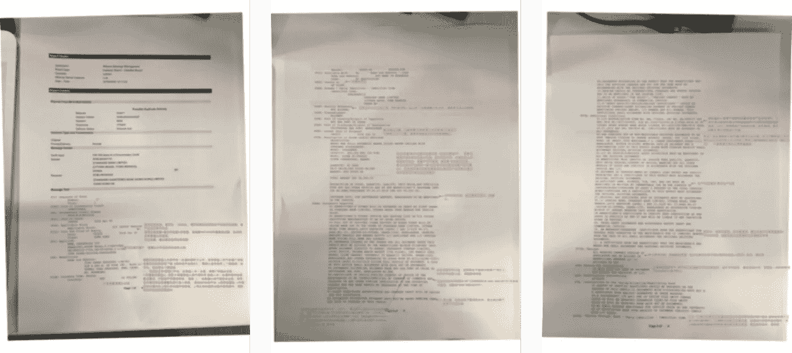
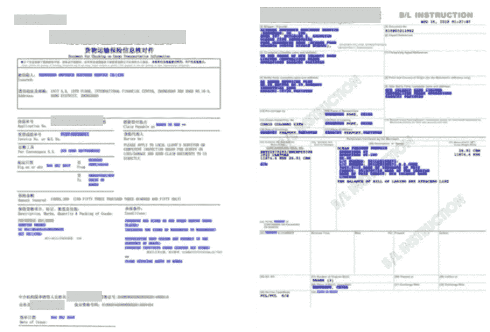

# 智能审计:在国际贸易中使用人工智能

> 原文：<https://medium.com/hackernoon/smart-audit-using-ai-in-international-trade-21a7bb21b57f>

智能人工智能应用程序可以帮助企业审计复杂的国际贸易文件，大大有利于工作效率和风险控制。

单据是国际贸易的重要组成部分，也是出了名的复杂。对于经常处理大量扫描图像等格式文档的交易人员来说，这决定了他们有效处理关键信息和控制风险的能力。现在，借助智能审计技术，即使是从皱巴巴的文件中也能处理信息，阿里巴巴正在展示人工智能解决方案如何提高效率，减少国际贸易中的痛点。

# 背景

国际贸易是一套复杂的程序，尤其是 B2B 贸易。为了控制风险，在每一步都要实施多个文档的交叉验证和基于文档的风险控制策略。示例包括公司信息和银行账户的交叉验证、与信用证、提单、保险单、装箱单、发票和海关申报单相关的风险审计。

考虑信用证的例子。对于这种类型的单据，必须审核各种条款，单据必须相互一致，并符合信用证的条款。这个过程通常由技术高超、经验丰富的人来完成。

这种漫长而充满风险的审计过程是阿里巴巴智能审计技术发展的主要驱动力。智能审计使用机器学习和人工智能，以更高效、成本更低、风险更小的方式处理文档。

这种技术的好处很多。智能审计通过提供订单决策报告、条款/信用/贸易风险报告以及准备和审计文件的解决方案，服务于更多的国际贸易中小企业。此外，它利用人工智能技术降低成本和风险，提高效率和客户体验，推动核心电子商务的优化和升级。

# 解决办法

总体技术方案抽象为四个部分:图像处理、自然语言处理、领域知识图、统一技术架构。

## *阿里巴巴智能审计解决方案的主要组件。*

**图像处理服务**

> 模糊测试
> 
> 变形恢复
> 
> 文档、卡片、面部识别
> 
> 布局分析

**自然语言处理**

> 文本分类(包括噪音)
> 
> 单词校正和排序
> 
> 文本解析，KV 分类
> 
> 语义理解

**领域知识图**

> 领域知识:术语，港口，货物描述
> 
> 专家策略:条款和条件、融资
> 
> 风险地图:国家、银行、地区、企业

**统一的技术架构**

> 利用、创新、横向扩展
> 
> 数据存储、决策引擎、模型服务
> 
> 监控和警告

## 图像处理

当图像质量较好时，现有的图像识别技术可以达到较高的准确率。不幸的是，情况并非总是如此。图像通常更复杂，直接回忆现有技术仅在不到 50%的情况下有效。此外，常见的识别技术理解能力较弱。例如，即使 OCR 识别出失真图像上的字符，它也不能组织它们来传递正确的语义；也无法分析判断图像的哪些部分是有用的。

因此，除了利用阿里巴巴的识别技术，图像处理的更大挑战是如何正确地预处理和后处理图像，以满足特定的需求。

## 自然语言处理

由于文档的格式多种多样，并且其中一半以上是图像，最好的 OCR 解决方案也无法将错误识别率保持在 10%以下。因此，需要一个健壮的文本分类模型。还有，如果没有特定领域的优化和分词，即使是低频率的错误字符识别也不能保证直接阅读和无人使用。

这意味着基于领域知识的单词校正和分割是至关重要的。然后通过解析引擎进行内容解析和键值关系重构，结合基于文本的领域知识图和风险控制策略，完成语义理解和智能审计。

## 领域知识图

这里构建的知识图主要从三个领域积累知识:领域知识、专家策略和风险图。领域知识包括国际贸易中常用的术语、缩写和港口信息。专家策略包括期限策略、冲突策略、融资策略和审计意见。风险地图包括国家、银行、地区和企业的信息。

领域知识图是智能审计的基础。所有先进的处理流程都是为了与 it 结合，实现真正意义上的智能审计和风险控制。

## 统一技术架构

统一的技术架构是从现有方法中抽象出来的。首先，所有的服务接口都聚集在统一的任务引擎下。接下来的工作是最大限度地利用阿里巴巴现有的技术和平台，如雷音(OCR 技术)、阿里云(证书和人脸识别)、MTEE(实时决策引擎)和 PAI(模型训练和部署平台)，等等。

The various online and offline technologies and platforms that are incorporated into Smart Audit

一旦这些技术和平台被整合，人们的努力将集中在更深入地挖掘算法和模型，以针对具体问题制定出创造性的解决方案。

# 算法

本文介绍的一些创新算法和模型主要是关于图像处理和自然语言处理。它包括模糊检测、去扭曲以及单词校正和分段。

The creative algorithms and models used in Smart Audit

## 模糊检测

模糊检测或图像质量评估旨在以快速、轻量的方式达到目标。如果图像质量良好，这可能意味着智能处理，或者提示重新上传并手动处理。

许多传统的解决方案可以处理特定类型的模糊性。一个例子是拉普拉斯算法，其基于通过计算二阶导数和方差获得的阈值来确定图像是否模糊。

The Laplacian algorithm determines whether an image is blurred or not

然而，传统的解决方案在特征提取和表示方面效果不佳。为了克服这种限制，本文提出了一种改进的 MobileNetV2 网络结构。模糊检测需要特别注意图像细节之间的细微差别。因此，首先使用随机切片和 HSV 颜色空间筛选生成一组样本，然后根据 OCR 识别率划分正负样本。

最初的 MobileNetV2 网络包含 17 个瓶颈层，每一层都进一步向外扩展。这个模型很大，在训练阶段很难收敛。它因此被剪裁并改进成一个新的架构，在一个更浅更窄的网络中，只包含两个卷积层、两个池层、两个瓶颈层和一个全连接层，并且具有更少的参数。

在最新一轮测试中，该算法的准确率约为 93.4%。原始模型的大小只有 2 MB。相比之下，使用原始 MobileNetV2 模型训练的模型大约为 26 MB。

Layers of the blur detection model

## 解除警戒

图像可能会以多种方式扭曲，如旋转、折叠和卷曲。这些问题不仅影响 OCR 识别，更糟糕的是，还影响语义理解。图像去扭曲是达到自动审计阶段的关键。许多传统方法可以解决特定的翘曲问题。例如，霍夫变换可用于检测直线，并将图像旋转正确的角度。

近年来，深度学习模型，如 FCN、STN 和 Unet，也被用于处理图像失真。结合语义分割的知识，Alibaba 在改进现有方法的基础上提出了一种新的去扭曲算法。

首先，使用数据合成技术创建样本。不同形式的

用于模拟多种变形类型，例如具有折叠线和卷曲曲线的图像；并通过以下方式模拟不同程度的变形

尺寸变化。然后应用插值和图像修补方法来填充模拟图像的缺失像素。

Process of data synthesis

使用现有的基于堆叠 Unet 的方法会导致裂缝、文本行扭曲、字符严重变形等问题。阿里巴巴团队对基于扩张卷积的网络结构进行了改进，通过调整损失函数和平滑预测，提出了一种新的解卷积方法。

Unwarping method in Smart Audit

度量 MS-SSIM(多尺度结构相似性)用于评估去扭曲算法的效果。阿里巴巴提出的算法的 MS-SSIM 是 0.693，与之前最先进的 0.490 相比，这是一个明显的进步。

Examples of unwarping algorithms

## 单词校正和分段

直接将单词校正与分段相结合的 HMM 模型在由于长文本而导致的预测阶段的大搜索空间方面效率不高。因此，阿里巴巴从一个新的角度解决了这个问题:分词被视为单词校正的特例，空白也被视为有效字符；纠正被视为一项翻译任务，将错误的字符序列翻译成正确的字符序列。这样，单词校正和分段被抽象成一个序列到序列的过程。

Word correction and segmentation using Seq2Seq

数据合成(基于概率转移矩阵添加、删除和修改字符)和转移学习用于训练和获得目标模型。目前，OCR 识别结果和地面真相之间的错误率(编辑距离)为 15.91%(如果忽略空白，则为 2.91%)。应用新的校正和切分模型，错误率降低到 2.24%，单词准确率提高到 93.56%。

*Example of word correction and segmentation*

# 应用程序

凡是应用智能审计的地方，工作效率至少提高 50%，成本和风险大大降低。本节描述两个真实场景中的应用示例。

## 审计信用证

在本例中，用户上传拍摄或扫描的 LC 文件。在一系列图像处理和自然语言处理程序之后，Smart Audit 会审查每个术语，标记风险信息，并返回审查和决策报告。

*Example of document audit*

## 核实文件

用户上传照片或扫描文件(如保险单、提单、报关单)。Smart Audit 解析并验证每个字段，用不同颜色标记信息(紫色表示一致性，黄色表示可疑信息，红色表示缺失信息)，并返回验证和建议报告。

# 结论

本文概述了智能审计的业务背景和技术解决方案，描述了一些已实现的和创新的算法和模型，以及几个应用。智能审计作为一种新的国际贸易模式，利用机器学习和人工智能技术提供风险和决策报告，以及整体解决方案。它还推动实施其他技术(如区块链技术)，以便在国际贸易中更好地为更多的中小企业服务。

# 阿里巴巴科技

关于阿里巴巴最新技术的第一手深度资料→脸书: [**“阿里巴巴科技”**](http://www.facebook.com/AlibabaTechnology) 。推特: [**【阿里巴巴技术】**](https://twitter.com/AliTech2017) 。