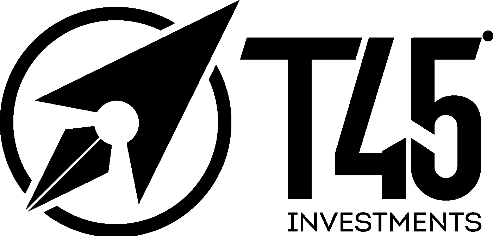

# 基于智能区块链的服务

> 原文：<https://medium.com/hackernoon/smart-blockchain-based-service-66b423110c5>

## 最近，数百个使用区块链技术的项目被创造出来。他们中的一些人建议为以太购买小猫，其他人是一些可疑项目的象征，其产品只存在于其白皮书中。还有一些人呼吁购买所有现有的加密货币，承诺一个月内 1000%的利润。每个人都想分一杯羹，做一个 ICO，拿一大笔钱“用于一个项目的开发”

T45 投资公司采取了不同的方式。凭借在交易所超过 15 年的专业交易经验，我们发现在这个领域使用[区块链](https://hackernoon.com/tagged/blockchain)技术是非常值得的。该公司将市场趋势的基本面分析和全球金融市场的真实交易融合在一个区块链的基准系统中。产品已准备就绪，工作正常。它是 S 简报，每个 S 简报都是对关键新闻的简短总结，评估它们在项目团队开发的系统中过去 4 小时内对市场和给定资产的影响，以及与时间戳和交易价格相关联的真实交易。这确保了系统性能的可信度和公众可获得性。

要成为会员并获得每年至少 20%的回报，您需要订阅并通过 S BRIEFs 进行交易。其中一个主要特点是，该公司不进行任何管理，认购者的交易资金仍由认购者自己控制。然而，他们在一个共同的策略下团结起来——简报、交易时间表和执行纪律。

其结果是一个基于区块链的项目，形成了一个聪明人的社区，不仅跟随信号，而且明智地导航。这是一场真正的交易革命，没有 ICO 或其他骗局。

渠道:[@ t45 投资](http://twitter.com/t45investments)

聊天: [@t45investmentschat_e](http://twitter.com/t45investmentschat_e) ng

更多关于 T45 投资:[https://goo.gl/8WsQR](https://goo.gl/8WsQR8)8