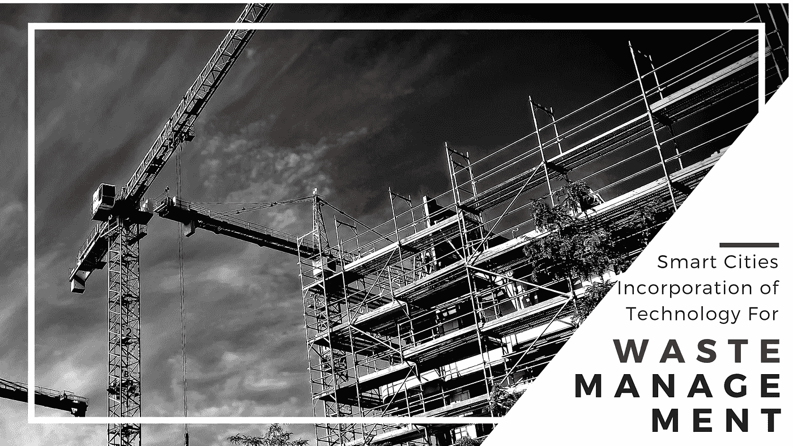
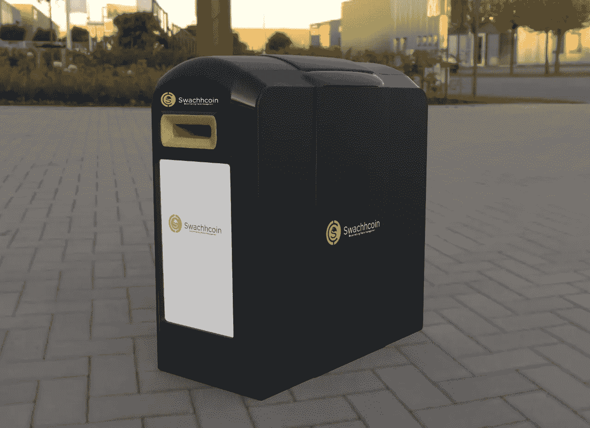

# 智能城市整合废物管理技术

> 原文：<https://medium.com/hackernoon/smart-cities-incorporation-of-technology-for-waste-management-a8ebf22f5>

## **简介**

根据定义，智慧城市是指利用技术和数据创造更高效的结果、改善所有部门的可持续性、促进广泛的经济发展并为提高该城市居民和工作人员的生活条件做出贡献的城市。利用技术来实现这些目的涵盖了广泛的部门，从卫生部门到教育部门，甚至城市中的废物管理。

技术极大地降低了当前废物管理系统的成本和复杂性，从而提高了它们的效率、安全性和生产率，同时也减少了它们对环境的影响。因此，本文旨在分析将技术整合到智能城市垃圾管理系统中的不同方式，以取得更好的效果。

www.swachhcoin.com

## **废物管理技术**

废物管理的复杂性比以前更加突出。世界各地的公民产生了越来越多的垃圾，这导致了一个重大的挑战，即如何成功地处理废物而不使个人面临重大的健康问题。具体而言，废物收集是废物管理的一个组成部分，是任何城市的一项基本服务，现有的系统可以通过使用智能技术来大大改善，以提高效率，并改善废物收集过程的质量。

为了应对这些挑战并解决垃圾填埋废物以及其他危险废物对环境的不利影响，全球废物管理行业正在重新思考不同的策略。其中一些策略包括使用技术进行运营分析和路线优化，因为这可以在很大程度上实现可持续发展目标，并降低运营成本。

此外，它们还在改变处理废物和废物处置的方式，以提高效率和加强环境保护。

因此，技术工具被用于这些目的的一些主要领域包括

## **1。自动化废物收集**

随着自动传感器的引入，每当容器装满并需要维修时，自动传感器就会触发自动警报，技术已经影响了废物管理的工作。事实上，一些其他工具，如先进的磁盘屏幕和光学分拣机已被引入，使分拣过程更容易和更快。

此外，用于废物收集的卡车现在使用天然气，而不是柴油，这样更安静，更具成本效益。此外，物流软件、移动应用程序和车载监视器简化了废物管理流程，同时也确保了驾驶员的安全。

## **2。提高回收率**

目前，废物管理公司和回收公司正在努力改进他们的技术和工具。单流回收最近有了进展，人们可以把所有的垃圾都倒进一个垃圾桶里。这有助于减轻人们的分类负担，也影响了回收利用率。此外，它还有助于减少卡车数量和排放。

## **3。路线优化**

路线优化在保护环境和减少有害排放方面非常重要，这也是公司投资先进系统和优化软件的原因。这些公司现在正在使用自动卡车，这些卡车已经安装了机械臂，可以节省正常路线上的精力和时间。它使得从一个地方到另一个地方的皮卡相当环保。这项技术在经济上也相当可行，而且还提高了能源效率。

## **4。垃圾填埋场的现代化**

通过利用技术的力量，废物管理行业成功地实现了垃圾场的现代化。完全符合相关法规的系统设计的垃圾填埋场确保全面保护健康和环境。此外，与地膜结合在一起的太阳能电池板系统的使用为可持续能源的生产提供了必要的支持，也防止了碳回到环境中。

## **5。更快的周转期**

一些废物管理公司也开始投资技术，为客户提供更好的客户体验。这些公司正在投资开发用户友好的移动应用，这样他们就可以通过推送通知促进更快的服务交付，甚至是账单支付。

## **6。废物转化为能源**

这是技术被用于改变智能国家废物管理公司运营的核心方式之一。它们可以被转化为能源，而不是把特定类型的废物留在垃圾填埋场。为此，有一种新的创新机器叫做消化器。沼气池可以将废物和产生的沼气转化为可在现场有效利用的能源。它可以用于不同类别的废物，如农业剩余物、食物、动物粪便等。

另一种用于废物转化的创新技术叫做热转化。这有助于将废物转化为特定的产品。通过利用从自然地热过程中获得的线索，利用热量和压力将无用的材料转化为具有相关用途的产品。

它可用于将废料转化为肥料、化学品、油以及其他重要的转化产品。更好的是，某些种类的垃圾填埋气体也可以转化为能源。在这种情况下，相关气体将是那些燃烧或释放的气体，它们可以通过使用某些新的创新技术转化为能量。这种技术的例子有微型涡轮机技术、生物反应器和燃料电池。

# **交换仓—交换仓**

SwBin 是 Swachhcoin 平台的一个创新设备，可以自主维持生态系统，同时还保留其核心的基本管理和工作原则。这种工具具有许多传统废物管理系统中没有的一些最具革命性的功能。这些功能包括:

## 1.Dapp 支持

## 2.启用物联网支持

## 3.自动开闭盖

## 4.LED 广告牌

## 5.源头垃圾分类

## 6.废物压缩

## 7.唯一用户标识

SwBin 的所有这些创新功能有助于促进更好的废物管理活动，因此是全世界所有智能城市的理想选择。

> 注意:谨防骗子。始终用 Swachhcoin 验证你的沟通渠道。骗子可能会试图冒充球队官员。永远相信 www.swachhcoin.com[上的信息和链接。骗子也可能试图使用相似的域名进行诈骗。时刻保持警惕。如果你注意到一些可疑的事情，请将同样的事情通知我们 info@swachhcoin.com](http://www.swachhcoin.com)

## 在此加入我们的社区:

[Official Telegram Discussion Group](https://t.me/swachhcoin)

[Twitter Channel](https://twitter.com/@swachhcoin)

[Facebook FanPage](https://www.facebook.com/swachhcoinofficial/)

[Swachhcoin Subreddit](https://www.reddit.com/r/swachhcoin/)