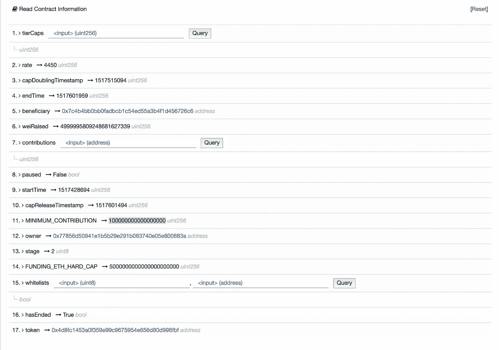

# 智能合同基本分析

> 原文：<https://medium.com/hackernoon/smart-contract-analysis-part-1-5e54e52498ed>

Photo by William Bout

区块链初创公司正在使用初始**或**报价来筹集资金和获得社区支持。想要支持项目的社区成员或投资者将 Ether/ETH 发送到给定的智能合约地址，作为回报，他们会立即收到自定义令牌，或者在 [ICO](https://hackernoon.com/tagged/ico) 事件结束后的某个时间收到令牌。****

让我们后退一步:就像任何其他投资一样，大多数社区成员在投资前都会做一些功课。许多网站、博客和博客作者在 ICO 活动前分享他们诚实的分析，做得非常出色。

我坚信投资前的最后几个分析步骤之一应该是分析 ICO 和令牌生成智能合约。这将真正给予社区对项目团队所做承诺的信心。

> **智能合同**是一种计算机协议，旨在以数字方式促进、验证或执行**合同**的协商或履行。**智能合约**允许在没有第三方的情况下执行可信交易。”[ [1](https://en.wikipedia.org/wiki/Smart_contract)

正如我在上一篇关于 ICO 最佳实践的文章中提到的，我真的希望鼓励 ICO 管理团队至少在 ICO 活动开始前几个小时发布这些带有源代码的合同，最好使用 ENS 而不是合同地址。

在这个骗子横行的时代，从社区的角度来看，这将让我们有足够的时间来再次检查智能合同是否真实，以及它是否在做它应该做的事情。

我想分享一些如何从智能合约中读取基本信息的技巧。做基本的智能合同分析，你不需要成为一名程序员。为了让它对更广泛的读者有用，我将尽量不要跳到代码中——至少在本系列的第 1 部分中不会。

让我们开始吧！

# **代币合同分析**

我们可以很容易地阅读一些关于基于 ERC20 的令牌的基本信息。

> 以太币令牌标准( **ERC20** )用于[以太币](https://hackernoon.com/tagged/ethereum)智能合约。于 2015 年开发的 **ERC20** 定义了以太坊令牌必须实现的通用规则列表。让开发人员能够对新令牌在以太坊生态系统中的功能进行编程"[[2](https://en.wikipedia.org/wiki/ERC20)]

所以我们以蜜蜂令牌为例:

打开[以太扫描](https://etherscan.io)。io 网站，在右上角搜索栏中搜索并选择 BEE

或者

点击此链接[蜜蜂令牌合约](https://etherscan.io/token/0x4d8fc1453a0f359e99c9675954e656d80d996fbf#readContract)

对于新令牌，您可能无法按符号搜索令牌，但可以按 ICO 管理团队提供的令牌地址进行搜索。

快速浏览“阅读智能合同标签”下提供的基本信息

Snapshot of BEE token contract via etherscan

将其与 ICO 团队提供的信息进行比较。

你一定注意到了数字“T4”2。> totalSupply - > 5 &零串":)。这是因为 value 支持 18 位小数。1 BEE = 1 x 10 的 18 次方。

您也可以查看“令牌持有者”选项卡，该选项卡将列出令牌持有者的地址。您也许能够检查在售前或私下销售期间已经转移了多少令牌——假设令牌是在 ICO 之前转移给他们。

对于大多数基于 ERC20 的令牌，您应该能够看到此类信息。

# ICO 合同分析

据我所知 ICO 智能合约还没有标准。ICO 管理团队成员可以自由设计和选择他们希望通过提供合同 **A** 应用程序**B**inary**I**interface-ABI 公开的信息。

现在让我们看看我们的示例 [BEE ICO 智能合约](https://etherscan.io/address/0x62caf75a67252f7be236a7335fed1410c7434b7f#readContract)并分析可用的信息

Snapshot of BEE ICO contract “Read Contract Tab”

选择“阅读合同信息”标签，就可以了！。大多数分享的信息都是自我描述的。给定的令牌地址编号为“17”—与我们在上一节中分析的令牌地址相同。14 岁时戴硬帽。最小贡献值在第 11 位—这是在 ETH。

记住 **1 ETH = 10 的 18 次方魏**。

这意味着最小贡献被设置为 0.1 ETH。

做得好的 ICO 合同还允许用户使用 etherscan 的“查询”功能查询更多信息。我就让你去探索那部分:)。

击掌！现在，您知道了如何探索智能合约并进行一些基本分析。