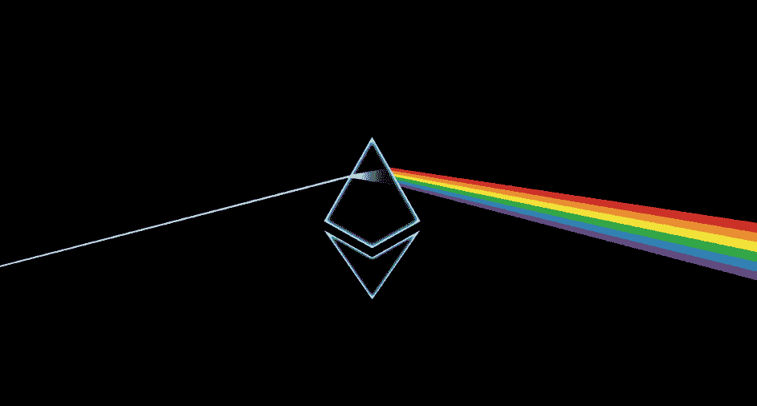
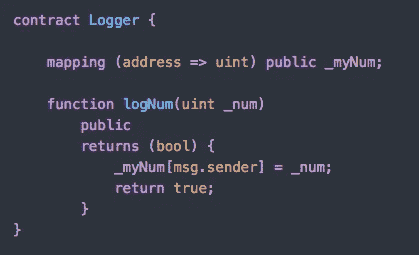
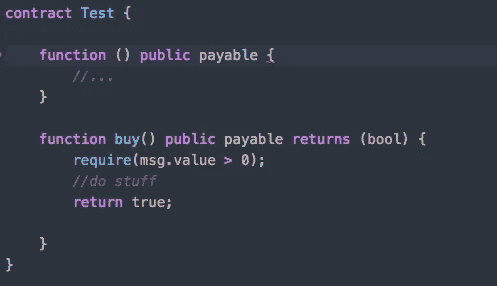
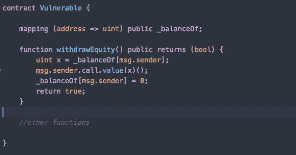
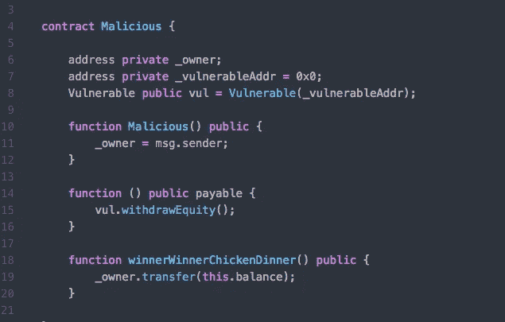
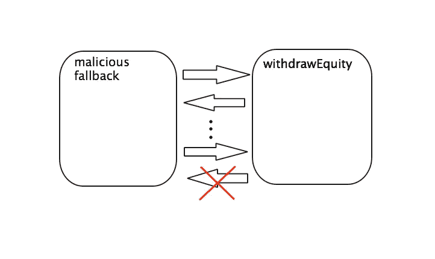

# 智能合约安全性:第 1 部分重入攻击

> 原文：<https://medium.com/hackernoon/smart-contract-security-part-1-reentrancy-attacks-ddb3b2429302>

以太坊是目前最大的两种加密货币之一，市值超过 600 亿美元，每天处理 60 多万笔交易。使用其图灵完备的高级编程语言 Solidity，人们每天都在构建智能合约。已经有大量的应用程序在主网络上运行，从令牌系统到钱包、对冲合约、彩票等等。哪里涉及金钱，哪里就有恶意的行为者。



智能合约一旦在区块链上部署，就不能再更改。这就是它们被称为“不可变”的原因。因此，遵循一些基本的安全准则，在部署之前做大量的测试，并尽可能保持代码的简单性是非常重要的。

在这一系列文章中，我将尝试解释一些我所理解的常见漏洞，并提供由专家撰写的材料供进一步研究。

我们先简单解释一下 [***调用***](https://ethereum.stackexchange.com/questions/8270/what-does-soliditys-call-function-mean) 函数是如何工作的。它用于调用另一个或同一契约的函数，并向其传输数据和/或以太网。在异常情况下它不会抛出，它只是返回 *false -* 否则返回 *true* 。*调用*触发代码执行，并为此花费所有可用的 gas。这就是问题开始的地方，稍后您将会看到。让我们看看这在实践中是如何工作的

我将使用这个简单的日志契约，它包含一个任何人都可以调用的 *logNum* 函数。它将一个整数作为参数，并使用 *_myNum* 映射将该数字映射/记录到您的地址。



现在假设，在我正在构建的另一个契约中，我想调用这个 *logNum* 函数，并将数字 10 传递给它。使用*调用*的语法是:

```
addressOfLogger.call(bytes4(sha3("logNum(uint256)")), 10);
```

call 方法内部的 4 个字节作为一个**哈希签名**，用来指向我们要调用的函数。实际上， *logNum* 的 hash 的前 4 个字节与 call 方法的 hash 相匹配，这个函数是用值 10 作为参数来调用的。

您也可以使用*调用*方法发送乙醚。让我们使用这个简单的测试契约来理解如何实现。这个由两个函数组成。*购买*应付的函数(接受魏)和 [*回退*](https://ethereum.stackexchange.com/questions/7570/whats-a-fallback-function-when-using-address-send) 的方法。



您可以使用*调用*方法，从您自己的合同中与*购买*功能进行交互，并向其转账，几乎与我们在上面使用的方式相同。你只需要知道测试合同的地址。在这种情况下，您可以写:

```
addressOfTest.call.value(amount)(bytes4(sha3("buy()")));
```

如果你想把以太转移到*回退*方法，你应该写:

```
addressOfTest.call.value(amount)(); //the parenthesis is empty
```

事实上，*调用*方法在没有 gas 限制的情况下触发代码执行，[除非您手动设置一个](https://consensys.github.io/smart-contract-best-practices/recommendations/#be-aware-of-the-tradeoffs-between-send-transfer-and-callvalue)，这使得**容易受到重入攻击**。这在过去导致了巨大的财务损失(DAO hack ~ 70M 万美元/2016 年 6 月)。


# 重入攻击

下面的合同将用于详细分析这种攻击。想象它代表一个钱包契约。你可以把乙醚送去储存在那里。的映射平衡将您的地址映射到您在此钱包中存储的乙醚量(单位为魏)。提款权功能允许任何使用钱包的人提取他们的余额。这就是不好的事情发生的地方。



正如我们前面看到的， *withdrawEquity* 中的 *call* 语句调用 *msg.sender 的* fallback 函数，以便将 wei 发送给他。事情是…它没有气体限制，所以这个回退函数中的任何代码都将被执行(只要有剩余气体用于这个目的)。现在，恶意参与者可以部署如下所示的智能合约:



让我们检查一下这个。在构造函数中有一个私有地址 *_owner* 被初始化。它在构造函数内部启动，并指示谁是契约的所有者/谁部署了它。另一个地址是易受攻击的钱包的地址(这里为了简单起见，我使用 0x0)。然后，创建了该契约的一个实例，我们差不多完成了。

如果坏人把魏发过来，从恶意契约到钱包再调用他的*回退*函数，怪事就发生了。当他调用该函数时，调用 *withdrawEquity* 函数(第 15 行)。

在 withdrawEquity 中，require 语句中的*调用*方法包含一个没有 gas 限制的空签名

```
msg.sender.call.value(x)()
```

因此，它调用恶意契约的回退方法，除非它失败(在失败的情况下，事务被恢复)。

```
vul.withdrawEquity();
```

这是对提款权函数**的再次调用**。实际上，坏人的合约接收以太，然后再次调用 withdrawEquity()。由于第一份合同的状态没有改变(攻击者的余额还没有被设置为零)，他再次获得报酬。一次又一次…直到执行耗尽或达到调用堆栈限制。



因此，如果调用了 10 次 withdrawEquity，那么只有最后一次调用会失败，因为调用不会传播异常，只有对/错，所以只有最后一次调用的执行会被恢复。这意味着恶意的家伙得到了 x9 倍的报酬，而不是 1。从这个角度来看，有人可以先储存 2 个乙醚，然后再得到 18 个乙醚。然后用 18 乙醚做同样的事情，以此类推…

# 如何避免这种情况

*   *transfer()* 和 *send()* 对可重入攻击是安全的，因为它们将代码执行限制在 2300 gas，目前足以记录日志和事件。
*   如果无法避免使用 *call()* 在使用外部调用之前，一定要做好内部工作(例如更改余额)。
*   一般来说，请记住，任何运行外部代码的函数都是一种威胁。

# **用于进一步学习的文档和资源**

1.  [坚固性文件](http://solidity.readthedocs.io/en/latest/security-considerations.html)
2.  [Consensys 智能合同安全性最佳实践](https://consensys.github.io/smart-contract-best-practices/)
3.  [维塔利科的安全系统](https://blog.ethereum.org/2016/06/19/thinking-smart-contract-security/)
4.  [以太坊智能合约攻击调查](https://eprint.iacr.org/2016/1007.pdf)
5.  [如何编写安全的智能合约-chriseth](http://chriseth.github.io/notes/talks/safe_solidity/#/)
6.  保护隐私的智能合同