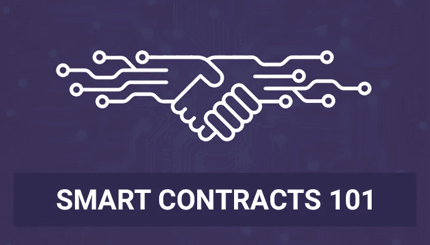

# 智能合同 101:释放区块链的力量

> 原文：<https://medium.com/hackernoon/smart-contracts-101-unleashing-the-power-of-blockchain-348a742d2a23>

像区块链行业的许多想法一样，一个普遍的困惑笼罩着“智能合同”这个术语。

Smart Contracts 101

区块链为我们提供了分布式可信存储，智能合约则为我们提供了分布式可信计算。他们买下了世界目前运作方式的巨大变化。

那么，什么是智能合约呢？

智能合同是一种虚拟协议，在特定条件下，直接控制签署合同的各方之间的资产或数字货币的转移。

准确地说，智能合约是自动执行的合约，它可以帮助你在一个无冲突、透明的区块链网络中交换任何有价值的东西。它们安全、数字化、高效，消除了中间人。

一个[智能合同](https://solidity.readthedocs.io/en/v0.4.24/introduction-to-smart-contracts.html)运行在区块链网络之上，因此它们存储在一个公共数据库中，不能被更改。签订合同的双方同意遵守一套规则。如果满足这些预定义的规则，协议将自动执行。此外，智能合同具有法律约束力和安全性。

好吧，如果你还在使用老派的方法来绑定协议，那么现在是时候转换到一个安全、高效和透明的网络了。

像纸质合同或数字合同这样的老一套方法对你来说弊大于利。纸质合同涉及多轮谈判、几个中间人和漫长的管理过程。然而，数字合同很容易伪造，尽管它们是纸质合同的快速替代品。

那么，有出路吗？

是的。唯一的出路是使用基于区块链的智能合约。

这些智能合约基本上是用 Solidity 编写的独立脚本，Solidity 是一种面向合约的编程语言。这些代码被编译成 JSON 或二进制格式，然后部署到区块链网络中的特定地址。

然而，设计和编写智能合约是一个复杂的过程。智能合约开发涉及多个步骤。所以，当你决定迁移到智能合同时，你需要雇佣最好的 [**智能合同开发者**](https://www.goodfirms.co/directory/services/list-blockchain-technology-companies/smart-contract-development) 。

## **智能合约的属性:**

智能合约开发人员在部署智能合约时关注六个属性:

1.  **协议识别** -为所有相关方寻找合作机会。还包括潜在的权利转让条款和交换资产的条件。
2.  **设置条件** -设置发生自然灾害或死亡等事件触发时的资产配置条件。
3.  **编码业务逻辑**——满足一定条件时触发的全自动逻辑代码。
4.  **数字签名** -当需要发放支付或验证消息时，为所有相关方设置数字签名。
5.  **执行流程** -在认证和验证之后，智能合同处于执行流程中，记录结果以供审计和合规。
6.  **更新网络** -执行智能合同后，每个分布式分类帐节点以相同的状态更新。此后，只有新的更新可以添加到合同中。

## **智能合约如何工作？**

1.  **协议**

该协议基本上具备了签约双方约定的所有条款。现在，这份协议还包括决定利润如何分配的条款，以及如果企业遭受任何损失，双方承担的百分比。现在，这些类型的条件被提出，双方以数字方式签署合同。

**2。定义协议**

智能契约是用人类可读的代码行定义的。该准则包含协议的所有结果和条件。一般来说，开发一种算法，以便定义何时以及为什么一个案例可以是真实的，以及应该如何发放付款。之后，一个软件将代码转换成二进制格式供机器翻译。

**3。排除第三方**

智能合约也称为自动执行合约，因为它不涉及第三方。智能合同被编程为一旦满足所有必要条件，合同就会自动执行。

## **为什么您应该转向智能合约？**

企业正在转向智能合同，因为它们提供了许多优于传统合同的优势。以下是智能合约提供的核心优势:

*   确定性:智能合同是用密码写成的，没有任何含糊和不一致的地方。
*   **安全性:**编码到区块链网络中的智能合同是安全的，因为智能合同被加密和分发。
*   自动化:这些智能合约准确而安全。它消除了等待时间的需要，并提供即时结果。整个过程是自动化的。
*   不可变的:智能合同永远不会被篡改或破坏，因此，本质上，它是不可变的
*   **成本:**由于没有人工参与，因此没有运营或记录成本。因此，智能合同具有成本效益。
*   **保证结果:**智能合同有可能显著减少诉讼和法庭的需求
*   **透明度:**合同的条款和条件对所有相关方都是完全可见和可访问的。
*   处理速度:智能合同运行在自动化流程上，在大多数情况下，消除了人工参与。这提高了合同中规定的交易速度。
*   **分发:**合同的结果由所有相关方验证，类似于基于区块链的交易。
*   **欺诈检测:**合同按时间顺序保存，每个记录都经过验证，因此不存在欺诈或[数据窃取](https://www.ibm.com/blogs/blockchain/2017/07/blockchain-for-fraud-prevention-industry-use-cases/)。

## **总结一下**:

智能合约的应用不仅仅局限于金融领域。实际上，每个行业，无论是房地产、供应链管理、医疗保健、保险、教育部门，电子商务都可以使用智能合同开展业务。可能性是无限的。

尽管它们相对较新，但企业正在慢慢地逐渐适应智能合同。它们承诺安全性、准确性、标准化、经济性、速度、独立性、信任度、数据存储和节省。

除此之外，智能合同是自我验证、自我执行和防篡改的。他们还能够实时跟踪性能。

简而言之，智能合同收紧了现有流程的束缚，并允许更多的自主权。