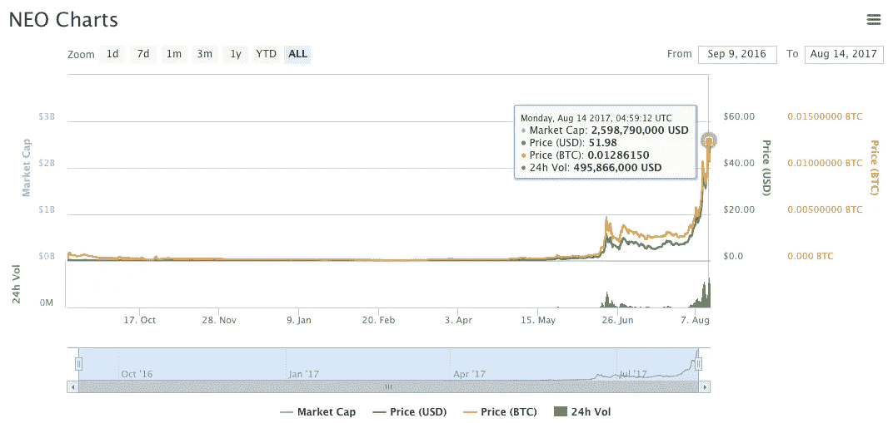

# 智能合同——省时入门

> 原文：<https://medium.com/hackernoon/smart-contracts-a-time-saving-primer-b3060e3e5667>

智能合约是一个有趣的概念，可以很容易地彻底改变世界每天进行成千上万笔交易的方式。毫不夸张地说，这无疑是很多领域的突破，而且不仅仅是简单的法律问题。

我们来了解一下原因。

从基础开始，让我们首先了解智能合约对我们有什么意义，以及它们与通常的合约有什么不同。

智能合同类似于普通合同，只是它是智能的。这不是那种需要律师(在这个特定的例子中)或第三方参与的传统合同，在一张纸上列出所有条件，并期望与你交易的另一方遵守所有指示。显然，如果一切顺利，没有“其他”政党腐败，那么你就会得到结果——在这种情况下，你需要聘请律师来拯救你。

让我们通过一个更好的例子来阐述这样一个场景:

假设你想从展厅买一辆车。所以陈列室就是这里的卖家。现在，在你和卖方之间有一笔交易要做，一份合同要做，合同中要有所有关于要支付的钱，贷款金额，保险细节和其他法律问题的说明。因此，这自然会引入其他第三方，如保险代理人、提供贷款的银行等。如果他们中的任何一方试图违反合同，你显然会陷入麻烦，然后你必须联系律师来解决问题，使法律命令发挥作用。即使一切顺利，你也必须在结算、文书工作上投入大量时间，而且一定比例的资金也会交给这些第三方。

这就是智能合约的优势所在。

# 聪明的合同！

智能合同是可编程的代码，包含由开发人员编码的涉及合同细节的所有规则和条例。他们使用 IFTTT 逻辑(If-This-Then-than 逻辑)，其中指令按顺序列出，并以自动方式执行，强制执行所有承诺。智能合约是在以太坊(稍后会详细介绍)环境中完成事情的方式。当一个人想要完成某项任务时，他们会在以太坊环境中与一个或多个人建立智能契约。智能合约可以被认为是一个指令列表，用编程语言“Solidity”编写。

智能合约帮助你处理任何有价值的东西，如股票、财产、服务、金钱等。没有中间实体的干涉。

智能合同的整个概念是由 Nick Szabo(计算机科学家和密码学家)在 1993 年首先提出的。在他通俗的解释中，他将智能合约程序比作自动售货机，用户可以投入金钱，按下按钮，然后接收他们的东西(在这种情况下是实物)，如薯片或苏打水。因此，这里需要确定一些步骤。除非你按下按钮，否则你不会从机器上收到任何东西，除非你先付款，否则你无法成功地按下按钮。他用这个简单的类比来说明智能合约也以类似的方式运作。基本上，如果第一组指令成功执行，则执行下一个函数，之后执行下一个函数，重复这个过程，直到契约最终结束。

但是，这不仅仅是它。最精彩的部分？智能合约基于区块链技术。让我们看看那是什么。

**© draglet.com**

# 区块链技术

区块链技术是如此巨大和惊人，以至于被视为下一个大事件。它类似于互联网，人们通过网络连接，他们所有的数据都是在线处理的，所有的东西都存储在网络服务器上，其他公司的云(当然是第三方！).在区块链技术中，几个节点(或计算机)连接在一个分散的分布式网络中。

(两方或多方之间)发生的每一笔交易都由网络中的所有节点进行验证。让我们更详细地了解一下:

什么是街区？

一个块仅仅是一个有限的事务集合，用一个加密代码存储在网络中。一个街区包含一定是在两方或多方之间发生的一些交易。一个区块中的每一笔交易都由区块链网络中的所有节点进行验证，并按时间顺序组合在一起，形成一个链。区块链技术由公共分类账组成，公共分类账是一种登记簿，在将所有交易细节添加到链中之前，所有节点都会记录并验证所有交易细节。

就此而言，在区块链环境中发生的每一个交易或变更都需要分布式共识才能被添加到链中。节点必须验证每个事务；之后创建该块，并按事务的时间顺序添加，以创建完美的区块链。

那么，它是如何按照时间顺序被链接起来的呢？

在多个节点的一个实例中可能会发生大量事务。因此，为了解决知道事务的正确时间顺序的问题，所有节点必须解决一个复杂的数学问题来计算块的加密代码。谁先解决了这个问题，谁就成为区块链的第一名，因为它在其他人之前做出了努力并利用计算能力解决了这个问题。此外，节点会因为验证其他节点的事务而获得激励(这就是它们这么做的原因！)并按时间顺序排列。当他们首先通过解决一个问题并在区块链中添加完美块来验证时，他们在这个过程中“挖掘”比特币(数字加密货币)。

那么，现在让我们了解一下智能合约在区块链环境中是如何运作的。

智能合约还通过区块链环境中的分布式共识进行验证，这意味着网络中见证智能合约执行的每个人都必须同意正在发生的事情，并同时将更改复制到他们的页面(这里是块)中。在智能合约中，有一些步骤编码在程序中，当初始步骤完成时，程序会自动执行。就像一个步骤执行时，每个节点会自动生成它的副本。例如，如果指令 1 在双方之间的契约中被执行，它将被通知给节点并被它们复制。然后，指令 2 发生，因此，另一个交易发生，完成了合同中的所有步骤。在每个步骤中，所有的更改都将被节点自动记录下来，并同时得到验证。这些节点/挖掘器验证在智能合约中发生的所有操作/交易，并且所有历史记录被记录并按照时间顺序存储在类似的块中，我们之前称之为区块链。因此，智能合约在区块链环境中发挥作用，因此不可能有欺诈活动，因为块中的每个加密代码都包含前一个块的“哈希”(加密代码)。前一个块的加密代码包含它前面的块的散列，以此类推。因此，黑客不可能破坏交易，因为它必须计算所有节点的哈希，这是不可能的。网络中的任何节点都不会变得欺诈。如果它没有正确地遵循契约指令，所有其他节点都会知道，因为它们会收到所有信息并验证这些步骤。合同将在任何违约或任何错误的情况下终止，这是智能合同的另一个优势。

**© attores.com**

# 智能合同的特征

让我们了解智能合约的一些关键特征，看看它们有多有用:

1.  如果需要，智能合约可以调用其他合约。这意味着，如果契约有两个部分，其中第一部分与检查需求有关，那么在条件得到验证之后，契约的第二部分(任务可能是执行事务)将接收第一部分的输出，并且事务将成功发生。
2.  智能合约充当需要多个签名的帐户。除非有足够数量的人签字，否则资金不会被转移。
3.  智能合约有助于管理两个或更多用户之间的协议，例如，如果一个人向另一个人出售保险。
4.  你不需要依靠任何中间人来执行或确认你的协议。这消除了第三方操纵的风险，因为执行是由网络以自动方式完成的。
5.  所有的文件都被加密在一个共享的账本里，所以没人能声称丢失了你的东西。
6.  区块链中的所有内容都有备份，因为所有节点都有一份备份，所以您不必担心数据丢失。
7.  智能合约是建立在区块链环境上的，所以一切都被很好地加密了，所以只有非常聪明的黑客才能篡改数据。
8.  智能合同节省您的时间，因为所有的任务都是自动化的，因为它们是用软件代码编写的。这也消除了文书工作和无休止的结算和其他法律。
9.  智能合同还能帮你省钱，因为由于区块链的环境，这里不需要支付中间人的费用。
10.  智能合同非常准确，因为它们是自动化的，这消除了在填写大量表格时可能出现的人为错误的可能性。

# 以太坊

现在，当我们读到比特币(一种数字货币)在区块链环境中用于执行交易时，它们更早用于基本的智能合约，涉及价值从一个节点转移到另一个节点。只有满足某些特定条件时，节点才会验证移动。但是，比特币仅限于货币使用的情况。这是一个几百行的限制性代码，主要处理货币交易。为了适应智能合约的各种规则和规定，使用了一个限制较少的平台，称为以太坊。它基本上是所有智能合约程序和应用程序的平台。它取代了比特币(限制性的)，允许开发者以“自治实体”的身份编写自己的智能合约程序。开发人员可以用来编写智能合同的编程语言被称为“图灵完备”，这意味着它支持更广泛的计算指令。

以太坊的目标是去中心化，并在某种程度上“民主化”现有的客户机-服务器模型。以太坊为智能合约的运行提供了一个平台，其中通常的互联网“服务器”或“云”被许多由来自世界各地的志愿者运行的“节点”所取代，从而创建了一个类似于互联网的“世界网络”。基本的想法是给用户自己完全的权力，而不是像其他公司服务器等依赖第三方。没有其他实体可以控制你的工作，这消除了第三方出错的可能性。你所做的每一个改变，比方说对你拥有的一个文档或者你在以太坊环境中工作的一个应用程序，都只能由你来做，你所做的任何编辑、保存或者删除，都会让网络上的所有其他节点在它们那端做出类似的改变。因此，你不必担心其他问题，如应用程序被禁止或损坏，由于一些技术故障和你丢失你的文件。此外，无论您在以太坊环境中做什么工作，都会反映在所有节点上，所以除了验证某些任务之外，您还有备份。

就像矿工在普通的区块链网络中获得比特币一样，在以太坊环境中，矿工赚取“醚”(货币)，或用于验证所有交易并维持合同顺畅流动和正确区块链的令牌。

比特币和以太坊的区别在于，以太坊节点关注每个智能合约的最新“状态”，并将其与智能合约中的所有代码、每个用户的账户余额和所有以太交易一起存储。

以比特币为例，剩下的钱数用来知道谁有多少数量的比特币。

每次交易发生时，网络都会分发总的比特币，就好像它只是实际的货币(实物)，以一种看起来像是实际硬币和纸币分红的方式返还比特币。

相比之下，以太坊利用账户。以太坊的行为就像一个银行账户，其中以太币存在于以太坊钱包中，可以转移到另一个账户中，从而改变账户的状态。

在以太坊中，每次一个程序被使用时，一个节点(计算机)网络就会处理它。由开发人员用编程语言‘Solidity’和‘Serpent’(人类容易理解)编写的智能合同代码被编译成‘字节码’，即 0 和 1 的组合(01101..)，它可以由以太坊环境中称为“以太坊虚拟机”(EVM)的运行时环境读取和执行。每个节点使用 EVMs 执行一个契约。

**© lightrains.com**

这里要理解的主要事情是，以太坊不只是像任何其他加密货币一样，它是一个完整的环境，其中任何人都可以利用区块链技术，并使用智能合约创建自己的 DAPPS(去中心化应用程序)。

# 智能合同应用程序

1.  通过智能合约进行医疗保健—我们可以使用智能合约来编码和存储个人健康报告，使用只有经过身份验证的人才能访问的私钥。可以存储各种医疗账单和收据，并根据智能合同指南直接发送给保险代理。
2.  音乐——与音乐产业相关的核心问题是版权、所有权、透明度和版税分配。智能合约可以通过创建一个分散的音乐版权数据库来解决这个问题。它将提供艺术家版税和实时分配的转移。音乐播放器将按照合同使用数字货币支付。
3.  投票系统——许多政府声称 EVMs(这里是电子投票机)在选举期间被篡改了。通过在区块链环境中启用投票系统，可以确保投票不会被黑客操纵。该系统将防止这种情况，因为投票将被加密，这也将节省大量资金。

# 一些不完美

让我们考虑智能合约可能出错的情况。

如果代码中有错误，或者任何列出的规则中有错误，该怎么办？开发人员也是人，人也会犯错，对吗？在这种情况下，智能合约仍然会以自动方式继续执行，这可能会导致一些不正确的交易。

如果有人发送了错误的代码，不正确的协议将继续执行，这是智能合约的一个严重缺陷。

此外，政府如何考虑对在区块链进行的交易征税？那确实需要考虑一下。

如果协议是以传统方式执行的，或者将要发生任何变化，例如延长某些提交的日期，那么与这些情况有关的任何问题都将在法院处理，有人指导如何纠正这种情况。但如果出现无法避免的问题，在区块链环境中是没有法院的。

与智能合约相关的未来需要考虑这些问题，并找出任何潜在的问题。

# 旁注:新中国对以太坊的竞争

NEO 以前被称为 Antshares，最近上涨了 376%。对于大约一个月前交易价格仅为 4-6 美元的加密货币来说，这是一个巨大的数字。NEO 是以太坊智能合约的迭代，使用独特的区块链算法，改进了以太坊当前的模型。NEO 填补了一些漏洞，这些漏洞使以太坊智能合约容易受到黑客的攻击，此外还提供了类似的基本功能，如去中心化商业和资产数字化。

让我们来看看这种加密货币的疯狂跳跃，它被认为是一个可以证明是下一个阿里巴巴的实体，以及它的创始人孙，下一个马云:

© highcharts.com | coinmarketcap.com

显然，以太坊给世界带来了革命性的未来技术，世界各地的创新正在与之竞争。最终，这项技术将会存在。合同现在已经过时了；智能合同形式的权力下放以完全自主的方式工作，消除了任何第三方(中央)干预的需要，这种权力下放正成为当务之急。

此外，与我们到目前为止投资的普通股票相比，加密货币汇率的深不可测行为显示了目前市场的波动性——也许直到监管机构开始出现并建立起来。但是，如果市场将由一个独立的机构来监管，难道它不会依靠集权来控制分权吗？这最终听起来是矛盾的，也是这个世界不应该诉诸的东西。

总之，中本聪给了世界一项如此超前的技术，以至于它注定会继续存在。 最重要的是，Vitalik Buterin 为我们提供了一种基于区块链技术的技术，这种技术进一步推动了加密货币和去中心化的发展，与比特币最初的内在价值相比，它为相关货币带来了更多的意义。

我有观点，但没有掌声。*你不喜欢我写的东西吗*😢*，还是你只是忘了鼓掌*🤔*？* ***不管是什么，请告诉我？*😌**