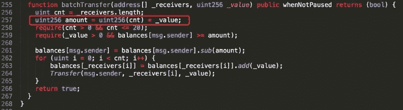

# 类固醇智能合约:解决以太坊稳固性面临的问题

> 原文：<https://medium.com/hackernoon/smart-contracts-on-steroids-solving-the-problems-facing-ethereums-solidity-a1f71cc260ce>

[flickr](https://www.flickr.com/photos/ethereumclassic/26834810469)

以太坊网络目前由超过 1700 个分散的应用程序组成，这个数字预计在未来几年还会增长。尽管所有这些 DApps 都依赖智能合约来完成许多重要任务，但很明显，智能合约容易出现错误、漏洞和其他灾难性错误，迄今为止，智能合约黑客窃取的金额超过 10 亿美元。

为了写一份智能合同，程序员必须学习一种全新的编程语言，叫做“[可靠性](https://en.wikipedia.org/wiki/Solidity)虽然智能合约有助于以太坊中的复杂操作，但在编写智能合约时犯简单的错误可能会导致可怕的后果，包括安全漏洞和/或非常高的交易成本。

一个最著名的[编码糟糕的智能契约](https://www.coindesk.com/understanding-dao-hack-journalists/)的例子来自分散自治组织(DAO)。最近在奇偶校验使用的[智能合约中也发现了一个错误](https://cryptovest.com/news/parity-was-warned-in-august-about-bug-that-froze-over-500-wallets/)，它被利用并导致了 50 万以太网(ETH)的损失，价值超过 1.69 亿美元。

**是稳健惹的祸吗？**

随着智能合约的问题变得越来越普遍，可靠性作为以太坊网络的一个问题引起了人们的关注。不幸的是，许多依赖智能合同的新项目缺乏具有适当优化和审计智能合同所需经验的程序员。

例如，在性能方面，在执行某些复杂的智能合同时，天然气费用可能是天文数字。“气体”是以太的一个标称单位，用于以太坊网络上的操作交易。这取决于智能合同的复杂性以及合同执行时网络的拥塞情况。以太坊自动惩罚缓慢而复杂的合同，理所当然地向他们收取很高的汽油费。但是，在许多情况下，用例本质上是复杂的，这样的天然气费用阻碍了智能合同的真正采用。

例如，使用以太坊智能合约来验证单个比特币交易的报头(即，scrypt 操作)将花费 3.7 亿以太坊气——按 3 Gwei 的气价计算，超过 10 亿 Gwei (1 ETH)。仅验证一次交易就需要大约 500 美元，这需要在 100 多次以太坊合约交易中完成。

在处理用 Solidity 编写的智能契约时，安全性，特别是整数溢出也是一个问题。黑客现在正在检测智能合同中的漏洞，使他们能够窃取大量的加密货币。这导致了高度的[安全警报](/@peckshield/alert-new-batchoverflow-bug-in-multiple-erc20-smart-contracts-cve-2018-10299-511067db6536)，因为多个 ERC20 令牌合同容易被黑客攻击。

许多这样的黑客攻击仅仅是由于程序员在 Solidity 中编写代码时所犯的错误。例如，[美妆连锁(BEC)](https://etherscan.io/token/0xc5d105e63711398af9bbff092d4b6769c82f793d) 在中国是一种备受瞩目的加密货币，于 2018 年 2 月 23 日在 OKeX 开始交易。它在交易的第一天飙升了 4000%。从其峰值市值约 700 亿美元(USD)开始，价格逐渐降至 4 月 22 日的 20 亿美元(USD)左右，当时其交易价值突然降至零。(OKEX 自[BECs](http://news.8btc.com/okex-suspend-bec-trading-due-to-irreversible-bug-in-smart-contract)停牌以来。)

这是由于 BEC 的 ERC20 智能合约中的一个错误造成的。在 BEC 的例子中，开发人员在合同中添加了一个名为“batchTransfer()”的方法。该方法旨在促进令牌一次传输到多方(换句话说，批量传输)。

Image credit from the [CVE-2018–10299 security alert](/coinmonks/alert-new-batchoverflow-bug-in-multiple-erc20-smart-contracts-cve-2018-10299-511067db6536)

然而，开发人员在下面一行代码中犯了一个严重的错误:

uint256 金额= uint 256(CNT)* _ 值。(你可以在[迈克尔·袁的中帖](/cybermiles/building-a-safer-crypto-token-27c96a7e78fd)中读到更多这方面的内容。)

现在怎么办？

**坚固性解决方案**

为了解决用 Solidity 编写的智能合同所面临的现实世界的问题，一种令人印象深刻的语言叫做" [Lity](https://www.litylang.org/getting_started/) "正在被创建，用于开发跨越 [CyberMiles 区块链](https://www.cybermiles.io/)、分散应用程序和其他定制区块链的智能合同。尤其是，Lity 旨在解决 Solidity 面临的性能和安全问题。

Lity 由一个动态可扩展语言、一个编译器和一个虚拟机运行时组成，这使它成为 Solidity 语言的一个发展。这意味着今天所有现存的 Solidity 程序都可以在 CyberMiles 虚拟机(CVM)上运行，而无需修改。

使用 Lity 语言的另一个好处是它比 Solidity 更灵活，更强大，更安全。例如，Lity 支持可以通过无线方式添加的新语言功能和特性。

在性能方面，Lity 扩展适用于特定的计算任务，可以进行高度优化。这被称为“libENI”函数，将从 CyberMiles 虚拟机(CVM)调用，在区块链节点上作为本机代码执行。

例如，公钥/私钥算法通常非常慢，并且在以太网上非常昂贵。许多类别的应用程序，如大多数“数据市场”，在以太坊上几乎是不可能的。然而，使用 libENI，这些操作只需几毫秒(快 10，000 倍)，并且需要非常低的汽油费(几美分，相比之下，前面提到的执行一次[跨链交易](https://en.bitcoin.it/wiki/Atomic_cross-chain_trading)需要 500 美元的汽油费)。

Lity 的计算改进对跨区块链资产交易所以及将非链数据纳入区块链交易具有重大意义。

最后，Lity 编译器检查 ERC 20 和 ERC 721 契约代码中的符合性和已知错误，同时在 ERC 20 契约中提供对 ERC 223 标准的支持，以防止令牌意外传输到不支持的契约地址。在虚拟机级别，Lity 自动防止常见问题，如整数溢出，或将合同所有者设置为 nil。

**智能合约的未来**

不幸的是，稳健已经成为当今智能合约中发现的错误的一个指责来源。为了确保智能合约的未来，像 Lity 这样的新编程语言正在开发中。

但毫无疑问，以太坊基金会正在积极寻找自主创新的方法。其中最主要的是致力于“Casper”和本地契约的实现，这是一种最终将以太坊迁移到 PoS 共识方法的过渡机制。以太坊基金会认为这种改变对于解决与战俘相关的各种问题是必要的。CyberMiles 基金会已经声称已经找到了解决方案:一个可行的 DPoS 模式和 litylang.org 概述的 CVM。比赛开始了。

虽然这种修改将标志着定义当今以太坊的核心技术元素之一的转变，但它的执行可能会对以太坊产生重大影响，特别是对其核心组件——智能合约。

阅读更多[瑞秋在《福布斯》上关于区块链和加密货币的文章](https://www.forbes.com/sites/rachelwolfson/#4698242a181c)

在推特上关注瑞秋，地址: [@Rachelwolf00](https://twitter.com/Rachelwolf00)