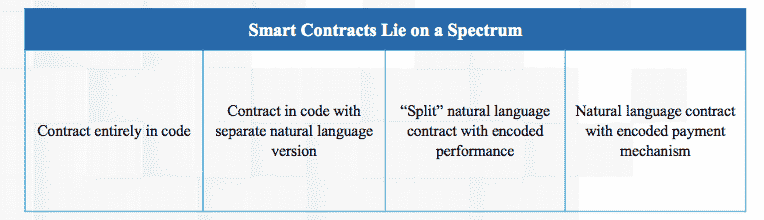
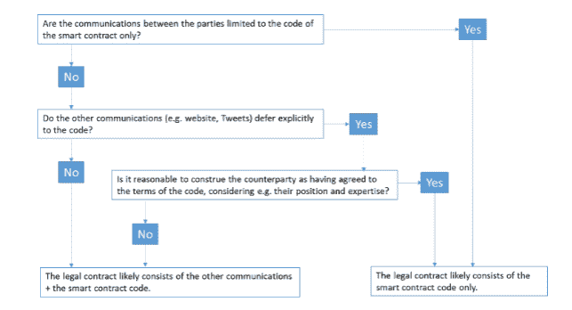

# 智能合同，第 2 部分:合法性

> 原文：<https://medium.com/hackernoon/smart-contracts-part-2-the-legality-761cc4be100d>

这是智能合约 3 部分系列的第 2 部分——如果您错过了它，请查看第 1 部分:[安全状态](/@1nst1tute/smart-contracts-part-1-the-state-of-security-4c37988c770)。

**智能合同的合法性通常是模糊的——监管需要澄清，智能争议解决系统必须建立。过去几年，人们对智能合约以及支持智能合约的区块链技术的兴奋程度在全球范围内飙升。但并不是每个人都忘乎所以，沃顿法律研究教授凯文·沃巴赫就是这样一个人。**

在最近的一个 [**播客**](http://knowledge.wharton.upenn.edu/article/what-are-smart-contracts/) 中，Werbach 说，“尽管我们认为机器可以有效地履行合同，但在很多情况下它们并不能。”这是对那些宣称智能合同已经“解决”了合同法，或者我们可以建立一个没有传统政府或法律体系的未来的人的一个很好的反驳。

> “尽管我们认为机器可以有效地履行合同，但在很多情况下它们并不能做到。”

对智能合约持夸张态度的人往往受到意识形态的驱动，认为他们可以从根本上改善社会的本质。那么，是什么在推动这种兴奋呢？

1.  从交易中去除人为因素并实现巨大效率收益的潜力。
2.  将腐败的中央集权机构(主要是政府机构)从其当前的权力掮客位置上移除的潜力。

智能合约也越来越受欢迎，因为它们承诺更便宜、更安全、更高效的商业交易。政府也加入了这一潮流，在某些情况下，政府对技术进行了大量投资。

本系列的第 1 部分主要关注智能合约安全性。在第 2 部分中，我们将深入探讨围绕它们的法律问题，并回答诸如智能合同在法律上可以强制执行吗？智能合同纠纷如何解决？

# 关于定义的一句话

话语很重要。如果要实现清晰的交流，语言的一致性是至关重要的，尤其是在区块链这样技术发展如此迅速的情况下。

术语“智能合同”本身就是一个误称，因为智能合同并不智能，也不总是符合合同的条件。智能合约不灵活，适应性差，没有内在智能。事实上，它们只和编码它们的人一样聪明(或愚蠢)——就像执行创造者命令的数字仆人。

他们甚至可能不符合被视为合同的标准，从法律意义上来说，合同有一个 [**的确切含义**](https://www.law.cornell.edu/wex/contract) :私人当事人之间达成的协议，规定了可依法强制执行的相互义务。

> ***“智能合约其实只是程序化执行的交易(PETs)。它们不是协议，而是执行协议的技术。”***

协议往往带有很大的主观性。它们存在于人们的头脑中，而不是在硬盘上，即使写在纸上，也可以在需要时进行仲裁。相比之下，智能合同几乎没有模糊或协商的空间。正如伯克利大学区块链的 Andrew gli dden[**所说的**](https://blockchainatberkeley.blog/should-smart-contracts-be-legally-enforceable-599b69f73aea) ，“智能合约实际上只是程序化执行的交易(pet)。它们不是协议，而是执行协议的技术。”

“智能合同”这个术语也变成了一种包罗万象的东西，被用于从根本上说不是合同的东西。

来源:[数字商会](https://digitalchamber.org/)

一方面，有一种观点认为“代码就是法律”,不需要复杂的自然语言就可以完全表达合同。另一种观点认为，智能合约只不过是商业逻辑的数字化表现。

虽然我们可能更准确地认为智能合约是一种自动托管、价值脚本或 Nick Szabo 的 OG [**定义**](http://szabo.best.vwh.net/smart.contracts.html) 之类的东西，但出于本文的目的，我们将智能合约定义为简单的计算机代码，编程为基于预定义的条件执行交易。

# 智能合同在法律上可以执行吗？

智能合同的用例涉及各种各样的法律领域，如果您考虑它们的跨司法管辖区性，回答上述问题将变得非常复杂。

> ***【认为法律体系无法干预关于智能合同结果的分歧，这是一个错误的结论。”***

一个常见的误解是，由于智能合同的自动执行性质，它可以充当大多数合同流程的替身。认为法律系统不能干预关于智能合同结果的分歧也是一个错误的结论。

即使合同自动执行其逻辑，这也不一定是既成事实的情况。

# 决定智能合同合法性的因素

智能合同是否可以作为法律上可执行的合同取决于每个案例的具体情况。在普通法中，自愿要约和承诺以及对价是合同的基本要素。在大多数情况下，合同可以通过多种形式建立:口头的，书面的，或者通过点击“同意”按钮等行为。一些智能合约表现出这些特征，而另一些则没有。

破译智能合同合法性的另一部分是确定代码在合同中扮演什么角色。下面的决策树说明了这一点:

来源:[云法律项目](http://www.cloudlegal.ccls.qmul.ac.uk/)

Perkins Coie 律师事务所的一份研究论文这样总结了**:“智能合同可以代表法律规定的有效法律合同的全部、部分或全部。因此，即使智能合同代表了可强制执行的法律合同的全部，它仍然与用自然语言编写的任何其他合同一样受合同法的约束。”**

> **即使智能合同代表了可强制执行的法律合同的全部，它仍然与用自然语言编写的任何其他合同一样受合同法的约束 **

**合同各方的具体情况、合同的编写和宣传方式，以及合同代码是否与其自然语言描述相匹配，都是决定智能合同可执行性的进一步因素。如果合同的两个部分之间有冲突(例如，代码与描述)，法官需要从整体上看合同，并试图确定双方的真实意图，以此来确定哪一个条款优先。**

**底线是:确定智能合同的合法性取决于其运作的事实矩阵，以及确定该问题的适用法律。**

# **以刀为例**

**在某些情况下，智能合同开发商会在网站上添加“等级”条款，试图避免任何不确定性。这种语言表明，在描述和智能合同代码之间发生冲突的情况下，以智能合同代码为准。**

**在[**【DAO】**](https://en.wikipedia.org/wiki/The_DAO_(organization))**(一系列旨在像用户指导的风险投资基金一样运作的智能合约)的案例中，事情更进一步，很明显，贡献者唯一同意的是代码。但是根据伦敦玛丽女王大学 [**云法律项目**](https://papers.ssrn.com/sol3/papers.cfm?abstract_id=3091218) 的研究员戴夫·米歇尔斯的说法，这种方法通常站不住脚:“问题是代码不是法律。法律就是法律。因此，在发生冲突的情况下，法官需要确定这样的条款是否具有法律约束力。”****

> ****“[对]普通消费者而言，法官可能会发现，仅仅提及机器可读代码并不能充分说明合同条款具有约束力。”****

****米歇尔斯继续说道:“如果交易对手是普通消费者，法官可能会发现，仅仅参考机器可读代码并不能为具有约束力的合同条款提供足够的通知。”另一方面，“如果交易对手是可靠性专家，法官可能会发现协议中人类可读的条款合法地服从于机器可读的代码。”****

****关于可执行性的最后一点:许多司法管辖区将采取措施解决合同双方(房东-房客、雇主-雇员等)之间的权力不平衡，如果智能合同不包括消费者撤回或要求退款的能力，它可能会与一些消费者保护法相冲突。****

# ****智能合同纠纷将如何处理？****

****智能合同提出了一些独特的解决方案和可执行性问题，这些问题很可能在未来挑战现有的法律制度。****

****他们提出的一系列问题确实很新颖，包括以下内容:****

*   ****智能合同可以用假名执行，因此，如果有必要，确定向谁提出索赔可能会成为一个问题。****
*   ****由于区块链网络的跨国性质，确定解决争议所依据的管辖权和适用法律可能很困难。****
*   ****当智能合同自动执行，并且其结果被写入一个分散的区块链时，当事人可能很难找到一个简单的方法来解除合同。****

****需要进一步完善管理智能合同的法律框架，以解决这类问题。****

****伦敦大学国王学院的商法教授马特加·杜洛维奇博士说:“传统的仲裁方法冗长，而且包括延期执行，这是不够的。创建一个更智能的争议解决系统是关键，需要律师和计算机、数学和密码学专家的合作。****

> *******“或许可以在一开始就将解除转让的逻辑纳入智能合同。”*******

****前面引用的 Dave Michels 也阐述了智能合同仲裁的可能性:“理论上，从一开始就将解除转让的逻辑纳入智能合同是可能的。例如，多重签名合同的结构可以允许第三方仲裁人用自己的私钥进行仲裁。”****

****虽然仲裁条款的必要性显而易见，但在智能合同中引入这种后门会带来许多其他问题。Michels 承认这一点:“在签订合同时，需要双方明确同意，因为它重新要求信任第三方，并给代码增加了一层复杂性，增加了出现错误或安全漏洞的可能性。”****

****尽管如此，拥有某种仲裁智能合同结果的方法可能会被证明是重要的，因为没有一个合同是无错的，或者可以被创建来应对每一种意外情况。尽管一些著名的试点项目正在进行中，但智能合同仲裁在未来的实践中会是什么样子还不清楚。****

****然而，有一点是清楚的，智能合同将产生的系统必须是可靠和高效的。这可能采取法庭或预选仲裁员的形式，一些技术专家甚至在考虑分散仲裁的想法，通过这种方式，争议被随机分配给选定的仲裁员，然后他们的决定被记录在区块链上。****

# ****最后的想法****

****智能合同是理解合同法为我们做了什么的一个重要切入点。如果你认为合同法仅仅是一种确保某种结果的机制，那么智能合同似乎可以实现这一功能，而且效率更高。****

****不难想象智能合约主导的未来。如果不说别的，它们通过澄清基本义务和自动化性能来减少诉讼的价值是不可否认的。然而，在大规模采用之前，需要广泛评估智能合同的法律地位，以便选择最适合特定司法管辖区的模式。****

****本文中提出的一些问题的解决方案需要在大规模使用之前得到解决。久而久之，聪明的合同将在法庭上得到检验，先例将被建立，人们将对其合法性达成共识。****

> *******“采用智能合同可能会有许多障碍，但法律不确定性不一定是其中之一。法院不需要推翻现存的判例来适应智能合同。*******

****展望未来，智能合同不会在法律真空中运作，也不会取代律师。合同法是一项人类事业，不容易单独翻译成代码。用旧的手段和工具找到新的解决办法将是法律界的崇高任务。****

****借用 [**乔治敦法律技术评论**](https://www.georgetownlawtechreview.org/the-law-and-legality-of-smart-contracts/GLTR-04-2017/) 的一句话，“采用智能合同可能会有许多障碍，但法律不确定性不一定是其中之一。法院不需要推翻现存的判例来适应智能合同。****

****合同法总是表现出适应新形势的内在能力，而不需要对其基本原则进行重大修改。没有理由认为智能合约会有什么不同。****

******代码必须防水******

****使用不完美或错误代码的后果可能是毁灭性的，甚至有点滑稽。2003 年 2 月，密歇根州大急流城圣玛丽医疗中心的一个计算机软件错误导致 8500 名病人被宣布死亡，尽管他们还活着。这个系统通知保险公司和病人自己关于“死亡”的信息，造成了很多混乱和管理上的麻烦。****

****两年后的 2005 年，密歇根州惩教署因程序故障提前释放了 23 名囚犯。所有相对较轻的判决，囚犯的时间都从 39 天减少到 161 天，而其他人则被关押在监狱里超过他们的释放日期。代码可能会让我们的生活变得更容易，但如果出错，代价可能会很高。****

********

****这篇文章是研究院的科林·亚当斯写的，最初发表在二元地区杂志上。****

****新兴技术领域绝不缺少创意或灵感；然而，这些本身并不等同于创新，也不推动技术进步，而是高质量的研发。该研究所对技术发展采取实用的方法，并寻求在想法和可行的解决方案之间寻求平衡。****

****kseniya forbinder 的插图****