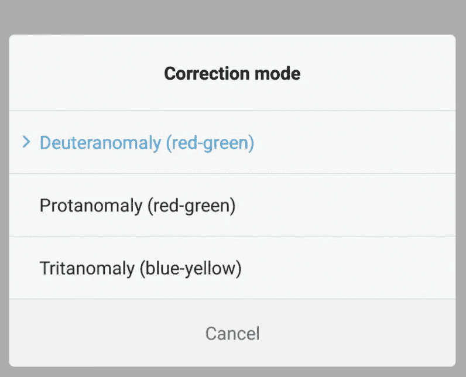

# 针对色盲和近视的智能手机定制

> 原文：<https://medium.com/hackernoon/smartphone-customizations-for-color-blindness-nearsightedness-66ceb38b3a9e>

在今天以智能手机为中心的世界里，如果你患有任何类型的眼部疾病，使你无法始终清楚地看到你的手机，那就很难了。这意味着，如果你有视觉障碍或色盲，你可能很难看到许多视力正常的人认为理所当然的超彩色的微小文字。

当然，有硬件解决方案和应用程序可以提供帮助，但你也可以找到一些已经内置在手机中的选项。

这里有几个你可以在 iPhones 和 Android 上找到的辅助选项，如果你有某种视觉障碍，可能会对你有所帮助。

# 颜色校正

色盲困扰着一小部分人，这两种手机都有改变屏幕颜色的选项，以使患有色盲的人更容易观看。

有几种不同类型的色盲，每一种限制不同的颜色光谱。一些最常见的类型包括原近视(红色-虚弱)、后近视(绿色-虚弱)和三近视(蓝色-虚弱)。如果你有任何这些类型的色盲，那么你可以调整你的手机光谱来适应你。

在 iPhones 上，这些选项可能有点难找到。前往设置>通用。在“辅助功能选项”下，选择“显示调节”，然后选择“颜色过滤器”。在那里，从一个选项列表中选择最适合你眼睛的选项。

[iPhone](https://thenextweb.com/topic/iphone/) 还有一个灰度选项，对于那些患有罕见色弱的人来说，这是一个很好的选择。还有一个色调选项，可以将你的手机屏幕变成红色，这是为那些眼睛敏感，在黑暗中看普通手机屏幕有困难的人准备的。

Android 上的过程非常相似。转到您的设置，然后从系统菜单中选择辅助功能。和 [iOS](https://thenextweb.com/topic/ios/) 一样，色彩滤镜都列在色彩校正选项卡下。名称略有不同，但它们描述的是相同的条件。

只有三种选择，一些机器人有灰度，尽管后者因型号而异。

# 文本大小

无论手机屏幕变得多么大，文本尺寸总是很小。即使你有 20/20 的视力，你的眼睛也很难看到这么小的字。仅仅看着明亮的屏幕就足以使眼睛疲劳——重要的是[采取措施减少疲劳](https://thenextweb.com/lifehacks/2012/03/31/cranky-with-a-headache-check-out-10-tips-to-avoid-computer-vision-syndrome/)以避免可能导致的头痛。

避免眯着眼睛看屏幕的一个方法是让你的字体变大。在 iPhones 上，基本尺寸选项可以变得相当大——对于那些需要更多提升的人来说，选择更大的文本可以看到更大的文本。

对于 Android 用户，字体大小设置在显示设置下。您可能需要查看“高级”下方的选项。

# 文本到语音转换

如果更大的文本没有帮助，您的手机还具有语音选项，可以为您朗读屏幕上的文本。

iPhones 有一个名为 VoiceOver 的功能，当在屏幕上轻触文本选择时，它会大声朗读文本。你可以调整演讲的音调和语速，让它尽可能地令人愉快。在“辅助功能”菜单下，选择 VoiceOver 并翻转开关。

Android 的文本到语音转换选项由谷歌提供支持。和 iOS 一样，可以调整语速和语言。

你知道有什么有用的应用程序可以帮助视障人士使用智能手机吗？请在评论中告诉我们。

> 这个故事是由瑞秋·凯瑟写的，最初发表在 T2 的下一个网站上。
> 
> 要阅读黑客正午的每周趋势 TNW 故事，请访问 Hackernoon.com/tnw 的。