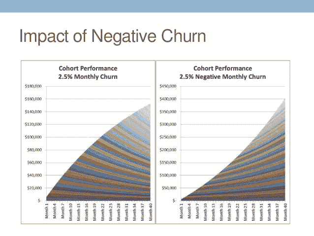
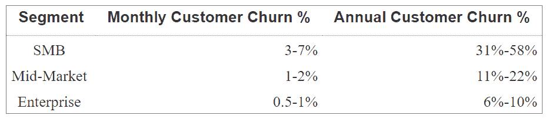
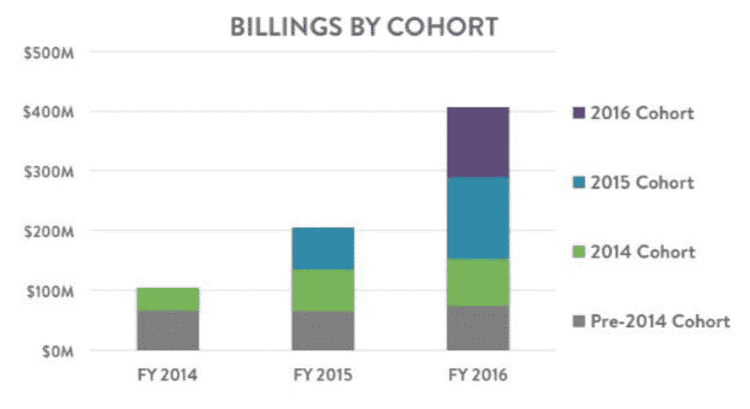
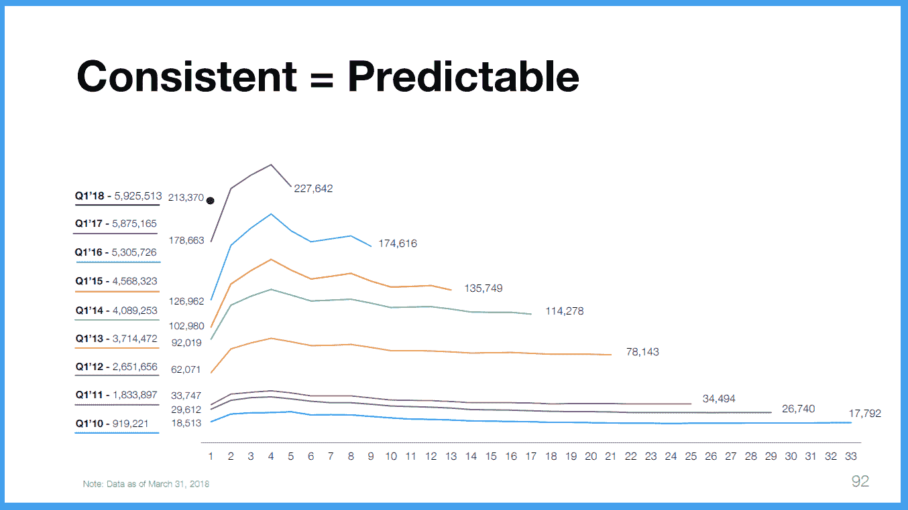
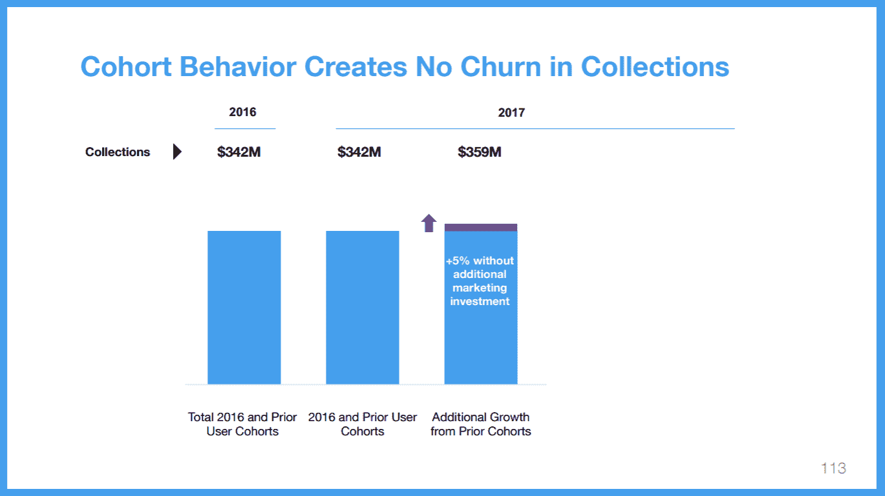
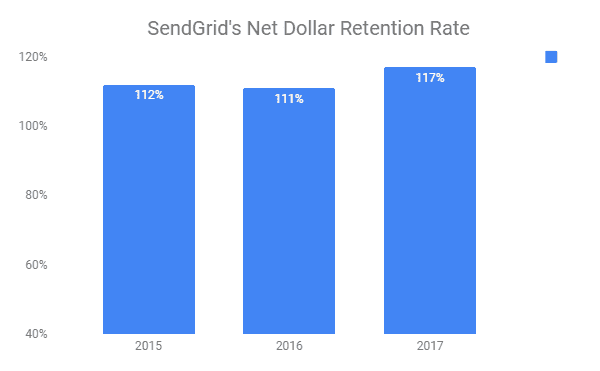

# 中小企业 SaaS 和净负流失

> 原文：<https://medium.com/hackernoon/smb-saas-and-the-curious-case-of-negative-churn-da52b5ec730e>

(Image Credit: forentrepreneurs.com)

流失率是 SaaS 的关键指标之一。它基本上是每个订阅续订期内客户流失的百分比—年流失率为 5%的产品意味着 95%的客户将在下次续订时续订订阅。

许多因素影响流失率；其中之一就是 SaaS 公司所服务的细分市场。一家为大企业服务的公司与一家为 [SMB](https://hackernoon.com/tagged/smb) (中小型企业)客户服务的公司相比，客户流失情况会有很大不同。

尽管流失率对于细分市场中的公司来说是独特的，但这里有一些基于 SaaS 公司服务的细分市场类型的关于流失率的一般观察。中小型企业细分市场中的 SaaS 公司的流失率明显高于中端市场和大型企业细分市场。

(Image Credit: Tomtunguz.com)

中小企业领域如此高的流失率有许多原因:中小企业倒闭更频繁，转换成本低，收入流不稳定等。以 7%的月流失率计算，一家为中小企业服务的公司到年底将失去一半以上的客户群。

因此，面对中小企业的大量流失，寻求发展的组织要么必须在获得新客户方面进行大量投资，要么建立一种导致“净负流失”的业务模式。

如果你想知道“净负流失率”是什么，这意味着来自保留客户的增量收入超过了来自流失客户的收入损失。因此，经历 5%净负流失率(或 105%保留率)和 5%客户流失率的企业将保留 95%的客户群，但将比去年多产生 5%的收入。

但是企业如何实现净负流失呢？公司可以通过三种方式实现它:**使用扩张、交叉销售和追加销售**。我们来看看几家成功部署了这些策略的公众上市公司。

**Shopify(使用扩展、交叉销售和追加销售)**

Shopify 是一个面向中小企业的基于云的商务平台。它开始帮助商家建立和管理他们的在线商店，多年来已经扩展到支持他们的整个业务，包括 web、移动、社交和实体业务。

Shopify 有两个收入来源:订阅和商家解决方案。顾名思义，订阅解决方案的收入来自平台订阅的销售，而商业解决方案主要解决客户的支付、运输和营运资金需求。

Shopify 一直报告月度账单留存率> 100%，这意味着 Shopify 通过向同一群体中的留存客户销售更多产品，不仅弥补了大量流失客户的收入损失。

(Image Credit: Shopify S-1)

随着商家在 Shopify 平台上取得成功，他们通过升级到更高的等级(追加销售)或购买额外的产品(交叉销售)来满足他们的需求，或者随着越来越多的客户在商家的商店进行交易，他们在交易费用上花费更多(使用扩展)，从而对 Shopify 的收入贡献越来越大。

**Square(使用扩展/交叉销售)**

Square 是一家支付公司，最初允许微型和小型商户通过智能手机上的读卡器接受信用卡/借记卡。从那时起，Square 扩大了其产品组合，包括其他 POS 服务、在线支付、金融服务，如向商户预付现金、工资和员工管理等。

Square 商户从支付和 POS 产品开始，但随着他们的发展，他们不仅处理更多的支付(使用扩展)，还购买其他服务(交叉销售)，如员工和工资管理、用于营运资本管理的现金预付款等。

Square 没有披露总收入的留存率，但它披露了交易收入(约占总收入的 80%)的留存率，交易收入在过去 4 个季度中同比增长超过 110%，在过去 17 个季度中一直保持在 100%以上。

**Wix(追加销售和交叉销售)**

另一个很好的例子是 Wix，这是一个基于云的解决方案，帮助小企业使用拖放工具创建漂亮的网站。它提供了一种免费增值模式，客户可以选择升级到付费计划以获得更多功能。

它的免费增值战略如此成功的原因是因为它让任何客户都可以永远免费建立和托管一个功能性网站。但客户必须为其功能付费，如客户域名、无广告、更多存储和带宽等。

客户投入了相当多的精力来建立一个功能网站，克服了学习曲线，从而在项目中投入了感情。因此，追加销售付费计划变得更加容易。

下面的屏幕截图描述了 Wix 在过去 9 年中的 Q1 团队表现。正如你所看到的，每个群组的用户数量在第一年的第四季度持续上升，这基本上是同一群组中的免费用户转化为付费用户，导致了“净负流失率”。

(Image Credit: Wix.com)

它清楚地显示在 Wix 的顶线(收款/收入)中。

(Image Credit: Wix.com)

**发送网格(使用扩展)**

SendGrid 是一个通信平台，使企业能够通过电子邮件与客户进行可靠的交流。它的核心产品，电子邮件 API 服务，可以集成到软件应用程序中，只需几行代码，就可以让开发人员访问一个强大的电子邮件平台；他们不需要构建内部通信系统，而需要专用服务器/数据库、领域专业知识和团队来持续维护和监控此类复杂系统。

如果你在收件箱里查看促销信息、发货通知、购物收据等。很有可能这些邮件很少来自 SendGrid 或其竞争对手。下面是从 SendGrid 的 IPO 文件中摘录的样本电子邮件的快照。

(Image Credit: SendGrid S-1)

SendGrid 根据发送的电子邮件数量向客户收费。因此，客户对产品的使用随着他们业务的增长而增长。毫不奇怪，SendGrid 的净美元留存率(即净负流失率)在过去 3 年中一直高于 110%(2017 年、2016 年和 2015 年分别为 117%、111%和 112%)

总之，为了效仿上述例子的成功，公司需要确定并执行净负流失战略，这将与他们产品的价值主张产生最大的共鸣。毕竟，从一个了解你产品价值的现有客户身上赚钱，要比一直承受着获得新客户的压力容易得多。

你觉得这里的策略和例子对如何思考 SaaS 中小企业的负面流失有用吗？你知道有什么有趣的公司我应该加入吗？

请在评论中告诉我。