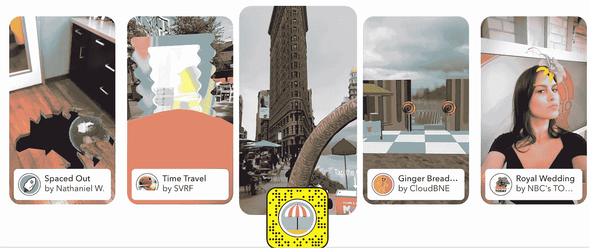
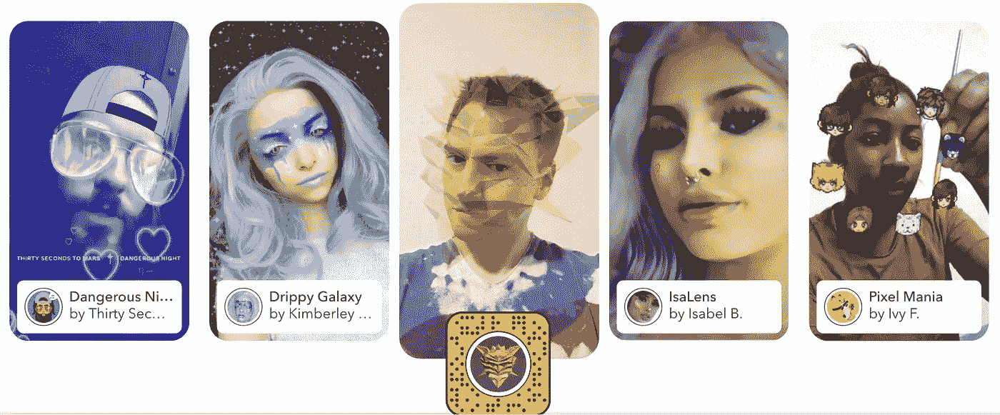
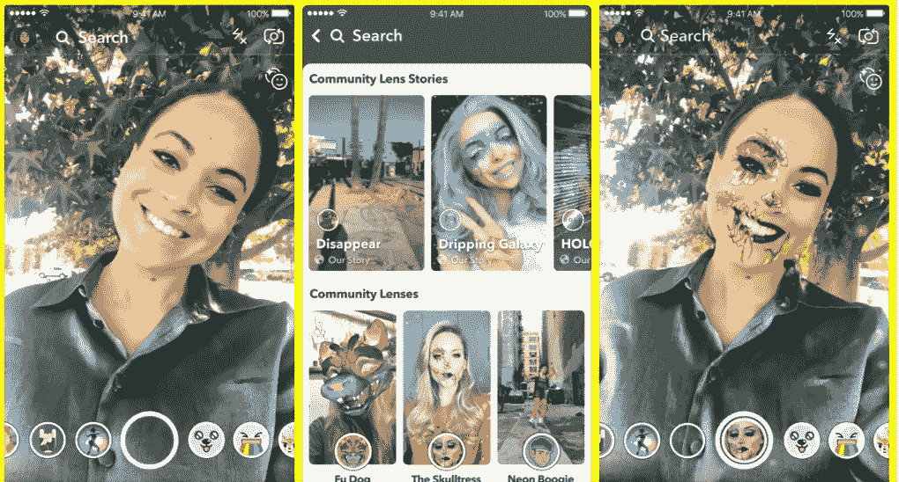

# SNAPCHAT 还是千禧一代的 FAV APP，吸吧凯莉·詹娜！

> 原文：<https://medium.com/hackernoon/snapchat-is-still-millennials-fav-application-suck-it-kylie-jenner-new-lenses-are-now-here-cddb29953aee>

# 新镜头现已上市

***被 MYDISRUPT 7/11/18***

# [Snapchat](https://www.snap.com/) ，仍然是我们千禧一代最喜欢的应用。原因是，Snapchat 是唯一一个带来持续创新并挑战我们最爱的设备——我们的手机——的社交媒体应用程序！

> 吸它凯莉·詹娜！卡戴珊就像那个部落中的其他人一样，靠姐姐的名气谋生，她试图关闭自己在 Snapchat 的账户，却发现自己更需要他们，而不是他们需要她，几个月后又回到自己的账户去卖她的染发剂和口红！

新闻报道 Snap 公司股票价值损失 1xx 亿美元，投资者没有意识到的是，我们这些用户根本不关心凯莉·詹娜的事情。她的销售主要是基于美国以外，在这里，美国，她只是一个罪恶的快乐，当一个人生病或累了忘记工作，没有别的，没有价值。所以，我们不买她卖的东西。

# ***昨天 Snapshot 推出了镜头浏览器，这是我们发现的。***

分享别人的镜头，或者设计和制作一个非常特别的镜头。

 [## 镜头工作室-镜头工作室由快照公司。

### Snap Inc .的 Lens Studio 使用 Lens Studio for Windows 创建、发布和共享神奇的增强现实体验…

lensstudio.snapchat.com](https://lensstudio.snapchat.com/) 

## 太神奇了！

## 你若敢

**HAAAAA？**

现在我们可以使用世界各地 Snapchatters 制造的数千个镜头，这是必须尝试的。

这些是 Snap 团队给出的方向

*“要在镜头浏览器中开始浏览，只需点击镜头转盘激活时出现的新图标。轻按镜头拼贴以解锁镜头，并被直接带到快照相机，或在专题报道中浏览镜头。在这些故事中，通过向上滑动快照来解锁镜头。*

*自从我们在 2017 年底推出 Lens Studio 以来，创作者已经提交了超过 100，000 个独特的镜头，这些镜头已经被 Snapchatters 观看了超过 25 亿次。现在，随着镜头资源管理器的推出，社区镜头将在镜头转盘旁边被发现，从而更容易找到并使用"*

iOS 上有镜头资源管理器

想打造自己的镜头？[参观镜头工作室！](https://lensstudio.snapchat.com/)

> 让我们看看 MZ 为 Instagram 复制这些功能需要多长时间！

> 如果你有一个很酷的镜头，确保版权，否则 MZ 将采取所有权。