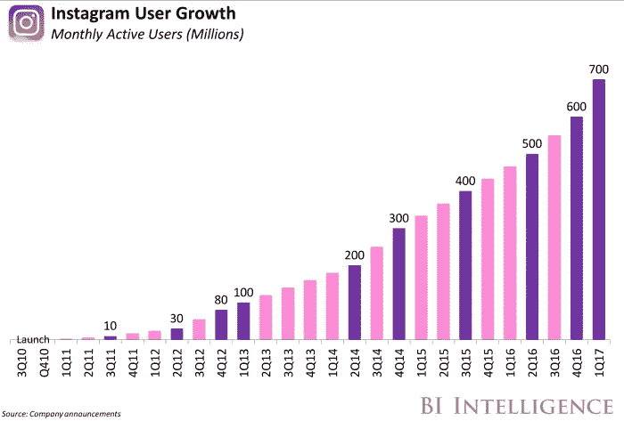

# Snapchat，你的时间到了。

> 原文：<https://medium.com/hackernoon/snapchat-your-time-is-up-d7134c30f1bc>

## 啪。噼啪作响。流行音乐？

Photo by [Tim Mossholder](https://unsplash.com/photos/C8jNJslQM3A?utm_source=unsplash&utm_medium=referral&utm_content=creditCopyText) on [Unsplash](https://unsplash.com/?utm_source=unsplash&utm_medium=referral&utm_content=creditCopyText)

我试着喜欢上 [Snapchat](https://hackernoon.com/tagged/snapchat) 。

几个亲密的朋友虔诚地使用这个应用程序来记录他们的恶作剧，就像任何一个好朋友一样，我也参与了——从远处。

我从未喜欢过它。

Snapchat 的界面令人困惑，内容杂乱无章，一堆没有标记的滑动控件，故意让非千禧一代难以理解。

网络是不可能建立的，发现是不存在的。

Snapchat 不适合我。

从表面上看，我并不孤单。

**用户增长已经放缓。**

**品牌使用率正在下降**。

Courtesy of L2inc.com

尽管 Instagram 是最直接的竞争对手，但它正在爆发式增长。

Instagram(脸书)抄袭了 Snap 的许多功能，但他们在实施和推广这些借鉴的想法方面做得更好。

甚至在 Instagram 故事出现之前，Snap 就已经在大量亏损了。2016 年亏损 5.14 亿美元，2017 年亏损 34 亿美元(虽然那包括上市过程中的 20 亿美元费用，但亏了钱就是亏了钱)。他们最近的收益电话会议显示了收入方面的亮点，但该公司仍在 2018 年的前三个月亏损了 3.5 亿美元。

烧钱，增长缓慢，前途未卜。

> Snap 公司完蛋了，对吧？

如果他们继续自称为一家相机公司，他们就是。

不好意思 Snap，你不是相机公司。Instagram 赢得了这场战争，坦率地说，这是一个愚蠢的想法。

# 那现在怎么办？

像 Instagram 一样，Snapchat 应用程序可以拍摄照片和视频，但这是相似之处需要结束的地方。

Snap 引入的东西，首先是消失的照片的短暂性，后来是故事，更多的是体验性的，更个性化的，而不是为了获得喜欢，完全是为了让无法到场的朋友与你共度这一时刻。

失去这一点就是 Snap 出错的地方。

Snap 应该是针对 30 岁以下人口激增的*个人信息平台，分享和获取日常生活中的想法和经历。*

> *世界人口越来越年轻，速度很快。20 亿人年龄在 10 到 24 岁之间，这是这个星球上增长最快的人口统计数据，Snapchat 目前 85%的观众都是这个演示。*

*Instagram 是照片(以及越来越多的视频)的 ***和*单向*传播*** 媒介，忽略那个空间。*

*Snapchat 可以不仅仅是一个信息和社区平台，而是围绕丰富的媒体内容和共享的创建而构建的。*

*以下是你如何做到这一点。*

## *满足我们对发现和成为部落一员的需求*

*在 Snapchat 中扩大你的人脉和位置网络是一场灾难。与你最亲密的朋友建立直接联系是一个开始，但要保持参与度并展示价值，你的人际网络需要扩大。*

*Snap 应该尽一切努力突出显示你身边的人、地点和事物，而 ***让*** 轻松将这些发现添加到你的网络中。通过展示他们周围发生的一切来满足用户的好奇心，建立一个志同道合的社区，创建部落，就像我们在离线时自然做的那样。*

*允许围绕这些发现进行热烈的讨论，利用您的扩展网络的力量进行验证和审查，提出更加有力的建议*

*是的，我知道快照地图，但目前，这是太差的实现(和半隐藏)来改变用户体验。*

## *限制，是的，限制品牌活动，让用户按自己的方式访问*

*当你试图建立一个企业时，限制品牌的行为听起来违背直觉，但如果你疏远了用户，就没有人可以做广告了。*

**

*在新的 Snapchat 上，品牌的第一条规则是，任何干扰体验的事情都应该限制在每个品牌每天一次的互动。任何迫使用户中断他们正在做的事情来参与一个品牌的行为，都应该被重新考虑，如果不可避免的话，应该加以限制。句号。*

*接下来，平台上的任何品牌广告(美食、快时尚、活动等。(这应该是一个小的，精心挑选的群体)不应该能够在 Snapchat 上做广告，而不让用户能够在 Snapchat 应用程序内， ***购买正在讨论或显示的任何东西*** 。*

*此外，Snap 应扩展与品牌沟通和互动的能力，完全由用户决定， ***在用户有需求、有问题或有意见时，提供真实性的真正尝试*** 。*

## *惊喜和喜悦*

*如果你做得好，名人(或有影响力的人)互动是产生对平台兴趣的一个很好的方式。停止将这些内容视为独特和独立的，并将其放入对话体验中，让 ***名人内容看起来和感觉起来像个人信息*** ，而不是迷你广告。*

*Snap spectacles 是一场灾难(生产了太多，进行了大量减记)，但这正是 Snap 应该继续做的实验类型。Spectacles(如果没有其他东西的话)表明，硬件可以包容一种体验，并有助于捕捉新的和令人兴奋的时刻，而不显得可笑。多做这些。*

*让用户成为明星。我们生活在一个顾客评论的时代，互联网创造了一个围绕顾客反馈的活动漩涡，从 Airbnb 到亚马逊的每个人都因这种用户生成的内容而变得明显更好。*

*这里面缺少的是我们对身边朋友圈的信任，我们最看重的人的话。突出这些人，展示他们的选择，让品牌为他们提供商品和服务，并为他们对社区的贡献提供好处。*

## *保持敏捷*

*脸书(通过 Instagram)已经将你纳入他们的视线；玩他们的游戏你不会赢，所以不要。*

*走不同的方向，开始快速迭代，尝试一些疯狂的东西，看看什么能坚持下来，但这一切都是为了你的用户，而不是你的广告商。如果你在每个决定中都把他们放在第一位，他们会留下来，带着他们的朋友一起兜风。*

*开始每季度进行一次实验，测试新的想法，并让一群用户作为“合作伙伴”参与进来，帮助确定他们以及社区的其他人是否需要你提出的任何东西。*

## *简化应用程序，增加功能，降低复杂性*

*有一个新版本的 Snapchat 应用程序在流传，它并不伟大(也不可怕)，但用户群对它很反感。*

*是时候给人们他们需要的东西，简化应用程序，坚持使用有效的东西，慢慢添加功能，而不要给界面增加无尽的复杂性。答案永远不是“增加更多标签页”，所以慢慢来，想办法逐渐引入新功能，让整体体验变得成熟。*

*花点时间看看像 Quartz News 应用程序这样的对话界面，或者第三方使用 Facebook Messenger 中的机器人(从他们那里偷一次，这是他们应得的)。当你这样做的时候，同时使用 Siri 和 Google Assistant，允许用户用语音命令创建内容，任何可以加速分享的东西。*

## *找到更好的赚钱方式*

*你的工作，Snap Inc .，不是迭代新的广告模式，而是为你的用户提供有意义的体验，并温和地从他们身上榨取金钱来支付。*

*轻轻地货币化；*

1.  *从平台上的每一笔交易中抽取一小部分，不要把这个成本转嫁给用户。*
2.  *向你选择在平台上使用的 品牌 ***收取额外费用，他们会为获得这样一个主要的用户群并在竞争中出局而付费****
3.  *开始允许用户(和一些品牌)创建内容(贴纸，gif，镜头等。)要在平台上卖。这些附加组件的最低成本为 1 美元，但让用户“支付”他们想要的，这是一个收入流，推动参与，让用户在构建平台中发挥作用(并赚取收入)。*
4.  *建立一个内部数据业务，一个 la Foursquare 的定位点，并开始告诉世界，30 岁以下的人在哪里和做什么(有价值的演示)。以完全透明的方式保护和匿名这些数据。*

## *停止执行以下所有操作*

1.  *制作你自己的内容，你不是做内容生意的，你不是网飞，你也不是 CNN*
2.  *称自己是一家相机公司，并与其他照片平台竞争*
3.  *梦想比 Instagram 更大，或者像脸书一样值钱。一个公司在几十亿的营收上拿二三十个点没有错。*

*球是在你的法院快照公司。你想成为一个也跑作为一个照片平台，或去现场为每个 30 岁以下的人分享他们的生活吗？*