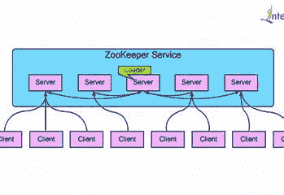

# 潜入阿帕奇动物园管理员

> 原文：<https://medium.com/hackernoon/sneak-peak-into-apache-zookeeper-10417393765>


Apache Zookeeper 是 Apache 基金会的开源工具。最初由雅虎开发。感谢雅虎的动物园管理员。

Zookeeper 是用 Java 编写的，它是独立于平台的。

什么是分布式系统？

多台独立的计算机连接在一起，对用户来说就像一台计算机。分布式系统通过网络传递消息进行通信。分布式系统中的所有组件相互交互以执行任务子集来实现共同的目标

**为什么要使用分布式系统？**

*   可靠性:即使分布式系统中的一台或多台服务器出现故障，系统仍将继续运行。
*   可伸缩性:系统可以根据工作负载的要求横向扩展和缩减。

**分布式系统的挑战？**

*   竞争条件:当两个或多个线程访问共享数据，并且它们试图同时改变它时，就会发生竞争条件。
*   死锁:当集群中的每个节点都在等待集群中的其他成员释放锁时，就会发生死锁。

# 因为协调分布式系统是一个动物园

Zookeeper 是分布式系统使用的高性能协调服务。Zookeeper 允许分布式系统通过数据注册器的分级名称空间来相互协调。

# 为什么我们需要像动物园管理员这样的服务？

1.结构管理

2.同步

3.领导人选举

4.命名服务

5.通知系统

Zookeeper 提供了实现上述所有任务的 API。

Zookeeper 架构



Zookeeper 服务以 2 模式运行

*   单独的
*   法定人数

在独立模式下，Zookeeper 服务在单个服务器上运行，没有状态被复制。

在 quorum 模式下，一组 Zookeeper 服务器(我们称之为 Zookeeper ensemble)复制状态，它们一起服务于客户端请求。

1.  Zookeeper 服务器的集合被称为**集合**。
2.  在任何时候，动物园管理员都有一个领队和其余的随从。最好至少有 3 台 Zookeeper 服务器来运行生产环境。
3.  客户端将始终在任何时间点连接到任何一个 Zookeeper 服务器。
4.  ensemble 中的任何 Zookeeper 服务器都可以为读取客户端请求提供服务。
5.  所有的写请求都将发送给动物园管理员。Zookeeper 使用 ZAB (Zookeeper 原子广播)协议，该协议确保将所有写入的变化从领导者传播到追随者。
6.  Zookeeper 由分层名称空间组成。
7.  名称空间中的每个节点被称为 **Znode** 。

**Znode** :

Zookeeper 树中的每个节点都是 Znode。动物园管理员中的节点维护 stat 结构。

一个节点可以是持久的，也可以是短暂的。顾名思义，持久的 Znode 将保留在 Zookeeper 中，直到或者除非没有进行删除调用，并且当 Zookeeper 客户端断开连接时，短暂的 Znode 将被删除。还有一个连续的 Znode，它在 Znode 后面附加一个唯一的数字。所以基本上有 4 种类型的 Znode 持久的，短暂的，持久连续的，短暂连续的。

ZAB :

客户给关注者的所有写请求都会被转发给领导者。领导者执行请求，并以事务的形式将执行结果作为状态更新进行广播。事务由提交事务时服务器必须应用于数据树的一组确切的变化组成。

**如何安装独立的 Zookeeper 并运行？**

从[这里](http://mirrors.estointernet.in/apache/zookeeper/zookeeper-3.4.13/zookeeper-3.4.13.tar.gz)下载 Zookeeper 最新稳定版。注意此链接可能因镜像而异。

我通常把我的安装放在`/opt`里，但是你们可以在你选择的服务器/机器上下载。

```
* wget [https://archive.apache.org/dist/zookeeper/zookeeper-3.4.13/zookeeper-3.4.13.tar.gz](https://archive.apache.org/dist/zookeeper/zookeeper-3.4.13/zookeeper-3.4.13.tar.gz)* tar xzf [zookeeper-3.4.13.tar.gz](https://archive.apache.org/dist/zookeeper/zookeeper-3.4.13/zookeeper-3.4.13.tar.gz)* cd zookeeper-3.4.13* cp conf/zoo_sample.cfg conf/zoo.cfg
```

启动 Zookeeper 服务器

```
*** sudo bin/zkServer.sh start**You sgould see output like below id Zookeeper start successfully**ZooKeeper JMX enabled by default
Using config: /opt/zookeeper-3.4.13/bin/../conf/zoo.cfg
Starting zookeeper … STARTED**
```

动物园管理员 CLI

1.  创建一个持久的节点

```
create /abhishek "anay"
```

输出应该如下所示

```
Created /abhishek
```

使用`-s`标志创建顺序 Znode，使用上述命令的`-e`标志创建临时 Znode。

2.**从动物园管理员处获取**数据

```
get /abhishek
```

您应该会看到如下输出

```
anay
cZxid = 0x9
ctime = Sun Nov 11 20:55:34 IST 2018
mZxid = 0x9
mtime = Sun Nov 11 20:55:34 IST 2018
pZxid = 0x9
cversion = 0
dataVersion = 0
aclVersion = 0
ephemeralOwner = 0x0
dataLength = 4
numChildren = 0
```

让我们理解上面的输出，它也是一个 Znode 元数据

*   anay:Znode 保存的数据。
*   cZxid: 0x9 是 Zookeeper 事务 id。
*   ctime: Znode 创建时间。
*   mZxid:上次修改时更改的 Zxid。
*   mtime:Znode 的上次修改时间。
*   pZxid:上次修改此 znode 子节点的更改的 Zxid。
*   c version:Znode 子节点的更改次数。
*   data version:Znode 的更改次数。
*   acl version:Znode 的 ACL 的更改次数。
*   ephemerlOwner:如果 Znode 是临时节点，则为该 Znode 所有者的会话 id。如果它不是一个短暂的节点，它将为零。
*   dataLength:Znode 中数据的长度。
*   numChildren:此节点的子节点数。

创建子节点

```
create /abhishek/anayamralkar loveyouson
```

3.**观看**命令

当 Znode 中的数据改变时，它会显示通知。我们可以使用`watch` 命令和`get`命令。

```
get /abhishek [watch] 1
```

输出类似于`get`命令，但当 Znode 中的数据发生变化时会显示通知。

```
get /abhishek [watch] 1
anay
cZxid = 0x9
ctime = Sun Nov 11 20:55:34 IST 2018
mZxid = 0x9
mtime = Sun Nov 11 20:55:34 IST 2018
pZxid = 0x9
cversion = 0
dataVersion = 0
aclVersion = 0
ephemeralOwner = 0x0
dataLength = 4
numChildren = 0
```

4.**设置**命令用来改变与 Znode 相关的数据

```
set /abhishek anayamralkar
```

5.**删除**命令删除 znode

```
delete /abhishek
```

6.列出节点和子节点的命令

```
[zk: localhost:2181(CONNECTED) 31] ls /
[zookeeper, abhishek]
[zk: localhost:2181(CONNECTED) 32] ls /abhishek
[anayamralkar]
```

7. **stat** 命令检查 Znode 和 children 的状态

```
stat /stat /abhishek
```

8.**帮助**命令查看所有可用命令

```
ZooKeeper -server host:port cmd args
 stat path [watch]
 set path data [version]
 ls path [watch]
 delquota [-n|-b] path
 ls2 path [watch]
 setAcl path acl
 setquota -n|-b val path
 history 
 redo cmdno
 printwatches on|off
 delete path [version]
 sync path
 listquota path
 rmr path
 get path [watch]
 create [-s] [-e] path data acl
 addauth scheme auth
 quit 
 getAcl path
 close 
 connect host:port
```

9.**退出**命令，退出 Zookeeper 外壳

```
quit
```