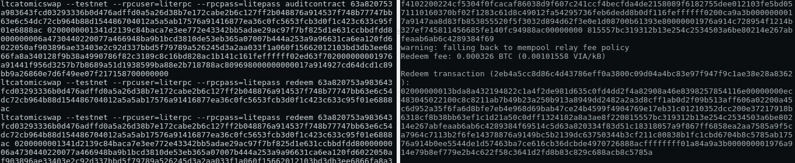

# 那么，我该如何进行原子交换呢

> 原文：<https://medium.com/hackernoon/so-how-do-i-really-do-an-atomic-swap-f797852c7639>

A Real Atomic Swap Between Viacoin and Litecoin

加密，加密，加密，这是现在谈论最多的话题，加密的消亡，加密的革命，但是在这篇文章中我们不打算谈论它，而是去做，去使用它。

我将向您展示原子交换在实践中是如何工作的，从代码的角度看它们背后的逻辑，以及实现最终结果的执行流程:

> Alice 拥有 Viacoin，而 Bob 是 Litecoin 的坚定支持者，但他想要 Viacoin，因为他相信它有光明的未来，Alice 和 Bob 如何在不通过第三方的情况下将他们的藏毒量交换给对方？

答案是 [**散列时间锁定契约**](https://en.bitcoin.it/wiki/Hashed_Timelock_Contracts) ，简而言之就是 HTLC。

简而言之，散列时间锁契约是一个非图灵完全契约，它像一个带有密钥的谜题一样工作，但要求求解者(在本例中为 Bob)在 X 时间过去之前提供密钥，否则他将失去要求奖励的能力，并将其返回给契约的发起者。

散列锁是满足条件的“事务难题”，输入数据散列等于来自前一个块的散列值，在脚本(比特币脚本语言)中，它看起来像这样:

原子跨链交换是发生在两个区块链上的散列锁定契约，发起者将创建一个契约并在其中锁定数量 X 的硬币 Z，该契约在时间段 T 内有效。如果密钥提供了有效秘密，则它可以移动锁定的硬币。如果在 T 结束之前没有完成，则该契约被取消。

如果你从比特币原语的角度来考虑它，这是有意义的，它也显示了密码学如何在简单的逻辑中使这种操作安全可靠。

Alice 在合同 A 中锁定了一些 Viacoin，Bob 在合同 B 中锁定了一些 Litecoin，Alice 给了 Bob 打开锁定的 via coin 的秘密，Bob 在最后也做了同样的事情 Alice 和 Bob 都被激励去分享秘密，因为如果不是他们两个做的，硬币会回到他们各自的钱包中，不会发生交换。

## 让我们做一个原子交换

要求:

*   2 台 VPS(数字海洋、Vultr …)或 2 台机器。
*   在每台机器上运行两个区块链的完整节点
*   原子 wap 包
*   支持的硬币(比特币、莱特币、Viacoin、Decred、Particl……)都是基于 UXTO 的协议。

首先，您需要安装两个节点，并配置它们使用 testnet，如这里的[所述](https://github.com/viacoin/atomicswap)。

场景:

在您的第一台机器上，您使用发起者区块链(比如 Alice 的 Viacoin)发起契约。

Alice initiates the swap

一旦创建了合同，Bob 必须对其进行审计，以检查是否:

*   锁定的金额是双方同意的金额
*   地址是鲍勃的地址
*   该合同在区块链上公布(不可更改)

Bob audits the contract

如果一切都是正确的，Bob 通过参与合同锁定他的硬币。

Bob participates in the swap by creating a new contract

轮到爱丽丝审核合同了

如果一切都检查过了(条件达成一致),爱丽丝继续兑换她的莱特币

Alice redeeming the litecoins from Bob’s contract

现在对于 Bob 来说，一旦交易实际公布，Bob 可以提取 Alice 在入会时知道的秘密，该秘密将解锁 Bob 可以兑换的 Viacoin 区块链上锁定的硬币

Bob now can extract the secret to redeem his Viacoins

就这样，硬币被解锁，原子交换完成。

这项技术将真正实现去中心化的交换，原子互换相当于外汇交换，但是是无信任和去中心化的。

实现主流可用性的道路还很漫长，我希望这将有助于构建东西，这是新协议的时代。