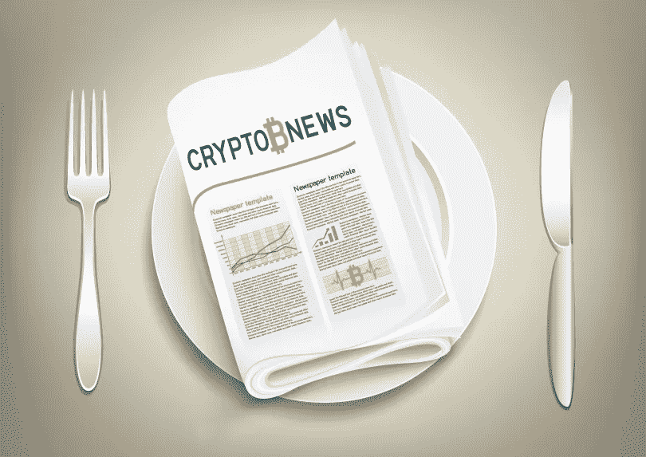

# 那么…你怎么吃你的加密新闻？

> 原文：<https://medium.com/hackernoon/so-how-do-you-eat-your-crypto-news-cf0ac9166d5e>

## 在一个新闻更新和技术本身一样快速发展的行业，我们如何将我们消费的内容切成我们真正可以咀嚼的小块呢？

我们搜寻每日新闻的方式已经改变。我们不再有几个大版面可供选择，我们有一个遍布在线平台的阵列——因社交“分享”的出现而放大。在这个迅速发展的空间里，日常的假新闻意味着我们必须非常小心我们正在阅读的内容。

元素集团一直在寻找最新、优质和平衡的加密货币和区块链技术读物。考虑到这一点，当收集我们的每日新闻时，从哪里开始呢？

# 膳食计划

如果你已经在这个领域呆了一段时间，你会非常熟悉永远可靠的 3C 公司: [Cointelegraph](https://cointelegraph.com/) 、 [CoinDesk](https://www.coindesk.com/) 和 [CCN](https://www.ccn.com/) 。然而，随着这么多其他专门的新闻门户网站的出现，以及主流媒体机构的跟风，我们如何才能获得各种各样的体面的加密新闻呢？

劳拉·申在今年共识论坛的一个小组讨论中谈到了许多加密出版物中的大量赞助内容，这些内容的标签还不够清晰。我们的团队也注意到了这一点，我们同意读者需要更清楚地了解哪些内容是付费的，哪些不是。

不仅如此，在各种社交媒体平台( [Twitter](https://twitter.com/?lang=en) 和 [Reddit](https://www.reddit.com/) 仅举几个例子)以及消息应用程序( [Telegram](https://telegram.org/) 尤其如此)上交叉发布新闻是另一个需要导航的迷宫。如何将所有这些新闻更新聚合起来，并以一种令人愉快的方式进行设置呢？

作为该领域创新的热心读者， [Element](https://elementgroup.com/) 想与您分享一些我们最喜欢的加密和区块链科技新闻来源，当然还有我们如何喜欢消化我们的每日更新。

# 首先

除了上面提到的专门的加密和区块链新闻门户网站之外，还有一些更值得一提的(大多数都有订阅，所以你可以将每日/每周的精彩内容发送到你的电子邮件中) :

尽管标题' [Bitcoinist](http://bitcoinist.com/) '一开始可能会暗示什么，但这个新闻来源不仅涵盖比特币新闻，还提供最新的替代硬币和 ico 的更新，以及当前区块链科技的发展。

[新闻 BTC](https://www.newsbtc.com/) 是另一个涵盖一系列比特币、替代币、ICO、区块链和加密相关时事的门户网站。它还提供每日市场价格分析，以及对投资者的预测和各种针对加密“新手”的教育文章。

[CoinCenter](https://coincenter.org/) 是一家研究和宣传中心，致力于调查和强调与加密货币行业相关的全球政策问题。他们的贡献者通常是该领域的学者和专家，他们的目的是促进该领域良好的公共政策。

Applancer 在内容数量上可能不如其他新闻门户网站多产，但质量密集。和往常一样，该出版物提供社区调查和专家评论，以及 ICO 评论。

# 主(流)

越来越多的主流媒体机构都在报道秘密新闻，有些甚至扩展到有专门的团队报道区块链的所有事情。福布斯[和彭博](https://www.forbes.com/#1be661b62254)[就是两家这样的媒体公司——它们也有自己的推特，专门用于数字货币。](https://www.bloomberg.com/europe)

[TechCrunch](https://techcrunch.com/) 和 [Radar Zero](https://radarzero.com/) 是两家科技新闻出版物，致力于大量报道区块链科技和加密新闻。[美国消费者新闻与商业频道](https://www.cnbc.com/world/?region=world)的《快钱》定期报道加密货币价格分析，并主持采访该领域的行业领袖和创新者。

市场观察定期报告加密监管的状况，并在其网站上提供价格指数。它恰好与[华尔街日报](https://www.wsj.com/europe)相联系，而《华尔街日报》就像[纽约时报](https://www.nytimes.com/)一样，在报道区块链科技新闻方面变得更加多产。

[路透社](https://www.reuters.com/)、[金融巨头](https://www.financemagnates.com/)和[商业内幕](http://www.businessinsider.com/)是三家机构金融出版物，它们也在增加加密货币的覆盖面。

# 博客沙拉

[Medium](/) 是 crypto 中最常用的长格式写空间。其中最有影响力的思想领袖之一当然是[维塔利克·布特林](/@VitalikButerin)，众所周知，他的观点决定着一个项目的成败。Jimmy Song 今年在 Consensus 制造了一些噪音，他是神秘领域教育方面的一个重要组成部分。

Ryan Selkis ，又名 TwobitIdiot，是[周刊 Bits](https://medium.com/tbis-weekly-bits) 的编辑，这是一个由“有点聪明的加密人”发布的帖子的汇总。投资者斯潘塞·博加特，又名加密精英，详细描述了加密市场的现状。菲尔·格雷泽的“如何做”的帖子也值得一读，这些帖子经常出现在《黑客月刊》上。

比特币基地首席执行官 Brian Armstrong 表示，他的主要目标之一是在谈到比特币基地作为业内企业的运作时保持透明，他通过自己的博客做到了这一点。这些作者都有值得关注的每日行业洞察的 Twitter feeds。说到这个…

# 只有甜点

正如我们的首席执行官斯坦所说，crypto 生活在 Twitter 上，如果你已经生活了一段时间，你就会发现这一趋势——事实上，它可能是你获取新闻的地方。这里只是一些在这个领域有影响的人，我们关注他们对当前加密和区块链技术发展的想法。

Shapeshift 首席执行官 [@ErikVoorhees](https://twitter.com/ErikVoorhees) 定期发布关于行业增长、监管效果和加密领域创新的推文。投资者兼分析师[@ tuurdemester](https://twitter.com/TuurDemeester)分享了他的研究以及对这个新兴行业内部运作的思考。

Lightning 首席执行官 [@starkness](https://twitter.com/starkness) 是区块链科技教育世界和讨论空间变化的忠实粉丝。@lopp 定期提供他对安全和加密相关的去中心化的不同观点。

[@cburniske](https://twitter.com/cburniske) 喜欢看加密货币和区块链科技创新的更大图景和哲学层面。 [@AriDavidPaul](https://twitter.com/AriDavidPaul) 是密码领域最前沿的思想领袖之一， [@PeterLBrandt](https://twitter.com/PeterLBrandt) 给普通交易者提供洞察力，专注于受过教育的刚进入市场的人。

仅供参考:看看[crypto influencers](https://cryptoinfluencers.io/)——“一份由算法生成的 Twitter 上 crypto 最有影响力的人的名单”。

# Reddit fours

虽然在 Reddit 上[r/比特币](https://www.reddit.com/r/Bitcoin/)和【there 以太坊都有以其名字命名的 subreddit，但还有一个普通的【there 加密货币 subreddit，受到加密交易员和区块链爱好者的欢迎。 [r/btc](https://www.reddit.com/r/btc/) 和 [r/bitcoinmarkets](https://www.reddit.com/r/BitcoinMarkets/) 是比特币广播可以效仿的其他不错的子节目， [r/ethtrader](https://www.reddit.com/r/ethtrader/) 、 [r/CryptoMarkets](https://www.reddit.com/r/CryptoMarkets/) 和 [r/altcoin](https://www.reddit.com/r/altcoin/) 也受到#hodl 投注者的青睐。

# 还没满？

另外值得一提的是劳拉·辛(Laura Shin)的[未被束缚的](http://unchainedpodcast.co/)和[未被证实的](https://unconfirmed.libsyn.com/)播客、[震中](https://epicenter.tv/)的一贯高质量采访，以及 Ran Neu-Ner，又名 [Cryptomanran](https://www.youtube.com/channel/UCN9Nj4tjXbVTLYWN0EKly_Q) 的加密市场广播。(值得注意的是，这些家伙也都在 Twitter 上！)

有几个电报频道需要提及，如 Cointelegraph 的[“一分钟新闻”](https://t.me/thecointelegraph)。这也是获得非英语新闻更新的最佳地方，比如 Forklog 的俄语频道。这个列表可能很长，因为几个加密货币社区聚集在 Telegram 上。

最后一点:我们建议查看一些由 [CoinDesk 团队在 Consensus 2018](https://www.pscp.tv/coindesk/1LyGBrddlNoGN) 上进行的一对一采访，以获得截至 2018 年 5 月对所有加密事物的广泛和多样的看法。

*   在推特[上关注我们](https://twitter.com/TheElementGrp?lang=en)，获取区块链科技和加密货币的每日汇总。
*   订阅我们的[网站](https://elementgroup.com/blog/)，获取 Element Group 的所有专有研究、报告和专栏文章。
*   有进一步的新闻来源推荐吗？请在下面的评论区告诉我们！

*(完全披露:元素集团赞助了冉·纽纳的《美国消费者新闻与商业频道密码交易者》节目和劳拉·申未经证实的播客)*