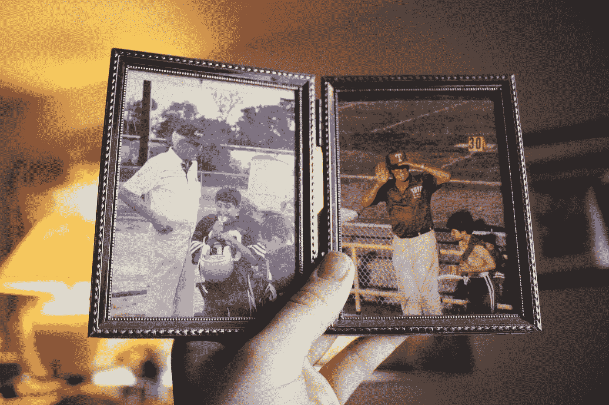

# 那么你的记忆力到底有多好呢？

> 原文：<https://medium.com/hackernoon/so-how-good-is-your-memory-really-9957be209b0a>

“A person holding a family portrait of a grandfather in a photo album” by [Lindy Baker](https://unsplash.com/@lindyjbaker?utm_source=medium&utm_medium=referral) on [Unsplash](https://unsplash.com?utm_source=medium&utm_medium=referral)

## 数据收集时代的隐私与记忆

我在温哥华，在飞行前几天消磨时间。

大约十年前，我在这里生活了很多年，漫步在我的旧居，勾起了我各种各样的回忆。

在这些散步的时候，我多年不曾想起的人、地方和经历的记忆会咆哮着回来，常常会让我面带微笑。

如果不在现场，不在温哥华，不站在这些地点面前，这些记忆就不可能浮现。

所有这些让我再次思考我们个人数据的收集和记录。

放弃一些隐私不也是对抗我们思想易错性的更好方法吗？

我 42 岁时的记忆力不如从前了。几乎每天我都有这样的对话，让我抓住救命稻草去寻找某某人的名字，或者我们当时去的那个地方的位置。

***比锐利的回忆更徒劳的攫取。***

忘记事情是人生的自然进程；大脑变得饱和，失去了一些弹性，我们的这些记忆有时会变得模糊不清。

> 我不确定你，但我不想忘记美好的时光。

你知道什么不会忘记吗？我的设备。我的应用。我选择的发布信息的平台。

在提醒我们一些事情的时候，这些数据收集一定有一定的价值。

Foursquare 会定期告诉我去过一个地点多少次。谷歌地图的“你的时间线”功能可以追踪我去过的所有地方，并按日期排序。[脸书](https://hackernoon.com/tagged/facebook)有“在这一天”，这一切都是由我的历史和我的旅行所创造的数据驱动的。

这些都不够全面，不足以真正增强记忆，但信息是存在的，这是困难的部分。

在什么时候，我将能够请求某个系统向我显示我与我哥哥的完整记忆集合？我们去的每一个地方，我们一起做了什么，以及从这些活动中创造的所有内容？

什么时候我可以要求显示我去某个特定的餐厅、酒吧或景点的所有时间，谁和我在一起，什么时候？

目前还没有一个很好的界面来访问这些信息，但这并不意味着收集数据本身就是邪恶的。如果放在正确的环境中，它对我们所有人都很有价值。

> 你是如何回忆起自己最喜欢的瞬间的？

# 进一步阅读

 [## 你的隐私对你来说值多少钱？

### 我打赌比你想的要少

hackernoon.com](https://hackernoon.com/how-much-is-your-privacy-worth-to-you-5078ce1eff38) 

如果你想对我写的东西发表看法，发表意见，或者如果我能以任何方式帮助你写文章或帮助完善你的产品或技术战略，请给我留言:kerry@betterstory.co 或在 [Twitter](http://www.twitter.com/kmore) 上找到我。